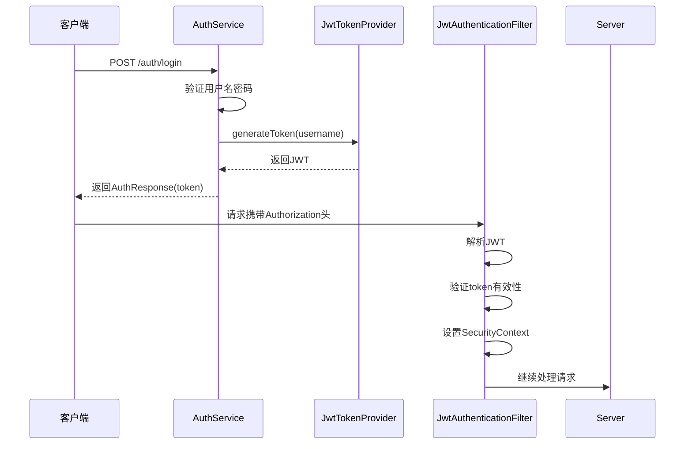
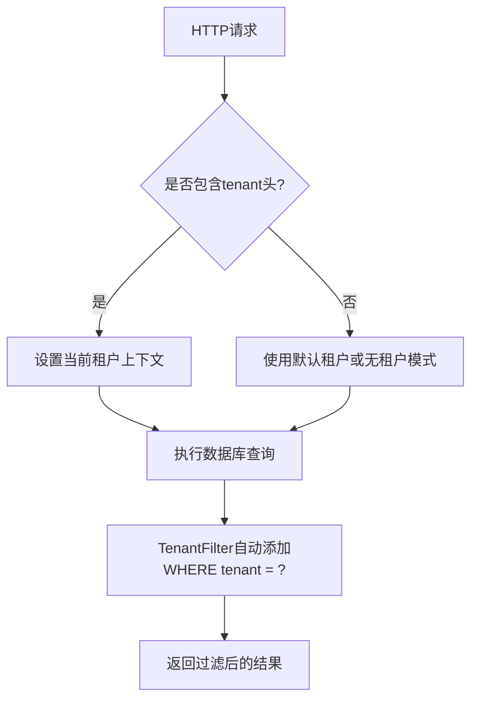

# API参考

<cite>
**本文档中引用的文件**  
- [AuthService.kt](file://service/src/main/kotlin/top/zztech/ainote/service/AuthService.kt)
- [NoteService.kt](file://service/src/main/kotlin/top/zztech/ainote/service/NoteService.kt)
- [LogService.kt](file://service/src/main/kotlin/top/zztech/ainote/service/LogService.kt)
- [OssService.kt](file://service/src/main/kotlin/top/zztech/ainote/service/OssService.kt)
- [JwtTokenProvider.kt](file://runtime/src/main/kotlin/top/zztech/ainote/runtime/utility/JwtTokenProvider.kt)
- [JwtAuthenticationFilter.kt](file://runtime/src/main/kotlin/top/zztech/ainote/runtime/utility/JwtAuthenticationFilter.kt)
- [TenantFilterForNonCacheMode.kt](file://runtime/src/main/kotlin/top/zztech/ainote/runtime/filter/TenantFilterForNonCacheMode.kt)
- [application.yml](file://service/src/main/resources/application.yml)
- [Account.kt](file://model/src/main/kotlin/top/zztech/ainote/model/Account.kt)
- [Log.kt](file://model/src/main/kotlin/top/zztech/ainote/model/Log.kt)
- [StaticFile.kt](file://model/src/main/kotlin/top/zztech/ainote/model/StaticFile.kt)
</cite>

## 目录
1. [简介](#简介)
2. [认证机制](#认证机制)
3. [多租户支持](#多租户支持)
4. [Jimmer ORM集成](#jimmer-orm集成)
5. [自动生成文档与客户端](#自动生成文档与客户端)
6. [AuthService API](#authservice-api)
7. [NoteService API](#noteservice-api)
8. [LogService API](#logservice-api)
9. [OssService API](#ossservice-api)

## 简介

ainote-server 是一个基于 Kotlin 和 Spring Boot 构建的现代化 RESTful API 服务器，采用 Jimmer ORM 实现类型安全的数据访问。本 API 文档详细描述了系统中所有核心服务的端点，包括认证、笔记管理、日志审计和对象存储功能。

系统通过 JWT 实现身份认证，并支持多租户隔离，确保不同租户的数据安全独立。所有 API 均遵循 REST 设计原则，提供清晰的资源路径和标准的 HTTP 状态码响应。

**Section sources**
- [README.md](file://README.md#L3-L235)

## 认证机制

ainote-server 使用 JWT（JSON Web Token）进行用户身份认证。客户端在登录成功后将获得一个加密的 token，后续请求需在 `Authorization` 头中携带 `Bearer <token>` 来验证身份。

JWT 的生成与验证由 `JwtTokenProvider` 类负责，密钥和过期时间在 `application.yml` 中配置。`JwtAuthenticationFilter` 在每次请求时自动解析 token 并设置安全上下文。



**Diagram sources**
- [AuthService.kt](file://service/src/main/kotlin/top/zztech/ainote/service/AuthService.kt#L38-L90)
- [JwtTokenProvider.kt](file://runtime/src/main/kotlin/top/zztech/ainote/runtime/utility/JwtTokenProvider.kt#L1-L50)
- [JwtAuthenticationFilter.kt](file://runtime/src/main/kotlin/top/zztech/ainote/runtime/utility/JwtAuthenticationFilter.kt#L1-L50)

**Section sources**
- [JwtTokenProvider.kt](file://runtime/src/main/kotlin/top/zztech/ainote/runtime/utility/JwtTokenProvider.kt#L1-L50)
- [JwtAuthenticationFilter.kt](file://runtime/src/main/kotlin/top/zztech/ainote/runtime/utility/JwtAuthenticationFilter.kt#L1-L50)
- [application.yml](file://service/src/main/resources/application.yml#L55-L57)

## 多租户支持

系统通过 `tenant` 请求头实现多租户数据隔离。当请求包含 `tenant` 头时，`TenantFilterForNonCacheMode` 会自动为所有数据库查询添加租户过滤条件，确保用户只能访问所属租户的数据。

此功能基于 Jimmer 的全局过滤器机制实现，对业务代码透明，开发者无需在每个查询中手动添加租户条件。



**Diagram sources**
- [TenantFilterForNonCacheMode.kt](file://runtime/src/main/kotlin/top/zztech/ainote/runtime/filter/TenantFilterForNonCacheMode.kt#L1-L26)
- [application.yml](file://service/src/main/resources/application.yml#L43-L49)

**Section sources**
- [TenantFilterForNonCacheMode.kt](file://runtime/src/main/kotlin/top/zztech/ainote/runtime/filter/TenantFilterForNonCacheMode.kt#L1-L26)
- [application.yml](file://service/src/main/resources/application.yml#L43-L49)

## Jimmer ORM集成

ainote-server 使用 Jimmer ORM 作为数据访问层，提供类型安全的数据库操作。Jimmer 的主要特性包括：

- **类型安全查询**：使用 Kotlin DSL 编写编译时检查的查询语句
- **智能保存**：自动判断 INSERT 或 UPDATE 操作
- **对象获取器（Object Fetcher）**：查询任意形状的数据结构
- **多层缓存**：支持 Redis 缓存以提升性能
- **Draft 拦截器**：自动填充创建时间、修改时间等审计字段

所有实体操作均通过 Repository 接口完成，如 `NoteRepository` 和 `LogRepository`，这些仓储类继承自 Jimmer 的 `AbstractKotlinRepository`。

**Section sources**
- [NoteRepository.kt](file://repository/src/main/kotlin/top/zztech/ainote/repository/NoteRepository.kt#L1-L27)
- [LogRepository.kt](file://repository/src/main/kotlin/top/zztech/ainote/repository/LogRepository.kt#L1-L54)
- [README.md](file://README.md#L77-L88)

## 自动生成文档与客户端

系统集成了 Jimmer 的 OpenAPI 支持，自动生成标准化的 API 文档和客户端代码：

- **OpenAPI 规范**: 可通过 `/openapi.yml` 访问 YAML 格式的 API 定义
- **Swagger UI**: 可通过 `/openapi.html` 访问交互式 API 文档界面
- **TypeScript 客户端**: 可通过 `/ts.zip` 下载自动生成的 TypeScript 客户端 SDK

这些资源在应用启动后即可访问，无需额外配置。

```mermaid
graph TB
A[Jimmer] --> B[生成OpenAPI规范]
B --> C[/openapi.yml]
B --> D[/openapi.html]
B --> E[/ts.zip]
C --> F[第三方工具集成]
D --> G[开发者测试API]
E --> H[前端项目直接使用]
```

**Diagram sources**
- [application.yml](file://service/src/main/resources/application.yml#L31-L36)
- [README.md](file://README.md#L67-L73)

**Section sources**
- [application.yml](file://service/src/main/resources/application.yml#L31-L36)
- [README.md](file://README.md#L67-L73)

## AuthService API

AuthService 提供用户认证相关的 REST API，包括登录和注册功能。

### POST /auth/login

用户登录接口，验证凭据并返回 JWT token。

- **HTTP方法**: POST
- **完整路径**: `/auth/login`
- **请求头**:
  - `Content-Type: application/json`
- **请求体结构**:
```json
{
  "username": "string",
  "password": "string"
}
```
- **成功响应 (200)**:
```json
{
  "userId": "uuid",
  "token": "string",
  "role": "USER|ADMIN"
}
```
- **错误响应**:
  - `401 Unauthorized`: 用户名或密码错误
  - `400 Bad Request`: 请求体格式无效

**Section sources**
- [AuthService.kt](file://service/src/main/kotlin/top/zztech/ainote/service/AuthService.kt#L51-L72)

### POST /auth/register

用户注册接口，创建新账户。

- **HTTP方法**: POST
- **完整路径**: `/auth/register`
- **请求头**:
  - `Content-Type: application/json`
- **请求体结构**:
```json
{
  "username": "string",
  "password": "string",
  "email": "string",
  "phone": "string"
}
```
- **成功响应 (200)**: 无内容
- **错误响应**:
  - `409 Conflict`: 用户名已存在
  - `400 Bad Request`: 请求体格式无效

**Section sources**
- [AuthService.kt](file://service/src/main/kotlin/top/zztech/ainote/service/AuthService.kt#L78-L89)
- [Account.kt](file://model/src/main/kotlin/top/zztech/ainote/model/Account.kt#L1-L34)

## NoteService API

NoteService 提供笔记管理功能，目前为示例服务。

### GET /note

获取所有笔记。

- **HTTP方法**: GET
- **完整路径**: `/note`
- **请求头**:
  - `Authorization: Bearer <token>`
  - `tenant: <tenant-id>` (可选)
- **成功响应 (200)**:
```json
[
  {
    "id": "uuid",
    "title": "string",
    "content": "string",
    "createdTime": "datetime",
    "modifiedTime": "datetime"
  }
]
```

**Section sources**
- [NoteService.kt](file://service/src/main/kotlin/top/zztech/ainote/service/NoteService.kt#L25-L32)
- [Note.kt](file://model/src/main/kotlin/top/zztech/ainote/model/Note.kt#L1-L29)

## LogService API

LogService 提供系统审计日志的查询和管理功能。

### GET /log

获取所有日志记录。

- **HTTP方法**: GET
- **完整路径**: `/log`
- **请求头**:
  - `Authorization: Bearer <token>`
  - `tenant: <tenant-id>` (可选)
- **成功响应 (200)**:
```json
[
  {
    "id": "uuid",
    "accountId": "uuid",
    "action": "string",
    "targetEntity": "string",
    "entityId": "uuid",
    "ipAddress": "string",
    "userAgent": "string",
    "requestMethod": "GET|POST|PUT|DELETE",
    "requestUrl": "string",
    "createdTime": "datetime"
  }
]
```

**Section sources**
- [LogService.kt](file://service/src/main/kotlin/top/zztech/ainote/service/LogService.kt#L41-L44)
- [Log.kt](file://model/src/main/kotlin/top/zztech/ainote/model/Log.kt#L1-L74)

### GET /log/{id}

根据ID获取单个日志。

- **HTTP方法**: GET
- **完整路径**: `/log/{id}`
- **路径参数**:
  - `id`: 日志UUID
- **成功响应 (200)**: 单个日志对象
- **错误响应**:
  - `404 Not Found`: 日志不存在

**Section sources**
- [LogService.kt](file://service/src/main/kotlin/top/zztech/ainote/service/LogService.kt#L51-L54)

### GET /log/account/{accountId}

根据用户ID获取日志。

- **HTTP方法**: GET
- **完整路径**: `/log/account/{accountId}`
- **路径参数**:
  - `accountId`: 用户UUID
- **成功响应 (200)**: 该用户的所有日志列表

**Section sources**
- [LogService.kt](file://service/src/main/kotlin/top/zztech/ainote/service/LogService.kt#L61-L64)

### GET /log/latest

获取最新的日志记录。

- **HTTP方法**: GET
- **完整路径**: `/log/latest`
- **查询参数**:
  - `limit`: 返回数量，默认10
- **成功响应 (200)**: 最新的日志列表

**Section sources**
- [LogService.kt](file://service/src/main/kotlin/top/zztech/ainote/service/LogService.kt#L72-L75)

### DELETE /log/{id}

删除指定日志。

- **HTTP方法**: DELETE
- **完整路径**: `/log/{id}`
- **路径参数**:
  - `id`: 日志UUID
- **成功响应 (200)**: 无内容
- **错误响应**:
  - `404 Not Found`: 日志不存在

**Section sources**
- [LogService.kt](file://service/src/main/kotlin/top/zztech/ainote/service/LogService.kt#L82-L86)

## OssService API

OssService 提供基于阿里云 OSS 的文件上传下载功能。

### POST /file/upload

上传文件到对象存储。

- **HTTP方法**: POST
- **完整路径**: `/file/upload`
- **请求头**:
  - `Authorization: Bearer <token>`
  - `Content-Type: multipart/form-data`
  - `tenant: <tenant-id>` (可选)
- **请求参数**:
  - `file`: MultipartFile
  - `folder`: 存储文件夹名称（可选）
- **成功响应 (200)**: 返回 `StaticFile` 对象
- **错误响应**:
  - `500 Internal Server Error`: OSS服务未配置

**Section sources**
- [OssService.kt](file://service/src/main/kotlin/top/zztech/ainote/service/OssService.kt#L48-L85)

### GET /file/{id}

根据ID获取文件信息。

- **HTTP方法**: GET
- **完整路径**: `/file/{id}`
- **路径参数**:
  - `id`: 文件UUID
- **成功响应 (200)**: `StaticFile` 对象或 null
- **错误响应**:
  - `404 Not Found`: 文件不存在

**Section sources**
- [OssService.kt](file://service/src/main/kotlin/top/zztech/ainote/service/OssService.kt#L92-L95)

### GET /file

获取所有文件。

- **HTTP方法**: GET
- **完整路径**: `/file`
- **成功响应 (200)**: 文件列表

**Section sources**
- [OssService.kt](file://service/src/main/kotlin/top/zztech/ainote/service/OssService.kt#L101-L104)

### GET /file/uploader/{uploaderId}

根据上传者ID获取文件。

- **HTTP方法**: GET
- **完整路径**: `/file/uploader/{uploaderId}`
- **路径参数**:
  - `uploaderId`: 上传者UUID
- **成功响应 (200)**: 该用户上传的文件列表

**Section sources**
- [OssService.kt](file://service/src/main/kotlin/top/zztech/ainote/service/OssService.kt#L111-L114)

### GET /file/type/{fileType}

根据文件类型获取文件。

- **HTTP方法**: GET
- **完整路径**: `/file/type/{fileType}`
- **路径参数**:
  - `fileType`: 文件类型（IMAGE, VIDEO, DOCUMENT等）
- **成功响应 (200)**: 指定类型的文件列表

**Section sources**
- [OssService.kt](file://service/src/main/kotlin/top/zztech/ainote/service/OssService.kt#L121-L124)

### GET /file/search

搜索文件名包含关键词的文件。

- **HTTP方法**: GET
- **完整路径**: `/file/search`
- **查询参数**:
  - `keyword`: 搜索关键词
- **成功响应 (200)**: 匹配的文件列表

**Section sources**
- [OssService.kt](file://service/src/main/kotlin/top/zztech/ainote/service/OssService.kt#L131-L134)

### GET /file/latest

获取最新的文件。

- **HTTP方法**: GET
- **完整路径**: `/file/latest`
- **查询参数**:
  - `limit`: 返回数量，默认10
- **成功响应 (200)**: 最新的文件列表

**Section sources**
- [OssService.kt](file://service/src/main/kotlin/top/zztech/ainote/service/OssService.kt#L141-L144)

### DELETE /file/{id}

删除文件（从OSS和数据库）。

- **HTTP方法**: DELETE
- **完整路径**: `/file/{id}`
- **路径参数**:
  - `id`: 文件UUID
- **成功响应 (200)**: 无内容
- **错误响应**:
  - `404 Not Found`: 文件不存在
  - `500 Internal Server Error`: OSS服务未配置

**Section sources**
- [OssService.kt](file://service/src/main/kotlin/top/zztech/ainote/service/OssService.kt#L175-L188)