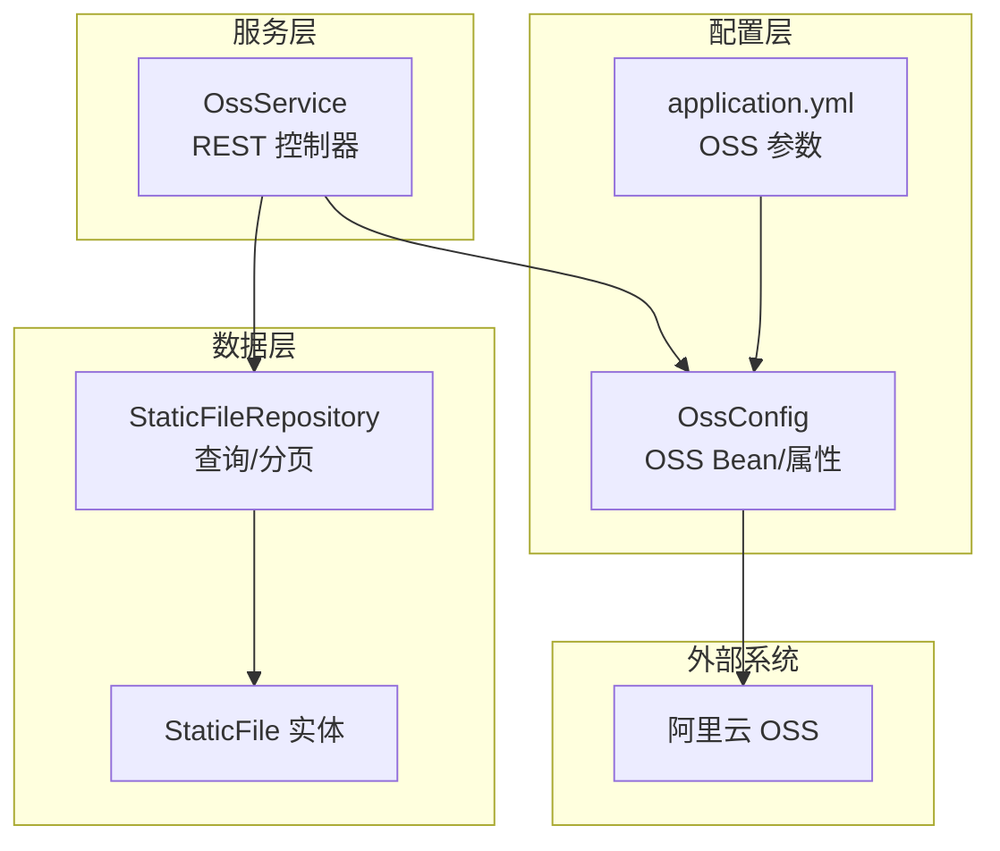
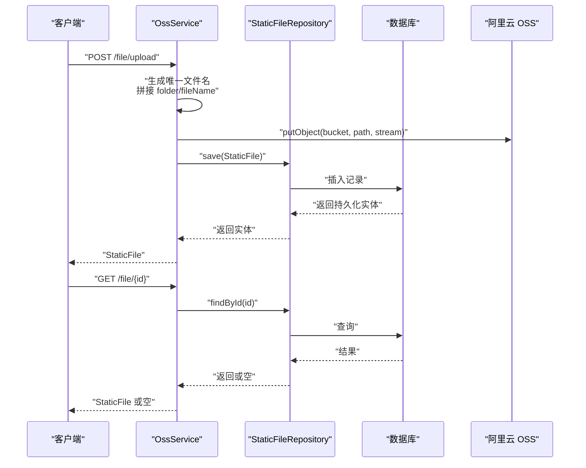
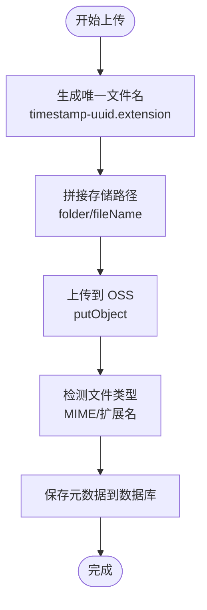
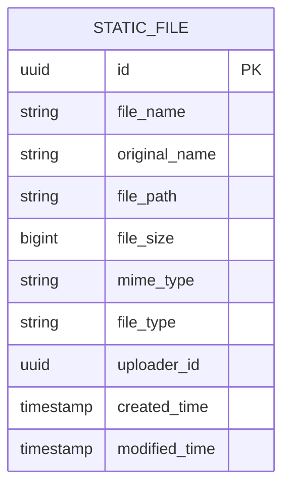
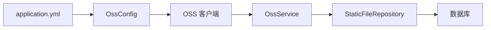

# 文件存储API

<cite>
**本文引用的文件**
- [OssService.kt](file://service/src/main/kotlin/top/zztech/ainote/service/service/OssService.kt)
- [StaticFile.kt](file://model/src/main/kotlin/top/zztech/ainote/model/StaticFile.kt)
- [FileType.kt](file://model/src/main/kotlin/top/zztech/ainote/model/enums/FileType.kt)
- [StaticFileRepository.kt](file://repository/src/main/kotlin/top/zztech/ainote/repository/StaticFileRepository.kt)
- [OssConfig.kt](file://service/src/main/kotlin/top/zztech/ainote/cfg/OssConfig.kt)
- [application.yml](file://service/src/main/resources/application.yml)
- [init.sql](file://database/init.sql)
</cite>

## 目录
1. [简介](#简介)
2. [项目结构](#项目结构)
3. [核心组件](#核心组件)
4. [架构总览](#架构总览)
5. [详细组件分析](#详细组件分析)
6. [依赖分析](#依赖分析)
7. [性能考虑](#性能考虑)
8. [故障排查指南](#故障排查指南)
9. [结论](#结论)
10. [附录](#附录)

## 简介
本文件为 ainote-server 的文件存储服务提供详尽的 RESTful API 文档，聚焦于 OssService 中公开的文件相关端点，覆盖上传、查询、搜索、分页与删除等能力。文档还深入说明：
- 文件上传流程：唯一文件名生成策略、上传至阿里云 OSS、元数据入库
- 文件类型（FileType）自动检测逻辑：基于 MIME 类型与扩展名
- 公网访问 URL 生成：getFileUrl 方法
- 内部工具方法：uploadFile(InputStream, String, String)、getFileUrl(String)
- 成功与错误响应示例（如 400 表示 OSS 未配置）

## 项目结构
文件存储服务位于 service 模块，围绕以下关键模块协作：
- 控制器层：OssService 提供 REST 接口
- 数据模型层：StaticFile 实体与 FileType 枚举
- 数据访问层：StaticFileRepository 提供查询与分页
- 配置层：OssConfig 负责 OSS 客户端与属性绑定
- 配置文件：application.yml 提供 OSS 连接参数
- 初始化脚本：init.sql 定义静态文件表结构

图表来源
- [OssService.kt](file://service/src/main/kotlin/top/zztech/ainote/service/service/OssService.kt#L33-L236)
- [StaticFileRepository.kt](file://repository/src/main/kotlin/top/zztech/ainote/repository/StaticFileRepository.kt#L1-L75)
- [StaticFile.kt](file://model/src/main/kotlin/top/zztech/ainote/model/StaticFile.kt#L1-L71)
- [OssConfig.kt](file://service/src/main/kotlin/top/zztech/ainote/cfg/OssConfig.kt#L1-L53)
- [application.yml](file://service/src/main/resources/application.yml#L16-L22)

章节来源
- [OssService.kt](file://service/src/main/kotlin/top/zztech/ainote/service/service/OssService.kt#L33-L236)
- [StaticFileRepository.kt](file://repository/src/main/kotlin/top/zztech/ainote/repository/StaticFileRepository.kt#L1-L75)
- [StaticFile.kt](file://model/src/main/kotlin/top/zztech/ainote/model/StaticFile.kt#L1-L71)
- [OssConfig.kt](file://service/src/main/kotlin/top/zztech/ainote/cfg/OssConfig.kt#L1-L53)
- [application.yml](file://service/src/main/resources/application.yml#L16-L22)

## 核心组件
- OssService：提供文件上传、查询、搜索、分页与删除的 REST 接口；内部封装上传与 URL 生成工具方法
- StaticFile：静态文件实体，包含文件名、原始名、大小、路径、MIME、类型、上传者等字段
- FileType：文件类型枚举，涵盖图片、视频、音频、文档、电子表格、演示文稿、压缩包、代码、其他
- StaticFileRepository：提供按上传者、类型、关键词、最新记录等查询能力
- OssConfig：基于 application.yml 的 OSS 属性绑定与客户端装配
- application.yml：提供 OSS endpoint、access-key-id、access-key-secret、bucket-name 等参数

章节来源
- [OssService.kt](file://service/src/main/kotlin/top/zztech/ainote/service/service/OssService.kt#L33-L236)
- [StaticFile.kt](file://model/src/main/kotlin/top/zztech/ainote/model/StaticFile.kt#L1-L71)
- [FileType.kt](file://model/src/main/kotlin/top/zztech/ainote/model/enums/FileType.kt#L1-L51)
- [StaticFileRepository.kt](file://repository/src/main/kotlin/top/zztech/ainote/repository/StaticFileRepository.kt#L1-L75)
- [OssConfig.kt](file://service/src/main/kotlin/top/zztech/ainote/cfg/OssConfig.kt#L1-L53)
- [application.yml](file://service/src/main/resources/application.yml#L16-L22)

## 架构总览
下图展示文件上传与查询的关键交互：

图表来源
- [OssService.kt](file://service/src/main/kotlin/top/zztech/ainote/service/service/OssService.kt#L48-L85)
- [StaticFileRepository.kt](file://repository/src/main/kotlin/top/zztech/ainote/repository/StaticFileRepository.kt#L1-L39)
- [init.sql](file://database/init.sql#L62-L73)

## 详细组件分析

### REST API 端点清单与说明
- POST /file/upload
  - 功能：上传单个文件，支持指定存储目录
  - 请求参数
    - multipart/form-data：file（必填，MultipartFile）
    - folder（可选，字符串，默认空）
  - 请求体：二进制文件流
  - 响应体：StaticFile 实体
  - 业务要点
    - 生成唯一文件名（时间戳-UUID.扩展名），可带 folder 前缀
    - 上传至 OSS 指定 Bucket
    - 自动检测 MIME 与扩展名，推导 FileType
    - 记录上传者 ID（若当前上下文可解析）
    - 保存元数据到数据库
  - 错误示例
    - 400：OSS 未配置（ossClient 为空）
  - 参考实现路径
    - [上传入口](file://service/src/main/kotlin/top/zztech/ainote/service/service/OssService.kt#L48-L85)
    - [唯一文件名生成](file://service/src/main/kotlin/top/zztech/ainote/service/service/OssService.kt#L207-L213)
    - [MIME/扩展名检测 FileType](file://service/src/main/kotlin/top/zztech/ainote/service/service/OssService.kt#L221-L235)

- GET /file/{id}
  - 功能：按 ID 查询文件详情
  - 路径参数：id（UUID）
  - 响应体：StaticFile 或空
  - 参考实现路径
    - [按ID查询](file://service/src/main/kotlin/top/zztech/ainote/service/service/OssService.kt#L92-L96)
    - [仓储实现](file://repository/src/main/kotlin/top/zztech/ainote/repository/StaticFileRepository.kt#L1-L20)

- GET /file
  - 功能：获取全部文件列表
  - 响应体：List<StaticFile>
  - 参考实现路径
    - [获取全部](file://service/src/main/kotlin/top/zztech/ainote/service/service/OssService.kt#L101-L105)
    - [仓储实现](file://repository/src/main/kotlin/top/zztech/ainote/repository/StaticFileRepository.kt#L1-L20)

- GET /file/uploader/{uploaderId}
  - 功能：按上传者 ID 查询其历史文件
  - 路径参数：uploaderId（UUID）
  - 响应体：List<StaticFile>（按创建时间倒序）
  - 参考实现路径
    - [按上传者查询](file://service/src/main/kotlin/top/zztech/ainote/service/service/OssService.kt#L111-L115)
    - [仓储实现](file://repository/src/main/kotlin/top/zztech/ainote/repository/StaticFileRepository.kt#L30-L40)

- GET /file/type/{fileType}
  - 功能：按 FileType 查询文件
  - 路径参数：fileType（枚举，如 IMAGE/VIDEO/AUDIO/DOCUMENT/SPREADSHEET/PRESENTATION/ARCHIVE/CODE/OTHER）
  - 响应体：List<StaticFile>（按创建时间倒序）
  - 参考实现路径
    - [按类型查询](file://service/src/main/kotlin/top/zztech/ainote/service/service/OssService.kt#L121-L125)
    - [仓储实现](file://repository/src/main/kotlin/top/zztech/ainote/repository/StaticFileRepository.kt#L41-L52)
    - [FileType 枚举](file://model/src/main/kotlin/top/zztech/ainote/model/enums/FileType.kt#L1-L51)

- GET /file/search
  - 功能：按原始文件名关键词模糊搜索
  - 查询参数：keyword（字符串）
  - 响应体：List<StaticFile>（按创建时间倒序）
  - 参考实现路径
    - [搜索接口](file://service/src/main/kotlin/top/zztech/ainote/service/service/OssService.kt#L131-L135)
    - [仓储实现](file://repository/src/main/kotlin/top/zztech/ainote/repository/StaticFileRepository.kt#L58-L64)

- GET /file/latest
  - 功能：获取最新上传的若干文件
  - 查询参数：limit（整数，默认 10）
  - 响应体：List<StaticFile>（按创建时间倒序）
  - 参考实现路径
    - [最新文件](file://service/src/main/kotlin/top/zztech/ainote/service/service/OssService.kt#L141-L145)
    - [仓储实现](file://repository/src/main/kotlin/top/zztech/ainote/repository/StaticFileRepository.kt#L70-L75)

- DELETE /file/{id}
  - 功能：删除文件（同时删除 OSS 对象与数据库记录）
  - 路径参数：id（UUID）
  - 响应体：无（204/200 视框架处理）
  - 错误示例
    - 400：OSS 未配置（ossClient 为空）
  - 参考实现路径
    - [删除接口](file://service/src/main/kotlin/top/zztech/ainote/service/service/OssService.kt#L175-L189)
    - [仓储实现](file://repository/src/main/kotlin/top/zztech/ainote/repository/StaticFileRepository.kt#L1-L20)

章节来源
- [OssService.kt](file://service/src/main/kotlin/top/zztech/ainote/service/service/OssService.kt#L48-L189)
- [StaticFileRepository.kt](file://repository/src/main/kotlin/top/zztech/ainote/repository/StaticFileRepository.kt#L30-L75)
- [FileType.kt](file://model/src/main/kotlin/top/zztech/ainote/model/enums/FileType.kt#L1-L51)

### 文件上传流程详解
- 唯一文件名生成
  - 格式：timestamp-uuid.extension
  - 依据原始文件名提取扩展名，结合 UUID 与毫秒时间戳确保全局唯一
  - 若传入 folder，则最终存储路径为 folder/filename
  - 参考实现路径
    - [唯一文件名生成](file://service/src/main/kotlin/top/zztech/ainote/service/service/OssService.kt#L207-L213)

- 上传至阿里云 OSS
  - 使用 OSS 客户端 putObject，目标 Bucket 来自配置
  - 上传输入流来自 MultipartFile
  - 参考实现路径
    - [上传调用](file://service/src/main/kotlin/top/zztech/ainote/service/service/OssService.kt#L60-L66)

- 元数据入库
  - 记录字段：fileName、originalName、filePath、fileSize、mimeType、fileType、uploaderId
  - uploaderId 尝试从当前账户上下文解析，失败则为空
  - 参考实现路径
    - [保存实体](file://service/src/main/kotlin/top/zztech/ainote/service/service/OssService.kt#L74-L85)
    - [仓储保存](file://repository/src/main/kotlin/top/zztech/ainote/repository/StaticFileRepository.kt#L1-L20)

- 文件类型自动检测
  - 优先判断 MIME 类型前缀（image/video/audio）
  - 否则回退到扩展名匹配（pdf/doc/docx/txt/md、xls/xlsx/csv、ppt/pptx/key、zip/rar/7z/tar/gz、java/kt/js/html/css/json/xml/py/cpp/c/h 等）
  - 默认 OTHER
  - 参考实现路径
    - [类型检测](file://service/src/main/kotlin/top/zztech/ainote/service/service/OssService.kt#L221-L235)

- 公网访问 URL 生成
  - 组合规则：https://{bucket}.{endpoint去掉http/https}/fileName
  - 参考实现路径
    - [URL 生成](file://service/src/main/kotlin/top/zztech/ainote/service/service/OssService.kt#L196-L198)

- 内部工具方法
  - uploadFile(InputStream, String, String)：从输入流上传并返回公网 URL
  - getFileUrl(String)：生成公网 URL
  - 参考实现路径
    - [上传工具](file://service/src/main/kotlin/top/zztech/ainote/service/service/OssService.kt#L153-L169)
    - [URL 工具](file://service/src/main/kotlin/top/zztech/ainote/service/service/OssService.kt#L196-L198)

图表来源
- [OssService.kt](file://service/src/main/kotlin/top/zztech/ainote/service/service/OssService.kt#L48-L85)
- [OssService.kt](file://service/src/main/kotlin/top/zztech/ainote/service/service/OssService.kt#L207-L235)

章节来源
- [OssService.kt](file://service/src/main/kotlin/top/zztech/ainote/service/service/OssService.kt#L48-L169)
- [StaticFileRepository.kt](file://repository/src/main/kotlin/top/zztech/ainote/repository/StaticFileRepository.kt#L1-L20)

### 数据模型与表结构
- StaticFile 字段
  - id、fileName、originalName、fileSize、filePath、mimeType、fileType、uploaderId、uploader
- FileType 枚举
  - IMAGE、VIDEO、AUDIO、DOCUMENT、SPREADSHEET、PRESENTATION、ARCHIVE、CODE、OTHER
- 数据库表 static_file
  - 字段：id、file_name、original_name、file_path、file_size、mime_type、file_type、uploader_id、created_time、modified_time

图表来源
- [StaticFile.kt](file://model/src/main/kotlin/top/zztech/ainote/model/StaticFile.kt#L1-L71)
- [init.sql](file://database/init.sql#L62-L73)

章节来源
- [StaticFile.kt](file://model/src/main/kotlin/top/zztech/ainote/model/StaticFile.kt#L1-L71)
- [FileType.kt](file://model/src/main/kotlin/top/zztech/ainote/model/enums/FileType.kt#L1-L51)
- [init.sql](file://database/init.sql#L62-L73)

## 依赖分析
- 控制器对 OSS 客户端的条件装配
  - 当存在 OSS Bean 时才启用控制器
  - 未配置时抛出异常，阻止上传/删除等操作
- OSS 客户端由配置类按 application.yml 参数构建
- 仓储层负责 SQL 查询与排序、分页

图表来源
- [OssConfig.kt](file://service/src/main/kotlin/top/zztech/ainote/cfg/OssConfig.kt#L34-L53)
- [application.yml](file://service/src/main/resources/application.yml#L16-L22)
- [OssService.kt](file://service/src/main/kotlin/top/zztech/ainote/service/service/OssService.kt#L33-L41)
- [StaticFileRepository.kt](file://repository/src/main/kotlin/top/zztech/ainote/repository/StaticFileRepository.kt#L1-L20)

章节来源
- [OssConfig.kt](file://service/src/main/kotlin/top/zztech/ainote/cfg/OssConfig.kt#L34-L53)
- [application.yml](file://service/src/main/resources/application.yml#L16-L22)
- [OssService.kt](file://service/src/main/kotlin/top/zztech/ainote/service/service/OssService.kt#L33-L41)

## 性能考虑
- 上传大文件建议使用分片上传（需在 OSS SDK 层扩展）
- 批量查询与分页：利用仓储层的排序与 limit，避免一次性拉取过多数据
- URL 生成为纯字符串拼接，开销极低
- MIME 类型检测为常量时间，扩展名映射为固定集合查找

## 故障排查指南
- 400 OSS 未配置
  - 现象：调用 /file/upload 或 /file/{id} 删除时抛出异常
  - 原因：未提供完整的 OSS 凭证或未注入 OSS Bean
  - 解决：在 application.yml 中补齐 aliyun.oss.* 参数，并确保配置生效
  - 参考实现路径
    - [控制器条件装配与异常](file://service/src/main/kotlin/top/zztech/ainote/service/service/OssService.kt#L33-L53)
    - [OSS Bean 构建与校验](file://service/src/main/kotlin/top/zztech/ainote/cfg/OssConfig.kt#L34-L53)
    - [配置项](file://service/src/main/resources/application.yml#L16-L22)

- 上传后无法访问
  - 检查 bucket 名称与 endpoint 是否正确
  - 检查 OSS 对象 ACL 与跨域设置
  - 参考实现路径
    - [URL 生成规则](file://service/src/main/kotlin/top/zztech/ainote/service/service/OssService.kt#L196-L198)

- 查询不到文件
  - 确认搜索关键词是否与 originalName 匹配
  - 确认 limit 设置是否过大导致未命中
  - 参考实现路径
    - [搜索接口](file://service/src/main/kotlin/top/zztech/ainote/service/service/OssService.kt#L131-L135)
    - [仓储实现](file://repository/src/main/kotlin/top/zztech/ainote/repository/StaticFileRepository.kt#L58-L64)

章节来源
- [OssService.kt](file://service/src/main/kotlin/top/zztech/ainote/service/service/OssService.kt#L33-L53)
- [OssConfig.kt](file://service/src/main/kotlin/top/zztech/ainote/cfg/OssConfig.kt#L34-L53)
- [application.yml](file://service/src/main/resources/application.yml#L16-L22)

## 结论
本文件存储服务以清晰的职责划分实现了文件上传、查询、搜索与删除能力。通过唯一文件名策略、MIME/扩展名双轨检测与统一 URL 生成，保证了易用性与一致性。建议在生产环境完善 OSS 凭证管理、监控与日志审计，并根据需要扩展分片上传与缓存策略。

## 附录
- OSS 配置项（application.yml）
  - aliyun.oss.endpoint
  - aliyun.oss.access-key-id
  - aliyun.oss.access-key-secret
  - aliyun.oss.bucket-name
- 数据库初始化表结构参考
  - static_file 表字段与约束

章节来源
- [application.yml](file://service/src/main/resources/application.yml#L16-L22)
- [init.sql](file://database/init.sql#L62-L73)