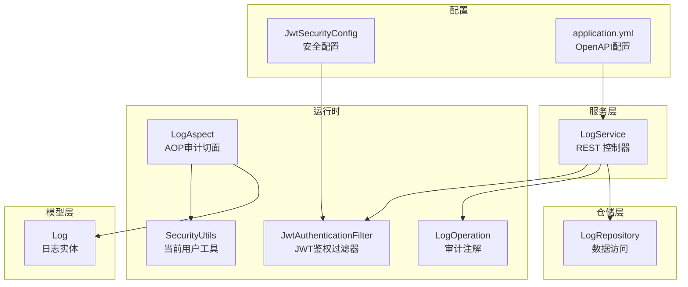
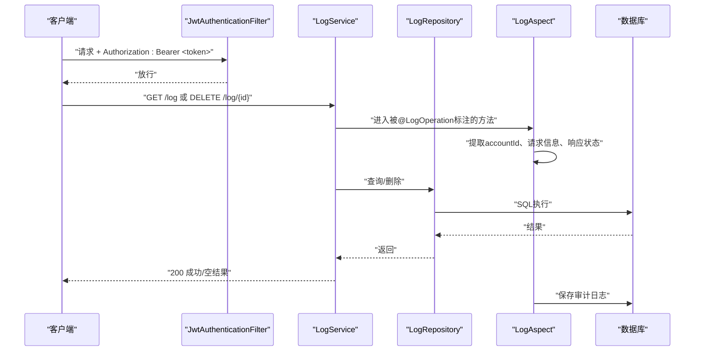
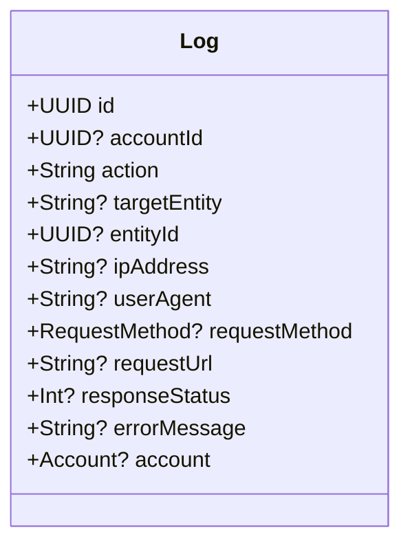
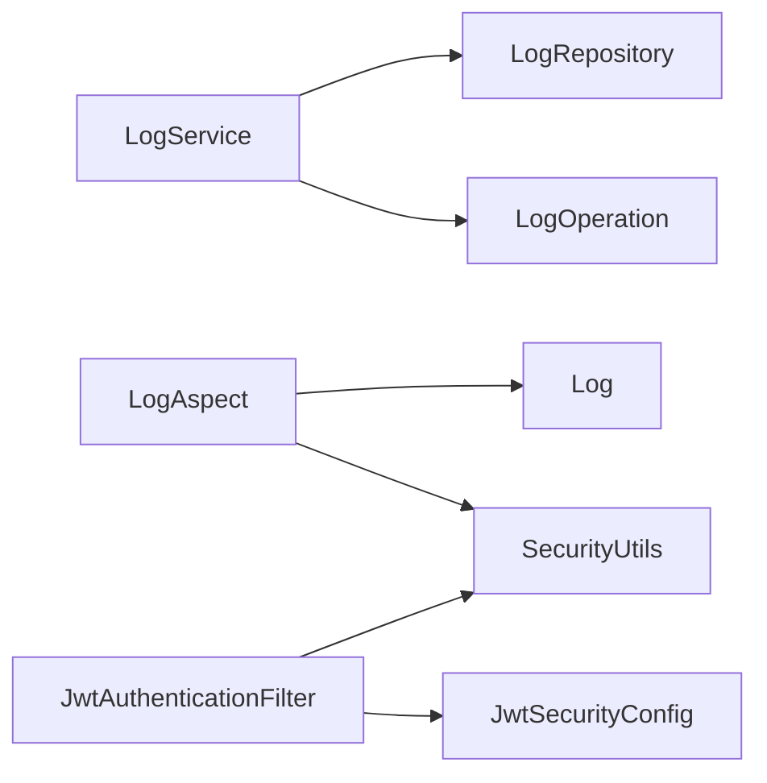

# 日志API

<cite>
**本文引用的文件**
- [LogService.kt](file://service/src/main/kotlin/top/zztech/ainote/service/LogService.kt)
- [LogRepository.kt](file://repository/src/main/kotlin/top/zztech/ainote/repository/LogRepository.kt)
- [Log.kt](file://model/src/main/kotlin/top/zztech/ainote/model/Log.kt)
- [LogOperation.kt](file://runtime/src/main/kotlin/top/zztech/ainote/runtime/annotation/LogOperation.kt)
- [LogAspect.kt](file://runtime/src/main/kotlin/top/zztech/ainote/runtime/aspect/LogAspect.kt)
- [JwtAuthenticationFilter.kt](file://runtime/src/main/kotlin/top/zztech/ainote/runtime/utility/JwtAuthenticationFilter.kt)
- [JwtSecurityConfig.kt](file://service/src/main/kotlin/top/zztech/ainote/cfg/JwtSecurityConfig.kt)
- [SecurityUtils.kt](file://runtime/src/main/kotlin/top/zztech/ainote/runtime/utility/SecurityUtils.kt)
- [application.yml](file://service/src/main/resources/application.yml)
</cite>

## 目录
1. [简介](#简介)
2. [项目结构](#项目结构)
3. [核心组件](#核心组件)
4. [架构总览](#架构总览)
5. [详细组件分析](#详细组件分析)
6. [依赖分析](#依赖分析)
7. [性能考虑](#性能考虑)
8. [故障排查指南](#故障排查指南)
9. [结论](#结论)
10. [附录](#附录)

## 简介
本文件为 ainote-server 的日志服务提供详尽的 RESTful API 文档，覆盖以下五个端点：
- GET /log：获取所有日志
- GET /log/{id}：根据ID查询日志
- GET /log/account/{accountId}：根据用户ID查询日志
- GET /log/latest：获取最新日志
- DELETE /log/{id}：删除日志

说明要点：
- 所有查询操作通过 LogRepository 访问数据库。
- 所有查询与删除操作均使用 @LogOperation 注解进行操作审计，由 LogAspect 切面自动记录审计日志。
- 删除操作为物理删除，无软删除机制。
- 鉴权采用 JWT，请求需携带有效的 Authorization: Bearer <token> 请求头。

## 项目结构
日志API位于 service 模块的 REST 控制器中，数据访问位于 repository 模块，审计注解与切面位于 runtime 模块，模型定义位于 model 模块。

图表来源
- [LogService.kt](file://service/src/main/kotlin/top/zztech/ainote/service/LogService.kt#L30-L87)
- [LogRepository.kt](file://repository/src/main/kotlin/top/zztech/ainote/repository/LogRepository.kt#L26-L53)
- [LogOperation.kt](file://runtime/src/main/kotlin/top/zztech/ainote/runtime/annotation/LogOperation.kt#L1-L29)
- [LogAspect.kt](file://runtime/src/main/kotlin/top/zztech/ainote/runtime/aspect/LogAspect.kt#L32-L159)
- [JwtAuthenticationFilter.kt](file://runtime/src/main/kotlin/top/zztech/ainote/runtime/utility/JwtAuthenticationFilter.kt#L15-L50)
- [JwtSecurityConfig.kt](file://service/src/main/kotlin/top/zztech/ainote/cfg/JwtSecurityConfig.kt#L23-L58)
- [SecurityUtils.kt](file://runtime/src/main/kotlin/top/zztech/ainote/runtime/utility/SecurityUtils.kt#L1-L19)
- [application.yml](file://service/src/main/resources/application.yml#L31-L50)

章节来源
- [LogService.kt](file://service/src/main/kotlin/top/zztech/ainote/service/LogService.kt#L30-L87)
- [LogRepository.kt](file://repository/src/main/kotlin/top/zztech/ainote/repository/LogRepository.kt#L26-L53)
- [LogOperation.kt](file://runtime/src/main/kotlin/top/zztech/ainote/runtime/annotation/LogOperation.kt#L1-L29)
- [LogAspect.kt](file://runtime/src/main/kotlin/top/zztech/ainote/runtime/aspect/LogAspect.kt#L32-L159)
- [JwtAuthenticationFilter.kt](file://runtime/src/main/kotlin/top/zztech/ainote/runtime/utility/JwtAuthenticationFilter.kt#L15-L50)
- [JwtSecurityConfig.kt](file://service/src/main/kotlin/top/zztech/ainote/cfg/JwtSecurityConfig.kt#L23-L58)
- [SecurityUtils.kt](file://runtime/src/main/kotlin/top/zztech/ainote/runtime/utility/SecurityUtils.kt#L1-L19)
- [application.yml](file://service/src/main/resources/application.yml#L31-L50)

## 核心组件
- LogService：提供日志查询与删除的 REST 接口，标注 @LogOperation 以启用审计。
- LogRepository：封装日志查询逻辑（按用户、按最新、分页等），基于 SQL DSL。
- Log 实体：描述审计日志的字段（操作、目标实体、请求信息、响应状态、错误信息等）。
- LogOperation 注解：声明审计动作、实体类型及是否包含请求/响应信息。
- LogAspect 切面：拦截带注解的方法，自动创建审计日志并持久化。
- 鉴权链路：JwtAuthenticationFilter + JwtSecurityConfig，要求 Authorization: Bearer <token>。

章节来源
- [LogService.kt](file://service/src/main/kotlin/top/zztech/ainote/service/LogService.kt#L30-L87)
- [LogRepository.kt](file://repository/src/main/kotlin/top/zztech/ainote/repository/LogRepository.kt#L26-L53)
- [Log.kt](file://model/src/main/kotlin/top/zztech/ainote/model/Log.kt#L16-L94)
- [LogOperation.kt](file://runtime/src/main/kotlin/top/zztech/ainote/runtime/annotation/LogOperation.kt#L1-L29)
- [LogAspect.kt](file://runtime/src/main/kotlin/top/zztech/ainote/runtime/aspect/LogAspect.kt#L32-L159)
- [JwtAuthenticationFilter.kt](file://runtime/src/main/kotlin/top/zztech/ainote/runtime/utility/JwtAuthenticationFilter.kt#L15-L50)
- [JwtSecurityConfig.kt](file://service/src/main/kotlin/top/zztech/ainote/cfg/JwtSecurityConfig.kt#L23-L58)

## 架构总览
下图展示日志API的调用链与审计流程。

图表来源
- [JwtAuthenticationFilter.kt](file://runtime/src/main/kotlin/top/zztech/ainote/runtime/utility/JwtAuthenticationFilter.kt#L15-L50)
- [LogService.kt](file://service/src/main/kotlin/top/zztech/ainote/service/LogService.kt#L30-L87)
- [LogRepository.kt](file://repository/src/main/kotlin/top/zztech/ainote/repository/LogRepository.kt#L26-L53)
- [LogAspect.kt](file://runtime/src/main/kotlin/top/zztech/ainote/runtime/aspect/LogAspect.kt#L32-L159)

## 详细组件分析

### GET /log（获取所有日志）
- 方法与路径：GET /log
- 请求参数：无
- 请求头：
  - Authorization: Bearer <token>（有效JWT）
  - 其他：无特殊要求
- 响应：
  - 200 OK：返回日志列表（数组），元素为 Log 实体 JSON
  - 404 Not Found：当查询结果为空时，控制器返回空集合；若业务上需区分“资源不存在”，请结合上游逻辑判断
- 审计：@LogOperation(action="QUERY_ALL_LOGS", entityType="Log", includeRequest=false)
- 数据来源：LogRepository.findAll()

章节来源
- [LogService.kt](file://service/src/main/kotlin/top/zztech/ainote/service/LogService.kt#L37-L45)
- [LogRepository.kt](file://repository/src/main/kotlin/top/zztech/ainote/repository/LogRepository.kt#L26-L35)
- [LogOperation.kt](file://runtime/src/main/kotlin/top/zztech/ainote/runtime/annotation/LogOperation.kt#L1-L29)

### GET /log/{id}（根据ID查询日志）
- 方法与路径：GET /log/{id}
- 路径参数：
  - id：UUID 类型，日志ID
- 请求头：
  - Authorization: Bearer <token>（有效JWT）
- 响应：
  - 200 OK：返回单个日志对象（Log 实体 JSON）
  - 404 Not Found：当未找到对应ID的日志时，返回空或空对象（具体取决于框架行为）
- 审计：@LogOperation(action="QUERY_LOG_BY_ID", entityType="Log", includeRequest=false)
- 数据来源：LogRepository.findById(id)

章节来源
- [LogService.kt](file://service/src/main/kotlin/top/zztech/ainote/service/LogService.kt#L46-L56)
- [LogRepository.kt](file://repository/src/main/kotlin/top/zztech/ainote/repository/LogRepository.kt#L26-L35)
- [LogOperation.kt](file://runtime/src/main/kotlin/top/zztech/ainote/runtime/annotation/LogOperation.kt#L1-L29)

### GET /log/account/{accountId}（根据用户ID查询日志）
- 方法与路径：GET /log/account/{accountId}
- 路径参数：
  - accountId：UUID 类型，用户ID
- 请求头：
  - Authorization: Bearer <token>（有效JWT）
- 响应：
  - 200 OK：返回该用户的所有日志列表（按创建时间倒序）
  - 404 Not Found：当无匹配日志时，返回空集合
- 审计：@LogOperation(action="QUERY_LOGS_BY_ACCOUNT", entityType="Log", includeRequest=false)
- 数据来源：LogRepository.findByUserId(accountId)

章节来源
- [LogService.kt](file://service/src/main/kotlin/top/zztech/ainote/service/LogService.kt#L57-L65)
- [LogRepository.kt](file://repository/src/main/kotlin/top/zztech/ainote/repository/LogRepository.kt#L36-L41)
- [LogOperation.kt](file://runtime/src/main/kotlin/top/zztech/ainote/runtime/annotation/LogOperation.kt#L1-L29)

### GET /log/latest（获取最新日志）
- 方法与路径：GET /log/latest
- 查询参数：
  - limit：整数，默认值为10，用于限制返回数量
- 请求头：
  - Authorization: Bearer <token>（有效JWT）
- 响应：
  - 200 OK：返回最新的日志列表（按创建时间倒序）
  - 404 Not Found：当无匹配日志时，返回空集合
- 审计：@LogOperation(action="QUERY_LATEST_LOGS", entityType="Log", includeRequest=false)
- 数据来源：LogRepository.findLatestLogs(limit)

章节来源
- [LogService.kt](file://service/src/main/kotlin/top/zztech/ainote/service/LogService.kt#L66-L76)
- [LogRepository.kt](file://repository/src/main/kotlin/top/zztech/ainote/repository/LogRepository.kt#L48-L53)
- [LogOperation.kt](file://runtime/src/main/kotlin/top/zztech/ainote/runtime/annotation/LogOperation.kt#L1-L29)

### DELETE /log/{id}（删除日志）
- 方法与路径：DELETE /log/{id}
- 路径参数：
  - id：UUID 类型，日志ID
- 请求头：
  - Authorization: Bearer <token>（有效JWT）
- 响应：
  - 200 OK：删除成功（无响应体）
  - 404 Not Found：当ID不存在时，可能返回空或抛出异常（取决于框架行为）
- 审计：@LogOperation(action="DELETE_LOG", entityType="Log", includeRequest=true)
- 数据来源：LogRepository.deleteById(id)
- 特别说明：删除为物理删除，无软删除机制

章节来源
- [LogService.kt](file://service/src/main/kotlin/top/zztech/ainote/service/LogService.kt#L77-L87)
- [LogRepository.kt](file://repository/src/main/kotlin/top/zztech/ainote/repository/LogRepository.kt#L26-L35)
- [LogOperation.kt](file://runtime/src/main/kotlin/top/zztech/ainote/runtime/annotation/LogOperation.kt#L1-L29)

### 审计与日志实体
- 审计触发：所有上述端点在进入控制器方法前，都会被 LogAspect 拦截并记录审计日志。
- 审计字段来源：LogAspect 会从请求上下文提取 accountId、IP、User-Agent、请求方法、URL、响应状态码、错误信息等，并持久化到 Log 实体。
- 日志实体字段概览（节选）：
  - id：UUID
  - accountId：UUID（可空）
  - action：字符串（操作名称）
  - targetEntity：字符串（实体类型）
  - entityId：UUID（可空）
  - ipAddress：字符串（可空）
  - userAgent：字符串（可空）
  - requestMethod：枚举（可空）
  - requestUrl：字符串（可空）
  - responseStatus：整数（可空）
  - errorMessage：字符串（可空）
  - account：关联账户（可空）

图表来源
- [Log.kt](file://model/src/main/kotlin/top/zztech/ainote/model/Log.kt#L16-L94)

章节来源
- [LogAspect.kt](file://runtime/src/main/kotlin/top/zztech/ainote/runtime/aspect/LogAspect.kt#L32-L159)
- [Log.kt](file://model/src/main/kotlin/top/zztech/ainote/model/Log.kt#L16-L94)

### 鉴权与请求头
- 鉴权方式：JWT Bearer Token
- 请求头：
  - Authorization: Bearer <token>
- 配置位置：
  - JwtAuthenticationFilter：从 Authorization 头解析 Bearer Token 并设置 SecurityContext
  - JwtSecurityConfig：禁用CSRF、表单登录、会话策略为STATELESS，允许任意请求放行（可根据需要扩展）
- 当前配置下，所有 /log 接口无需额外权限即可访问（任何已认证用户均可访问）。

章节来源
- [JwtAuthenticationFilter.kt](file://runtime/src/main/kotlin/top/zztech/ainote/runtime/utility/JwtAuthenticationFilter.kt#L15-L50)
- [JwtSecurityConfig.kt](file://service/src/main/kotlin/top/zztech/ainote/cfg/JwtSecurityConfig.kt#L23-L58)
- [SecurityUtils.kt](file://runtime/src/main/kotlin/top/zztech/ainote/runtime/utility/SecurityUtils.kt#L1-L19)

## 依赖分析
- 控制器依赖：
  - LogService 依赖 LogRepository 进行数据访问。
  - LogService 使用 @LogOperation 注解声明审计行为。
- 审计依赖：
  - LogAspect 依赖 HttpServletRequest、KSqlClient、SecurityUtils.getCurrentAccountId()。
  - LogAspect 在 finally 中创建并保存 Log 实体。
- 鉴权依赖：
  - JwtAuthenticationFilter 依赖 JwtTokenProvider 与 UserDetailsService。
  - JwtSecurityConfig 将 JwtAuthenticationFilter 注入到过滤链。

图表来源
- [LogService.kt](file://service/src/main/kotlin/top/zztech/ainote/service/LogService.kt#L30-L87)
- [LogRepository.kt](file://repository/src/main/kotlin/top/zztech/ainote/repository/LogRepository.kt#L26-L53)
- [LogOperation.kt](file://runtime/src/main/kotlin/top/zztech/ainote/runtime/annotation/LogOperation.kt#L1-L29)
- [LogAspect.kt](file://runtime/src/main/kotlin/top/zztech/ainote/runtime/aspect/LogAspect.kt#L32-L159)
- [JwtAuthenticationFilter.kt](file://runtime/src/main/kotlin/top/zztech/ainote/runtime/utility/JwtAuthenticationFilter.kt#L15-L50)
- [JwtSecurityConfig.kt](file://service/src/main/kotlin/top/zztech/ainote/cfg/JwtSecurityConfig.kt#L23-L58)
- [SecurityUtils.kt](file://runtime/src/main/kotlin/top/zztech/ainote/runtime/utility/SecurityUtils.kt#L1-L19)

章节来源
- [LogService.kt](file://service/src/main/kotlin/top/zztech/ainote/service/LogService.kt#L30-L87)
- [LogRepository.kt](file://repository/src/main/kotlin/top/zztech/ainote/repository/LogRepository.kt#L26-L53)
- [LogAspect.kt](file://runtime/src/main/kotlin/top/zztech/ainote/runtime/aspect/LogAspect.kt#L32-L159)
- [JwtAuthenticationFilter.kt](file://runtime/src/main/kotlin/top/zztech/ainote/runtime/utility/JwtAuthenticationFilter.kt#L15-L50)
- [JwtSecurityConfig.kt](file://service/src/main/kotlin/top/zztech/ainote/cfg/JwtSecurityConfig.kt#L23-L58)
- [SecurityUtils.kt](file://runtime/src/main/kotlin/top/zztech/ainote/runtime/utility/SecurityUtils.kt#L1-L19)

## 性能考虑
- 分页与限制：最新日志接口提供 limit 参数，建议在高并发场景下合理设置上限，避免一次性返回过多数据。
- 查询排序：按 createdTime 倒序查询，索引设计应关注该列的排序与过滤效率。
- 审计写入：每次请求都会产生一次审计日志写入，建议对审计表进行必要的索引优化与分区策略（如按时间分区）。
- 连接池与事务：默认事务传播行为为 REQUIRED，注意避免长事务导致锁竞争。

## 故障排查指南
- 401/403 未授权
  - 检查 Authorization 头是否为 Bearer <token>，且 token 有效。
  - 确认 JwtAuthenticationFilter 已正确解析并设置 SecurityContext。
- 404 未找到
  - 对于 GET /log/{id} 与 DELETE /log/{id}，若返回空或异常，确认 id 是否存在。
  - 对于 GET /log 与 GET /log/account/{accountId}，返回空集合属正常情况。
- 审计日志缺失
  - 确认方法已标注 @LogOperation。
  - 检查 LogAspect 是否生效（AOP 启用、切点表达式正确）。
  - 确认 KSqlClient 可用且数据库连接正常。
- 删除无效
  - 确认传入的是正确的日志ID。
  - 注意删除为物理删除，无软删除机制，删除后不可恢复。

章节来源
- [JwtAuthenticationFilter.kt](file://runtime/src/main/kotlin/top/zztech/ainote/runtime/utility/JwtAuthenticationFilter.kt#L15-L50)
- [LogAspect.kt](file://runtime/src/main/kotlin/top/zztech/ainote/runtime/aspect/LogAspect.kt#L32-L159)
- [LogService.kt](file://service/src/main/kotlin/top/zztech/ainote/service/LogService.kt#L77-L87)

## 结论
- 日志API提供了完整的查询与删除能力，所有操作均通过 LogRepository 访问数据库，并由 LogAspect 自动审计。
- 鉴权采用 JWT Bearer Token，当前安全配置允许任意请求放行（可按需增强）。
- 删除为物理删除，请谨慎操作。

## 附录

### 请求头规范
- Authorization: Bearer <token>（必需）

章节来源
- [JwtAuthenticationFilter.kt](file://runtime/src/main/kotlin/top/zztech/ainote/runtime/utility/JwtAuthenticationFilter.kt#L15-L50)
- [JwtSecurityConfig.kt](file://service/src/main/kotlin/top/zztech/ainote/cfg/JwtSecurityConfig.kt#L23-L58)

### OpenAPI 与文档
- 项目启用了 OpenAPI/Swagger 文档生成，可通过 /openapi.html 与 /openapi.yml 访问。
- OpenAPI 配置位于 application.yml，包含安全方案与UI路径。

章节来源
- [application.yml](file://service/src/main/resources/application.yml#L31-L50)