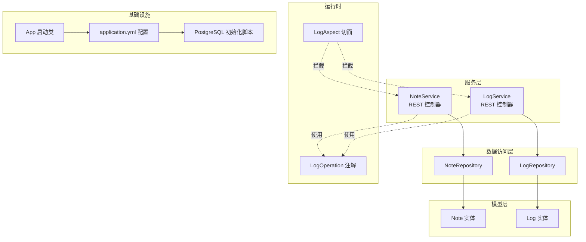
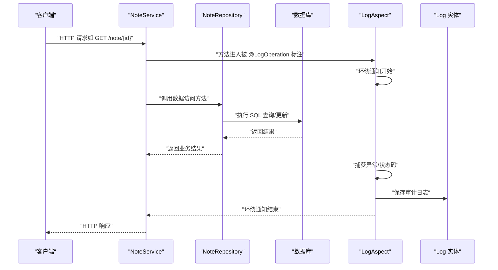
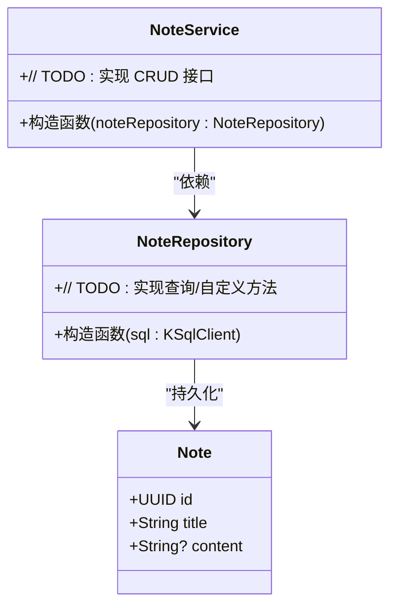
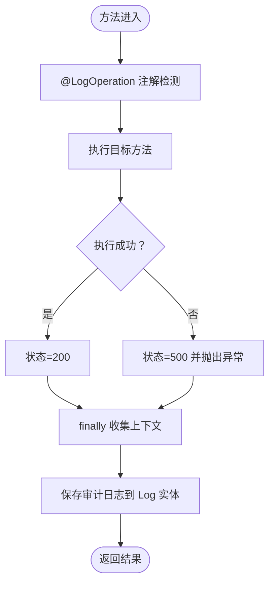
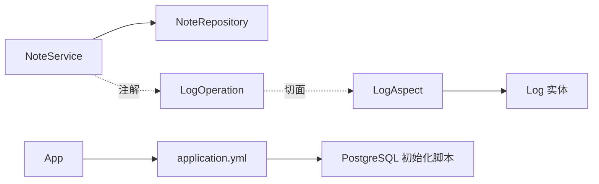

# 笔记API

<cite>
**本文引用的文件**
- [NoteService.kt](file://service/src/main/kotlin/top/zztech/ainote/service/NoteService.kt)
- [Note.kt](file://model/src/main/kotlin/top/zztech/ainote/model/Note.kt)
- [NoteRepository.kt](file://repository/src/main/kotlin/top/zztech/ainote/repository/NoteRepository.kt)
- [LogOperation.kt](file://runtime/src/main/kotlin/top/zztech/ainote/runtime/annotation/LogOperation.kt)
- [LogAspect.kt](file://runtime/src/main/kotlin/top/zztech/ainote/runtime/aspect/LogAspect.kt)
- [LogService.kt](file://service/src/main/kotlin/top/zztech/ainote/service/LogService.kt)
- [Log.kt](file://model/src/main/kotlin/top/zztech/ainote/model/Log.kt)
- [init.sql](file://database/init.sql)
- [App.kt](file://service/src/main/kotlin/top/zztech/ainote/App.kt)
- [application.yml](file://service/src/main/resources/application.yml)
</cite>

## 目录
1. [简介](#简介)
2. [项目结构](#项目结构)
3. [核心组件](#核心组件)
4. [架构总览](#架构总览)
5. [详细组件分析](#详细组件分析)
6. [依赖关系分析](#依赖关系分析)
7. [性能与可扩展性建议](#性能与可扩展性建议)
8. [故障排查指南](#故障排查指南)
9. [结论](#结论)
10. [附录：REST API 规范](#附录rest-api-规范)

## 简介
本文件为 ainote-server 的“笔记服务”RESTful API 文档，目标是帮助开发者快速理解并扩展 NoteService 的功能。当前服务已具备基础的 REST 控制器与事务管理能力，并映射到 /note 路径；同时，系统通过注解与切面机制实现了统一的操作日志记录。尽管当前控制器类体为空，但本文将明确其预期职责与扩展方向，包括提供笔记的增删改查（CRUD）端点，并给出最佳实践与实现指引。

## 项目结构
- 服务层：NoteService 位于 service 模块，负责对外暴露 REST 接口。
- 数据模型：Note 实体定义了笔记的核心字段（标题、内容等）。
- 数据访问：NoteRepository 基于 BabyFish Kotlin Repository 抽象，提供对 Note 的持久化能力。
- 日志体系：LogOperation 注解与 LogAspect 切面共同实现自动审计日志记录；LogService 提供日志查询接口。
- 启动与配置：App 应用入口启用隐式 API；application.yml 配置数据库、Redis、OpenAPI 等参数。

图表来源
- [NoteService.kt](file://service/src/main/kotlin/top/zztech/ainote/service/NoteService.kt#L1-L32)
- [NoteRepository.kt](file://repository/src/main/kotlin/top/zztech/ainote/repository/NoteRepository.kt#L1-L27)
- [LogOperation.kt](file://runtime/src/main/kotlin/top/zztech/ainote/runtime/annotation/LogOperation.kt#L1-L29)
- [LogAspect.kt](file://runtime/src/main/kotlin/top/zztech/ainote/runtime/aspect/LogAspect.kt#L1-L159)
- [LogService.kt](file://service/src/main/kotlin/top/zztech/ainote/service/LogService.kt#L1-L87)
- [App.kt](file://service/src/main/kotlin/top/zztech/ainote/App.kt#L1-L14)
- [application.yml](file://service/src/main/resources/application.yml#L1-L57)
- [init.sql](file://database/init.sql#L1-L101)

章节来源
- [NoteService.kt](file://service/src/main/kotlin/top/zztech/ainote/service/NoteService.kt#L1-L32)
- [NoteRepository.kt](file://repository/src/main/kotlin/top/zztech/ainote/repository/NoteRepository.kt#L1-L27)
- [LogOperation.kt](file://runtime/src/main/kotlin/top/zztech/ainote/runtime/annotation/LogOperation.kt#L1-L29)
- [LogAspect.kt](file://runtime/src/main/kotlin/top/zztech/ainote/runtime/aspect/LogAspect.kt#L1-L159)
- [LogService.kt](file://service/src/main/kotlin/top/zztech/ainote/service/LogService.kt#L1-L87)
- [App.kt](file://service/src/main/kotlin/top/zztech/ainote/App.kt#L1-L14)
- [application.yml](file://service/src/main/resources/application.yml#L1-L57)
- [init.sql](file://database/init.sql#L1-L101)

## 核心组件
- NoteService：REST 控制器，映射到 /note，声明式开启事务，注入 NoteRepository，用于承载笔记 CRUD 的 HTTP 接口。
- Note 实体：定义笔记的标识、标题与内容等字段，继承通用基类，支持唯一键约束。
- NoteRepository：基于 BabyFish Kotlin Repository 抽象，提供对 Note 的查询与自定义扩展方法。
- 日志注解与切面：LogOperation 注解用于标注需要记录日志的方法；LogAspect 切面在方法执行前后收集请求/响应信息并写入 Log 实体。
- 日志服务：LogService 提供日志查询与删除接口，便于审计与运维。

章节来源
- [NoteService.kt](file://service/src/main/kotlin/top/zztech/ainote/service/NoteService.kt#L1-L32)
- [Note.kt](file://model/src/main/kotlin/top/zztech/ainote/model/Note.kt#L1-L29)
- [NoteRepository.kt](file://repository/src/main/kotlin/top/zztech/ainote/repository/NoteRepository.kt#L1-L27)
- [LogOperation.kt](file://runtime/src/main/kotlin/top/zztech/ainote/runtime/annotation/LogOperation.kt#L1-L29)
- [LogAspect.kt](file://runtime/src/main/kotlin/top/zztech/ainote/runtime/aspect/LogAspect.kt#L1-L159)
- [LogService.kt](file://service/src/main/kotlin/top/zztech/ainote/service/LogService.kt#L1-L87)

## 架构总览
下图展示了从客户端到服务层、数据访问层以及日志记录的整体流程。NoteService 作为入口，调用 NoteRepository 完成数据读写；所有带 @LogOperation 的方法都会被 LogAspect 自动拦截并生成审计日志。

图表来源
- [NoteService.kt](file://service/src/main/kotlin/top/zztech/ainote/service/NoteService.kt#L1-L32)
- [NoteRepository.kt](file://repository/src/main/kotlin/top/zztech/ainote/repository/NoteRepository.kt#L1-L27)
- [LogOperation.kt](file://runtime/src/main/kotlin/top/zztech/ainote/runtime/annotation/LogOperation.kt#L1-L29)
- [LogAspect.kt](file://runtime/src/main/kotlin/top/zztech/ainote/runtime/aspect/LogAspect.kt#L1-L159)
- [Log.kt](file://model/src/main/kotlin/top/zztech/ainote/model/Log.kt#L1-L74)

## 详细组件分析

### NoteService 类结构与职责
- 注解与映射
  - @RestController：声明为 REST 控制器，自动序列化响应。
  - @RequestMapping("/note")：统一前缀为 /note。
  - @Transactional：开启事务，确保 CRUD 操作的一致性。
- 依赖注入
  - 注入 NoteRepository，用于数据访问。
- 当前状态
  - 类体为空，尚未实现任何接口方法，是后续扩展的骨架。

图表来源
- [NoteService.kt](file://service/src/main/kotlin/top/zztech/ainote/service/NoteService.kt#L1-L32)
- [NoteRepository.kt](file://repository/src/main/kotlin/top/zztech/ainote/repository/NoteRepository.kt#L1-L27)
- [Note.kt](file://model/src/main/kotlin/top/zztech/ainote/model/Note.kt#L1-L29)

章节来源
- [NoteService.kt](file://service/src/main/kotlin/top/zztech/ainote/service/NoteService.kt#L1-L32)

### Note 实体与数据模型
- 字段说明
  - id：主键（UUID）。
  - title：键字段，唯一约束。
  - content：笔记内容，允许为空。
- 继承与约束
  - 继承通用基类，支持唯一键约束，便于业务去重与检索。

章节来源
- [Note.kt](file://model/src/main/kotlin/top/zztech/ainote/model/Note.kt#L1-L29)
- [init.sql](file://database/init.sql#L75-L82)

### NoteRepository 数据访问
- 基于 BabyFish Kotlin Repository 抽象，提供对 Note 的基本持久化能力。
- 可扩展：可在类中添加自定义查询方法，如按标题模糊匹配等。

章节来源
- [NoteRepository.kt](file://repository/src/main/kotlin/top/zztech/ainote/repository/NoteRepository.kt#L1-L27)

### 日志注解与切面
- LogOperation 注解
  - 作用：标记需要记录日志的方法。
  - 参数：action（操作名）、entityType（实体类型）、includeRequest/Response（是否记录请求/响应）。
- LogAspect 切面
  - 作用：拦截带 @LogOperation 的方法，自动采集请求上下文、响应状态、异常信息，并保存到 Log 实体。
  - 行为：环绕通知，先执行原方法，再在 finally 中落库；异常时设置 500 并抛出。

图表来源
- [LogOperation.kt](file://runtime/src/main/kotlin/top/zztech/ainote/runtime/annotation/LogOperation.kt#L1-L29)
- [LogAspect.kt](file://runtime/src/main/kotlin/top/zztech/ainote/runtime/aspect/LogAspect.kt#L1-L159)
- [Log.kt](file://model/src/main/kotlin/top/zztech/ainote/model/Log.kt#L1-L74)

章节来源
- [LogOperation.kt](file://runtime/src/main/kotlin/top/zztech/ainote/runtime/annotation/LogOperation.kt#L1-L29)
- [LogAspect.kt](file://runtime/src/main/kotlin/top/zztech/ainote/runtime/aspect/LogAspect.kt#L1-L159)
- [LogService.kt](file://service/src/main/kotlin/top/zztech/ainote/service/LogService.kt#L1-L87)

## 依赖关系分析
- 控制器到仓库：NoteService 依赖 NoteRepository 完成数据访问。
- 注解到切面：LogOperation 与 LogAspect 形成横切关注点，保证日志记录的统一性。
- 配置到启动：application.yml 提供数据库、Redis、OpenAPI 等配置；App 启动类启用隐式 API。

图表来源
- [NoteService.kt](file://service/src/main/kotlin/top/zztech/ainote/service/NoteService.kt#L1-L32)
- [NoteRepository.kt](file://repository/src/main/kotlin/top/zztech/ainote/repository/NoteRepository.kt#L1-L27)
- [LogOperation.kt](file://runtime/src/main/kotlin/top/zztech/ainote/runtime/annotation/LogOperation.kt#L1-L29)
- [LogAspect.kt](file://runtime/src/main/kotlin/top/zztech/ainote/runtime/aspect/LogAspect.kt#L1-L159)
- [Log.kt](file://model/src/main/kotlin/top/zztech/ainote/model/Log.kt#L1-L74)
- [App.kt](file://service/src/main/kotlin/top/zztech/ainote/App.kt#L1-L14)
- [application.yml](file://service/src/main/resources/application.yml#L1-L57)
- [init.sql](file://database/init.sql#L1-L101)

章节来源
- [NoteService.kt](file://service/src/main/kotlin/top/zztech/ainote/service/NoteService.kt#L1-L32)
- [NoteRepository.kt](file://repository/src/main/kotlin/top/zztech/ainote/repository/NoteRepository.kt#L1-L27)
- [LogOperation.kt](file://runtime/src/main/kotlin/top/zztech/ainote/runtime/annotation/LogOperation.kt#L1-L29)
- [LogAspect.kt](file://runtime/src/main/kotlin/top/zztech/ainote/runtime/aspect/LogAspect.kt#L1-L159)
- [App.kt](file://service/src/main/kotlin/top/zztech/ainote/App.kt#L1-L14)
- [application.yml](file://service/src/main/resources/application.yml#L1-L57)
- [init.sql](file://database/init.sql#L1-L101)

## 性能与可扩展性建议
- 分页与排序：在查询接口中引入分页参数，避免一次性返回大量数据。
- 缓存策略：结合 Redis 或本地缓存，对热点笔记进行缓存，降低数据库压力。
- 并发控制：对更新/删除接口增加乐观锁或版本号校验，防止并发覆盖。
- 日志粒度：根据业务重要性调整 @LogOperation 的 includeRequest/Response，平衡审计完整性与性能。
- 数据一致性：利用 @Transactional 保障事务边界，避免部分提交导致的数据不一致。

[本节为通用建议，无需特定文件来源]

## 故障排查指南
- 日志查询
  - 使用 LogService 的查询接口定位问题：按账户、最新日志、按 ID 查询等。
- 异常处理
  - LogAspect 在异常时会记录错误消息与状态码 500，便于定位问题根因。
- 数据库初始化
  - 若笔记表缺失，请确认 init.sql 已执行，确保表结构与索引存在。

章节来源
- [LogService.kt](file://service/src/main/kotlin/top/zztech/ainote/service/LogService.kt#L1-L87)
- [LogAspect.kt](file://runtime/src/main/kotlin/top/zztech/ainote/runtime/aspect/LogAspect.kt#L1-L159)
- [init.sql](file://database/init.sql#L1-L101)

## 结论
NoteService 当前作为笔记模块的 REST 入口，已具备良好的扩展基础：REST 映射、事务管理、日志记录与数据访问层均已就绪。建议尽快实现标准 CRUD 端点，并遵循统一的日志记录规范，以提升系统的可观测性与可维护性。

[本节为总结，无需特定文件来源]

## 附录：REST API 规范

- 基础路径
  - /note

- 认证与安全
  - OpenAPI 配置中定义了基于 Header 的租户密钥方案（tenant），请在请求头中携带相应值以满足多租户隔离要求。

- 端点清单（建议实现）
  - 获取笔记列表
    - 方法：GET
    - 路径：/note
    - 返回：笔记列表
    - 备注：建议支持分页与排序参数
  - 获取单个笔记
    - 方法：GET
    - 路径：/note/{id}
    - 参数：id（UUID）
    - 返回：笔记对象
  - 创建笔记
    - 方法：POST
    - 路径：/note
    - 请求体：笔记字段（标题、内容等）
    - 返回：新创建的笔记对象
    - 日志：使用 @LogOperation(action="CREATE_NOTE", entityType="Note")
  - 更新笔记
    - 方法：PUT
    - 路径：/note/{id}
    - 参数：id（UUID）
    - 请求体：更新字段
    - 返回：更新后的笔记对象
    - 日志：使用 @LogOperation(action="UPDATE_NOTE", entityType="Note")
  - 删除笔记
    - 方法：DELETE
    - 路径：/note/{id}
    - 参数：id（UUID）
    - 返回：无
    - 日志：使用 @LogOperation(action="DELETE_NOTE", entityType="Note")

- 错误与状态码
  - 成功：200
  - 新建：201
  - 未找到：404
  - 服务器错误：500（同时记录审计日志）

- OpenAPI 与 UI
  - OpenAPI 文档路径：/openapi.yml
  - UI 路径：/openapi.html

章节来源
- [application.yml](file://service/src/main/resources/application.yml#L31-L50)
- [LogOperation.kt](file://runtime/src/main/kotlin/top/zztech/ainote/runtime/annotation/LogOperation.kt#L1-L29)
- [LogAspect.kt](file://runtime/src/main/kotlin/top/zztech/ainote/runtime/aspect/LogAspect.kt#L1-L159)
- [NoteService.kt](file://service/src/main/kotlin/top/zztech/ainote/service/NoteService.kt#L1-L32)