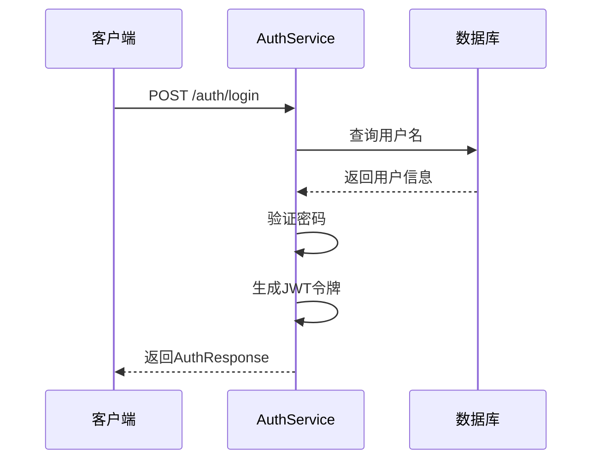
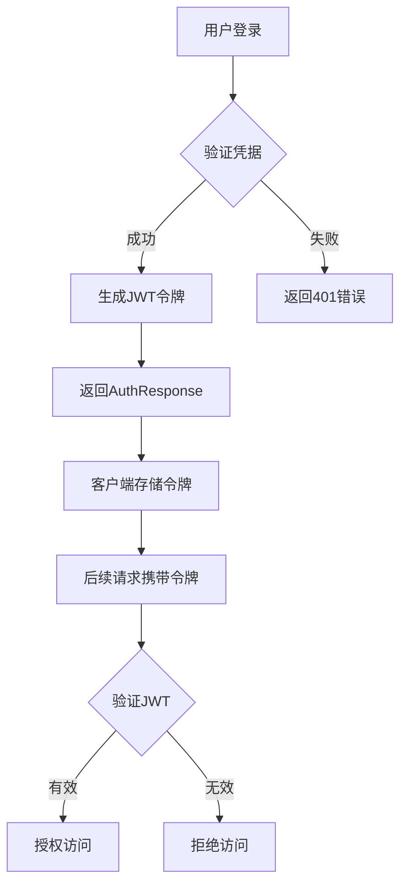
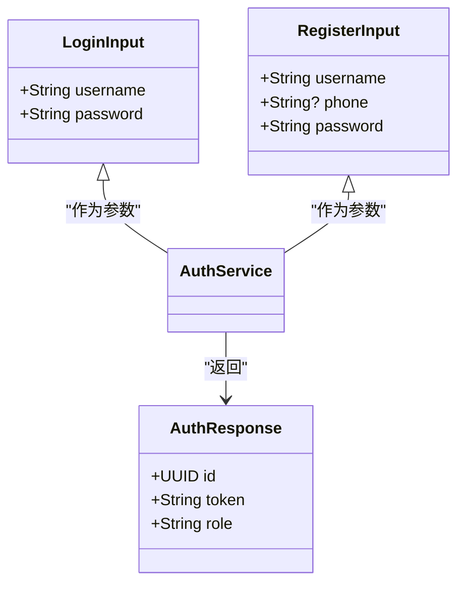
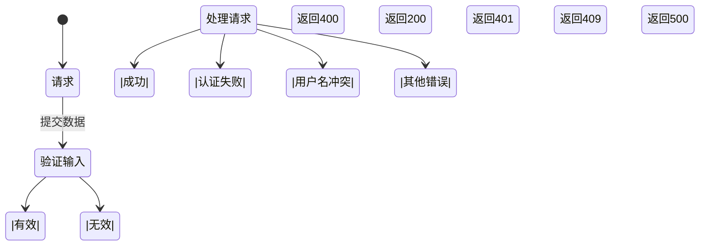
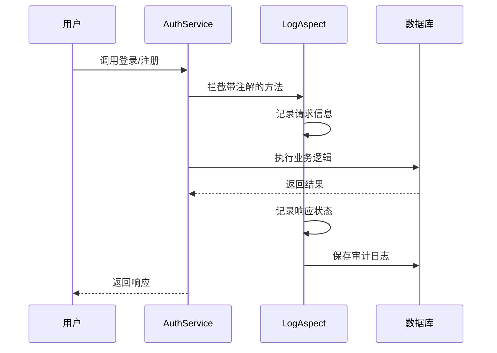

# 认证API

<cite>
**本文档引用的文件**  
- [AuthService.kt](file://service/src/main/kotlin/top/zztech/ainote/service/AuthService.kt)
- [LoginInput.kt](file://service/build/generated/ksp/main/kotlin/top/zztech/ainote/service/dto/LoginInput.kt)
- [RegisterInput.kt](file://service/build/generated/ksp/main/kotlin/top/zztech/ainote/service/dto/RegisterInput.kt)
- [AuthResponse.kt](file://runtime/src/main/kotlin/top/zztech/ainote/runtime/dto/AuthResponse.kt)
- [JwtTokenProvider.kt](file://runtime/src/main/kotlin/top/zztech/ainote/runtime/utility/JwtTokenProvider.kt)
- [JwtAuthenticationFilter.kt](file://runtime/src/main/kotlin/top/zztech/ainote/runtime/utility/JwtAuthenticationFilter.kt)
- [LogOperation.kt](file://runtime/src/main/kotlin/top/zztech/ainote/runtime/annotation/LogOperation.kt)
- [LogAspect.kt](file://runtime/src/main/kotlin/top/zztech/ainote/runtime/aspect/LogAspect.kt)
- [Account.kt](file://model/src/main/kotlin/top/zztech/ainote/model/Account.kt)
- [AccountError.kt](file://service/src/main/kotlin/top/zztech/ainote/error/AccountError.kt)
- [JwtSecurityConfig.kt](file://service/src/main/kotlin/top/zztech/ainote/cfg/JwtSecurityConfig.kt)
- [application.yml](file://service/src/main/resources/application.yml)
</cite>

## 目录
1. [简介](#简介)
2. [认证端点](#认证端点)
3. [JWT认证机制](#jwt认证机制)
4. [请求与响应结构](#请求与响应结构)
5. [错误处理](#错误处理)
6. [安全与审计](#安全与审计)
7. [配置说明](#配置说明)

## 简介
ainote-server的认证服务提供用户登录和注册功能，通过RESTful API实现安全的身份验证。该服务基于Spring Security框架，使用JWT（JSON Web Token）进行无状态认证，并通过BCrypt算法加密存储用户密码。所有认证操作均被记录审计日志，确保系统的可追溯性和安全性。

**Section sources**
- [AuthService.kt](file://service/src/main/kotlin/top/zztech/ainote/service/AuthService.kt#L1-L90)
- [App.kt](file://service/src/main/kotlin/top/zztech/ainote/App.kt#L1-L14)

## 认证端点
认证服务提供两个主要的REST API端点，均位于`/auth`路径下。

### 登录端点
- **HTTP方法**: POST
- **URL路径**: `/auth/login`
- **功能**: 验证用户凭据并返回JWT令牌
- **审计日志**: 使用`@LogOperation(action = "LOGIN")`注解记录操作

### 注册端点
- **HTTP方法**: POST
- **URL路径**: `/auth/register`
- **功能**: 创建新用户账户
- **审计日志**: 使用`@LogOperation(action = "REGISTER")`注解记录操作



**Diagram sources**
- [AuthService.kt](file://service/src/main/kotlin/top/zztech/ainote/service/AuthService.kt#L51-L72)
- [Account.kt](file://model/src/main/kotlin/top/zztech/ainote/model/Account.kt#L1-L34)

## JWT认证机制
ainote-server使用JWT实现无状态认证，工作流程如下：

1. 用户通过`/auth/login`端点提交用户名和密码
2. 服务验证凭据，成功后生成JWT令牌
3. 令牌包含用户身份信息，并使用密钥签名
4. 后续请求需在`Authorization`头中携带`Bearer <token>`格式的令牌
5. 服务通过`JwtAuthenticationFilter`验证令牌并建立安全上下文



**Diagram sources**
- [JwtTokenProvider.kt](file://runtime/src/main/kotlin/top/zztech/ainote/runtime/utility/JwtTokenProvider.kt#L1-L50)
- [JwtAuthenticationFilter.kt](file://runtime/src/main/kotlin/top/zztech/ainote/runtime/utility/JwtAuthenticationFilter.kt#L1-L50)

## 请求与响应结构
### 请求头要求
- **Content-Type**: application/json
- **Authorization** (仅限受保护端点): Bearer <JWT令牌>

### LoginInput 请求体结构
用于登录请求的JSON数据结构：

| 字段 | 类型 | 必需 | 描述 |
|------|------|------|------|
| username | string | 是 | 用户名 |
| password | string | 是 | 密码 |

### RegisterInput 请求体结构
用于注册请求的JSON数据结构：

| 字段 | 类型 | 必需 | 描述 |
|------|------|------|------|
| username | string | 是 | 用户名 |
| phone | string | 否 | 手机号码 |
| password | string | 是 | 密码 |

### AuthResponse 响应体结构
认证成功时返回的JSON数据结构：

| 字段 | 类型 | 描述 |
|------|------|------|
| id | UUID | 用户唯一标识符 |
| token | string | JWT认证令牌 |
| role | string | 用户角色（ADMIN或USER） |



**Diagram sources**
- [LoginInput.kt](file://service/build/generated/ksp/main/kotlin/top/zztech/ainote/service/dto/LoginInput.kt#L1-L94)
- [RegisterInput.kt](file://service/build/generated/ksp/main/kotlin/top/zztech/ainote/service/dto/RegisterInput.kt#L1-L106)
- [AuthResponse.kt](file://runtime/src/main/kotlin/top/zztech/ainote/runtime/dto/AuthResponse.kt#L1-L8)

## 错误处理
认证服务定义了标准化的错误响应机制。

### 成功响应
- **HTTP状态码**: 200 OK
- **示例**: 
```json
{
  "id": "a1b2c3d4-e5f6-7890-g1h2-i3j4k5l6m7n8",
  "token": "eyJhbGciOiJIUzI1NiIsInR5cCI6IkpXVCJ9.xxxxx",
  "role": "USER"
}
```

### 错误响应
| HTTP状态码 | 错误类型 | 描述 | 示例消息 |
|-----------|---------|------|---------|
| 401 | 认证失败 | 用户名不存在或密码错误 | "用户不存在: username" |
| 409 | 冲突 | 用户名已存在 | "用户名已存在" |
| 400 | 请求错误 | 输入数据验证失败 | "输入参数无效" |



**Diagram sources**
- [AccountError.kt](file://service/src/main/kotlin/top/zztech/ainote/error/AccountError.kt#L2-L11)
- [AuthService.kt](file://service/src/main/kotlin/top/zztech/ainote/service/AuthService.kt#L58-L87)

## 安全与审计
### 密码加密
用户密码通过BCryptPasswordEncoder进行加密存储，确保即使数据库泄露也无法直接获取明文密码。

### 操作审计
使用`@LogOperation`注解和AOP切面实现操作审计：
- 所有登录和注册操作均被记录
- 日志包含IP地址、User-Agent、请求URL等信息
- 异常情况也会被记录用于故障排查



**Diagram sources**
- [LogOperation.kt](file://runtime/src/main/kotlin/top/zztech/ainote/runtime/annotation/LogOperation.kt#L1-L29)
- [LogAspect.kt](file://runtime/src/main/kotlin/top/zztech/ainote/runtime/aspect/LogAspect.kt#L1-L159)
- [JwtSecurityConfig.kt](file://service/src/main/kotlin/top/zztech/ainote/cfg/JwtSecurityConfig.kt#L1-L69)

## 配置说明
### JWT配置
在`application.yml`中定义JWT相关参数：

```yaml
jwt:
  secret: Nobody likes you, everyone left you. They're all out without you, having fun
  expiration: 86400000  # 24小时
```

### 安全配置
- 会话管理: 无状态（STATELESS）
- CSRF保护: 已禁用
- CORS: 允许所有来源、方法和头部
- 密码编码器: BCryptPasswordEncoder

**Section sources**
- [application.yml](file://service/src/main/resources/application.yml#L51-L57)
- [JwtSecurityConfig.kt](file://service/src/main/kotlin/top/zztech/ainote/cfg/JwtSecurityConfig.kt#L1-L69)