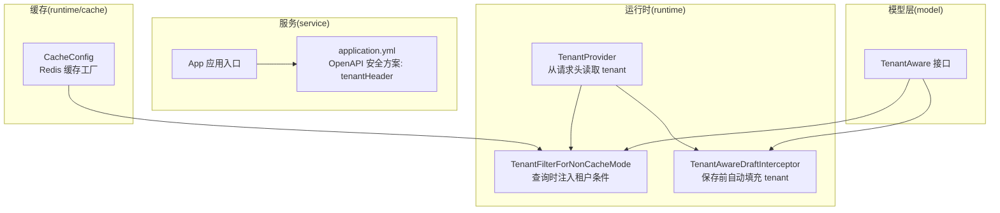
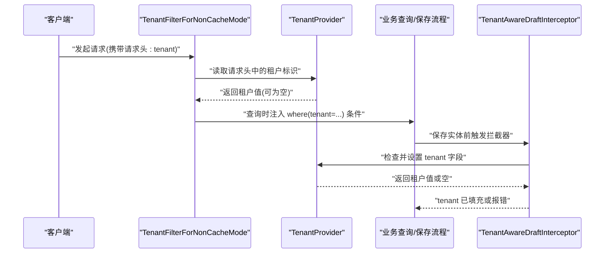
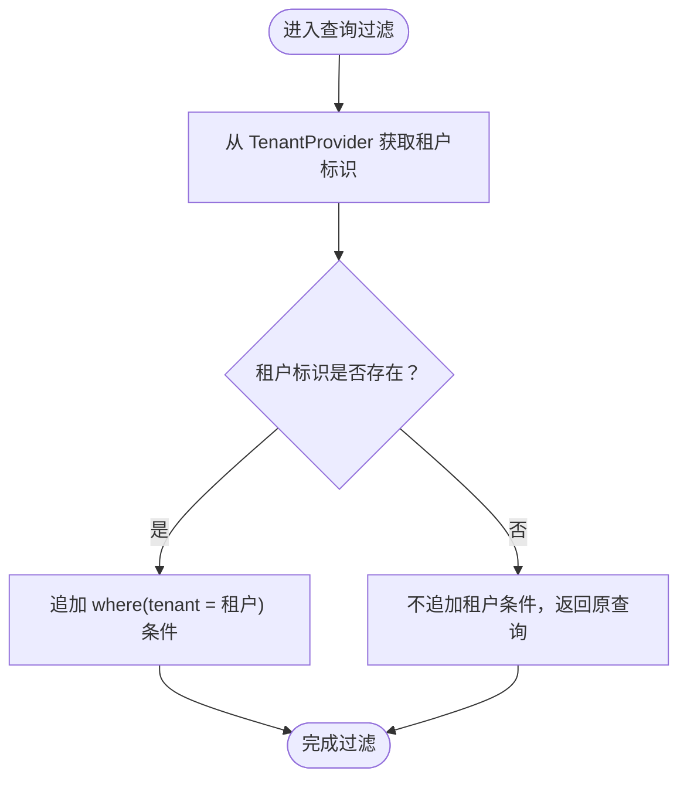
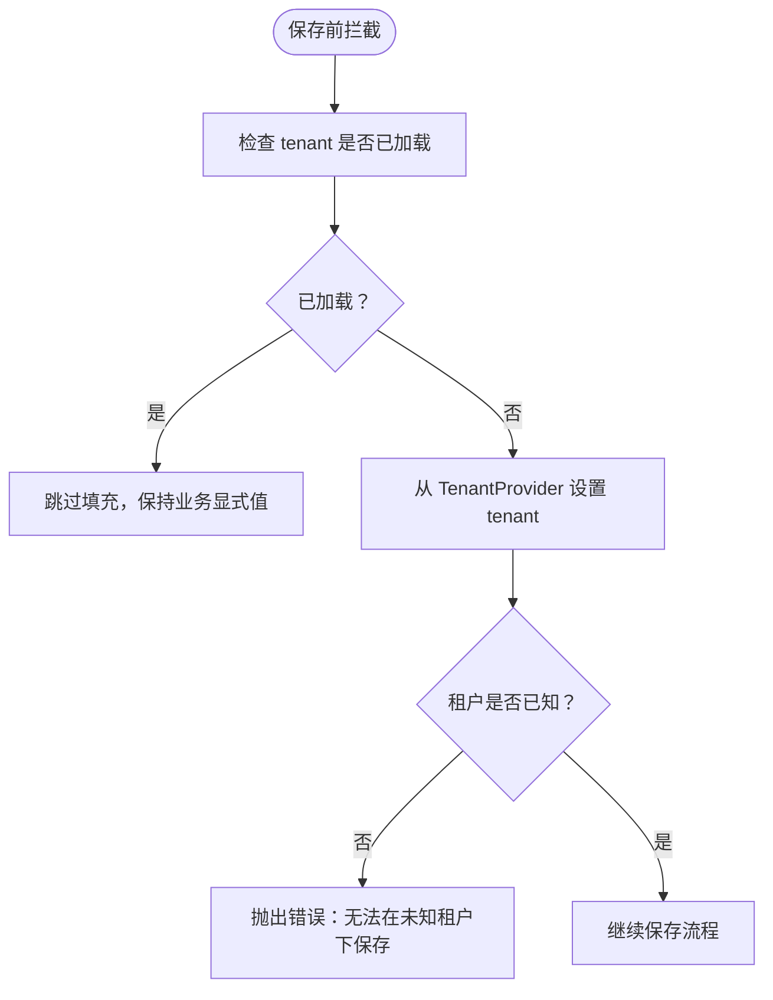
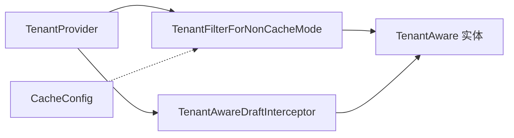

# 多租户支持

<cite>
**本文引用的文件**
- [TenantAware.kt](file://model/src/main/kotlin/top/zztech/ainote/model/common/TenantAware.kt)
- [TenantProvider.kt](file://runtime/src/main/kotlin/top/zztech/ainote/runtime/TenantProvider.kt)
- [TenantFilterForNonCacheMode.kt](file://runtime/src/main/kotlin/top/zztech/ainote/runtime/filter/TenantFilterForNonCacheMode.kt)
- [TenantAwareDraftInterceptor.kt](file://runtime/src/main/kotlin/top/zztech/ainote/runtime/interceptor/TenantAwareDraftInterceptor.kt)
- [application.yml](file://service/src/main/resources/application.yml)
- [CacheConfig.kt](file://runtime/src/main/kotlin/top/zztech/ainote/runtime/cache/CacheConfig.kt)
- [App.kt](file://service/src/main/kotlin/top/zztech/ainote/App.kt)
</cite>

## 目录
1. [简介](#简介)
2. [项目结构](#项目结构)
3. [核心组件](#核心组件)
4. [架构总览](#架构总览)
5. [详细组件分析](#详细组件分析)
6. [依赖关系分析](#依赖关系分析)
7. [性能与缓存影响](#性能与缓存影响)
8. [使用示例与最佳实践](#使用示例与最佳实践)
9. [故障排查指南](#故障排查指南)
10. [结论](#结论)

## 简介
本文件聚焦于系统的多租户支持能力，解释如何通过接口与拦截器、过滤器实现“按租户隔离”的数据访问与持久化。重点包括：
- 如何通过 TenantAware 接口为实体统一引入 tenant 字段；
- 如何通过 TenantProvider 从 HTTP 请求头中提取租户标识；
- 在非缓存模式下，TenantFilterForNonCacheMode 在查询阶段自动注入租户条件；
- 在保存阶段，TenantAwareDraftInterceptor 自动填充未加载的 tenant 字段；
- 如何通过 curl -H "tenant: a" 指定租户并进行验证；
- 多租户模式对数据库查询与缓存的影响，以及 application.yml 中的租户相关配置。

## 项目结构
多租户相关代码主要分布在以下模块：
- model：定义统一的租户接口与实体基类契约（TenantAware）
- runtime：运行时的租户提供者、过滤器与拦截器（TenantProvider、TenantFilterForNonCacheMode、TenantAwareDraftInterceptor）
- service：应用入口与配置（App.kt、application.yml）
- runtime/cache：缓存配置（CacheConfig.kt）

图表来源
- [TenantAware.kt](file://model/src/main/kotlin/top/zztech/ainote/model/common/TenantAware.kt#L1-L16)
- [TenantProvider.kt](file://runtime/src/main/kotlin/top/zztech/ainote/runtime/TenantProvider.kt#L1-L15)
- [TenantFilterForNonCacheMode.kt](file://runtime/src/main/kotlin/top/zztech/ainote/runtime/filter/TenantFilterForNonCacheMode.kt#L1-L25)
- [TenantAwareDraftInterceptor.kt](file://runtime/src/main/kotlin/top/zztech/ainote/runtime/interceptor/TenantAwareDraftInterceptor.kt#L1-L21)
- [application.yml](file://service/src/main/resources/application.yml#L1-L57)
- [CacheConfig.kt](file://runtime/src/main/kotlin/top/zztech/ainote/runtime/cache/CacheConfig.kt#L1-L58)
- [App.kt](file://service/src/main/kotlin/top/zztech/ainote/App.kt#L1-L14)

章节来源
- [App.kt](file://service/src/main/kotlin/top/zztech/ainote/App.kt#L1-L14)
- [application.yml](file://service/src/main/resources/application.yml#L1-L57)

## 核心组件
- TenantAware 接口：为所有需要参与多租户隔离的实体提供统一的 tenant 字段契约，通常由拦截器在保存时自动填充。
- TenantProvider：从当前 HTTP 请求的请求头中读取名为 "tenant" 的值，作为当前请求的租户标识。
- TenantFilterForNonCacheMode：在非缓存模式下，作为 KFilter 注入到查询中，自动为匹配的实体类型追加 where(tenant = 当前租户) 条件。
- TenantAwareDraftInterceptor：在实体保存前，若 tenant 字段未显式加载，则自动从 TenantProvider 设置该字段；否则抛出错误以避免未知租户写入。

章节来源
- [TenantAware.kt](file://model/src/main/kotlin/top/zztech/ainote/model/common/TenantAware.kt#L1-L16)
- [TenantProvider.kt](file://runtime/src/main/kotlin/top/zztech/ainote/runtime/TenantProvider.kt#L1-L15)
- [TenantFilterForNonCacheMode.kt](file://runtime/src/main/kotlin/top/zztech/ainote/runtime/filter/TenantFilterForNonCacheMode.kt#L1-L25)
- [TenantAwareDraftInterceptor.kt](file://runtime/src/main/kotlin/top/zztech/ainote/runtime/interceptor/TenantAwareDraftInterceptor.kt#L1-L21)

## 架构总览
多租户在请求生命周期中的关键交互如下：

图表来源
- [TenantFilterForNonCacheMode.kt](file://runtime/src/main/kotlin/top/zztech/ainote/runtime/filter/TenantFilterForNonCacheMode.kt#L1-L25)
- [TenantAwareDraftInterceptor.kt](file://runtime/src/main/kotlin/top/zztech/ainote/runtime/interceptor/TenantAwareDraftInterceptor.kt#L1-L21)
- [TenantProvider.kt](file://runtime/src/main/kotlin/top/zztech/ainote/runtime/TenantProvider.kt#L1-L15)

## 详细组件分析

### TenantAware 接口
- 角色：为实体提供统一的 tenant 字段契约，确保所有“租户感知”的实体具备相同的字段名与语义。
- 设计要点：接口标注为映射超类，便于生成器将其作为基类属性处理；注释明确指出该字段通常不由业务代码直接修改，而是由拦截器自动填充。

章节来源
- [TenantAware.kt](file://model/src/main/kotlin/top/zztech/ainote/model/common/TenantAware.kt#L1-L16)

### TenantProvider
- 角色：从当前线程绑定的 HTTP 请求中读取名为 "tenant" 的请求头，作为当前请求的租户标识。
- 行为细节：仅当请求头存在且非空时才返回有效值；否则返回空，表示未知租户。

章节来源
- [TenantProvider.kt](file://runtime/src/main/kotlin/top/zztech/ainote/runtime/TenantProvider.kt#L1-L15)

### TenantFilterForNonCacheMode
- 角色：在非缓存模式下，作为 KFilter 对实体进行全局过滤，自动追加 where(tenant = 当前租户) 条件。
- 条件注册：通过条件注解避免与“缓存模式下的租户过滤器”冲突，确保同一时间只启用一种模式。
- 过滤时机：在查询构建阶段生效，保证读取数据时天然带有多租户隔离。

图表来源
- [TenantFilterForNonCacheMode.kt](file://runtime/src/main/kotlin/top/zztech/ainote/runtime/filter/TenantFilterForNonCacheMode.kt#L1-L25)

章节来源
- [TenantFilterForNonCacheMode.kt](file://runtime/src/main/kotlin/top/zztech/ainote/runtime/filter/TenantFilterForNonCacheMode.kt#L1-L25)

### TenantAwareDraftInterceptor
- 角色：在实体保存前自动填充 tenant 字段，确保每条记录都带有明确的租户归属。
- 保护机制：若 tenant 字段未显式加载，拦截器会尝试从 TenantProvider 设置；若仍为空则抛出错误，防止未知租户的数据写入。
- 适用范围：对所有实现 TenantAware 的实体生效，保障写入一致性。

图表来源
- [TenantAwareDraftInterceptor.kt](file://runtime/src/main/kotlin/top/zztech/ainote/runtime/interceptor/TenantAwareDraftInterceptor.kt#L1-L21)

章节来源
- [TenantAwareDraftInterceptor.kt](file://runtime/src/main/kotlin/top/zztech/ainote/runtime/interceptor/TenantAwareDraftInterceptor.kt#L1-L21)

## 依赖关系分析
- 组件耦合
  - TenantFilterForNonCacheMode 依赖 TenantProvider 提供租户标识，并作用于实现了 TenantAware 的实体类型。
  - TenantAwareDraftInterceptor 同样依赖 TenantProvider，在保存前确保 tenant 字段被正确设置。
- 条件装配
  - 非缓存模式过滤器通过条件注解避免与“缓存模式下的租户过滤器”同时启用，降低冲突风险。
- 缓存配置
  - CacheConfig 声明了 Redis 缓存工厂，但未直接注入租户隔离逻辑；因此在缓存模式下需另行实现租户隔离策略（例如通过缓存键分区或专用缓存过滤器）。

图表来源
- [TenantProvider.kt](file://runtime/src/main/kotlin/top/zztech/ainote/runtime/TenantProvider.kt#L1-L15)
- [TenantFilterForNonCacheMode.kt](file://runtime/src/main/kotlin/top/zztech/ainote/runtime/filter/TenantFilterForNonCacheMode.kt#L1-L25)
- [TenantAwareDraftInterceptor.kt](file://runtime/src/main/kotlin/top/zztech/ainote/runtime/interceptor/TenantAwareDraftInterceptor.kt#L1-L21)
- [CacheConfig.kt](file://runtime/src/main/kotlin/top/zztech/ainote/runtime/cache/CacheConfig.kt#L1-L58)

章节来源
- [CacheConfig.kt](file://runtime/src/main/kotlin/top/zztech/ainote/runtime/cache/CacheConfig.kt#L1-L58)

## 性能与缓存影响
- 查询性能
  - 在非缓存模式下，TenantFilterForNonCacheMode 会在每次查询时追加租户条件，这会增加 SQL WHERE 子句的复杂度。建议在 tenant 字段上建立合适的索引以优化查询性能。
- 缓存命中率
  - 在缓存模式下，若未对缓存键进行“租户分区”，不同租户的数据可能互相污染，导致缓存命中异常或数据泄露。建议在缓存键中包含租户标识，或采用租户隔离的缓存空间。
- 缓存配置现状
  - CacheConfig 未显式声明租户隔离策略，需结合业务在缓存层补充租户维度的键空间划分或过滤器。

[本节为通用性能讨论，不直接分析具体文件]

## 使用示例与最佳实践
- 指定租户
  - 通过请求头 "tenant" 指定当前租户，例如使用 curl 发送请求时添加 -H "tenant: a"。
- OpenAPI 安全方案
  - application.yml 中配置了名为 tenantHeader 的 apiKey 安全方案，名称为 "tenant"，位于请求头中，便于 API 文档与安全校验工具识别该租户头。
- 最佳实践
  - 所有需要隔离的实体应实现 TenantAware 接口；
  - 在保存前不要手动覆盖 tenant 字段，交由拦截器自动填充；
  - 在缓存模式下，务必在缓存键中加入租户维度，避免跨租户数据污染；
  - 为 tenant 字段建立索引，提升查询性能。

章节来源
- [application.yml](file://service/src/main/resources/application.yml#L1-L57)

## 故障排查指南
- 保存时报错：无法在未知租户下保存
  - 可能原因：请求未携带有效的 "tenant" 请求头，或请求头为空；
  - 处理方式：确认请求头是否正确设置，且值非空；或在业务层显式加载 tenant 字段后再保存。
- 查询结果为空
  - 可能原因：当前租户与目标数据不匹配，或未正确设置租户头；
  - 处理方式：核对请求头 "tenant" 的值；确认 TenantFilterForNonCacheMode 生效。
- 缓存数据混乱
  - 可能原因：缓存键未区分租户；
  - 处理方式：在缓存键中加入租户标识，或在缓存层实现租户隔离策略。

章节来源
- [TenantAwareDraftInterceptor.kt](file://runtime/src/main/kotlin/top/zztech/ainote/runtime/interceptor/TenantAwareDraftInterceptor.kt#L1-L21)
- [TenantFilterForNonCacheMode.kt](file://runtime/src/main/kotlin/top/zztech/ainote/runtime/filter/TenantFilterForNonCacheMode.kt#L1-L25)

## 结论
本系统通过 TenantAware 接口、TenantProvider、TenantFilterForNonCacheMode 与 TenantAwareDraftInterceptor 形成完整的多租户数据隔离闭环：在读取时通过过滤器自动注入租户条件，在写入时通过拦截器自动填充租户字段。配合 application.yml 中的租户头配置，开发者可以轻松地通过请求头指定租户并进行 API 调用。在缓存模式下，需额外关注缓存键的租户维度设计，以避免跨租户数据污染。