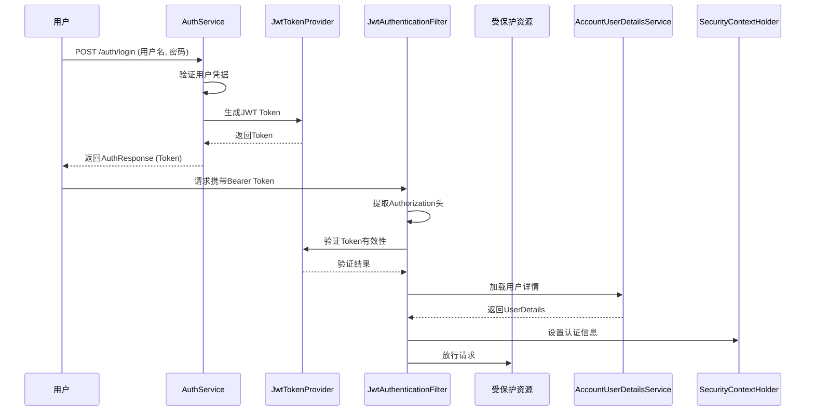
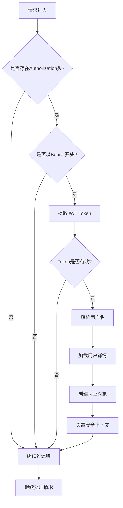
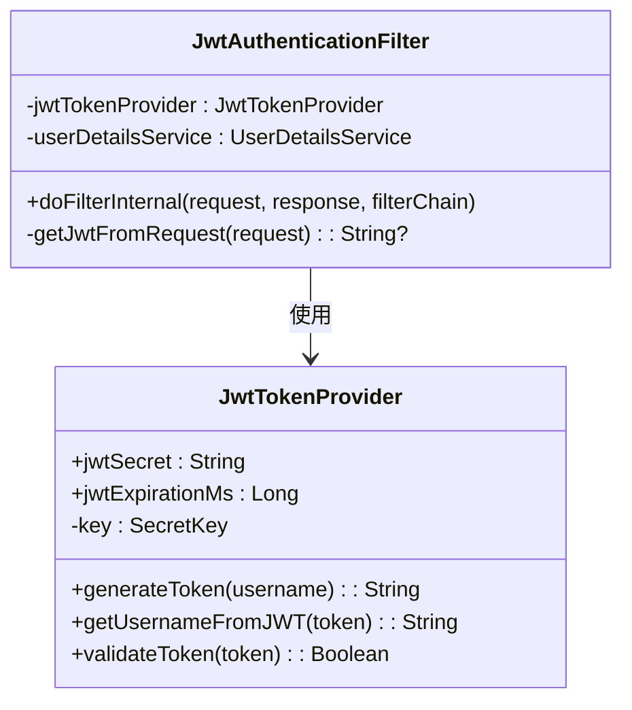
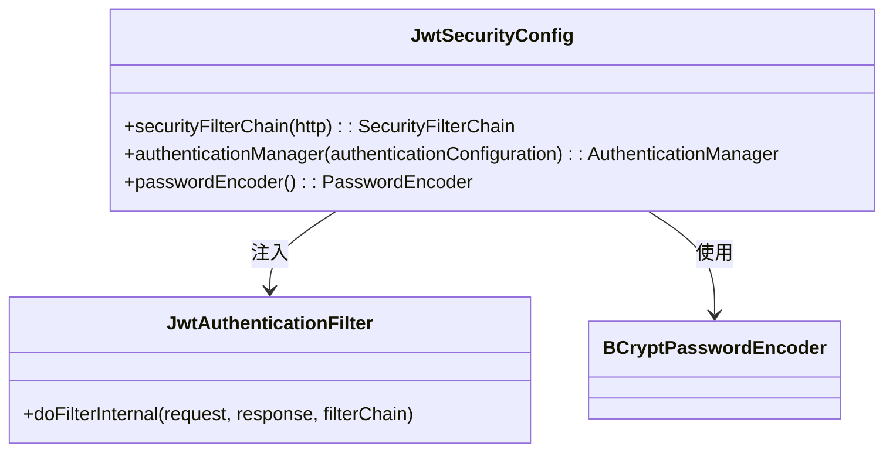
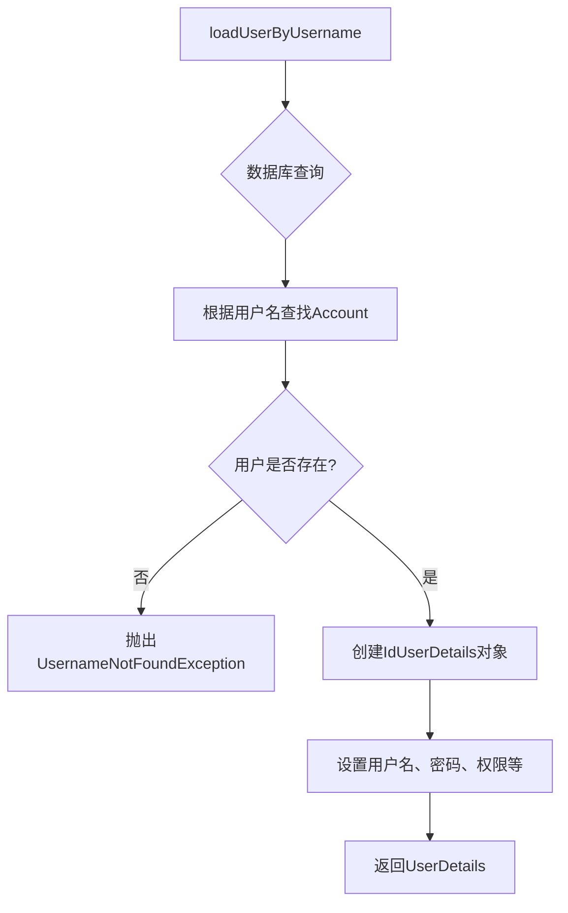
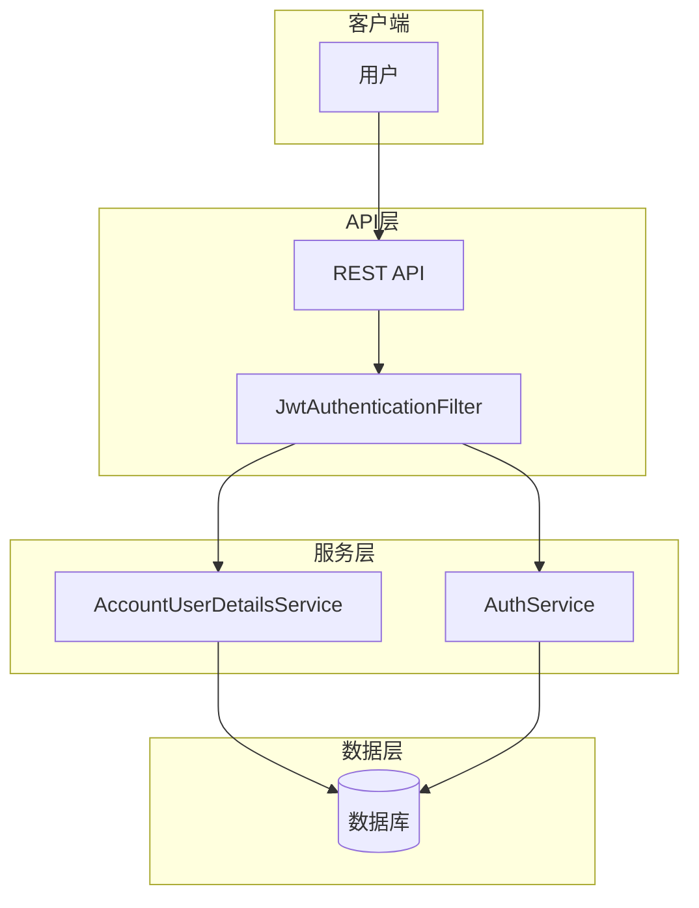
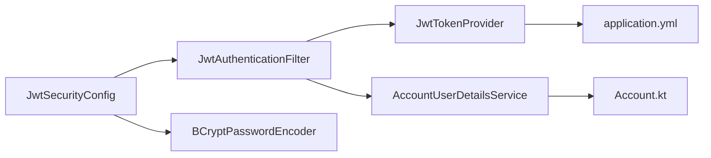
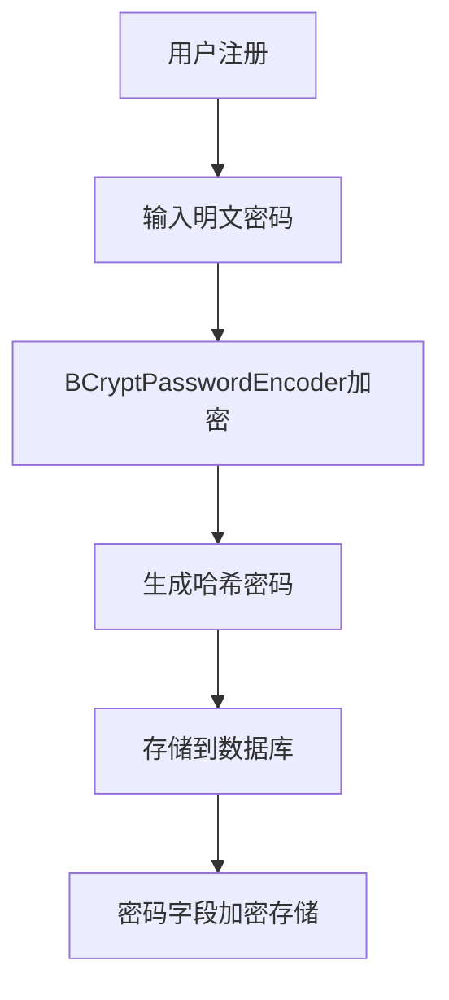

# 安全机制

<cite>
**本文档引用的文件**  
- [JwtAuthenticationFilter.kt](file://runtime/src/main/kotlin/top/zztech/ainote/runtime/utility/JwtAuthenticationFilter.kt)
- [JwtTokenProvider.kt](file://runtime/src/main/kotlin/top/zztech/ainote/runtime/utility/JwtTokenProvider.kt)
- [JwtSecurityConfig.kt](file://service/src/main/kotlin/top/zztech/ainote/cfg/JwtSecurityConfig.kt)
- [AccountUserDetailsService.kt](file://service/src/main/kotlin/top/zztech/ainote/service/AccountUserDetailsService.kt)
- [AuthService.kt](file://service/src/main/kotlin/top/zztech/ainote/service/AuthService.kt)
- [application.yml](file://service/src/main/resources/application.yml)
- [Account.kt](file://model/src/main/kotlin/top/zztech/ainote/model/Account.kt)
</cite>

## 目录
1. [简介](#简介)
2. [核心安全组件](#核心安全组件)
3. [JWT认证流程](#jwt认证流程)
4. [组件详细分析](#组件详细分析)
5. [系统架构概览](#系统架构概览)
6. [依赖关系分析](#依赖关系分析)
7. [多租户数据隔离](#多租户数据隔离)
8. [密码安全机制](#密码安全机制)
9. [结论](#结论)

## 简介
本文档详细阐述了ainote-server项目中的安全机制，重点分析JWT认证流程和多租户数据隔离策略。系统采用基于JWT的无状态认证方案，结合Spring Security框架实现全面的安全控制。用户通过登录接口获取JWT Token，后续请求通过拦截器自动验证Token有效性，实现安全的API访问控制。

## 核心安全组件

系统安全体系由多个核心组件构成，包括JWT过滤器、Token提供器、安全配置、用户详情服务等，共同构建了完整的认证与授权机制。

**本节来源**  
- [JwtAuthenticationFilter.kt](file://runtime/src/main/kotlin/top/zztech/ainote/runtime/utility/JwtAuthenticationFilter.kt#L1-L50)
- [JwtTokenProvider.kt](file://runtime/src/main/kotlin/top/zztech/ainote/runtime/utility/JwtTokenProvider.kt#L1-L50)
- [JwtSecurityConfig.kt](file://service/src/main/kotlin/top/zztech/ainote/cfg/JwtSecurityConfig.kt#L1-L69)

## JWT认证流程

系统采用标准的JWT认证流程：用户登录时验证凭据并生成Token；后续请求携带Bearer Token；服务端通过过滤器解析并验证Token；验证通过后建立安全上下文，允许访问受保护资源。

**图示来源**  
- [AuthService.kt](file://service/src/main/kotlin/top/zztech/ainote/service/AuthService.kt#L51-L72)
- [JwtTokenProvider.kt](file://runtime/src/main/kotlin/top/zztech/ainote/runtime/utility/JwtTokenProvider.kt#L19-L26)
- [JwtAuthenticationFilter.kt](file://runtime/src/main/kotlin/top/zztech/ainote/runtime/utility/JwtAuthenticationFilter.kt#L20-L40)

## 组件详细分析

### JwtAuthenticationFilter分析
JwtAuthenticationFilter是核心的请求拦截组件，继承OncePerRequestFilter，确保每个请求只被过滤一次。它负责从HTTP请求头中提取JWT Token，验证其有效性，并建立Spring Security上下文。

**图示来源**  
- [JwtAuthenticationFilter.kt](file://runtime/src/main/kotlin/top/zztech/ainote/runtime/utility/JwtAuthenticationFilter.kt#L20-L40)

**本节来源**  
- [JwtAuthenticationFilter.kt](file://runtime/src/main/kotlin/top/zztech/ainote/runtime/utility/JwtAuthenticationFilter.kt#L1-L50)

### JwtTokenProvider分析
JwtTokenProvider负责JWT Token的生成、解析和验证。使用HMAC-SHA算法进行签名，确保Token的完整性和安全性。Token包含用户名、签发时间和过期时间等声明信息。

**图示来源**  
- [JwtTokenProvider.kt](file://runtime/src/main/kotlin/top/zztech/ainote/runtime/utility/JwtTokenProvider.kt#L13-L50)
- [JwtAuthenticationFilter.kt](file://runtime/src/main/kotlin/top/zztech/ainote/runtime/utility/JwtAuthenticationFilter.kt#L16-L19)

**本节来源**  
- [JwtTokenProvider.kt](file://runtime/src/main/kotlin/top/zztech/ainote/runtime/utility/JwtTokenProvider.kt#L1-L50)

### JwtSecurityConfig分析
JwtSecurityConfig是Spring Security的配置类，通过注解@EnableWebSecurity和@EnableMethodSecurity启用Web安全和方法级安全。配置了无状态会话、禁用CSRF保护，并将JWT过滤器注入到安全过滤链中。

**图示来源**  
- [JwtSecurityConfig.kt](file://service/src/main/kotlin/top/zztech/ainote/cfg/JwtSecurityConfig.kt#L26-L68)

**本节来源**  
- [JwtSecurityConfig.kt](file://service/src/main/kotlin/top/zztech/ainote/cfg/JwtSecurityConfig.kt#L1-L69)

### AccountUserDetailsService分析
AccountUserDetailsService实现了Spring Security的UserDetailsService接口，负责根据用户名从数据库加载用户详情。查询Account表获取用户信息，并构建包含权限信息的UserDetails对象。

**图示来源**  
- [AccountUserDetailsService.kt](file://service/src/main/kotlin/top/zztech/ainote/service/AccountUserDetailsService.kt#L31-L53)

**本节来源**  
- [AccountUserDetailsService.kt](file://service/src/main/kotlin/top/zztech/ainote/service/AccountUserDetailsService.kt#L1-L54)

## 系统架构概览

系统安全架构采用分层设计，前端通过HTTP请求与后端交互，JWT过滤器拦截请求进行认证，业务服务层处理具体逻辑，数据访问层与数据库交互。

**图示来源**  
- [AuthService.kt](file://service/src/main/kotlin/top/zztech/ainote/service/AuthService.kt#L38-L90)
- [AccountUserDetailsService.kt](file://service/src/main/kotlin/top/zztech/ainote/service/AccountUserDetailsService.kt#L28-L54)

## 依赖关系分析

系统各安全组件之间存在明确的依赖关系，形成了完整的认证链条。

**图示来源**  
- [JwtSecurityConfig.kt](file://service/src/main/kotlin/top/zztech/ainote/cfg/JwtSecurityConfig.kt#L26-L68)
- [JwtAuthenticationFilter.kt](file://runtime/src/main/kotlin/top/zztech/ainote/runtime/utility/JwtAuthenticationFilter.kt#L16-L19)
- [application.yml](file://service/src/main/resources/application.yml#L55-L57)
- [Account.kt](file://model/src/main/kotlin/top/zztech/ainote/model/Account.kt#L1-L34)

**本节来源**  
- [go.mod](file://go.mod#L1-L10)

## 多租户数据隔离

系统通过TenantAware接口和TenantFilterForNonCacheMode过滤器实现多租户数据隔离。每个数据实体实现TenantAware接口，包含tenantId字段，在查询时自动添加租户过滤条件，确保不同租户的数据相互隔离。

**本节来源**  
- [TenantAware.kt](file://model/src/main/kotlin/top/zztech/ainote/model/common/TenantAware.kt)
- [TenantFilterForNonCacheMode.kt](file://runtime/src/main/kotlin/top/zztech/ainote/runtime/filter/TenantFilterForNonCacheMode.kt)

## 密码安全机制

系统使用BCryptPasswordEncoder对用户密码进行哈希存储，确保密码安全。BCrypt是一种自适应的哈希算法，具有盐值自动生成功能，能有效抵御彩虹表攻击。

**图示来源**  
- [JwtSecurityConfig.kt](file://service/src/main/kotlin/top/zztech/ainote/cfg/JwtSecurityConfig.kt#L66-L68)
- [AuthService.kt](file://service/src/main/kotlin/top/zztech/ainote/service/AuthService.kt#L83)

**本节来源**  
- [JwtSecurityConfig.kt](file://service/src/main/kotlin/top/zztech/ainote/cfg/JwtSecurityConfig.kt#L60-L68)
- [AuthService.kt](file://service/src/main/kotlin/top/zztech/ainote/service/AuthService.kt#L80-L87)

## 结论

ainote-server项目实现了完整的JWT认证机制和多租户数据隔离策略。通过Spring Security框架集成JWT，实现了无状态、可扩展的认证方案。密码使用BCrypt算法安全存储，Token通过HMAC-SHA签名确保完整性。系统架构清晰，组件职责明确，为应用提供了坚实的安全基础。