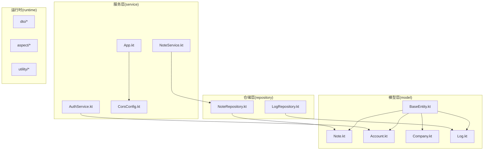
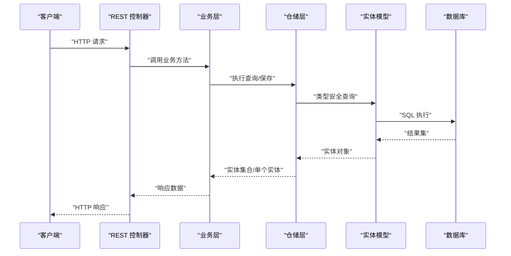
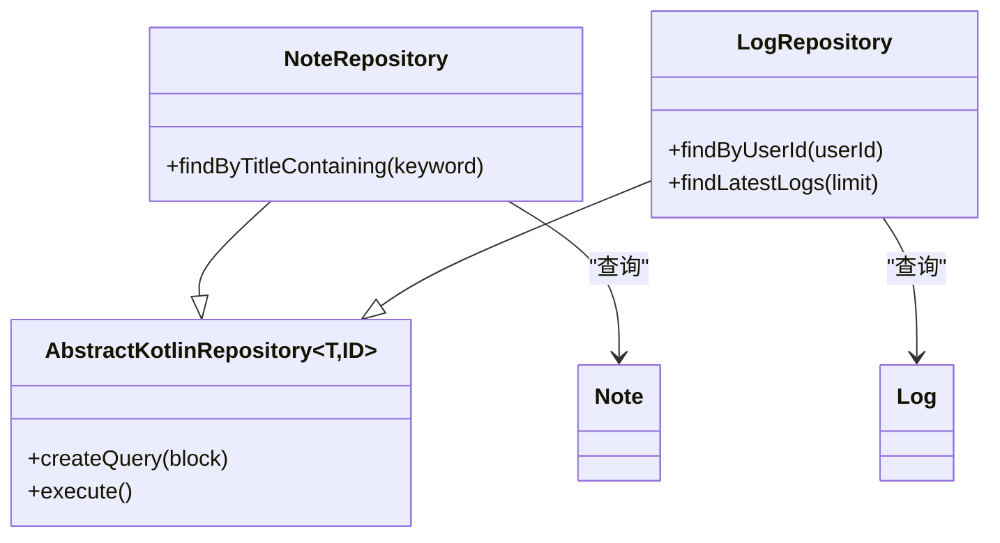
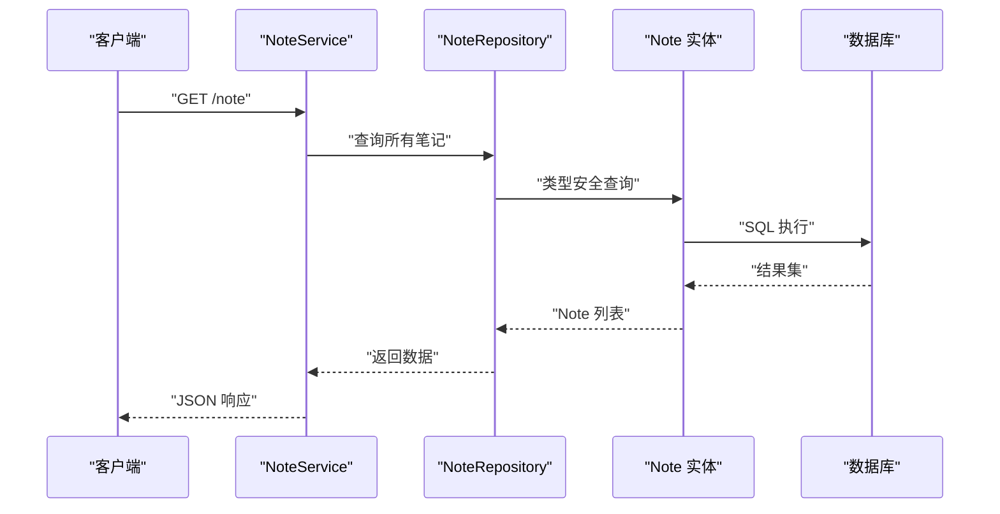
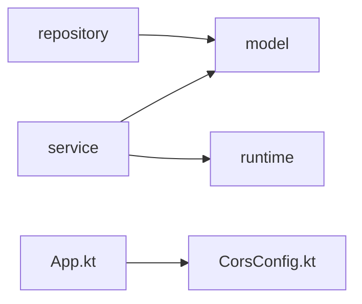

# 添加新实体

<cite>
**本文引用的文件**
- [BaseEntity.kt](file://model/src/main/kotlin/top/zztech/ainote/model/common/BaseEntity.kt)
- [Note.kt](file://model/src/main/kotlin/top/zztech/ainote/model/Note.kt)
- [Account.kt](file://model/src/main/kotlin/top/zztech/ainote/model/Account.kt)
- [Company.kt](file://model/src/main/kotlin/top/zztech/ainote/model/Company.kt)
- [Log.kt](file://model/src/main/kotlin/top/zztech/ainote/model/Log.kt)
- [LogRepository.kt](file://repository/src/main/kotlin/top/zztech/ainote/repository/LogRepository.kt)
- [NoteRepository.kt](file://repository/src/main/kotlin/top/zztech/ainote/repository/NoteRepository.kt)
- [NoteService.kt](file://service/src/main/kotlin/top/zztech/ainote/service/NoteService.kt)
- [AuthService.kt](file://service/src/main/kotlin/top/zztech/ainote/service/AuthService.kt)
- [App.kt](file://service/src/main/kotlin/top/zztech/ainote/App.kt)
- [CorsConfig.kt](file://service/src/main/kotlin/top/zztech/ainote/cfg/CorsConfig.kt)
- [model/build.gradle.kts](file://model/build.gradle.kts)
- [settings.gradle.kts](file://settings.gradle.kts)
- [build.gradle.kts](file://build.gradle.kts)
</cite>

## 目录
1. [简介](#简介)
2. [项目结构](#项目结构)
3. [核心组件](#核心组件)
4. [架构总览](#架构总览)
5. [详细组件分析](#详细组件分析)
6. [依赖分析](#依赖分析)
7. [性能考虑](#性能考虑)
8. [故障排查指南](#故障排查指南)
9. [结论](#结论)
10. [附录](#附录)

## 简介
本指南面向希望在项目中新增数据实体的开发者，提供从模型层到仓储层再到服务层的完整流程说明。您将学习如何：
- 在 model 模块中定义新的 Kotlin 接口实体，继承通用基类并使用 Jimmer ORM 的注解；
- 在 repository 模块中编写仓储类，基于 KSP 生成的类型安全查询 DSL 实现自定义查询；
- 在 service 模块中实现 REST 控制器，暴露 API 端点并完成业务逻辑；
- 正确触发 KSP（Kotlin Symbol Processing）以生成运行时所需的代理类与 DTO；
- 清理模板示例实体，避免重复与混淆。

## 项目结构
项目采用多模块结构，各模块职责清晰：
- model：定义实体接口与公共基类，承载领域模型；
- repository：基于 Jimmer 的仓储层，提供类型安全的查询与持久化能力；
- service：Spring MVC 层，负责暴露 REST API、事务控制与业务编排；
- runtime：运行时配置、拦截器、切面与 DTO 定义；
- database：数据库初始化脚本。

图表来源
- [BaseEntity.kt](file://model/src/main/kotlin/top/zztech/ainote/model/common/BaseEntity.kt#L1-L30)
- [Note.kt](file://model/src/main/kotlin/top/zztech/ainote/model/Note.kt#L1-L29)
- [Account.kt](file://model/src/main/kotlin/top/zztech/ainote/model/Account.kt#L1-L34)
- [Company.kt](file://model/src/main/kotlin/top/zztech/ainote/model/Company.kt#L1-L33)
- [Log.kt](file://model/src/main/kotlin/top/zztech/ainote/model/Log.kt#L1-L94)
- [NoteRepository.kt](file://repository/src/main/kotlin/top/zztech/ainote/repository/NoteRepository.kt#L1-L27)
- [LogRepository.kt](file://repository/src/main/kotlin/top/zztech/ainote/repository/LogRepository.kt#L1-L54)
- [NoteService.kt](file://service/src/main/kotlin/top/zztech/ainote/service/NoteService.kt#L1-L32)
- [AuthService.kt](file://service/src/main/kotlin/top/zztech/ainote/service/AuthService.kt#L1-L90)
- [App.kt](file://service/src/main/kotlin/top/zztech/ainote/App.kt#L1-L14)
- [CorsConfig.kt](file://service/src/main/kotlin/top/zztech/ainote/cfg/CorsConfig.kt#L1-L17)

章节来源
- [settings.gradle.kts](file://settings.gradle.kts#L1-L6)
- [build.gradle.kts](file://build.gradle.kts#L1-L7)

## 核心组件
- 实体基类与通用字段
  - 基类提供统一的创建与修改时间字段，便于审计与排序。
  - 示例参考：[BaseEntity.kt](file://model/src/main/kotlin/top/zztech/ainote/model/common/BaseEntity.kt#L1-L30)

- 实体注解与主键配置
  - 使用 @Entity 标识实体；@Id/@GeneratedValue 配置主键与生成策略；@KeyUniqueConstraint 定义唯一约束。
  - 示例参考：[Note.kt](file://model/src/main/kotlin/top/zztech/ainote/model/Note.kt#L1-L29)，[Account.kt](file://model/src/main/kotlin/top/zztech/ainote/model/Account.kt#L1-L34)，[Company.kt](file://model/src/main/kotlin/top/zztech/ainote/model/Company.kt#L1-L33)，[Log.kt](file://model/src/main/kotlin/top/zztech/ainote/model/Log.kt#L1-L94)

- 仓储层与类型安全查询
  - 仓储类继承 AbstractKotlinRepository 并注入 KSqlClient，使用 createQuery 构建类型安全查询。
  - 示例参考：[NoteRepository.kt](file://repository/src/main/kotlin/top/zztech/ainote/repository/NoteRepository.kt#L1-L27)，[LogRepository.kt](file://repository/src/main/kotlin/top/zztech/ainote/repository/LogRepository.kt#L1-L54)

- 服务层与 REST 控制器
  - 使用 @RestController 和 @RequestMapping 暴露 API；通过 @Autowired 注入仓储实例；结合 @Transactional 管理事务。
  - 示例参考：[NoteService.kt](file://service/src/main/kotlin/top/zztech/ainote/service/NoteService.kt#L1-L32)，[AuthService.kt](file://service/src/main/kotlin/top/zztech/ainote/service/AuthService.kt#L1-L90)

章节来源
- [BaseEntity.kt](file://model/src/main/kotlin/top/zztech/ainote/model/common/BaseEntity.kt#L1-L30)
- [Note.kt](file://model/src/main/kotlin/top/zztech/ainote/model/Note.kt#L1-L29)
- [Account.kt](file://model/src/main/kotlin/top/zztech/ainote/model/Account.kt#L1-L34)
- [Company.kt](file://model/src/main/kotlin/top/zztech/ainote/model/Company.kt#L1-L33)
- [Log.kt](file://model/src/main/kotlin/top/zztech/ainote/model/Log.kt#L1-L94)
- [NoteRepository.kt](file://repository/src/main/kotlin/top/zztech/ainote/repository/NoteRepository.kt#L1-L27)
- [LogRepository.kt](file://repository/src/main/kotlin/top/zztech/ainote/repository/LogRepository.kt#L1-L54)
- [NoteService.kt](file://service/src/main/kotlin/top/zztech/ainote/service/NoteService.kt#L1-L32)
- [AuthService.kt](file://service/src/main/kotlin/top/zztech/ainote/service/AuthService.kt#L1-L90)

## 架构总览
下图展示了从实体定义到 API 暴露的端到端流程，以及各模块间的依赖关系。

图表来源
- [NoteService.kt](file://service/src/main/kotlin/top/zztech/ainote/service/NoteService.kt#L1-L32)
- [AuthService.kt](file://service/src/main/kotlin/top/zztech/ainote/service/AuthService.kt#L1-L90)
- [NoteRepository.kt](file://repository/src/main/kotlin/top/zztech/ainote/repository/NoteRepository.kt#L1-L27)
- [LogRepository.kt](file://repository/src/main/kotlin/top/zztech/ainote/repository/LogRepository.kt#L1-L54)
- [Note.kt](file://model/src/main/kotlin/top/zztech/ainote/model/Note.kt#L1-L29)
- [Log.kt](file://model/src/main/kotlin/top/zztech/ainote/model/Log.kt#L1-L94)

## 详细组件分析

### 实体模型层（model）
- 设计原则
  - 统一继承 BaseEntity，获得创建/修改时间字段；
  - 使用 @Entity 标注实体；@Id/@GeneratedValue 配置主键；@KeyUniqueConstraint 定义唯一性约束；
  - 对外暴露只读属性，避免直接修改审计字段，交由拦截器处理。

- 关键注解与约定
  - @Entity：声明为 Jimmer 实体；
  - @Id + @GeneratedValue：主键生成策略；
  - @KeyUniqueConstraint：唯一约束声明；
  - @Column/@ManyToOne 等：映射列名与关联关系。

- 示例参考
  - [Note.kt](file://model/src/main/kotlin/top/zztech/ainote/model/Note.kt#L1-L29)
  - [Account.kt](file://model/src/main/kotlin/top/zztech/ainote/model/Account.kt#L1-L34)
  - [Company.kt](file://model/src/main/kotlin/top/zztech/ainote/model/Company.kt#L1-L33)
  - [Log.kt](file://model/src/main/kotlin/top/zztech/ainote/model/Log.kt#L1-L94)

章节来源
- [BaseEntity.kt](file://model/src/main/kotlin/top/zztech/ainote/model/common/BaseEntity.kt#L1-L30)
- [Note.kt](file://model/src/main/kotlin/top/zztech/ainote/model/Note.kt#L1-L29)
- [Account.kt](file://model/src/main/kotlin/top/zztech/ainote/model/Account.kt#L1-L34)
- [Company.kt](file://model/src/main/kotlin/top/zztech/ainote/model/Company.kt#L1-L33)
- [Log.kt](file://model/src/main/kotlin/top/zztech/ainote/model/Log.kt#L1-L94)

### 仓储层（repository）
- 设计原则
  - 继承 AbstractKotlinRepository<T, ID>，注入 KSqlClient；
  - 使用 createQuery 构建类型安全查询，支持 where、select、orderBy、limit 等；
  - 自定义查询方法集中于仓储层，保持服务层简洁。

- 查询示例模式
  - 单表查询：根据条件筛选并排序；
  - 多表关联：通过实体关系导航（如 Log.account）进行联结查询。

- 示例参考
  - [NoteRepository.kt](file://repository/src/main/kotlin/top/zztech/ainote/repository/NoteRepository.kt#L1-L27)
  - [LogRepository.kt](file://repository/src/main/kotlin/top/zztech/ainote/repository/LogRepository.kt#L1-L54)

图表来源
- [NoteRepository.kt](file://repository/src/main/kotlin/top/zztech/ainote/repository/NoteRepository.kt#L1-L27)
- [LogRepository.kt](file://repository/src/main/kotlin/top/zztech/ainote/repository/LogRepository.kt#L1-L54)
- [Note.kt](file://model/src/main/kotlin/top/zztech/ainote/model/Note.kt#L1-L29)
- [Log.kt](file://model/src/main/kotlin/top/zztech/ainote/model/Log.kt#L1-L94)

章节来源
- [NoteRepository.kt](file://repository/src/main/kotlin/top/zztech/ainote/repository/NoteRepository.kt#L1-L27)
- [LogRepository.kt](file://repository/src/main/kotlin/top/zztech/ainote/repository/LogRepository.kt#L1-L54)

### 服务层（service）
- 设计原则
  - 使用 @RestController 和 @RequestMapping 暴露 REST API；
  - 通过构造函数注入仓储实例，避免 @Autowired 字段注入；
  - 使用 @Transactional 管理事务边界；
  - 结合运行时注解与切面实现操作日志记录。

- 示例参考
  - [NoteService.kt](file://service/src/main/kotlin/top/zztech/ainote/service/NoteService.kt#L1-L32)
  - [AuthService.kt](file://service/src/main/kotlin/top/zztech/ainote/service/AuthService.kt#L1-L90)

图表来源
- [NoteService.kt](file://service/src/main/kotlin/top/zztech/ainote/service/NoteService.kt#L1-L32)
- [NoteRepository.kt](file://repository/src/main/kotlin/top/zztech/ainote/repository/NoteRepository.kt#L1-L27)
- [Note.kt](file://model/src/main/kotlin/top/zztech/ainote/model/Note.kt#L1-L29)

章节来源
- [NoteService.kt](file://service/src/main/kotlin/top/zztech/ainote/service/NoteService.kt#L1-L32)
- [AuthService.kt](file://service/src/main/kotlin/top/zztech/ainote/service/AuthService.kt#L1-L90)

### 构建与代码生成（KSP）
- 必要步骤
  - 在 model 模块的构建脚本中启用 KSP 插件并引入 ksp 依赖；
  - 配置 Kotlin 源集以包含 KSP 生成的源码目录；
  - 运行 ./gradlew build 触发 KSP，生成 Jimmer 运行时所需的代理类与 DTO。

- 示例参考
  - [model/build.gradle.kts](file://model/build.gradle.kts#L1-L43)

章节来源
- [model/build.gradle.kts](file://model/build.gradle.kts#L1-L43)

## 依赖分析
- 模块依赖
  - service 依赖 model 与 runtime；
  - repository 依赖 model；
  - runtime 提供运行时配置与工具。

- 外部依赖
  - Spring Boot 3.x、Jimmer SQL Kotlin、KSP。

图表来源
- [settings.gradle.kts](file://settings.gradle.kts#L1-L6)
- [App.kt](file://service/src/main/kotlin/top/zztech/ainote/App.kt#L1-L14)
- [CorsConfig.kt](file://service/src/main/kotlin/top/zztech/ainote/cfg/CorsConfig.kt#L1-L17)

章节来源
- [settings.gradle.kts](file://settings.gradle.kts#L1-L6)
- [build.gradle.kts](file://build.gradle.kts#L1-L7)

## 性能考虑
- 类型安全查询
  - 使用 createQuery 构建查询，避免字符串拼接带来的错误与性能问题；
  - 合理使用 where、orderBy、limit，减少不必要的数据传输。

- 主键与索引
  - 为主键与常用查询字段建立索引，提升查询效率；
  - 使用 @KeyUniqueConstraint 定义唯一约束，确保数据一致性。

- 事务边界
  - 将批量写入或跨实体操作放入同一事务，减少回滚成本；
  - 避免在事务内执行耗时操作（如网络请求）。

- DTO 与序列化
  - 使用 DTO 返回敏感字段，避免一次性返回整个实体导致的序列化开销。

## 故障排查指南
- KSP 未生成代码
  - 确认已运行 ./gradlew build；
  - 检查 model/build.gradle.kts 中是否正确配置了 KSP 插件与依赖；
  - 确认 Kotlin 源集已包含 KSP 生成目录。

- 编译报错找不到实体或 DTO
  - 清理并重新构建项目；
  - 确保实体注解正确（@Entity、@Id、@GeneratedValue 等）；
  - 检查实体是否位于正确的包路径下。

- 查询异常或返回空值
  - 检查 createQuery 的 where 条件是否正确；
  - 确认实体关系映射（如 @ManyToOne）是否一致；
  - 使用 orderBy 与 limit 时注意边界条件。

- CORS 或跨域问题
  - 确认已启用跨域配置；
  - 检查允许的来源、方法与头部设置。

章节来源
- [model/build.gradle.kts](file://model/build.gradle.kts#L1-L43)
- [CorsConfig.kt](file://service/src/main/kotlin/top/zztech/ainote/cfg/CorsConfig.kt#L1-L17)

## 结论
通过遵循本指南，您可以快速在项目中添加新的数据实体：先在 model 中定义实体接口并配置注解，再在 repository 中实现类型安全查询，最后在 service 中暴露 REST API。务必在每次修改实体后运行构建以触发 KSP 生成运行时代码，并及时清理模板示例实体，保持项目整洁。

## 附录

### 从实体定义到 API 暴露的完整流程清单
- 在 model 中新增实体接口
  - 继承 BaseEntity；
  - 使用 @Entity、@Id、@GeneratedValue、@KeyUniqueConstraint 等注解；
  - 参考：[Note.kt](file://model/src/main/kotlin/top/zztech/ainote/model/Note.kt#L1-L29)

- 在 repository 中新增仓储类
  - 继承 AbstractKotlinRepository 并注入 KSqlClient；
  - 使用 createQuery 实现自定义查询；
  - 参考：[NoteRepository.kt](file://repository/src/main/kotlin/top/zztech/ainote/repository/NoteRepository.kt#L1-L27)

- 在 service 中新增 REST 控制器
  - 使用 @RestController、@RequestMapping 暴露端点；
  - 通过构造函数注入仓储实例；
  - 参考：[NoteService.kt](file://service/src/main/kotlin/top/zztech/ainote/service/NoteService.kt#L1-L32)

- 触发 KSP 生成运行时代码
  - 运行 ./gradlew build；
  - 确认 model/build.gradle.kts 中 KSP 已正确配置；
  - 参考：[model/build.gradle.kts](file://model/build.gradle.kts#L1-L43)

- 清理模板示例实体
  - 删除示例 Note 实体与相关仓储与服务，避免重复与混淆；
  - 参考：[Note.kt](file://model/src/main/kotlin/top/zztech/ainote/model/Note.kt#L1-L29)，[NoteRepository.kt](file://repository/src/main/kotlin/top/zztech/ainote/repository/NoteRepository.kt#L1-L27)，[NoteService.kt](file://service/src/main/kotlin/top/zztech/ainote/service/NoteService.kt#L1-L32)