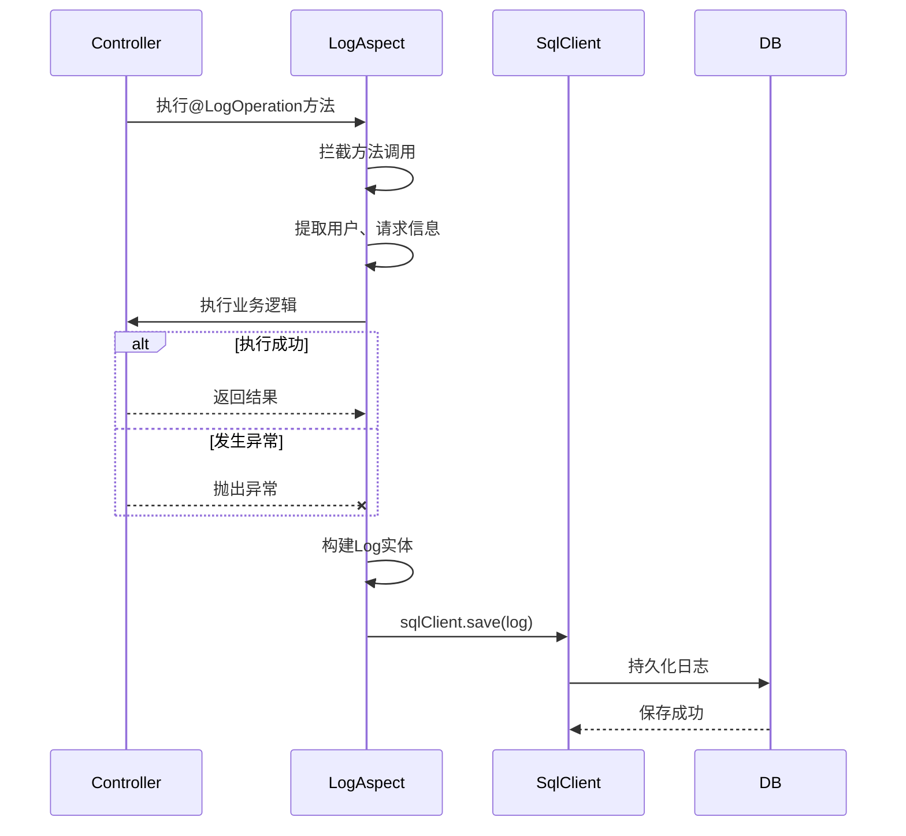

# 自定义扩展

<cite>
**本文档引用的文件**  
- [BaseEntityDraftInterceptor.kt](file://runtime/src/main/kotlin/top/zztech/ainote/runtime/interceptor/BaseEntityDraftInterceptor.kt)
- [TenantAwareDraftInterceptor.kt](file://runtime/src/main/kotlin/top/zztech/ainote/runtime/interceptor/TenantAwareDraftInterceptor.kt)
- [TenantFilterForNonCacheMode.kt](file://runtime/src/main/kotlin/top/zztech/ainote/runtime/filter/TenantFilterForNonCacheMode.kt)
- [CorsConfig.kt](file://service/src/main/kotlin/top/zztech/ainote/cfg/CorsConfig.kt)
- [JwtSecurityConfig.kt](file://service/src/main/kotlin/top/zztech/ainote/cfg/JwtSecurityConfig.kt)
- [OssConfig.kt](file://service/src/main/kotlin/top/zztech/ainote/cfg/OssConfig.kt)
- [LogAspect.kt](file://runtime/src/main/kotlin/top/zztech/ainote/runtime/aspect/LogAspect.kt)
- [LogOperation.kt](file://runtime/src/main/kotlin/top/zztech/ainote/runtime/annotation/LogOperation.kt)
- [TenantProvider.kt](file://runtime/src/main/kotlin/top/zztech/ainote/runtime/TenantProvider.kt)
- [BaseEntity.kt](file://model/src/main/kotlin/top/zztech/ainote/model/common/BaseEntity.kt)
- [TenantAware.kt](file://model/src/main/kotlin/top/zztech/ainote/model/common/TenantAware.kt)
- [application.yml](file://service/src/main/resources/application.yml)
</cite>

## 目录
1. [简介](#简介)
2. [拦截器扩展](#拦截器扩展)
3. [过滤器扩展](#过滤器扩展)
4. [配置类扩展](#配置类扩展)
5. [多租户功能控制](#多租户功能控制)
6. [高级特性应用](#高级特性应用)
7. [总结](#总结)

## 简介
本指南旨在指导开发者如何在 `runtime` 模块中扩展框架功能，包括创建自定义拦截器、过滤器、配置类，以及利用 Jimmer 的高级特性构建复杂响应结构。通过合理使用 Spring 和 Jimmer 提供的机制，开发者可以实现对数据操作的自动处理、请求上下文管理、安全策略配置等功能。

## 拦截器扩展

在 `runtime/interceptor` 包下，框架通过实现 Jimmer 的 `DraftInterceptor` 机制，为实体类提供数据操作前后的钩子处理能力。开发者可参照现有实现创建新的拦截器类，实现字段的自动填充。

例如，`BaseEntityDraftInterceptor` 实现了对 `createdTime` 和 `modifiedTime` 字段的自动填充。当插入新记录时，若 `createdTime` 未设置，则自动填充当前时间；每次保存时，若 `modifiedTime` 未设置，则更新为当前时间。

类似地，`TenantAwareDraftInterceptor` 在保存实现 `TenantAware` 接口的实体时，自动填充 `tenant` 字段，其值来源于 `TenantProvider` 获取的请求头信息。

**重要提示**：Jimmer 的 `DraftInterceptor` 是领域模型层面的拦截机制，优于传统的 Spring `HandlerInterceptor`，因为它直接作用于数据持久化过程，而非 HTTP 请求处理流程。

**Section sources**
- [BaseEntityDraftInterceptor.kt](file://runtime/src/main/kotlin/top/zztech/ainote/runtime/interceptor/BaseEntityDraftInterceptor.kt#L1-L23)
- [TenantAwareDraftInterceptor.kt](file://runtime/src/main/kotlin/top/zztech/ainote/runtime/interceptor/TenantAwareDraftInterceptor.kt#L1-L22)
- [BaseEntity.kt](file://model/src/main/kotlin/top/zztech/ainote/model/common/BaseEntity.kt#L1-L30)
- [TenantAware.kt](file://model/src/main/kotlin/top/zztech/ainote/model/common/TenantAware.kt#L1-L17)

## 过滤器扩展

在 `runtime/filter` 包中，`TenantFilterForNonCacheMode` 是一个典型的自定义过滤器实现。它继承自 Jimmer 的 `KFilter<TenantAware>`，用于在查询时自动添加租户过滤条件。

该过滤器通过 `TenantProvider` 获取当前请求的 `tenant` 头信息，并在所有对 `TenantAware` 类型实体的查询中自动添加 `WHERE tenant = ?` 条件，从而实现数据层面的多租户隔离。

此过滤器使用 `@ConditionalOnMissingBean` 注解，确保在缓存模式下可被其他实现替代，体现了良好的扩展性设计。

**Section sources**
- [TenantFilterForNonCacheMode.kt](file://runtime/src/main/kotlin/top/zztech/ainote/runtime/filter/TenantFilterForNonCacheMode.kt#L1-L26)
- [TenantProvider.kt](file://runtime/src/main/kotlin/top/zztech/ainote/runtime/TenantProvider.kt#L1-L16)

## 配置类扩展

框架通过配置类实现跨域、安全、OSS 等功能的自定义配置。

### 跨域配置
`CorsConfig` 类实现了 `WebMvcConfigurer` 接口，通过 `addCorsMappings` 方法配置全局跨域策略，允许所有来源、方法和头信息，并支持凭据。

### 安全配置
`JwtSecurityConfig` 使用 Spring Security 配置无状态 JWT 认证。它禁用了 CSRF、表单登录等传统安全机制，注册了 `JwtAuthenticationFilter` 用于 JWT 令牌的解析和认证，并配置了全局权限为 `permitAll()`，具体权限控制交由业务层处理。

### OSS 配置
`OssConfig` 和 `OssProperties` 提供了阿里云 OSS 的客户端配置。通过 `@ConfigurationProperties` 绑定配置项，并使用 `@ConditionalOnProperty` 确保仅在配置完整时创建 `OSS` Bean。

**Section sources**
- [CorsConfig.kt](file://service/src/main/kotlin/top/zztech/ainote/cfg/CorsConfig.kt#L1-L17)
- [JwtSecurityConfig.kt](file://service/src/main/kotlin/top/zztech/ainote/cfg/JwtSecurityConfig.kt#L1-L69)
- [OssConfig.kt](file://service/src/main/kotlin/top/zztech/ainote/cfg/OssConfig.kt#L1-L54)
- [application.yml](file://service/src/main/resources/application.yml#L1-L57)

## 多租户功能控制

### 启用机制
多租户功能通过以下组件协同工作：
- **请求头解析**：`TenantProvider` 从 HTTP 请求头中提取 `tenant` 信息。
- **数据过滤**：`TenantFilterForNonCacheMode` 在查询时自动添加租户条件。
- **数据填充**：`TenantAwareDraftInterceptor` 在保存时自动填充租户字段。

### 禁用方法
若需禁用多租户功能，可采取以下措施：
1. **移除过滤器**：删除或注释 `TenantFilterForNonCacheMode` 类，或通过配置使其不生效。
2. **移除拦截器**：删除 `TenantAwareDraftInterceptor` 类。
3. **移除注解依赖**：确保实体类不再实现 `TenantAware` 接口。
4. **配置调整**：在 `application.yml` 中移除与租户相关的安全配置。

**Section sources**
- [TenantFilterForNonCacheMode.kt](file://runtime/src/main/kotlin/top/zztech/ainote/runtime/filter/TenantFilterForNonCacheMode.kt#L1-L26)
- [TenantProvider.kt](file://runtime/src/main/kotlin/top/zztech/ainote/runtime/TenantProvider.kt#L1-L16)
- [TenantAwareDraftInterceptor.kt](file://runtime/src/main/kotlin/top/zztech/ainote/runtime/interceptor/TenantAwareDraftInterceptor.kt#L1-L22)
- [application.yml](file://service/src/main/resources/application.yml#L43-L49)

## 高级特性应用

### 日志操作切面
框架通过 `LogAspect` 和 `LogOperation` 注解实现了声明式日志记录。`LogOperation` 注解用于标记需要记录日志的方法，`LogAspect` 切面自动捕获方法执行前后的上下文（如用户ID、IP地址、请求参数等），并持久化到 `Log` 实体中。

**Diagram sources**
- [LogAspect.kt](file://runtime/src/main/kotlin/top/zztech/ainote/runtime/aspect/LogAspect.kt#L1-L159)
- [LogOperation.kt](file://runtime/src/main/kotlin/top/zztech/ainote/runtime/annotation/LogOperation.kt#L1-L29)

### Jimmer 高级特性
- **计算属性**：可在实体类中定义非持久化字段，通过 `@Transient` 注解或在查询中动态计算。
- **DTO 映射**：利用 Jimmer 的 `@SqlView` 或 `@ClientIgnore` 构建复杂响应结构，实现领域模型与传输模型的分离。
- **类型安全查询**：通过 Kotlin 扩展函数实现编译时安全的 SQL 查询，避免运行时错误。

**Section sources**
- [LogAspect.kt](file://runtime/src/main/kotlin/top/zztech/ainote/runtime/aspect/LogAspect.kt#L1-L159)
- [LogOperation.kt](file://runtime/src/main/kotlin/top/zztech/ainote/runtime/annotation/LogOperation.kt#L1-L29)

## 总结
本指南详细介绍了如何在 `runtime` 模块中进行自定义扩展。通过 `DraftInterceptor` 实现数据自动填充，通过 `KFilter` 实现多租户数据隔离，通过配置类定制跨域、安全等策略。开发者应优先使用 Jimmer 提供的领域模型拦截机制，而非传统的 Spring MVC 拦截器，以实现更优雅、更可靠的扩展。