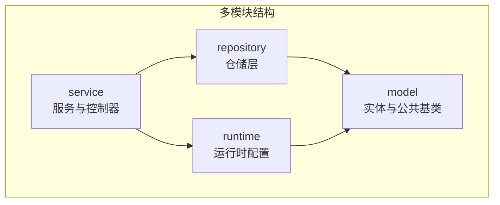
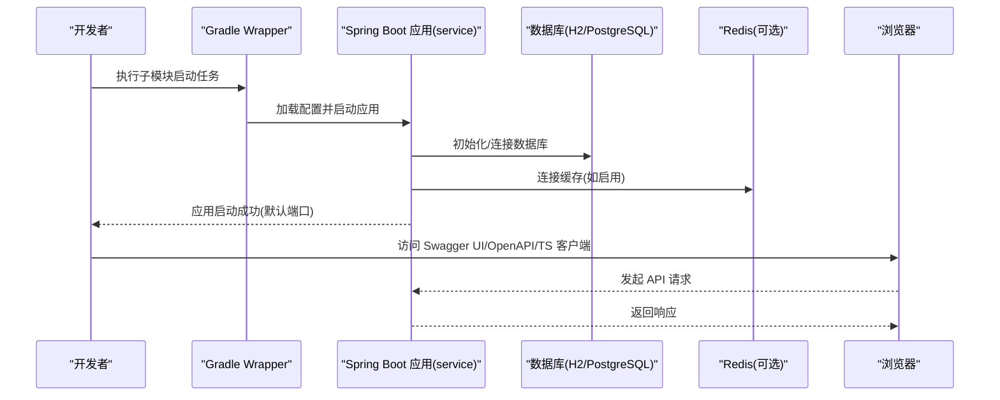
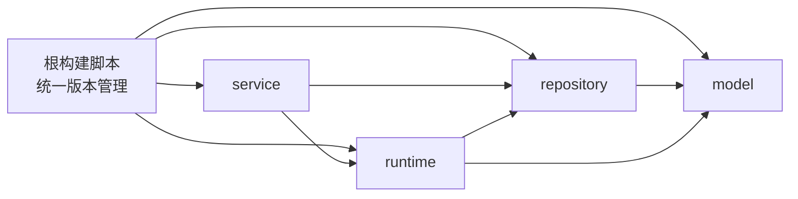

# 快速开始

<cite>
**本文引用的文件**
- [README.md](file://README.md)
- [settings.gradle.kts](file://settings.gradle.kts)
- [build.gradle.kts](file://build.gradle.kts)
- [model/build.gradle.kts](file://model/build.gradle.kts)
- [repository/build.gradle.kts](file://repository/build.gradle.kts)
- [runtime/build.gradle.kts](file://runtime/build.gradle.kts)
- [service/build.gradle.kts](file://service/build.gradle.kts)
- [service/src/main/resources/application.yml](file://service/src/main/resources/application.yml)
- [service/src/main/kotlin/top/zztech/ainote/App.kt](file://service/src/main/kotlin/top/zztech/ainote/App.kt)
- [database/init.sql](file://database/init.sql)
</cite>

## 目录
1. [简介](#简介)
2. [项目结构](#项目结构)
3. [核心组件](#核心组件)
4. [架构总览](#架构总览)
5. [详细组件分析](#详细组件分析)
6. [依赖分析](#依赖分析)
7. [性能考虑](#性能考虑)
8. [故障排查指南](#故障排查指南)
9. [结论](#结论)
10. [附录](#附录)

## 简介
本指南面向首次接触 ainote-server 的开发者，帮助你在本地快速搭建并运行项目。你将学会：
- 环境准备：JDK 17+ 与 Gradle 8.x（推荐使用项目自带 wrapper）
- 首次设置的两种方式：先构建再打开 IDE，或直接在 IDE 中打开后运行 main 方法自动触发代码生成
- 启动应用：使用 Gradle 子模块任务或 IDE 直接运行 main
- 访问 API 文档与客户端生成：Swagger UI、OpenAPI 规范、TypeScript 客户端
- 生产构建与运行：打包为可执行 JAR 并通过 java -jar 启动
- 常见问题与 IDE 报错处理建议

## 项目结构
ainote-server 采用多模块架构，职责清晰分离：
- model：实体定义与公共基类
- repository：数据访问层（Spring Data 风格仓储）
- runtime：运行时配置（过滤器、拦截器、缓存等）
- service：服务层与 REST 控制器

模块依赖关系如下：
- service → repository → model
- service → runtime → model
- runtime → repository → model

图表来源
- [settings.gradle.kts](file://settings.gradle.kts#L1-L6)
- [model/build.gradle.kts](file://model/build.gradle.kts#L1-L43)
- [repository/build.gradle.kts](file://repository/build.gradle.kts#L1-L40)
- [runtime/build.gradle.kts](file://runtime/build.gradle.kts#L1-L50)
- [service/build.gradle.kts](file://service/build.gradle.kts#L1-L57)

章节来源
- [settings.gradle.kts](file://settings.gradle.kts#L1-L6)
- [README.md](file://README.md#L14-L33)

## 核心组件
- 应用入口：Spring Boot 启动类位于 service 模块，包含主函数与注解，负责加载应用上下文。
- 配置中心：application.yml 提供数据库、Redis、Jimmer 客户端、OpenAPI/Swagger、服务器端口等配置项。
- 数据初始化：init.sql 提供开发阶段的数据库表结构与初始数据，便于快速验证。

章节来源
- [service/src/main/kotlin/top/zztech/ainote/App.kt](file://service/src/main/kotlin/top/zztech/ainote/App.kt#L1-L14)
- [service/src/main/resources/application.yml](file://service/src/main/resources/application.yml#L1-L57)
- [database/init.sql](file://database/init.sql#L1-L101)

## 架构总览
下图展示了从启动到访问 API 文档的整体流程，以及各模块之间的交互关系。

图表来源
- [service/build.gradle.kts](file://service/build.gradle.kts#L1-L57)
- [service/src/main/resources/application.yml](file://service/src/main/resources/application.yml#L1-L57)
- [README.md](file://README.md#L67-L74)

## 详细组件分析

### 环境与工具要求
- JDK 版本：JDK 17 或更高版本
- 构建工具：Gradle 8.x；强烈建议使用项目自带的 wrapper（gradlew/gradlew.bat），避免版本差异导致的问题
- Kotlin 与 Spring Boot 版本：由根构建脚本统一管理，确保模块间版本一致

章节来源
- [README.md](file://README.md#L36-L40)
- [build.gradle.kts](file://build.gradle.kts#L1-L7)
- [model/build.gradle.kts](file://model/build.gradle.kts#L10-L10)
- [repository/build.gradle.kts](file://repository/build.gradle.kts#L10-L10)
- [runtime/build.gradle.kts](file://runtime/build.gradle.kts#L11-L11)
- [service/build.gradle.kts](file://service/build.gradle.kts#L13-L13)

### 首次设置的两种方式
方式一：先构建再打开
- 使用 Gradle wrapper 执行构建，确保生成代码与依赖就绪，再在 IDE 中打开项目
- 适合希望 IDE 一次性具备完整索引与生成代码的场景

方式二：直接在 IDE 中打开后运行 main
- 在 IDE 中打开项目，暂时忽略 IDE 报错
- 等待依赖下载完成后，直接运行 service 模块中的 main 方法
- 该方式会触发代码生成与依赖加载，随后 IDE 报错通常会消失

章节来源
- [README.md](file://README.md#L41-L56)

### 启动应用
- 使用 Gradle 子模块任务启动：在项目根目录执行子模块启动任务，即可启动服务模块
- 在 IDE 中直接运行 main：service 模块的启动类包含主函数，直接运行即可启动应用
- 默认访问地址：应用启动后可通过默认端口访问

章节来源
- [README.md](file://README.md#L57-L66)
- [service/src/main/kotlin/top/zztech/ainote/App.kt](file://service/src/main/kotlin/top/zztech/ainote/App.kt#L1-L14)

### 访问 API 文档与客户端生成
应用启动后，可访问以下地址：
- Swagger UI
- OpenAPI 规范
- TypeScript 客户端压缩包

章节来源
- [README.md](file://README.md#L67-L74)
- [service/src/main/resources/application.yml](file://service/src/main/resources/application.yml#L31-L50)

### 生产构建与运行
- 生产构建：清理并构建项目，生成可执行 JAR
- 生产运行：使用 java -jar 命令启动已构建的 JAR 包

章节来源
- [README.md](file://README.md#L192-L205)

### 数据库与缓存配置
- 数据库：默认使用内存数据库；也可配置 MySQL 或 PostgreSQL
- 缓存：可选启用 Redis 与 Redisson
- 初始化：应用启动时会根据配置初始化数据库与基础数据

章节来源
- [README.md](file://README.md#L148-L191)
- [service/src/main/resources/application.yml](file://service/src/main/resources/application.yml#L1-L22)
- [database/init.sql](file://database/init.sql#L1-L101)

## 依赖分析
模块间的依赖关系与构建脚本中的版本管理如下所示：

图表来源
- [build.gradle.kts](file://build.gradle.kts#L1-L7)
- [settings.gradle.kts](file://settings.gradle.kts#L1-L6)
- [service/build.gradle.kts](file://service/build.gradle.kts#L19-L38)
- [repository/build.gradle.kts](file://repository/build.gradle.kts#L21-L28)
- [runtime/build.gradle.kts](file://runtime/build.gradle.kts#L17-L31)

章节来源
- [settings.gradle.kts](file://settings.gradle.kts#L1-L6)
- [build.gradle.kts](file://build.gradle.kts#L1-L7)
- [service/build.gradle.kts](file://service/build.gradle.kts#L19-L38)
- [repository/build.gradle.kts](file://repository/build.gradle.kts#L21-L28)
- [runtime/build.gradle.kts](file://runtime/build.gradle.kts#L17-L31)

## 性能考虑
- 使用项目自带 Gradle wrapper 可减少环境差异带来的构建问题
- 在开发阶段使用内存数据库可提升启动速度；生产环境建议使用稳定的关系型数据库
- 如启用缓存，合理配置 Redis 参数以获得更好的读写性能

## 故障排查指南
- IDE 报错处理
  - 若首次打开项目出现 IDE 报错，请优先尝试“先构建再打开”的方式，确保生成代码与依赖就绪
  - 若选择“直接在 IDE 中打开”，等待依赖下载完成后，直接运行 main 方法，通常可自动修复大部分临时性报错
- 端口冲突
  - 默认端口为 8080，若被占用可在配置文件中调整端口后再启动
- 数据库连接失败
  - 确认数据库驱动与连接信息正确；如使用内存数据库，无需额外配置
- 缓存未生效
  - 如启用 Redis，请确认 Redis 服务已启动且配置正确

章节来源
- [README.md](file://README.md#L36-L66)
- [README.md](file://README.md#L148-L191)
- [service/src/main/resources/application.yml](file://service/src/main/resources/application.yml#L51-L57)

## 结论
通过本指南，你可以快速完成 ainote-server 的本地搭建与运行。建议优先使用项目自带的 Gradle wrapper，并按“先构建再打开”的方式确保 IDE 与生成代码的完整性。启动后即可访问 Swagger UI、OpenAPI 规范与 TypeScript 客户端，满足前后端联调与自动化集成需求。生产构建与运行步骤简单明确，便于部署上线。

## 附录
- 快速命令清单
  - 使用 Gradle 子模块任务启动应用
  - 清理并构建生产包
  - 使用 java -jar 启动已构建的 JAR 包
- 参考文件路径
  - 应用入口类
  - 配置文件
  - 数据库初始化脚本

章节来源
- [README.md](file://README.md#L57-L66)
- [README.md](file://README.md#L192-L205)
- [service/src/main/kotlin/top/zztech/ainote/App.kt](file://service/src/main/kotlin/top/zztech/ainote/App.kt#L1-L14)
- [service/src/main/resources/application.yml](file://service/src/main/resources/application.yml#L1-L57)
- [database/init.sql](file://database/init.sql#L1-L101)