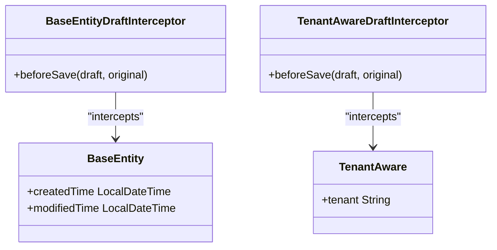
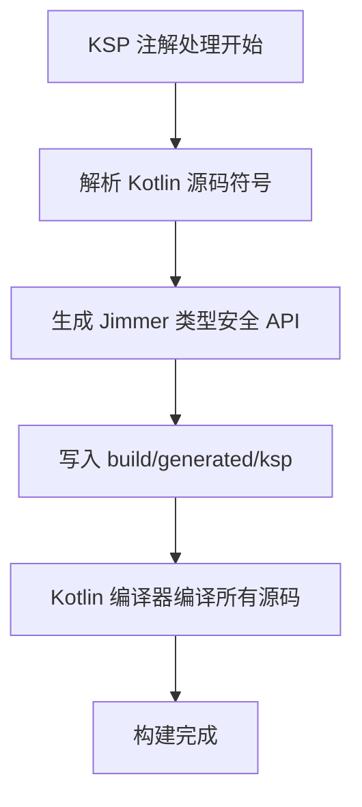
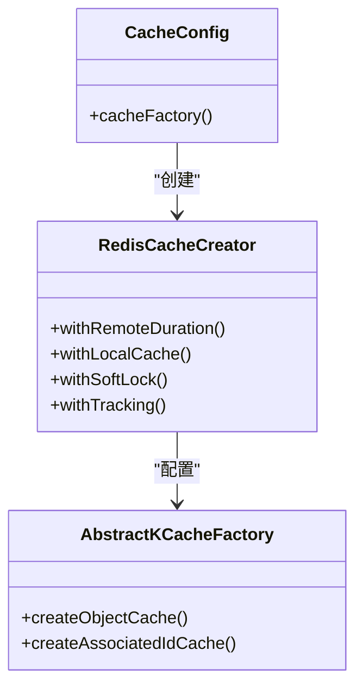

# 技术栈与依赖

<cite>
**本文档中引用的文件**  
- [build.gradle.kts](file://build.gradle.kts)
- [settings.gradle.kts](file://settings.gradle.kts)
- [model/build.gradle.kts](file://model/build.gradle.kts)
- [repository/build.gradle.kts](file://repository/build.gradle.kts)
- [runtime/build.gradle.kts](file://runtime/build.gradle.kts)
- [service/build.gradle.kts](file://service/build.gradle.kts)
- [service/src/main/resources/application.yml](file://service/src/main/resources/application.yml)
- [service/src/main/kotlin/top/zztech/ainote/App.kt](file://service/src/main/kotlin/top/zztech/ainote/App.kt)
- [runtime/src/main/kotlin/top/zztech/ainote/runtime/cache/CacheConfig.kt](file://runtime/src/main/kotlin/top/zztech/ainote/runtime/cache/CacheConfig.kt)
- [model/src/main/kotlin/top/zztech/ainote/model/common/BaseEntity.kt](file://model/src/main/kotlin/top/zztech/ainote/model/common/BaseEntity.kt)
- [model/src/main/kotlin/top/zztech/ainote/model/common/TenantAware.kt](file://model/src/main/kotlin/top/zztech/ainote/model/common/TenantAware.kt)
- [runtime/src/main/kotlin/top/zztech/ainote/runtime/interceptor/BaseEntityDraftInterceptor.kt](file://runtime/src/main/kotlin/top/zztech/ainote/runtime/interceptor/BaseEntityDraftInterceptor.kt)
- [runtime/src/main/kotlin/top/zztech/ainote/runtime/interceptor/TenantAwareDraftInterceptor.kt](file://runtime/src/main/kotlin/top/zztech/ainote/runtime/interceptor/TenantAwareDraftInterceptor.kt)
</cite>

## 目录
1. [技术栈概览](#技术栈概览)
2. [Kotlin 2.1.20 与 Spring Boot 3.5.6 集成](#kotlin-2120-与-spring-boot-356-集成)
3. [Jimmer ORM 0.9.117 核心优势](#jimmer-orm-09117-核心优势)
4. [Gradle 与 Kotlin Symbol Processing (KSP)](#gradle-与-kotlin-symbol-processing-ksp)
5. [数据库配置与切换](#数据库配置与切换)
6. [Redisson 多层缓存机制](#redisson-多层缓存机制)
7. [核心依赖列表](#核心依赖列表)

## 技术栈概览

本项目采用现代化的 JVM 技术栈，以 Kotlin 语言为核心，结合 Spring Boot 构建企业级后端服务。通过 Jimmer ORM 实现类型安全的数据访问，利用 KSP 在编译期生成高效代码，并通过 Redisson 提供分布式缓存支持。整体架构模块化清晰，分为 model、repository、runtime 和 service 四个子项目。

**Section sources**
- [build.gradle.kts](file://build.gradle.kts)
- [settings.gradle.kts](file://settings.gradle.kts)

## Kotlin 2.1.20 与 Spring Boot 3.5.6 集成

项目采用 Kotlin 2.1.20 版本，与 Spring Boot 3.5.6 深度集成。Kotlin 的空安全、扩展函数、数据类等特性显著提升了代码可读性和安全性。通过 `kotlin("plugin.spring")` 插件支持，Kotlin 与 Spring 的 AOP、依赖注入等机制无缝协作。JVM 目标版本为 17，确保兼容最新性能优化和语言特性。

在 `runtime` 和 `service` 模块中，通过 Gradle 插件声明引入 Kotlin 与 Spring 支持，确保编译器正确处理注解和代理生成。

**Section sources**
- [runtime/build.gradle.kts](file://runtime/build.gradle.kts#L3-L6)
- [service/build.gradle.kts](file://service/build.gradle.kts#L4-L5)

## Jimmer ORM 0.9.117 核心优势

Jimmer 作为现代 Kotlin ORM 框架，相比传统 JPA 具有显著优势：

### 类型安全 DSL
Jimmer 提供完全类型安全的查询 DSL，避免运行时 SQL 错误。所有实体关系在编译期验证，IDE 可提供完整代码补全。

### Smart Save
通过 `DraftInterceptor` 机制实现智能保存。例如，`BaseEntityDraftInterceptor` 自动填充 `createdTime` 和 `modifiedTime` 字段，无需在业务代码中手动设置。



**Diagram sources**
- [model/src/main/kotlin/top/zztech/ainote/model/common/BaseEntity.kt](file://model/src/main/kotlin/top/zztech/ainote/model/common/BaseEntity.kt)
- [runtime/src/main/kotlin/top/zztech/ainote/runtime/interceptor/BaseEntityDraftInterceptor.kt](file://runtime/src/main/kotlin/top/zztech/ainote/runtime/interceptor/BaseEntityDraftInterceptor.kt)
- [model/src/main/kotlin/top/zztech/ainote/model/common/TenantAware.kt](file://model/src/main/kotlin/top/zztech/ainote/model/common/TenantAware.kt)
- [runtime/src/main/kotlin/top/zztech/ainote/runtime/interceptor/TenantAwareDraftInterceptor.kt](file://runtime/src/main/kotlin/top/zztech/ainote/runtime/interceptor/TenantAwareDraftInterceptor.kt)

### Object Fetcher
支持细粒度对象图获取，避免 N+1 查询问题。可在查询时精确指定需要加载的关联字段，提升性能。

Jimmer 通过 KSP 在编译期生成类型安全的 API 和实体类，极大提升开发效率和运行时性能。

**Section sources**
- [model/build.gradle.kts](file://model/build.gradle.kts#L18-L19)
- [repository/build.gradle.kts](file://repository/build.gradle.kts#L24)
- [service/build.gradle.kts](file://service/build.gradle.kts#L24)

## Gradle 与 Kotlin Symbol Processing (KSP)

项目使用 Gradle 作为构建系统，通过 `build.gradle.kts` 脚本实现模块化依赖管理。KSP（Kotlin Symbol Processing）在编译期处理注解并生成代码，相比传统 APT 更快且原生支持 Kotlin。

在 `model` 和 `service` 模块中，`ksp("org.babyfish.jimmer:jimmer-ksp")` 声明了 KSP 处理器，用于生成 Jimmer 的类型安全 API。生成的代码路径已配置为 `build/generated/ksp/main/kotlin`，确保 IDE 正确识别。



**Diagram sources**
- [model/build.gradle.kts](file://model/build.gradle.kts#L27-L31)
- [service/build.gradle.kts](file://service/build.gradle.kts#L40-L46)

**Section sources**
- [model/build.gradle.kts](file://model/build.gradle.kts)
- [service/build.gradle.kts](file://service/build.gradle.kts)

## 数据库配置与切换

项目默认配置 PostgreSQL，通过 `application.yml` 中的占位符支持多数据库切换。支持 H2、MySQL、PostgreSQL 三种数据库。

### 当前配置
```yaml
spring:
  datasource:
    driver-class-name: org.postgresql.Driver
    url: jdbc:postgresql://${DB_HOST:localhost}:${DB_PORT:5432}/${DB_NAME:ainote}
```

### 切换方法
1. **H2**: 修改 `driver-class-name` 为 `org.h2.Driver`，URL 改为 `jdbc:h2:mem:ainote`
2. **MySQL**: 修改为 `com.mysql.cj.jdbc.Driver` 和对应 JDBC URL
3. **PostgreSQL**: 使用当前配置

数据库连接池由 Spring Boot 自动配置，支持通过环境变量注入连接参数，便于在不同环境间切换。

**Section sources**
- [service/src/main/resources/application.yml](file://service/src/main/resources/application.yml#L2-L6)

## Redisson 多层缓存机制

通过 Redisson 提供 Redis 分布式缓存支持，结合 Jimmer 的缓存抽象实现多层缓存策略。`CacheConfig` 配置类定义了本地缓存（Caffeine）与远程 Redis 的联合使用。

缓存策略包括：
- 远程缓存：有效期 1 小时
- 本地缓存：最多 100 条，有效期 5 分钟
- 软锁机制：防止缓存击穿
- 缓存跟踪：自动失效关联数据



**Diagram sources**
- [runtime/src/main/kotlin/top/zztech/ainote/runtime/cache/CacheConfig.kt](file://runtime/src/main/kotlin/top/zztech/ainote/runtime/cache/CacheConfig.kt)

**Section sources**
- [runtime/src/main/kotlin/top/zztech/ainote/runtime/cache/CacheConfig.kt](file://runtime/src/main/kotlin/top/zztech/ainote/runtime/cache/CacheConfig.kt)
- [runtime/build.gradle.kts](file://runtime/build.gradle.kts#L27)

## 核心依赖列表

| 依赖 | 版本 | 作用 |
|------|------|------|
| Kotlin | 2.1.20 | 主要编程语言 |
| Spring Boot | 3.5.6 | 应用框架与自动配置 |
| Jimmer ORM | 0.9.117 | 类型安全的 Kotlin ORM |
| KSP | 2.1.20-2.0.0 | Kotlin 编译期代码生成 |
| Redisson | 3.52.0 | Redis 客户端与分布式缓存 |
| PostgreSQL Driver | 42.7.4 | 数据库连接驱动 |
| JJWT | 0.12.6 | JWT 令牌生成与验证 |
| Aliyun OSS SDK | 3.18.1 | 对象存储服务集成 |

所有依赖版本通过根项目的 `build.gradle.kts` 统一管理，确保版本一致性。

**Section sources**
- [build.gradle.kts](file://build.gradle.kts)
- [service/build.gradle.kts](file://service/build.gradle.kts)
- [runtime/build.gradle.kts](file://runtime/build.gradle.kts)