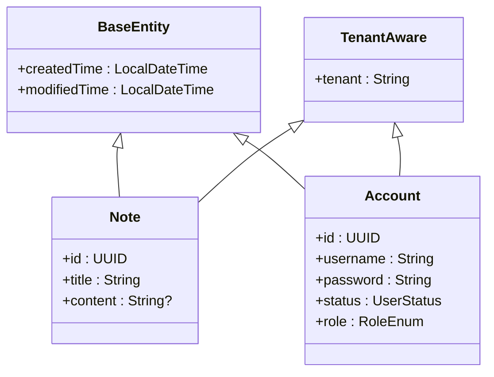
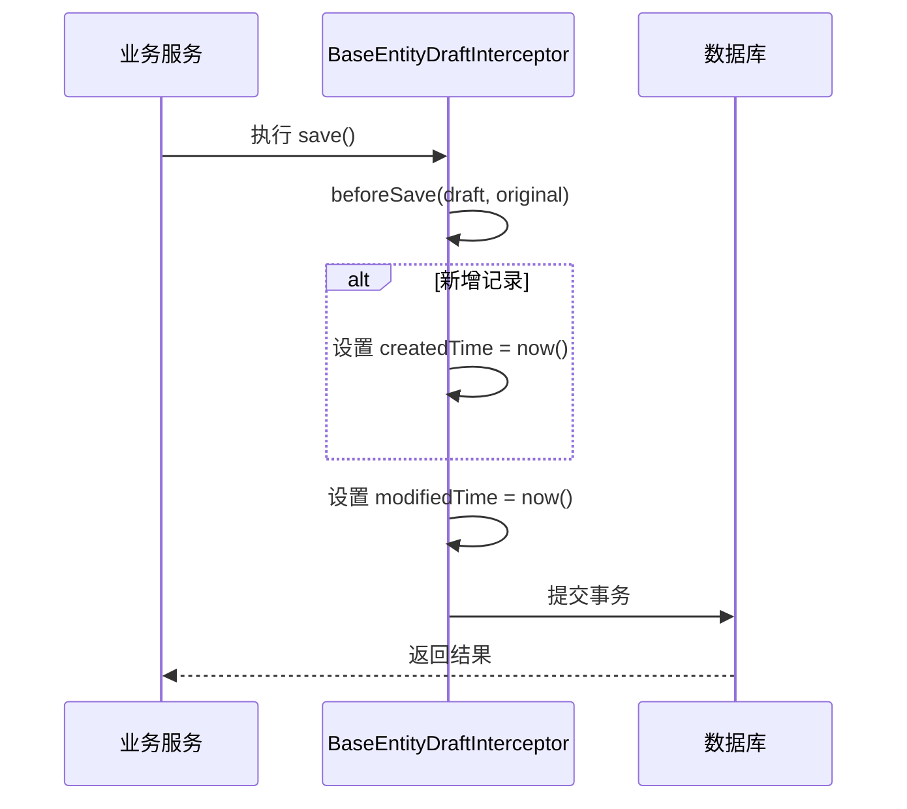
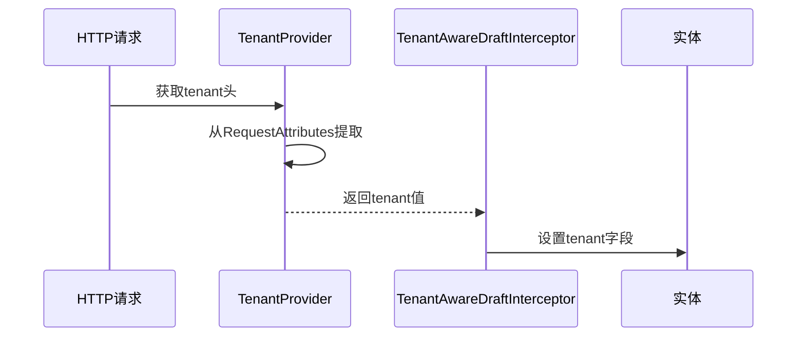
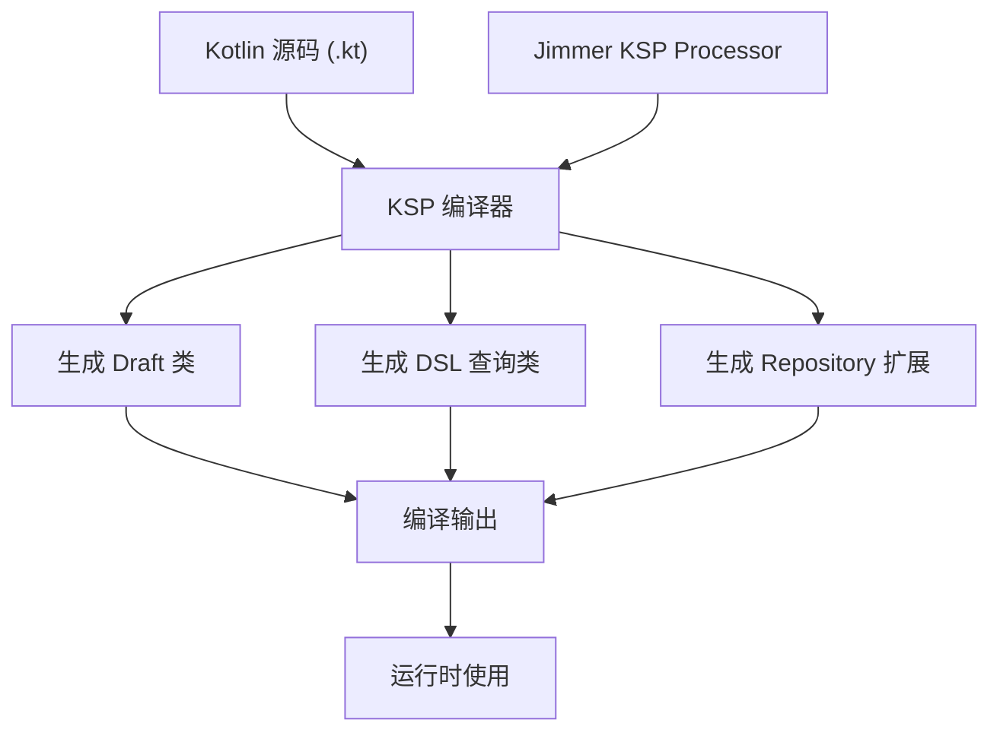

# Jimmer ORM 使用指南

<cite>
**本文档引用的文件**  
- [BaseEntity.kt](file://model/src/main/kotlin/top/zztech/ainote/model/common/BaseEntity.kt)
- [TenantAware.kt](file://model/src/main/kotlin/top/zztech/ainote/model/common/TenantAware.kt)
- [BaseEntityDraftInterceptor.kt](file://runtime/src/main/kotlin/top/zztech/ainote/runtime/interceptor/BaseEntityDraftInterceptor.kt)
- [TenantAwareDraftInterceptor.kt](file://runtime/src/main/kotlin/top/zztech/ainote/runtime/interceptor/TenantAwareDraftInterceptor.kt)
- [Note.kt](file://model/src/main/kotlin/top/zztech/ainote/model/Note.kt)
- [Log.kt](file://model/src/main/kotlin/top/zztech/ainote/model/Log.kt)
- [Account.kt](file://model/src/main/kotlin/top/zztech/ainote/model/Account.kt)
- [TenantProvider.kt](file://runtime/src/main/kotlin/top/zztech/ainote/runtime/TenantProvider.kt)
- [NoteRepository.kt](file://repository/src/main/kotlin/top/zztech/ainote/repository/NoteRepository.kt)
- [build.gradle.kts](file://service/build.gradle.kts)
- [settings.gradle.kts](file://settings.gradle.kts)
</cite>

## 目录
1. [引言](#引言)
2. [核心注解详解](#核心注解详解)
3. [审计字段与多租户自动填充机制](#审计字段与多租户自动填充机制)
4. [@Key 与 @KeyUniqueConstraint 注解说明](#key-与-keyuniqueconstraint-注解说明)
5. [类型安全 DSL 查询介绍](#类型安全-dsl-查询介绍)
6. [KSP 编译时代码生成机制](#ksp-编译时代码生成机制)
7. [总结](#总结)

## 引言

Jimmer ORM 是一个现代化的 Kotlin 语言持久层框架，提供类型安全、编译时检查的数据库操作能力。本项目基于 Jimmer 构建，充分利用其对象映射、智能保存、类型安全查询、多租户支持等特性，实现了高效、安全的数据访问模式。本文将深入解析 Jimmer 在本项目中的具体应用，涵盖实体定义、自动填充机制、唯一约束配置、DSL 查询以及 KSP 编译时生成技术。

**文档来源说明**：本文档内容基于项目中实际使用的 Jimmer 相关代码文件进行分析，确保信息准确可靠。

## 核心注解详解

Jimmer 使用一系列注解来定义实体结构和行为。以下是本项目中使用的核心注解及其作用：

### @Entity
用于标记一个 Kotlin 接口为持久化实体类。Jimmer 通过此注解识别需要映射到数据库表的对象。例如，在 `Note.kt` 和 `Account.kt` 中均使用了该注解。

### @Id
标识实体中的主键字段。通常配合 `@GeneratedValue` 使用以实现自动主键生成。在本项目中，所有实体（如 `Note`、`Account`、`Log`）的 `id` 字段均使用此注解，并设置为自增 UUID。

### @Key
定义业务键（Business Key），即在业务逻辑中具有唯一性约束的字段。例如，在 `Note.kt` 中，`title` 被标记为 `@Key`，表示笔记标题在系统中应具备业务唯一性。

### @KeyUniqueConstraint
用于配置由 `@Key` 字段生成的唯一约束的行为。其主要参数包括：
- `noMoreUniqueConstraints`: 若设为 `true`，则禁止除 `@Key` 外的其他字段创建额外的唯一约束。
- `isNullNotDistinct`: 若设为 `true`，则数据库中多个 `NULL` 值不会被视为重复，避免因 `NULL` 导致唯一性冲突。

该注解广泛应用于 `Note`、`Account` 和 `Log` 实体中，统一管理业务键的唯一性策略。

**Section sources**
- [Note.kt](file://model/src/main/kotlin/top/zztech/ainote/model/Note.kt#L13-L17)
- [Account.kt](file://model/src/main/kotlin/top/zztech/ainote/model/Account.kt#L15-L20)
- [Log.kt](file://model/src/main/kotlin/top/zztech/ainote/model/Log.kt#L19-L23)

## 审计字段与多租户自动填充机制

本项目通过继承通用接口和使用 Draft 拦截器机制，实现了审计字段和多租户字段的自动填充，无需在业务代码中手动设置。

### 公共基类设计

#### BaseEntity
`BaseEntity` 是一个使用 `@MappedSuperclass` 注解的接口，定义了所有实体共有的审计字段：
- `createdTime`: 记录实体创建时间
- `modifiedTime`: 记录实体最后修改时间

这两个字段通过 `BaseEntityDraftInterceptor` 在保存时自动填充。

#### TenantAware
`TenantAware` 接口定义了 `tenant` 字段，用于实现多租户数据隔离。该字段由 `TenantAwareDraftInterceptor` 自动设置。



**Diagram sources**
- [BaseEntity.kt](file://model/src/main/kotlin/top/zztech/ainote/model/common/BaseEntity.kt#L7-L29)
- [TenantAware.kt](file://model/src/main/kotlin/top/zztech/ainote/model/common/TenantAware.kt#L5-L16)

### Draft 拦截器机制

Jimmer 提供 `DraftInterceptor` 接口，允许在实体保存前执行自定义逻辑。

#### BaseEntityDraftInterceptor
该拦截器负责自动设置时间戳字段：
- 当为新插入记录（`original === null`）且 `createdTime` 未加载时，设置当前时间为 `createdTime`
- 每次保存时，若 `modifiedTime` 未加载，则更新为当前时间



**Diagram sources**
- [BaseEntityDraftInterceptor.kt](file://runtime/src/main/kotlin/top/zztech/ainote/runtime/interceptor/BaseEntityDraftInterceptor.kt#L11-L22)

#### TenantAwareDraftInterceptor
该拦截器从请求上下文中获取租户信息并自动填充 `tenant` 字段：
- 依赖 `TenantProvider` 从 HTTP 请求头中提取 `tenant` 头信息
- 若 `tenant` 字段未加载且当前上下文存在租户，则自动设置

`TenantProvider` 通过 Spring 的 `RequestContextHolder` 获取当前请求，并读取名为 `tenant` 的请求头。



**Diagram sources**
- [TenantAwareDraftInterceptor.kt](file://runtime/src/main/kotlin/top/zztech/ainote/runtime/interceptor/TenantAwareDraftInterceptor.kt#L11-L21)
- [TenantProvider.kt](file://runtime/src/main/kotlin/top/zztech/ainote/runtime/TenantProvider.kt#L7-L15)

**Section sources**
- [BaseEntityDraftInterceptor.kt](file://runtime/src/main/kotlin/top/zztech/ainote/runtime/interceptor/BaseEntityDraftInterceptor.kt#L1-L23)
- [TenantAwareDraftInterceptor.kt](file://runtime/src/main/kotlin/top/zztech/ainote/runtime/interceptor/TenantAwareDraftInterceptor.kt#L1-L22)
- [TenantProvider.kt](file://runtime/src/main/kotlin/top/zztech/ainote/runtime/TenantProvider.kt#L1-L16)

## @Key 与 @KeyUniqueConstraint 注解说明

`@Key` 注解用于定义业务唯一性字段，区别于数据库主键。它在语义上表示某个字段或字段组合在业务层面必须唯一。

在本项目中，`Note` 实体的 `title` 字段被标记为 `@Key`，意味着每个用户的笔记标题应保持唯一（结合多租户字段）。

`@KeyUniqueConstraint` 进一步控制这些业务键的数据库约束行为：
- `noMoreUniqueConstraints = true` 确保不会因其他字段意外产生额外唯一索引
- `isNullNotDistinct = true` 允许多个 `NULL` 值共存，适用于可选字段的唯一性约束

这种设计既保证了业务规则的一致性，又避免了数据库层面的约束冲突。

**Section sources**
- [Note.kt](file://model/src/main/kotlin/top/zztech/ainote/model/Note.kt#L14-L17)
- [Account.kt](file://model/src/main/kotlin/top/zztech/ainote/model/Account.kt#L17-L20)

## 类型安全 DSL 查询介绍

Jimmer 提供类型安全的 DSL 查询 API，可在编译期检查查询语句的正确性，避免运行时 SQL 错误。

虽然当前 `NoteRepository.kt` 中未实现具体查询方法，但其结构已预留 DSL 查询扩展能力：

```kotlin
fun findByTitleContaining(keyword: String): List<Note> =
    createQuery {
        where(table.title `like?` "%$keyword%")
        select(table)
    }.execute()
```

此类查询具备以下优势：
- 字段引用类型安全，重构时自动更新
- 表达式语法清晰，接近自然语言
- 支持复杂关联查询、分页、排序等操作
- 自动生成高效 SQL，避免 N+1 问题

未来可在各 Repository 中扩展此类方法，实现安全、高效的数据库访问。

**Section sources**
- [NoteRepository.kt](file://repository/src/main/kotlin/top/zztech/ainote/repository/NoteRepository.kt#L1-L27)

## KSP 编译时代码生成机制

Kotlin Symbol Processing (KSP) 是 Jimmer 实现类型安全 API 的核心技术。

### 配置说明
项目在 `build.gradle.kts` 中配置了 KSP 插件：
- `id("com.google.devtools.ksp")` 引入 KSP 支持
- `ksp("org.babyfish.jimmer:jimmer-ksp:${jimmerVersion}")` 添加 Jimmer KSP 处理器
- 配置生成源码目录 `build/generated/ksp/main/kotlin`，供 IDE 识别

### 生成内容
KSP 在编译期间自动生成以下内容：
- 实体对应的 Draft 类（如 `NoteDraft`）
- 类型安全的查询 DSL 类
- Repository 扩展函数
- DTO 映射代码（如有 `.dto` 文件）

这些生成代码使得开发者可以使用纯 Kotlin 语法进行类型安全的操作，无需手动编写模板代码。



**Diagram sources**
- [build.gradle.kts](file://service/build.gradle.kts#L6-L7)
- [build.gradle.kts](file://model/build.gradle.kts#L5-L6)

**Section sources**
- [build.gradle.kts](file://service/build.gradle.kts#L1-L57)
- [build.gradle.kts](file://model/build.gradle.kts#L1-L42)
- [settings.gradle.kts](file://settings.gradle.kts#L1-L6)

## 总结

本项目通过 Jimmer ORM 实现了现代化的持久层设计：
- 使用 `@Entity`、`@Id`、`@Key` 等注解清晰定义实体模型
- 借助 `BaseEntity` 和 `TenantAware` 实现通用字段抽象
- 利用 `DraftInterceptor` 机制自动填充 `createdTime`、`modifiedTime` 和 `tenant` 字段
- 通过 `@KeyUniqueConstraint` 统一管理业务唯一性约束
- 预留类型安全 DSL 查询接口，支持未来扩展
- 基于 KSP 在编译期生成类型安全 API，提升开发效率与代码质量

该架构具备良好的可维护性、扩展性和类型安全性，为系统的稳定运行提供了坚实基础。