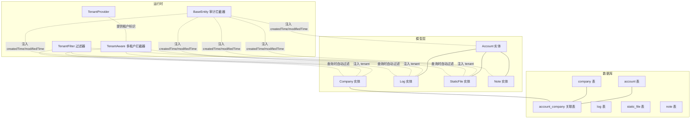
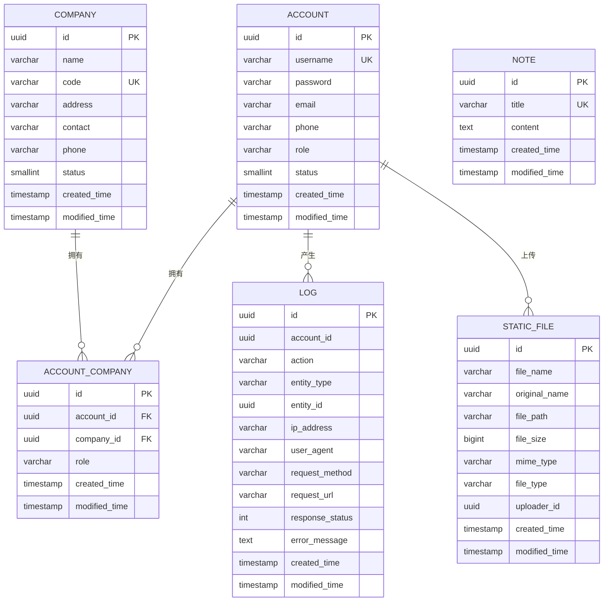
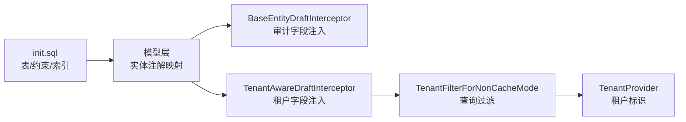

# 实体关系与数据库模式

<cite>
**本文引用的文件**
- [init.sql](file://database/init.sql)
- [BaseEntity.kt](file://model/src/main/kotlin/top/zztech/ainote/model/common/BaseEntity.kt)
- [TenantAware.kt](file://model/src/main/kotlin/top/zztech/ainote/model/common/TenantAware.kt)
- [BaseEntityDraftInterceptor.kt](file://runtime/src/main/kotlin/top/zztech/ainote/runtime/interceptor/BaseEntityDraftInterceptor.kt)
- [TenantAwareDraftInterceptor.kt](file://runtime/src/main/kotlin/top/zztech/ainote/runtime/interceptor/TenantAwareDraftInterceptor.kt)
- [TenantFilterForNonCacheMode.kt](file://runtime/src/main/kotlin/top/zztech/ainote/runtime/filter/TenantFilterForNonCacheMode.kt)
- [TenantProvider.kt](file://runtime/src/main/kotlin/top/zztech/ainote/runtime/TenantProvider.kt)
- [Account.kt](file://model/src/main/kotlin/top/zztech/ainote/model/Account.kt)
- [Company.kt](file://model/src/main/kotlin/top/zztech/ainote/model/Company.kt)
- [Log.kt](file://model/src/main/kotlin/top/zztech/ainote/model/Log.kt)
- [StaticFile.kt](file://model/src/main/kotlin/top/zztech/ainote/model/StaticFile.kt)
- [Note.kt](file://model/src/main/kotlin/top/zztech/ainote/model/Note.kt)
- [LogRepository.kt](file://repository/src/main/kotlin/top/zztech/ainote/repository/LogRepository.kt)
- [StaticFileRepository.kt](file://repository/src/main/kotlin/top/zztech/ainote/repository/StaticFileRepository.kt)
</cite>

## 目录
1. [简介](#简介)
2. [项目结构](#项目结构)
3. [核心组件](#核心组件)
4. [架构总览](#架构总览)
5. [详细组件分析](#详细组件分析)
6. [依赖分析](#依赖分析)
7. [性能考虑](#性能考虑)
8. [故障排查指南](#故障排查指南)
9. [结论](#结论)
10. [附录](#附录)

## 简介
本文件围绕数据库初始化脚本与Jimmer ORM实体模型，系统性梳理Note、Account、Log、StaticFile与Company五大核心实体的字段定义、主键、外键、唯一约束与索引；阐明各实体如何继承BaseEntity以获得createdTime与modifiedTime审计字段，以及部分实体如何通过TenantAware实现多租户支持；重点解释Account与Company之间的多对多关系（通过account_company关联表实现）、Log与Account的可选关联、StaticFile与Account的上传者关系；并给出实体关系图（ERD）的文字描述及Jimmer注解（如@ManyToOne、@IdView）在关系映射中的作用说明。

## 项目结构
- 数据库模式由database/init.sql统一定义，包含account、company、account_company、log、static_file、note等表，以及若干索引。
- 实体模型位于model/src/main/kotlin/top/zztech/ainote/model，采用Jimmer注解驱动的实体定义。
- 审计与多租户能力通过runtime下的拦截器与过滤器实现，分别注入createdTime/modifiedTime与tenant字段。
- 仓储层位于repository，提供基于KSqlClient的查询封装，体现Log与StaticFile的典型使用场景。

图表来源
- [init.sql](file://database/init.sql#L1-L100)
- [Account.kt](file://model/src/main/kotlin/top/zztech/ainote/model/Account.kt#L1-L34)
- [Company.kt](file://model/src/main/kotlin/top/zztech/ainote/model/Company.kt#L1-L33)
- [Log.kt](file://model/src/main/kotlin/top/zztech/ainote/model/Log.kt#L1-L94)
- [StaticFile.kt](file://model/src/main/kotlin/top/zztech/ainote/model/StaticFile.kt#L1-L71)
- [Note.kt](file://model/src/main/kotlin/top/zztech/ainote/model/Note.kt#L1-L29)
- [BaseEntityDraftInterceptor.kt](file://runtime/src/main/kotlin/top/zztech/ainote/runtime/interceptor/BaseEntityDraftInterceptor.kt#L1-L23)
- [TenantAwareDraftInterceptor.kt](file://runtime/src/main/kotlin/top/zztech/ainote/runtime/interceptor/TenantAwareDraftInterceptor.kt#L1-L22)
- [TenantFilterForNonCacheMode.kt](file://runtime/src/main/kotlin/top/zztech/ainote/runtime/filter/TenantFilterForNonCacheMode.kt#L1-L26)
- [TenantProvider.kt](file://runtime/src/main/kotlin/top/zztech/ainote/runtime/TenantProvider.kt#L1-L15)

章节来源
- [init.sql](file://database/init.sql#L1-L100)
- [Account.kt](file://model/src/main/kotlin/top/zztech/ainote/model/Account.kt#L1-L34)
- [Company.kt](file://model/src/main/kotlin/top/zztech/ainote/model/Company.kt#L1-L33)
- [Log.kt](file://model/src/main/kotlin/top/zztech/ainote/model/Log.kt#L1-L94)
- [StaticFile.kt](file://model/src/main/kotlin/top/zztech/ainote/model/StaticFile.kt#L1-L71)
- [Note.kt](file://model/src/main/kotlin/top/zztech/ainote/model/Note.kt#L1-L29)
- [BaseEntityDraftInterceptor.kt](file://runtime/src/main/kotlin/top/zztech/ainote/runtime/interceptor/BaseEntityDraftInterceptor.kt#L1-L23)
- [TenantAwareDraftInterceptor.kt](file://runtime/src/main/kotlin/top/zztech/ainote/runtime/interceptor/TenantAwareDraftInterceptor.kt#L1-L22)
- [TenantFilterForNonCacheMode.kt](file://runtime/src/main/kotlin/top/zztech/ainote/runtime/filter/TenantFilterForNonCacheMode.kt#L1-L26)
- [TenantProvider.kt](file://runtime/src/main/kotlin/top/zztech/ainote/runtime/TenantProvider.kt#L1-L15)

## 核心组件
- Account：用户账户实体，具备用户名、密码、邮箱、电话、角色、状态等字段，继承BaseEntity，使用@KeyUniqueConstraint声明业务唯一键（username）。
- Company：公司实体，具备名称、编码、地址、联系人、电话、状态等字段，继承BaseEntity，使用@KeyUniqueConstraint声明业务唯一键（code）。
- Log：系统审计日志实体，记录操作动作、目标实体类型与ID、请求信息、响应状态、错误信息等，继承BaseEntity；通过@ManyToOne与Account建立可选关联，同时提供accountId的@IdView便于直接读取外键值。
- StaticFile：静态文件实体，记录文件名、原始名、路径、大小、MIME类型、文件类型、上传者等，继承BaseEntity；通过@ManyToOne与Account建立可选关联，同时提供uploaderId的@IdView便于直接读取外键值。
- Note：示例实体，演示实体结构与BaseEntity继承关系，使用@Key标注标题为主键约束。
- BaseEntity：审计基类，提供createdTime与modifiedTime两个时间字段，由拦截器在保存前自动填充。
- TenantAware：多租户基类，提供tenant字段，由拦截器在保存前自动注入当前租户标识，过滤器在查询时自动追加tenant条件。

章节来源
- [Account.kt](file://model/src/main/kotlin/top/zztech/ainote/model/Account.kt#L1-L34)
- [Company.kt](file://model/src/main/kotlin/top/zztech/ainote/model/Company.kt#L1-L33)
- [Log.kt](file://model/src/main/kotlin/top/zztech/ainote/model/Log.kt#L1-L94)
- [StaticFile.kt](file://model/src/main/kotlin/top/zztech/ainote/model/StaticFile.kt#L1-L71)
- [Note.kt](file://model/src/main/kotlin/top/zztech/ainote/model/Note.kt#L1-L29)
- [BaseEntity.kt](file://model/src/main/kotlin/top/zztech/ainote/model/common/BaseEntity.kt#L1-L30)
- [TenantAware.kt](file://model/src/main/kotlin/top/zztech/ainote/model/common/TenantAware.kt#L1-L17)

## 架构总览
下图展示数据库表与Jimmer实体之间的对应关系，以及关键约束与索引：

图表来源
- [init.sql](file://database/init.sql#L1-L100)
- [Account.kt](file://model/src/main/kotlin/top/zztech/ainote/model/Account.kt#L1-L34)
- [Company.kt](file://model/src/main/kotlin/top/zztech/ainote/model/Company.kt#L1-L33)
- [Log.kt](file://model/src/main/kotlin/top/zztech/ainote/model/Log.kt#L1-L94)
- [StaticFile.kt](file://model/src/main/kotlin/top/zztech/ainote/model/StaticFile.kt#L1-L71)
- [Note.kt](file://model/src/main/kotlin/top/zztech/ainote/model/Note.kt#L1-L29)

## 详细组件分析

### Account 实体
- 字段与约束
  - 主键：id（UUID，自动生成）
  - 唯一约束：username（业务唯一键）
  - 审计字段：created_time、modified_time（由BaseEntity提供）
  - 默认值：status默认1，role默认"USER"
- 继承关系
  - 继承BaseEntity，自动具备createdTime与modifiedTime
- 多租户
  - 当前Account未实现TenantAware，不参与多租户过滤
- 关系
  - 与Log：一对多（可选关联，@ManyToOne）
  - 与StaticFile：一对多（可选关联，@ManyToOne）

章节来源
- [Account.kt](file://model/src/main/kotlin/top/zztech/ainote/model/Account.kt#L1-L34)
- [BaseEntity.kt](file://model/src/main/kotlin/top/zztech/ainote/model/common/BaseEntity.kt#L1-L30)
- [Log.kt](file://model/src/main/kotlin/top/zztech/ainote/model/Log.kt#L1-L94)
- [StaticFile.kt](file://model/src/main/kotlin/top/zztech/ainote/model/StaticFile.kt#L1-L71)

### Company 实体
- 字段与约束
  - 主键：id（UUID，自动生成）
  - 唯一约束：code（业务唯一键）
  - 审计字段：created_time、modified_time（由BaseEntity提供）
  - 默认值：status默认1
- 继承关系
  - 继承BaseEntity，自动具备createdTime与modifiedTime
- 多租户
  - 当前Company未实现TenantAware，不参与多租户过滤
- 关系
  - 与Account：多对多（通过account_company中间表）
  - 与Log：无直接关系
  - 与StaticFile：无直接关系

章节来源
- [Company.kt](file://model/src/main/kotlin/top/zztech/ainote/model/Company.kt#L1-L33)
- [BaseEntity.kt](file://model/src/main/kotlin/top/zztech/ainote/model/common/BaseEntity.kt#L1-L30)
- [init.sql](file://database/init.sql#L34-L44)

### Log 实体
- 字段与约束
  - 主键：id（UUID，自动生成）
  - 审计字段：created_time、modified_time（由BaseEntity提供）
  - 可选关联：account_id（@IdView），@ManyToOne(Account)
  - 其他字段：action、entity_type、entity_id、ip_address、user_agent、request_method、request_url、response_status、error_message
- 继承关系
  - 继承BaseEntity，自动具备createdTime与modifiedTime
- 多租户
  - 当前Log未实现TenantAware，不参与多租户过滤
- 关系
  - 与Account：可选一对一（@ManyToOne），通过account_id外键关联
- 索引
  - idx_log_account_id（account_id）
  - idx_log_created_time（created_time）

章节来源
- [Log.kt](file://model/src/main/kotlin/top/zztech/ainote/model/Log.kt#L1-L94)
- [BaseEntity.kt](file://model/src/main/kotlin/top/zztech/ainote/model/common/BaseEntity.kt#L1-L30)
- [init.sql](file://database/init.sql#L46-L60)
- [LogRepository.kt](file://repository/src/main/kotlin/top/zztech/ainote/repository/LogRepository.kt#L1-L53)

### StaticFile 实体
- 字段与约束
  - 主键：id（UUID，自动生成）
  - 审计字段：created_time、modified_time（由BaseEntity提供）
  - 可选关联：uploader_id（@IdView），@ManyToOne(Account)
  - 其他字段：fileName、originalName、filePath、fileSize、mimeType、fileType
- 继承关系
  - 继承BaseEntity，自动具备createdTime与modifiedTime
- 多租户
  - 当前StaticFile未实现TenantAware，不参与多租户过滤
- 关系
  - 与Account：可选一对一（@ManyToOne），通过uploader_id外键关联
- 索引
  - idx_static_file_uploader_id（uploader_id）

章节来源
- [StaticFile.kt](file://model/src/main/kotlin/top/zztech/ainote/model/StaticFile.kt#L1-L71)
- [BaseEntity.kt](file://model/src/main/kotlin/top/zztech/ainote/model/common/BaseEntity.kt#L1-L30)
- [init.sql](file://database/init.sql#L62-L73)
- [StaticFileRepository.kt](file://repository/src/main/kotlin/top/zztech/ainote/repository/StaticFileRepository.kt#L1-L39)

### Note 实体
- 字段与约束
  - 主键：id（UUID，自动生成）
  - 唯一约束：title（业务唯一键）
  - 审计字段：created_time、modified_time（由BaseEntity提供）
- 继承关系
  - 继承BaseEntity，自动具备createdTime与modifiedTime
- 多租户
  - 当前Note未实现TenantAware，不参与多租户过滤

章节来源
- [Note.kt](file://model/src/main/kotlin/top/zztech/ainote/model/Note.kt#L1-L29)
- [BaseEntity.kt](file://model/src/main/kotlin/top/zztech/ainote/model/common/BaseEntity.kt#L1-L30)

### 多对多关系：Account 与 Company（account_company）
- 关联表
  - account_company：包含account_id、company_id、role、created_time、modified_time
  - 外键：account_id指向account(id)，company_id指向company(id)
  - 唯一约束：(account_id, company_id)
- 索引
  - idx_account_company_account_id(account_id)
  - idx_account_company_company_id(company_id)
- 实体映射
  - 在Jimmer中，可通过中间实体或跨表查询实现多对多；当前模型未显式定义account_company实体，但数据库层面已建模，可通过KSqlClient进行关联查询。

章节来源
- [init.sql](file://database/init.sql#L34-L44)
- [Account.kt](file://model/src/main/kotlin/top/zztech/ainote/model/Account.kt#L1-L34)
- [Company.kt](file://model/src/main/kotlin/top/zztech/ainote/model/Company.kt#L1-L33)

### 审计字段：BaseEntity 与拦截器
- BaseEntity
  - createdTime、modifiedTime两个审计字段，使用@JsonFormat格式化输出
- 拦截器
  - BaseEntityDraftInterceptor：在保存前自动设置createdTime与modifiedTime
- 影响范围
  - Account、Company、Log、StaticFile、Note均继承BaseEntity，因此均具备审计字段

章节来源
- [BaseEntity.kt](file://model/src/main/kotlin/top/zztech/ainote/model/common/BaseEntity.kt#L1-L30)
- [BaseEntityDraftInterceptor.kt](file://runtime/src/main/kotlin/top/zztech/ainote/runtime/interceptor/BaseEntityDraftInterceptor.kt#L1-L23)

### 多租户支持：TenantAware、拦截器与过滤器
- TenantAware
  - tenant字段，用于标识实体所属租户
- 拦截器
  - TenantAwareDraftInterceptor：在保存前自动注入tenant
- 过滤器
  - TenantFilterForNonCacheMode：在查询时自动追加where(tenant = 当前租户)
- 租户来源
  - TenantProvider：从HTTP请求头tenant中提取当前租户标识
- 影响范围
  - 当前Account、Company、Log、StaticFile、Note未实现TenantAware，因此不受多租户过滤影响；若需启用多租户隔离，应在相关实体上实现TenantAware并确保拦截器与过滤器生效。

章节来源
- [TenantAware.kt](file://model/src/main/kotlin/top/zztech/ainote/model/common/TenantAware.kt#L1-L17)
- [TenantAwareDraftInterceptor.kt](file://runtime/src/main/kotlin/top/zztech/ainote/runtime/interceptor/TenantAwareDraftInterceptor.kt#L1-L22)
- [TenantFilterForNonCacheMode.kt](file://runtime/src/main/kotlin/top/zztech/ainote/runtime/filter/TenantFilterForNonCacheMode.kt#L1-L26)
- [TenantProvider.kt](file://runtime/src/main/kotlin/top/zztech/ainote/runtime/TenantProvider.kt#L1-L15)

### 关系映射注解说明
- @IdView
  - 用于暴露外键字段（如accountId、uploaderId），便于直接读取外键值而无需加载关联对象
- @ManyToOne
  - 声明多对一关系，配合@JoinColumn指定外键列；示例中使用ForeignKeyType.FAKE表示逻辑外键，实际不强制外键约束
- @MappedSuperclass
  - 标记基类，使其字段与行为被子类继承
- @KeyUniqueConstraint
  - 控制唯一约束策略，避免生成额外唯一约束，仅保留业务唯一键

章节来源
- [Log.kt](file://model/src/main/kotlin/top/zztech/ainote/model/Log.kt#L1-L94)
- [StaticFile.kt](file://model/src/main/kotlin/top/zztech/ainote/model/StaticFile.kt#L1-L71)
- [BaseEntity.kt](file://model/src/main/kotlin/top/zztech/ainote/model/common/BaseEntity.kt#L1-L30)
- [Account.kt](file://model/src/main/kotlin/top/zztech/ainote/model/Account.kt#L1-L34)
- [Company.kt](file://model/src/main/kotlin/top/zztech/ainote/model/Company.kt#L1-L33)

## 依赖分析
- 数据库层
  - init.sql定义了所有表、主键、外键、唯一约束与索引
- 模型层
  - 各实体通过Jimmer注解映射到数据库表，继承BaseEntity获得审计字段
  - Account与Company之间通过account_company中间表形成多对多
  - Log与StaticFile与Account之间为可选关联
- 运行时层
  - BaseEntityDraftInterceptor与TenantAwareDraftInterceptor负责字段注入
  - TenantFilterForNonCacheMode负责查询过滤
  - TenantProvider负责租户标识提取

图表来源
- [init.sql](file://database/init.sql#L1-L100)
- [BaseEntityDraftInterceptor.kt](file://runtime/src/main/kotlin/top/zztech/ainote/runtime/interceptor/BaseEntityDraftInterceptor.kt#L1-L23)
- [TenantAwareDraftInterceptor.kt](file://runtime/src/main/kotlin/top/zztech/ainote/runtime/interceptor/TenantAwareDraftInterceptor.kt#L1-L22)
- [TenantFilterForNonCacheMode.kt](file://runtime/src/main/kotlin/top/zztech/ainote/runtime/filter/TenantFilterForNonCacheMode.kt#L1-L26)
- [TenantProvider.kt](file://runtime/src/main/kotlin/top/zztech/ainote/runtime/TenantProvider.kt#L1-L15)

章节来源
- [init.sql](file://database/init.sql#L1-L100)
- [BaseEntityDraftInterceptor.kt](file://runtime/src/main/kotlin/top/zztech/ainote/runtime/interceptor/BaseEntityDraftInterceptor.kt#L1-L23)
- [TenantAwareDraftInterceptor.kt](file://runtime/src/main/kotlin/top/zztech/ainote/runtime/interceptor/TenantAwareDraftInterceptor.kt#L1-L22)
- [TenantFilterForNonCacheMode.kt](file://runtime/src/main/kotlin/top/zztech/ainote/runtime/filter/TenantFilterForNonCacheMode.kt#L1-L26)
- [TenantProvider.kt](file://runtime/src/main/kotlin/top/zztech/ainote/runtime/TenantProvider.kt#L1-L15)

## 性能考虑
- 索引利用
  - account_company：对account_id与company_id建立索引，有利于多对多查询与去重
  - log：对account_id与created_time建立索引，有利于按用户与时间排序查询
  - static_file：对uploader_id建立索引，有利于按上传者检索
- 关联查询
  - 使用@IdView可避免不必要的JOIN，直接读取外键值；需要完整关联对象时再使用@ManyToOne
- 多租户过滤
  - 若开启多租户，建议在实体上实现TenantAware并启用过滤器，避免全表扫描

[本节为通用指导，不直接分析具体文件]

## 故障排查指南
- 审计字段为空
  - 检查是否正确注册BaseEntityDraftInterceptor，确认保存流程触发拦截器
- 多租户数据泄露
  - 检查TenantProvider是否能正确从请求头获取tenant，TenantFilterForNonCacheMode是否生效
- 外键一致性问题
  - Log与StaticFile的外键使用ForeignKeyType.FAKE，不强制数据库约束；如需强一致，可在数据库层调整外键策略
- 查询结果异常
  - 若启用了多租户过滤，确认请求头tenant是否正确传递

章节来源
- [BaseEntityDraftInterceptor.kt](file://runtime/src/main/kotlin/top/zztech/ainote/runtime/interceptor/BaseEntityDraftInterceptor.kt#L1-L23)
- [TenantAwareDraftInterceptor.kt](file://runtime/src/main/kotlin/top/zztech/ainote/runtime/interceptor/TenantAwareDraftInterceptor.kt#L1-L22)
- [TenantFilterForNonCacheMode.kt](file://runtime/src/main/kotlin/top/zztech/ainote/runtime/filter/TenantFilterForNonCacheMode.kt#L1-L26)
- [TenantProvider.kt](file://runtime/src/main/kotlin/top/zztech/ainote/runtime/TenantProvider.kt#L1-L15)
- [Log.kt](file://model/src/main/kotlin/top/zztech/ainote/model/Log.kt#L1-L94)
- [StaticFile.kt](file://model/src/main/kotlin/top/zztech/ainote/model/StaticFile.kt#L1-L71)

## 结论
本项目通过init.sql与Jimmer实体模型清晰地定义了Account、Company、Log、StaticFile与Note五大核心实体的字段、约束与索引；Account与Company通过account_company实现多对多关系；Log与StaticFile与Account之间为可选关联，便于审计与文件管理场景；所有实体继承BaseEntity获得统一的审计能力；多租户支持通过TenantAware、拦截器与过滤器实现，当前模型未启用多租户，如需启用可在相关实体上扩展TenantAware并确保运行时配置生效。

[本节为总结性内容，不直接分析具体文件]

## 附录

### 数据库DDL要点摘要
- account：主键id，唯一键username，审计字段created_time/modified_time
- company：主键id，唯一键code，审计字段created_time/modified_time
- account_company：主键id，外键account_id与company_id，唯一键(account_id, company_id)
- log：主键id，可选account_id，审计字段created_time/modified_time
- static_file：主键id，可选uploader_id，审计字段created_time/modified_time
- note：主键id，唯一键title，审计字段created_time/modified_time
- 索引：
  - idx_account_company_account_id(account_id)
  - idx_account_company_company_id(company_id)
  - idx_log_account_id(account_id)
  - idx_log_created_time(created_time)
  - idx_static_file_uploader_id(uploader_id)

章节来源
- [init.sql](file://database/init.sql#L1-L100)