# 数据库初始化与示例数据

<cite>
**本文引用的文件**
- [init.sql](file://database/init.sql)
</cite>

## 目录
1. [简介](#简介)
2. [项目结构](#项目结构)
3. [核心组件](#核心组件)
4. [架构总览](#架构总览)
5. [详细组件分析](#详细组件分析)
6. [依赖关系分析](#依赖关系分析)
7. [性能考量](#性能考量)
8. [故障排查指南](#故障排查指南)
9. [结论](#结论)
10. [附录](#附录)

## 简介
本文件围绕数据库初始化脚本进行系统化解读，重点覆盖以下方面：
- 初始化流程：通过 DROP TABLE IF EXISTS 确保数据库处于干净状态，避免重复建表导致的冲突。
- 表结构与约束：逐表说明字段类型、约束（NOT NULL、DEFAULT、PRIMARY KEY、UNIQUE、FOREIGN KEY），并特别解析 account 的业务唯一键与 account_company 的复合唯一键。
- 索引设计：解释各索引的创建目的，以提升查询性能。
- 示例数据：说明 INSERT 语句如何为 account、company 和 note 表填充初始示例数据，并阐述其在开发与测试中的作用。

## 项目结构
数据库初始化脚本位于 database/init.sql，负责一次性完成数据库对象的创建与基础数据填充。该脚本独立于应用代码运行，通常在首次部署或重置数据库时执行。

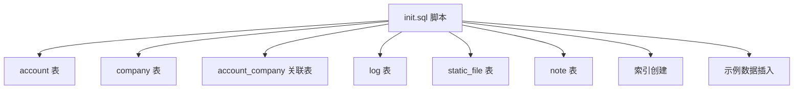

**图表来源**
- [init.sql](file://database/init.sql#L1-L101)

**章节来源**
- [init.sql](file://database/init.sql#L1-L101)

## 核心组件
本节对每个表的结构、字段类型、约束及索引进行逐一说明，并给出业务意义与设计意图。

- account 表
  - 主键：id（UUID，默认生成）
  - 字段与约束：
    - username：VARCHAR(50)，NOT NULL；业务唯一键约束保证用户名全局唯一。
    - password：VARCHAR(255)，NOT NULL；用于安全存储密码。
    - email/phone：可选字段，便于联系信息管理。
    - role：VARCHAR(50)，NOT NULL；角色标识（如 ADMIN/USER）。
    - status：SMALLINT，NOT NULL，默认 1；状态枚举（启用/禁用等）。
    - created_time/modified_time：TIMESTAMP，NOT NULL；记录创建与更新时间。
  - 唯一约束：business_key_account（基于 username），确保用户名唯一性，避免重复注册。
  - 设计要点：采用 UUID 主键，避免序列竞争与暴露顺序；使用业务键唯一约束保障业务一致性。

- company 表
  - 主键：id（UUID，默认生成）
  - 字段与约束：
    - name/code：VARCHAR(100)/VARCHAR(50)，均 NOT NULL；公司名称与业务编码。
    - address/contact/phone：可选字段，支持企业联系信息。
    - status：SMALLINT，默认 1；公司状态。
    - created_time/modified_time：TIMESTAMP，NOT NULL。
  - 唯一约束：business_key_company（基于 code），确保公司编码唯一，便于业务识别与关联。

- account_company 关联表
  - 主键：id（UUID，默认生成）
  - 字段与约束：
    - account_id/company_id：NOT NULL，分别指向 account.id 与 company.id。
    - role：VARCHAR(50)，可选的角色属性（如“负责人”、“普通成员”）。
    - created_time/modified_time：TIMESTAMP，NOT NULL。
    - 外键约束：
      - fk_account_company_account：REFERENCES account(id)
      - fk_account_company_company：REFERENCES company(id)
    - 复合唯一约束：business_key_account_company(account_id, company_id)，防止同一用户在同一公司重复绑定。
  - 设计要点：多对多关系的中间表，通过复合唯一约束实现“去重绑定”。

- log 表
  - 主键：id（UUID，默认生成）
  - 字段与约束：
    - account_id：可选，用于记录操作人。
    - action/entity_type/entity_id：可选，记录操作行为与目标实体。
    - ip_address/user_agent/request_method/request_url/response_status/error_message：审计与追踪所需字段。
    - created_time/modified_time：TIMESTAMP，NOT NULL。
  - 设计要点：支持统一的日志采集与检索，便于问题定位与合规审计。

- static_file 表
  - 主键：id（UUID，默认生成）
  - 字段与约束：
    - file_name/original_name/file_path/file_size：必填，文件元信息。
    - mime_type/file_type/uploader_id：可选，便于分类与归属追踪。
    - created_time/modified_time：TIMESTAMP，NOT NULL。
  - 设计要点：通用静态资源存储，支持上传者追踪与类型归类。

- note 表
  - 主键：id（UUID，默认生成）
  - 字段与约束：
    - title：VARCHAR(255)，NOT NULL；笔记标题。
    - content：TEXT，可选；笔记内容。
    - created_time/modified_time：TIMESTAMP，NOT NULL。
  - 唯一约束：business_key_note（基于 title），确保笔记标题唯一，便于按标题快速检索与去重。

**章节来源**
- [init.sql](file://database/init.sql#L8-L82)

## 架构总览
下图展示初始化脚本的总体执行顺序与对象关系：

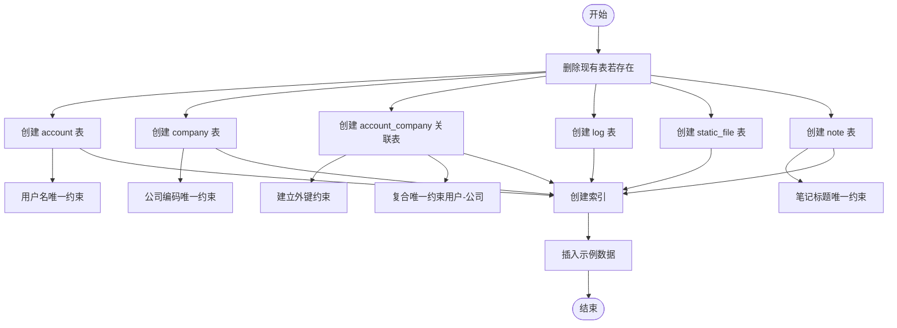

**图表来源**
- [init.sql](file://database/init.sql#L1-L101)

## 详细组件分析

### account 表：业务唯一键与角色状态
- 业务唯一键：username 的 UNIQUE 约束确保系统内用户名不重复，是登录与鉴权的基础。
- 角色与状态：role 与 status 字段用于权限控制与账号生命周期管理。
- 安全建议：生产环境应结合密码哈希策略与最小权限原则使用该表。

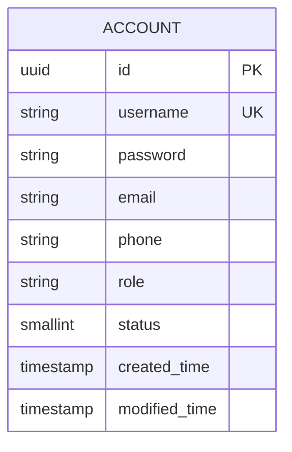

**图表来源**
- [init.sql](file://database/init.sql#L8-L19)

**章节来源**
- [init.sql](file://database/init.sql#L8-L19)

### company 表：编码唯一与状态管理
- 公司编码 code 的 UNIQUE 约束保证业务识别码唯一，便于跨模块引用与去重。
- 状态字段 status 支持启用/停用等治理场景。

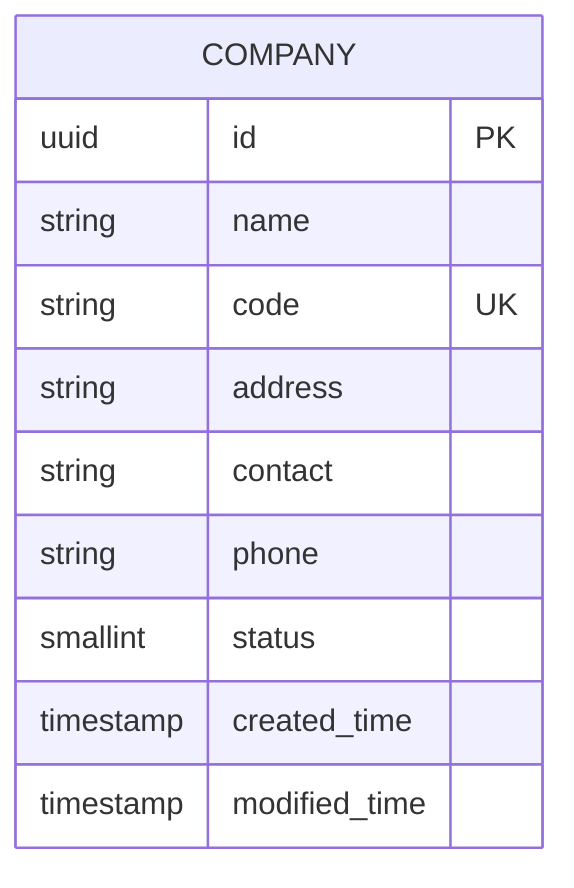

**图表来源**
- [init.sql](file://database/init.sql#L21-L32)

**章节来源**
- [init.sql](file://database/init.sql#L21-L32)

### account_company 关联表：多对多关系与复合唯一
- 外键约束：
  - account_id 引用 account(id)
  - company_id 引用 company(id)
- 复合唯一约束：(account_id, company_id) 防止重复绑定同一用户到同一公司。
- 设计收益：简化多租户或多组织场景下的用户归属管理，避免冗余绑定。

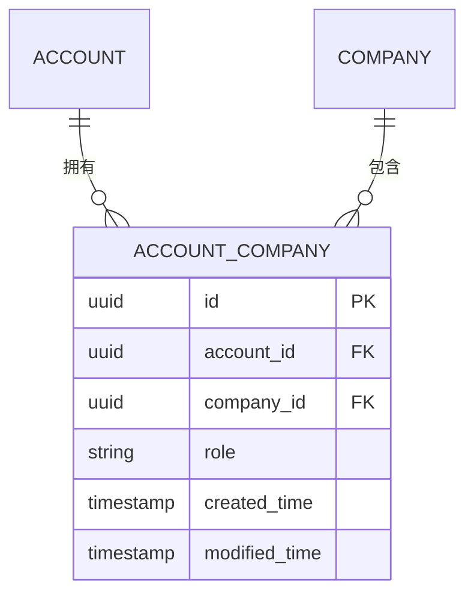

**图表来源**
- [init.sql](file://database/init.sql#L34-L44)

**章节来源**
- [init.sql](file://database/init.sql#L34-L44)

### log 表：审计与追踪
- 记录操作行为、请求上下文与响应状态，便于问题回溯与合规审计。
- 索引 idx_log_created_time 与 idx_log_account_id 提升查询效率。

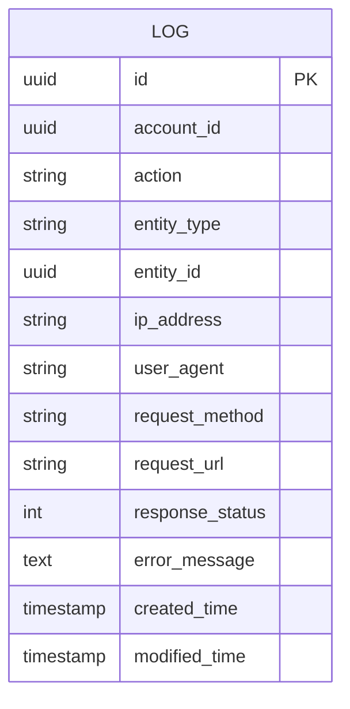

**图表来源**
- [init.sql](file://database/init.sql#L46-L60)

**章节来源**
- [init.sql](file://database/init.sql#L46-L60)

### static_file 表：静态资源存储
- 存储文件元信息与上传者信息，支持后续文件管理与访问控制。
- 索引 idx_static_file_uploader_id 有助于按上传者检索文件。

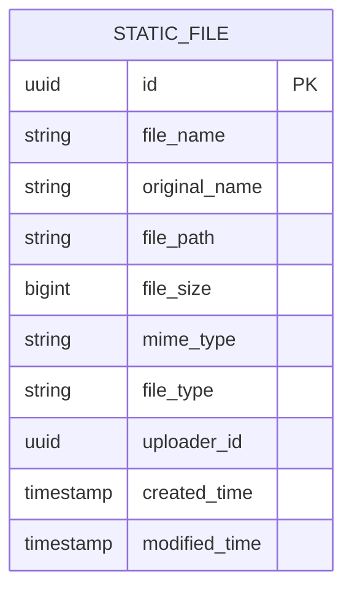

**图表来源**
- [init.sql](file://database/init.sql#L62-L73)

**章节来源**
- [init.sql](file://database/init.sql#L62-L73)

### note 表：示例笔记与标题唯一
- 用于演示笔记功能，title 的 UNIQUE 约束确保标题唯一，便于按标题检索。
- content 支持文本内容，便于测试富文本与搜索能力。

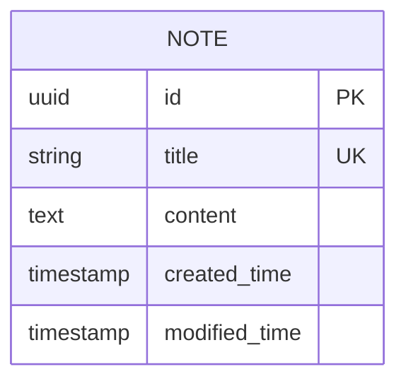

**图表来源**
- [init.sql](file://database/init.sql#L75-L82)

**章节来源**
- [init.sql](file://database/init.sql#L75-L82)

### 索引设计与性能优化
- idx_account_company_account_id：加速 account_company 按用户查询的性能。
- idx_account_company_company_id：加速 account_company 按公司查询的性能。
- idx_log_account_id：加速按用户审计日志的查询。
- idx_log_created_time：加速按时间范围的日志筛选。
- idx_static_file_uploader_id：加速按上传者检索文件的性能。

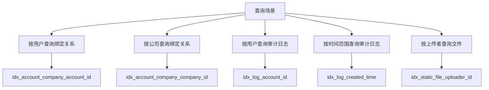

**图表来源**
- [init.sql](file://database/init.sql#L84-L89)

**章节来源**
- [init.sql](file://database/init.sql#L84-L89)

### 示例数据：账户、企业与笔记
- account 表：
  - 插入两条初始账户：admin（管理员）与 user1（普通用户）。
  - 预设角色与邮箱、电话等信息，便于快速登录与测试。
- company 表：
  - 插入两条示例企业：COMP001 与 COMP002，便于多租户场景测试。
- note 表：
  - 插入两条示例笔记，标题唯一，便于测试笔记列表与详情功能。

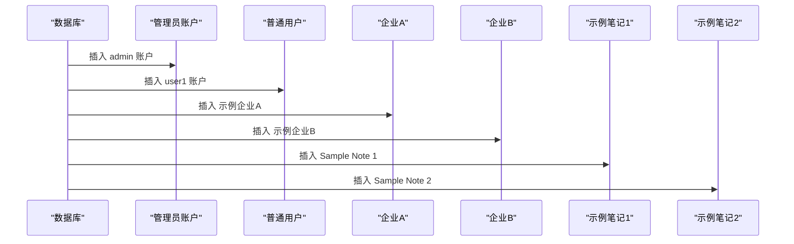

**图表来源**
- [init.sql](file://database/init.sql#L90-L101)

**章节来源**
- [init.sql](file://database/init.sql#L90-L101)

## 依赖关系分析
- account_company 的外键依赖 account 与 company，确保数据完整性。
- log 与 static_file 作为辅助表，分别服务于审计与文件管理。
- note 作为演示表，与 account/公司无直接外键关联，但可通过业务逻辑间接关联。

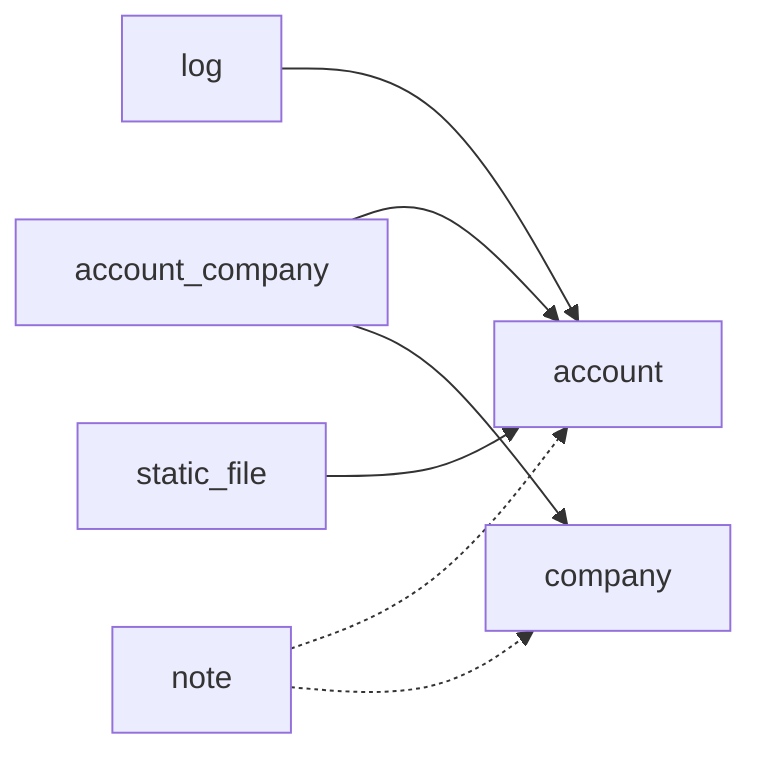

**图表来源**
- [init.sql](file://database/init.sql#L34-L44)
- [init.sql](file://database/init.sql#L46-L73)
- [init.sql](file://database/init.sql#L75-L82)

**章节来源**
- [init.sql](file://database/init.sql#L34-L44)
- [init.sql](file://database/init.sql#L46-L73)
- [init.sql](file://database/init.sql#L75-L82)

## 性能考量
- 使用 UUID 主键：避免序列热点与暴露业务顺序，适合分布式场景。
- 合理索引：针对高频查询字段建立单列索引，减少全表扫描。
- 唯一约束：在业务关键字段上建立唯一约束，既保证数据一致性，也利于索引命中。
- 时间字段：created_time/modified_time 统一格式，便于范围查询与排序。

[本节为通用指导，无需列出具体文件来源]

## 故障排查指南
- 唯一约束冲突
  - 现象：插入重复用户名、公司编码或笔记标题导致失败。
  - 排查：检查对应唯一约束是否已被占用；必要时修改输入值。
- 外键约束失败
  - 现象：插入 account_company 时提示引用不存在的 account 或 company。
  - 排查：确认 account 与 company 是否已存在；检查 UUID 是否正确。
- 索引未生效
  - 现象：按 account_id 或 created_time 查询较慢。
  - 排查：确认索引是否存在；检查查询条件是否命中索引（如大小写、类型）。

**章节来源**
- [init.sql](file://database/init.sql#L18-L19)
- [init.sql](file://database/init.sql#L31-L32)
- [init.sql](file://database/init.sql#L81-L82)
- [init.sql](file://database/init.sql#L34-L44)
- [init.sql](file://database/init.sql#L84-L89)

## 结论
该初始化脚本通过“先清理后创建”的方式，确保数据库处于一致的初始状态；通过主键、唯一约束与外键约束构建清晰的数据模型；配合针对性索引提升查询性能；并通过示例数据快速搭建开发与测试环境。整体设计兼顾了业务一致性、扩展性与可维护性。

[本节为总结性内容，无需列出具体文件来源]

## 附录
- 执行顺序建议
  - 先删除表（DROP），再创建表（CREATE），最后创建索引与插入数据。
  - 若需保留历史数据，请移除 DROP 部分或改为迁移脚本。
- 开发与测试用途
  - 提供管理员账户与普通用户，便于登录与权限验证。
  - 提供示例企业与示例笔记，便于功能演示与接口联调。

[本节为通用指导，无需列出具体文件来源]