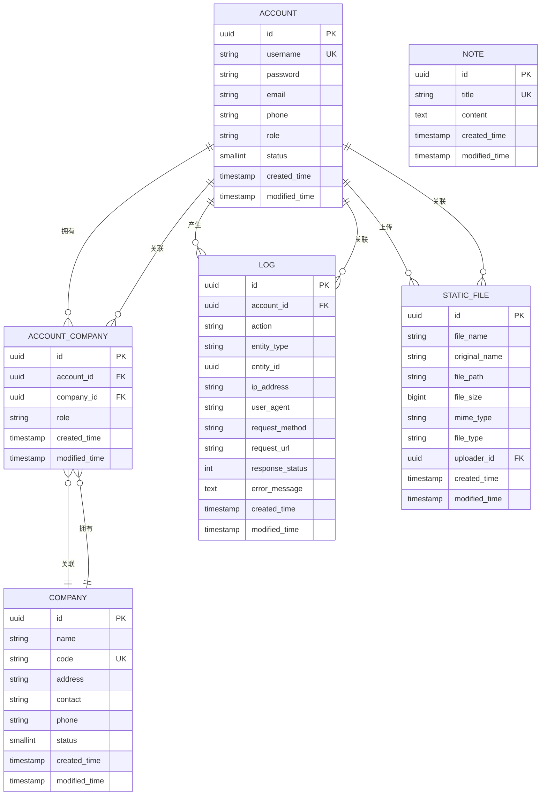

# 数据模型与ORM

<cite>
**本文档引用的文件**
- [init.sql](file://database/init.sql#L1-L101)
- [BaseEntity.kt](file://model/src/main/kotlin/top/zztech/ainote/model/common/BaseEntity.kt#L1-L30)
- [TenantAware.kt](file://model/src/main/kotlin/top/zztech/ainote/model/common/TenantAware.kt#L1-L17)
- [Note.kt](file://model/src/main/kotlin/top/zztech/ainote/model/Note.kt#L1-L29)
- [Account.kt](file://model/src/main/kotlin/top/zztech/ainote/model/Account.kt#L1-L34)
- [Log.kt](file://model/src/main/kotlin/top/zztech/ainote/model/Log.kt#L1-L94)
- [StaticFile.kt](file://model/src/main/kotlin/top/zztech/ainote/model/StaticFile.kt#L1-L71)
- [Company.kt](file://model/src/main/kotlin/top/zztech/ainote/model/Company.kt#L1-L33)
- [RoleEnum.kt](file://model/src/main/kotlin/top/zztech/ainote/model/enums/RoleEnum.kt#L1-L9)
- [UserStatus.kt](file://model/src/main/kotlin/top/zztech/ainote/model/enums/UserStatus.kt#L1-L31)
- [CompanyStatus.kt](file://model/src/main/kotlin/top/zztech/ainote/model/enums/CompanyStatus.kt#L1-L31)
- [FileType.kt](file://model/src/main/kotlin/top/zztech/ainote/model/enums/FileType.kt#L1-L51)
- [RequestMethod.kt](file://model/src/main/kotlin/top/zztech/ainote/model/enums/RequestMethod.kt#L1-L14)
- [BaseEntityDraftInterceptor.kt](file://runtime/src/main/kotlin/top/zztech/ainote/runtime/interceptor/BaseEntityDraftInterceptor.kt#L1-L23)
- [TenantAwareDraftInterceptor.kt](file://runtime/src/main/kotlin/top/zztech/ainote/runtime/interceptor/TenantAwareDraftInterceptor.kt#L1-L22)
</cite>

## 目录
1. [简介](#简介)
2. [核心实体与数据库表结构](#核心实体与数据库表结构)
3. [实体继承与审计字段](#实体继承与审计字段)
4. [多租户支持机制](#多租户支持机制)
5. [Jimmer ORM注解详解](#jimmer-orm注解详解)
6. [枚举类型存储策略](#枚举类型存储策略)
7. [实体关系与ER图描述](#实体关系与er图描述)
8. [Jimmer DSL查询示例](#jimmer-dsl查询示例)

## 简介
本文档详细描述了 ainote-server 项目中的核心数据模型，包括 Note、Account、Log、StaticFile 和 Company 等实体。结合数据库初始化脚本（init.sql）和 Kotlin 实体类定义，深入解析了各表的字段、约束、索引以及 Jimmer ORM 的使用方式。同时说明了 BaseEntity 和 TenantAware 的继承机制，以及如何通过 KSP 生成类型安全的查询 API。

## 核心实体与数据库表结构

### Note（笔记）
- **表名**: `note`
- **主键**: `id` (UUID, 自动生成)
- **业务键**: `title` (唯一约束 `business_key_note`)
- **字段**:
  - `title`: VARCHAR(255), 非空，唯一
  - `content`: TEXT, 可为空
  - `created_time`, `modified_time`: TIMESTAMP, 非空
- **索引**: 无额外索引

### Account（账户）
- **表名**: `account`
- **主键**: `id` (UUID, 自动生成)
- **业务键**: `username` (唯一约束 `business_key_account`)
- **字段**:
  - `username`: VARCHAR(50), 非空
  - `password`: VARCHAR(255), 非空
  - `email`, `phone`: 可为空
  - `role`: VARCHAR(50), 非空，默认值 'USER'
  - `status`: SMALLINT, 非空，默认值 1
  - `created_time`, `modified_time`: TIMESTAMP, 非空
- **索引**: 无额外索引

### Company（公司）
- **表名**: `company`
- **主键**: `id` (UUID, 自动生成)
- **业务键**: `code` (唯一约束 `business_key_company`)
- **字段**:
  - `name`: VARCHAR(100), 非空
  - `code`: VARCHAR(50), 非空，唯一
  - `address`, `contact`, `phone`: 可为空
  - `status`: SMALLINT, 非空，默认值 1
  - `created_time`, `modified_time`: TIMESTAMP, 非空
- **索引**: 无额外索引

### Log（日志）
- **表名**: `log`
- **主键**: `id` (UUID, 自动生成)
- **字段**:
  - `account_id`: UUID, 外键关联 account
  - `action`: VARCHAR(50), 非空
  - `entity_type`, `entity_id`: 操作目标实体类型和ID
  - `ip_address`, `user_agent`: 请求信息
  - `request_method`: VARCHAR(10)
  - `request_url`: VARCHAR(500)
  - `response_status`: INT
  - `error_message`: TEXT
  - `created_time`, `modified_time`: TIMESTAMP, 非空
- **索引**:
  - `idx_log_account_id` (account_id)
  - `idx_log_created_time` (created_time)

### StaticFile（静态文件）
- **表名**: `static_file`
- **主键**: `id` (UUID, 自动生成)
- **字段**:
  - `file_name`, `original_name`: VARCHAR(255), 非空
  - `file_path`: VARCHAR(500), 非空
  - `file_size`: BIGINT, 非空
  - `mime_type`: VARCHAR(100), 可为空
  - `file_type`: VARCHAR(50), 可为空
  - `uploader_id`: UUID, 外键关联 account
  - `created_time`, `modified_time`: TIMESTAMP, 非空
- **索引**:
  - `idx_static_file_uploader_id` (uploader_id)

### 多对多关系表：account_company
- **表名**: `account_company`
- **主键**: `id` (UUID, 自动生成)
- **外键**:
  - `account_id` → account(id)
  - `company_id` → company(id)
- **业务键**: `(account_id, company_id)` 唯一
- **索引**:
  - `idx_account_company_account_id` (account_id)
  - `idx_account_company_company_id` (company_id)

**本节来源**
- [init.sql](file://database/init.sql#L8-L101)
- [Note.kt](file://model/src/main/kotlin/top/zztech/ainote/model/Note.kt#L1-L29)
- [Account.kt](file://model/src/main/kotlin/top/zztech/ainote/model/Account.kt#L1-L34)
- [Company.kt](file://model/src/main/kotlin/top/zztech/ainote/model/Company.kt#L1-L33)
- [Log.kt](file://model/src/main/kotlin/top/zztech/ainote/model/Log.kt#L1-L94)
- [StaticFile.kt](file://model/src/main/kotlin/top/zztech/ainote/model/StaticFile.kt#L1-L71)

## 实体继承与审计字段

所有核心实体均继承自 `BaseEntity` 接口，该接口定义了两个关键的审计字段：

- `createdTime`: 记录实体创建时间
- `modifiedTime`: 记录实体最后修改时间

这两个字段通过 `BaseEntityDraftInterceptor` 在保存时自动填充：
- 当实体为新增（`original === null`）且 `createdTime` 未设置时，自动设置为当前时间
- 每次保存时，若 `modifiedTime` 未设置，则自动更新为当前时间

此机制确保了所有实体的审计字段一致性，无需在业务代码中手动维护。

**本节来源**
- [BaseEntity.kt](file://model/src/main/kotlin/top/zztech/ainote/model/common/BaseEntity.kt#L1-L30)
- [BaseEntityDraftInterceptor.kt](file://runtime/src/main/kotlin/top/zztech/ainote/runtime/interceptor/BaseEntityDraftInterceptor.kt#L1-L23)

## 多租户支持机制

系统通过 `TenantAware` 接口实现多租户支持：

- `TenantAware` 定义了 `tenant` 字段，表示实体所属租户
- 所有需要多租户支持的实体可继承此接口
- `TenantAwareDraftInterceptor` 负责在保存时自动填充 `tenant` 字段
- `tenant` 值由 `TenantProvider` 提供，通常从当前请求上下文获取

该设计实现了数据层面的租户隔离，确保不同租户的数据互不干扰。

**本节来源**
- [TenantAware.kt](file://model/src/main/kotlin/top/zztech/ainote/model/common/TenantAware.kt#L1-L17)
- [TenantAwareDraftInterceptor.kt](file://runtime/src/main/kotlin/top/zztech/ainote/runtime/interceptor/TenantAwareDraftInterceptor.kt#L1-L22)

## Jimmer ORM注解详解

### @Entity
标记接口为持久化实体，Jimmer 会为其生成相应的 SQL 映射和查询 API。

### @Id
标识主键字段。配合 `@GeneratedValue(strategy = GenerationType.AUTO)` 实现 UUID 自动生成。

### @Key
将字段标记为业务键（Business Key），Jimmer 会确保其唯一性。在 `Note` 中用于 `title` 字段。

### @KeyUniqueConstraint
配置业务键的唯一性约束行为：
- `noMoreUniqueConstraints = true`: 禁止其他字段形成唯一约束
- `isNullNotDistinct = true`: NULL 值不参与唯一性判断

### @Table
指定数据库表名。如 `Account` 显式映射到 `account` 表。

### @Column
指定字段对应的数据库列名。如 `Log` 中的 `entity_type` 映射到 `targetEntity`。

### @ManyToOne 与 @JoinColumn
定义多对一关联关系。`Log.account` 和 `StaticFile.uploader` 均关联到 `Account`。

### @IdView
用于关联字段的ID视图，允许直接访问外键值（如 `accountId`），同时支持完整对象加载（如 `account`）。

### @Default
指定字段的默认值，在实体创建时自动填充。

**本节来源**
- [Note.kt](file://model/src/main/kotlin/top/zztech/ainote/model/Note.kt#L1-L29)
- [Account.kt](file://model/src/main/kotlin/top/zztech/ainote/model/Account.kt#L1-L34)
- [Log.kt](file://model/src/main/kotlin/top/zztech/ainote/model/Log.kt#L1-L94)
- [StaticFile.kt](file://model/src/main/kotlin/top/zztech/ainote/model/StaticFile.kt#L1-L71)
- [Company.kt](file://model/src/main/kotlin/top/zztech/ainote/model/Company.kt#L1-L33)

## 枚举类型存储策略

项目中使用 `@EnumType` 注解定义枚举的数据库存储方式：

### 存储为名称（NAME）
- **使用枚举**: `RoleEnum`, `FileType`, `RequestMethod`
- **存储方式**: 将枚举常量名（如 "ADMIN", "IMAGE", "POST"）作为字符串存储
- **优点**: 可读性强，易于调试
- **示例**:
  ```sql
  INSERT INTO account(...) VALUES ('admin', ..., 'ADMIN', ...);
  ```

### 存储为序号（ORDINAL）
- **使用枚举**: `UserStatus`, `CompanyStatus`
- **存储方式**: 将枚举的序号（0, 1, 2...）作为整数存储
- **优点**: 存储空间小，性能略优
- **示例**:
  ```sql
  INSERT INTO account(...) VALUES ('admin', ..., 1); -- 1 对应 ACTIVE
  ```

此策略允许根据业务需求选择合适的存储方式，平衡可读性与性能。

**本节来源**
- [RoleEnum.kt](file://model/src/main/kotlin/top/zztech/ainote/model/enums/RoleEnum.kt#L1-L9)
- [UserStatus.kt](file://model/src/main/kotlin/top/zztech/ainote/model/enums/UserStatus.kt#L1-L31)
- [CompanyStatus.kt](file://model/src/main/kotlin/top/zztech/ainote/model/enums/CompanyStatus.kt#L1-L31)
- [FileType.kt](file://model/src/main/kotlin/top/zztech/ainote/model/enums/FileType.kt#L1-L51)
- [RequestMethod.kt](file://model/src/main/kotlin/top/zztech/ainote/model/enums/RequestMethod.kt#L1-L14)

## 实体关系与ER图描述

以下是系统核心实体的关系描述：



**图示来源**
- [init.sql](file://database/init.sql#L8-L101)
- [Account.kt](file://model/src/main/kotlin/top/zztech/ainote/model/Account.kt#L1-L34)
- [Company.kt](file://model/src/main/kotlin/top/zztech/ainote/model/Company.kt#L1-L33)
- [Log.kt](file://model/src/main/kotlin/top/zztech/ainote/model/Log.kt#L1-L94)
- [StaticFile.kt](file://model/src/main/kotlin/top/zztech/ainote/model/StaticFile.kt#L1-L71)
- [Note.kt](file://model/src/main/kotlin/top/zztech/ainote/model/Note.kt#L1-L29)

## Jimmer DSL查询示例

Jimmer 通过 KSP 在编译期生成类型安全的查询 API，以下为典型查询示例：

### 查询活跃用户笔记
```kotlin
db.createQuery(Note::class) {
    where(Note::title eq "Sample Note 1")
    where(Note::id inList listOf(uuid1, uuid2))
    orderBy(Note::createdTime.desc())
}.fetch()
```

### 关联查询日志与用户
```kotlin
db.createQuery(Log::class) {
    where(Log::account(IdOnly.of(Account::class, accountId)))
    select(
        Log::action,
        Log::createdTime,
        Log::account(Account::username)
    )
}.fetch()
```

### 分页查询文件
```kotlin
db.createQuery(StaticFile::class) {
    where(StaticFile::fileType eq FileType.IMAGE)
    limit(0, 20)
    orderBy(StaticFile::createdTime.desc())
}.fetch()
```

这些查询类型安全、语法简洁，且能充分利用数据库索引，是 Jimmer ORM 的核心优势。

**本节来源**
- [Note.kt](file://model/src/main/kotlin/top/zztech/ainote/model/Note.kt#L1-L29)
- [Log.kt](file://model/src/main/kotlin/top/zztech/ainote/model/Log.kt#L1-L94)
- [StaticFile.kt](file://model/src/main/kotlin/top/zztech/ainote/model/StaticFile.kt#L1-L71)