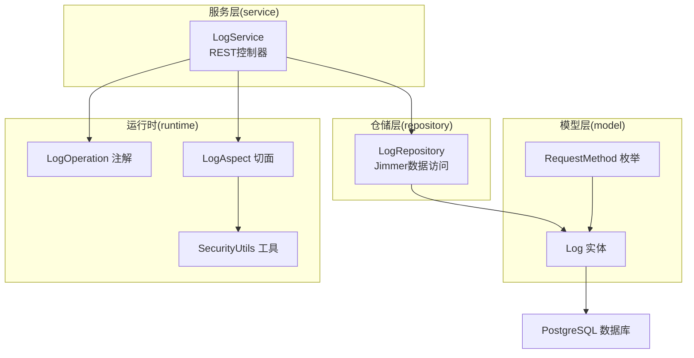
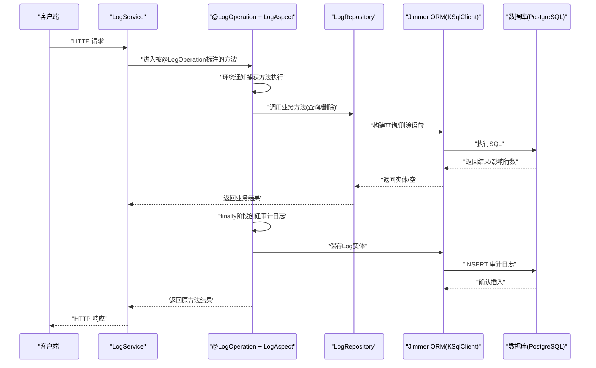
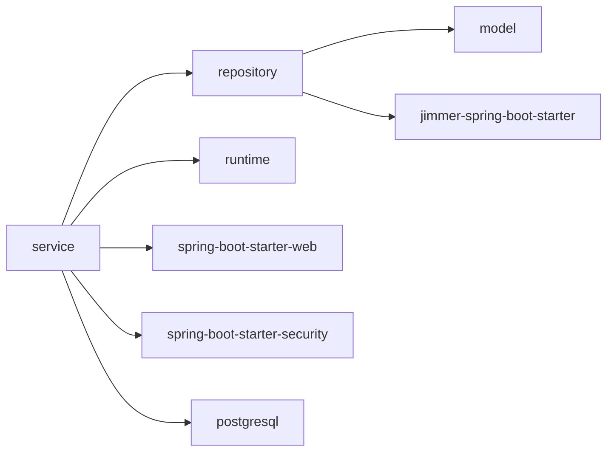

# 日志服务架构

<cite>
**本文引用的文件**
- [LogService.kt](file://service/src/main/kotlin/top/zztech/ainote/service/LogService.kt)
- [LogRepository.kt](file://repository/src/main/kotlin/top/zztech/ainote/repository/LogRepository.kt)
- [Log.kt](file://model/src/main/kotlin/top/zztech/ainote/model/Log.kt)
- [LogOperation.kt](file://runtime/src/main/kotlin/top/zztech/ainote/runtime/annotation/LogOperation.kt)
- [LogAspect.kt](file://runtime/src/main/kotlin/top/zztech/ainote/runtime/aspect/LogAspect.kt)
- [SecurityUtils.kt](file://runtime/src/main/kotlin/top/zztech/ainote/runtime/utility/SecurityUtils.kt)
- [RequestMethod.kt](file://model/src/main/kotlin/top/zztech/ainote/model/enums/RequestMethod.kt)
- [init.sql](file://database/init.sql)
- [build.gradle.kts](file://service/build.gradle.kts)
- [repository/build.gradle.kts](file://repository/build.gradle.kts)
</cite>

## 目录
1. [引言](#引言)
2. [项目结构](#项目结构)
3. [核心组件](#核心组件)
4. [架构总览](#架构总览)
5. [详细组件分析](#详细组件分析)
6. [依赖分析](#依赖分析)
7. [性能考虑](#性能考虑)
8. [故障排查指南](#故障排查指南)
9. [结论](#结论)

## 引言
本文件围绕审计日志管理功能进行系统化剖析，重点覆盖以下目标：
- 全面解读LogService提供的五个REST端点：获取全部日志、按ID查询、按用户ID查询、获取最新日志、删除日志。
- 解释各端点的HTTP方法、路径参数、请求参数及业务语义。
- 阐述LogRepository如何通过Jimmer ORM实现高效查询。
- 分析@LogOperation注解在方法上的应用，说明其如何触发LogAspect切面自动记录操作行为，形成闭环审计机制。
- 给出数据流图，展示从API请求到数据库查询/删除的完整路径。
- 讨论分页与性能优化的潜在改进方向（如引入分页参数）。
- 指出LogService本身也是日志记录的参与者，体现自反性设计。

## 项目结构
该项目采用多模块结构，日志相关能力分布在service、repository、model、runtime四个子模块中：
- service：对外暴露REST API，编排业务逻辑。
- repository：基于Jimmer ORM封装数据访问，提供自定义查询。
- model：定义实体模型与枚举。
- runtime：运行时基础设施，包括注解、切面、安全工具等。



图表来源
- [LogService.kt](file://service/src/main/kotlin/top/zztech/ainote/service/LogService.kt#L30-L87)
- [LogRepository.kt](file://repository/src/main/kotlin/top/zztech/ainote/repository/LogRepository.kt#L26-L53)
- [Log.kt](file://model/src/main/kotlin/top/zztech/ainote/model/Log.kt#L16-L94)
- [LogOperation.kt](file://runtime/src/main/kotlin/top/zztech/ainote/runtime/annotation/LogOperation.kt#L11-L29)
- [LogAspect.kt](file://runtime/src/main/kotlin/top/zztech/ainote/runtime/aspect/LogAspect.kt#L32-L159)
- [SecurityUtils.kt](file://runtime/src/main/kotlin/top/zztech/ainote/runtime/utility/SecurityUtils.kt#L1-L19)
- [RequestMethod.kt](file://model/src/main/kotlin/top/zztech/ainote/model/enums/RequestMethod.kt#L1-L14)

章节来源
- [build.gradle.kts](file://service/build.gradle.kts#L19-L38)
- [repository/build.gradle.kts](file://repository/build.gradle.kts#L20-L28)

## 核心组件
- LogService：提供REST API，负责接收请求、调用LogRepository并返回结果；同时通过@LogOperation注解参与审计日志记录。
- LogRepository：基于Jimmer ORM封装查询，提供按用户ID查询与获取最新日志等自定义查询。
- Log实体：描述审计日志字段，包括操作者、动作、目标实体、请求上下文、响应状态等。
- LogOperation注解：声明式标注需要记录的操作，驱动LogAspect自动记录。
- LogAspect切面：拦截带@LogOperation的方法，提取请求上下文与实体ID，持久化生成审计日志。
- SecurityUtils：从安全上下文中提取当前登录账户ID，作为审计日志的accountId来源。
- RequestMethod枚举：映射HTTP方法到数据库存储值。

章节来源
- [LogService.kt](file://service/src/main/kotlin/top/zztech/ainote/service/LogService.kt#L30-L87)
- [LogRepository.kt](file://repository/src/main/kotlin/top/zztech/ainote/repository/LogRepository.kt#L26-L53)
- [Log.kt](file://model/src/main/kotlin/top/zztech/ainote/model/Log.kt#L16-L94)
- [LogOperation.kt](file://runtime/src/main/kotlin/top/zztech/ainote/runtime/annotation/LogOperation.kt#L11-L29)
- [LogAspect.kt](file://runtime/src/main/kotlin/top/zztech/ainote/runtime/aspect/LogAspect.kt#L32-L159)
- [SecurityUtils.kt](file://runtime/src/main/kotlin/top/zztech/ainote/runtime/utility/SecurityUtils.kt#L1-L19)
- [RequestMethod.kt](file://model/src/main/kotlin/top/zztech/ainote/model/enums/RequestMethod.kt#L1-L14)

## 架构总览
下图展示了从客户端请求到数据库写入的完整流程，包括AOP自动审计与Jimmer ORM查询路径。



图表来源
- [LogService.kt](file://service/src/main/kotlin/top/zztech/ainote/service/LogService.kt#L30-L87)
- [LogAspect.kt](file://runtime/src/main/kotlin/top/zztech/ainote/runtime/aspect/LogAspect.kt#L40-L105)
- [LogRepository.kt](file://repository/src/main/kotlin/top/zztech/ainote/repository/LogRepository.kt#L26-L53)
- [Log.kt](file://model/src/main/kotlin/top/zztech/ainote/model/Log.kt#L16-L94)

## 详细组件分析

### REST端点一览与业务语义
- 获取全部日志
  - 方法：GET
  - 路径：/log
  - 参数：无
  - 业务语义：返回系统内全部审计日志，按默认顺序返回。
  - 关联实现：[LogService.findAll](file://service/src/main/kotlin/top/zztech/ainote/service/LogService.kt#L41-L44)
  - 关联注解：[@LogOperation(action="QUERY_ALL_LOGS")](file://service/src/main/kotlin/top/zztech/ainote/service/LogService.kt#L41-L41)

- 按ID查询日志
  - 方法：GET
  - 路径：/log/{id}
  - 路径参数：id(UUID)
  - 业务语义：根据日志ID精确查询单条审计日志。
  - 关联实现：[LogService.findById](file://service/src/main/kotlin/top/zztech/ainote/service/LogService.kt#L51-L56)
  - 关联注解：[@LogOperation(action="QUERY_LOG_BY_ID")](file://service/src/main/kotlin/top/zztech/ainote/service/LogService.kt#L51-L51)

- 按用户ID查询日志
  - 方法：GET
  - 路径：/log/account/{accountId}
  - 路径参数：accountId(UUID)
  - 业务语义：查询指定账户的所有审计日志，按创建时间降序排列。
  - 关联实现：[LogService.findByAccountId](file://service/src/main/kotlin/top/zztech/ainote/service/LogService.kt#L61-L64)
  - 关联注解：[@LogOperation(action="QUERY_LOGS_BY_ACCOUNT")](file://service/src/main/kotlin/top/zztech/ainote/service/LogService.kt#L61-L61)

- 获取最新日志
  - 方法：GET
  - 路径：/log/latest
  - 查询参数：limit(int，默认10)
  - 业务语义：返回最近N条审计日志，按创建时间降序。
  - 关联实现：[LogService.findLatestLogs](file://service/src/main/kotlin/top/zztech/ainote/service/LogService.kt#L72-L75)
  - 关联注解：[@LogOperation(action="QUERY_LATEST_LOGS")](file://service/src/main/kotlin/top/zztech/ainote/service/LogService.kt#L72-L72)

- 删除日志
  - 方法：DELETE
  - 路径：/log/{id}
  - 路径参数：id(UUID)
  - 业务语义：删除指定ID的审计日志。
  - 关联实现：[LogService.delete](file://service/src/main/kotlin/top/zztech/ainote/service/LogService.kt#L82-L86)
  - 关联注解：[@LogOperation(action="DELETE_LOG", includeRequest=true)](file://service/src/main/kotlin/top/zztech/ainote/service/LogService.kt#L82-L82)

章节来源
- [LogService.kt](file://service/src/main/kotlin/top/zztech/ainote/service/LogService.kt#L30-L87)

### LogRepository与Jimmer ORM查询
- findByUserId(userId: UUID)
  - 功能：按账户ID查询日志，按createdTime降序排序。
  - 关键点：使用Jimmer Kotlin DSL构建查询，过滤条件为账户ID相等，排序与选择表字段。
  - 复杂度：取决于数据库索引与数据量，建议对account_id与created_time建立联合索引以提升排序与过滤效率。
  - 参考实现：[LogRepository.findByUserId](file://repository/src/main/kotlin/top/zztech/ainote/repository/LogRepository.kt#L31-L41)

- findLatestLogs(limit: Int)
  - 功能：获取最新N条日志，按createdTime降序。
  - 关键点：使用limit限制返回数量，避免一次性拉取大量数据。
  - 复杂度：O(N log N)或接近O(N)，受数据库排序与limit影响。
  - 参考实现：[LogRepository.findLatestLogs](file://repository/src/main/kotlin/top/zztech/ainote/repository/LogRepository.kt#L43-L53)

- 默认findAll与findById
  - 功能：继承自基础仓库，提供全量与按主键查询。
  - 注意：默认查询未显式排序，可能受数据库默认顺序影响。
  - 参考实现：[LogRepository 继承基类方法](file://repository/src/main/kotlin/top/zztech/ainote/repository/LogRepository.kt#L26-L30)

章节来源
- [LogRepository.kt](file://repository/src/main/kotlin/top/zztech/ainote/repository/LogRepository.kt#L26-L53)

### @LogOperation注解与LogAspect切面
- 注解定义
  - 作用域：函数级别
  - 字段：action、entityType、includeRequest、includeResponse
  - 用途：声明式标注需要记录的操作，驱动AOP自动记录
  - 参考定义：[LogOperation](file://runtime/src/main/kotlin/top/zztech/ainote/runtime/annotation/LogOperation.kt#L11-L29)

- 切面拦截与日志生成
  - 拦截点：@Around("@annotation(top.zztech.ainote.runtime.annotation.LogOperation)")
  - 执行流程：
    1) 包围执行目标方法，捕获异常与响应状态。
    2) finally阶段提取实体ID与当前账户ID。
    3) 构建Log实体并保存至数据库。
  - 关键实现：
    - 拦截与状态判定：[LogAspect.logOperation](file://runtime/src/main/kotlin/top/zztech/ainote/runtime/aspect/LogAspect.kt#L40-L70)
    - 创建日志实体与保存：[LogAspect.createLogEntry](file://runtime/src/main/kotlin/top/zztech/ainote/runtime/aspect/LogAspect.kt#L72-L105)
    - 实体ID提取策略：[extractEntityId](file://runtime/src/main/kotlin/top/zztech/ainote/runtime/aspect/LogAspect.kt#L110-L135)
    - 当前账户ID提取：[getCurrentAccountId](file://runtime/src/main/kotlin/top/zztech/ainote/runtime/utility/SecurityUtils.kt#L1-L19)

- 自反性设计
  - LogService自身也通过@LogOperation标注其方法，使其成为审计日志的“被审计对象”，形成闭环审计机制。
  - 示例：删除日志方法标注了@LogOperation且includeRequest为true，确保删除操作也被记录。

章节来源
- [LogOperation.kt](file://runtime/src/main/kotlin/top/zztech/ainote/runtime/annotation/LogOperation.kt#L11-L29)
- [LogAspect.kt](file://runtime/src/main/kotlin/top/zztech/ainote/runtime/aspect/LogAspect.kt#L40-L105)
- [SecurityUtils.kt](file://runtime/src/main/kotlin/top/zztech/ainote/runtime/utility/SecurityUtils.kt#L1-L19)
- [LogService.kt](file://service/src/main/kotlin/top/zztech/ainote/service/LogService.kt#L41-L86)

### 数据模型与关系
- Log实体关键字段
  - id：UUID主键
  - accountId：当前操作账户ID（可空）
  - action：操作名称
  - targetEntity：目标实体类型
  - entityId：目标实体ID
  - requestMethod/requestUrl/ipAddress/userAgent：请求上下文
  - responseStatus：响应状态码
  - errorMessage：错误信息
  - account：与Account的多对一关联（懒加载）

- RequestMethod枚举
  - 映射HTTP方法字符串到数据库存储值，便于统一表示。

章节来源
- [Log.kt](file://model/src/main/kotlin/top/zztech/ainote/model/Log.kt#L16-L94)
- [RequestMethod.kt](file://model/src/main/kotlin/top/zztech/ainote/model/enums/RequestMethod.kt#L1-L14)

### 数据流图（API到数据库）
```mermaid
flowchart TD
Start(["请求进入"]) --> Parse["解析路径参数/查询参数"]
Parse --> Dispatch{"路由到哪个端点？"}
Dispatch --> |GET /log| QAll["调用LogRepository.findAll"]
Dispatch --> |GET /log/{id}| QById["调用LogRepository.findById"]
Dispatch --> |GET /log/account/{accountId}| QByAcc["调用LogRepository.findByUserId"]
Dispatch --> |GET /log/latest| QLatest["调用LogRepository.findLatestLogs(limit)"]
Dispatch --> |DELETE /log/{id}| Del["调用LogRepository.deleteById(id)"]
QAll --> Repo["Jimmer查询执行"]
QById --> Repo
QByAcc --> Repo
QLatest --> Repo
Del --> Repo
Repo --> DB["PostgreSQL"]
DB --> Repo
Repo --> Resp["返回业务结果"]
Resp --> Audit["AOP自动记录审计日志"]
Audit --> End(["结束"])
```

图表来源
- [LogService.kt](file://service/src/main/kotlin/top/zztech/ainote/service/LogService.kt#L30-L87)
- [LogRepository.kt](file://repository/src/main/kotlin/top/zztech/ainote/repository/LogRepository.kt#L26-L53)
- [LogAspect.kt](file://runtime/src/main/kotlin/top/zztech/ainote/runtime/aspect/LogAspect.kt#L40-L105)

## 依赖分析
- 模块依赖
  - service依赖repository与runtime模块。
  - repository依赖model模块与Jimmer Spring Boot Starter。
- 运行时依赖
  - Spring Web、Spring Security、Jimmer ORM、PostgreSQL驱动等。
- 数据库初始化
  - 初始化脚本包含log表，确保审计日志表存在。



图表来源
- [build.gradle.kts](file://service/build.gradle.kts#L19-L38)
- [repository/build.gradle.kts](file://repository/build.gradle.kts#L20-L28)
- [init.sql](file://database/init.sql#L1-L32)

章节来源
- [build.gradle.kts](file://service/build.gradle.kts#L19-L38)
- [repository/build.gradle.kts](file://repository/build.gradle.kts#L20-L28)
- [init.sql](file://database/init.sql#L1-L32)

## 性能考虑
- 查询性能
  - 对于按用户ID查询与最新日志查询，已通过orderBy与limit控制结果规模，但未见显式分页参数。建议在后续版本引入分页参数（page/size），并在数据库层面建立合适的索引（如account_id+created_time、entity_id+created_time）。
- 写入性能
  - 审计日志写入发生在finally阶段，属于轻量级写入。若日志量巨大，可考虑异步落盘或批量提交策略。
- 缓存与并发
  - 当前未见针对日志查询的缓存策略。对于高频读取场景，可在业务层增加短期缓存（需注意数据一致性）。
- 网络与代理
  - LogAspect在提取IP时已考虑X-Forwarded-For头，部署在反向代理后仍可正确识别真实客户端IP。

[本节为通用性能建议，不直接分析具体文件]

## 故障排查指南
- 审计日志未生成
  - 检查是否正确标注@LogOperation，以及方法是否被AOP代理。
  - 确认LogAspect已被注册为切面组件。
  - 参考：[LogAspect构造与注册](file://runtime/src/main/kotlin/top/zztech/ainote/runtime/aspect/LogAspect.kt#L32-L40)
- 无法获取当前账户ID
  - 确保请求已通过JWT过滤器完成认证，SecurityContext中有有效身份。
  - 参考：[SecurityUtils.getCurrentAccountId](file://runtime/src/main/kotlin/top/zztech/ainote/runtime/utility/SecurityUtils.kt#L1-L19)
- 删除日志失败
  - 确认传入的UUID格式正确，且对应记录存在。
  - 参考：[LogService.delete](file://service/src/main/kotlin/top/zztech/ainote/service/LogService.kt#L82-L86)
- 查询结果为空
  - 检查数据库中是否存在匹配的审计日志记录。
  - 参考：[LogRepository findByUserId/findLatestLogs](file://repository/src/main/kotlin/top/zztech/ainote/repository/LogRepository.kt#L31-L53)

章节来源
- [LogAspect.kt](file://runtime/src/main/kotlin/top/zztech/ainote/runtime/aspect/LogAspect.kt#L32-L40)
- [SecurityUtils.kt](file://runtime/src/main/kotlin/top/zztech/ainote/runtime/utility/SecurityUtils.kt#L1-L19)
- [LogService.kt](file://service/src/main/kotlin/top/zztech/ainote/service/LogService.kt#L82-L86)
- [LogRepository.kt](file://repository/src/main/kotlin/top/zztech/ainote/repository/LogRepository.kt#L31-L53)

## 结论
- LogService提供了完整的审计日志查询与管理能力，覆盖全量查询、按ID查询、按用户查询、最新日志与删除。
- 通过@LogOperation与LogAspect实现了声明式、自动化的审计日志记录，形成闭环审计机制。
- LogRepository基于Jimmer ORM提供简洁高效的查询封装，支持按用户与最新日志的定制查询。
- 建议后续引入分页参数与索引优化，以进一步提升大规模数据下的查询性能与稳定性。
- LogService自身也纳入审计范围，体现了系统的自反性设计，有助于追踪审计体系自身的变更与使用情况。