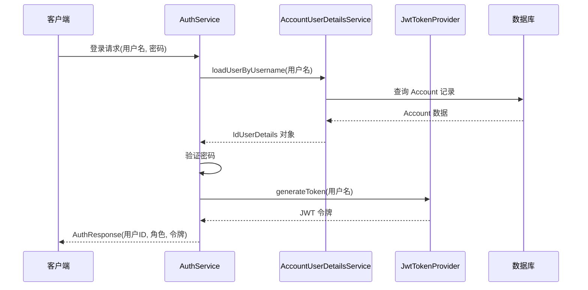
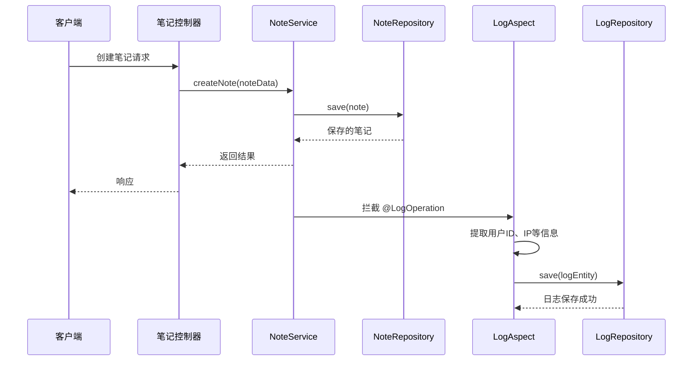
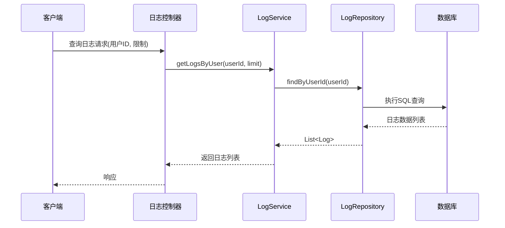

# 核心功能架构

<cite>
**本文档引用的文件**  
- [AuthService.kt](file://service/src/main/kotlin/top/zztech/ainote/service/AuthService.kt)
- [AccountUserDetailsService.kt](file://service/src/main/kotlin/top/zztech/ainote/service/AccountUserDetailsService.kt)
- [JwtTokenProvider.kt](file://runtime/src/main/kotlin/top/zztech/ainote/runtime/utility/JwtTokenProvider.kt)
- [NoteService.kt](file://service/src/main/kotlin/top/zztech/ainote/service/NoteService.kt)
- [NoteRepository.kt](file://repository/src/main/kotlin/top/zztech/ainote/repository/NoteRepository.kt)
- [LogService.kt](file://service/src/main/kotlin/top/zztech/ainote/service/LogService.kt)
- [LogRepository.kt](file://repository/src/main/kotlin/top/zztech/ainote/repository/LogRepository.kt)
- [LogOperation.kt](file://runtime/src/main/kotlin/top/zztech/ainote/runtime/annotation/LogOperation.kt)
- [LogAspect.kt](file://runtime/src/main/kotlin/top/zztech/ainote/runtime/aspect/LogAspect.kt)
- [Account.kt](file://model/src/main/kotlin/top/zztech/ainote/model/Account.kt)
- [Note.kt](file://model/src/main/kotlin/top/zztech/ainote/model/Note.kt)
- [Log.kt](file://model/src/main/kotlin/top/zztech/ainote/model/Log.kt)
</cite>

## 目录
1. [简介](#简介)
2. [认证服务实现](#认证服务实现)
3. [笔记服务实现](#笔记服务实现)
4. [日志服务实现](#日志服务实现)
5. [服务层架构与依赖注入](#服务层架构与依赖注入)

## 简介
本文档深入剖析 ainote-server 项目中核心业务逻辑层的三大服务：认证服务（AuthService）、笔记服务（NoteService）和日志服务（LogService）。文档详细阐述了各服务的实现机制、相互协作方式以及如何遵循 Spring 框架的依赖注入原则。重点分析了认证流程、数据持久化操作和基于 AOP 的日志记录机制。

## 认证服务实现

### 认证流程与组件协作
认证服务（`AuthService`）负责处理用户登录和令牌生成。其核心流程如下：
1.  接收用户凭据（用户名和密码）。
2.  委托 `AccountUserDetailsService` 从数据库加载用户信息。
3.  验证凭据的有效性。
4.  使用 `JwtTokenProvider` 生成 JWT 令牌。
5.  返回包含用户 ID、角色和令牌的 `AuthResponse`。

`AccountUserDetailsService` 实现了 Spring Security 的 `UserDetailsService` 接口，通过查询 `Account` 实体来获取用户详情，并将其封装为 `IdUserDetails` 对象。

`JwtTokenProvider` 是一个 Spring 组件，负责 JWT 令牌的生成、解析和验证。它使用配置的密钥（`jwt.secret`）对令牌进行签名，并设置过期时间（`jwt.expiration`）。

**图示来源**
- [AuthService.kt](file://service/src/main/kotlin/top/zztech/ainote/service/AuthService.kt)
- [AccountUserDetailsService.kt](file://service/src/main/kotlin/top/zztech/ainote/service/AccountUserDetailsService.kt)
- [JwtTokenProvider.kt](file://runtime/src/main/kotlin/top/zztech/ainote/runtime/utility/JwtTokenProvider.kt)
- [Account.kt](file://model/src/main/kotlin/top/zztech/ainote/model/Account.kt)

**本节来源**
- [AuthService.kt](file://service/src/main/kotlin/top/zztech/ainote/service/AuthService.kt#L1-L50)
- [AccountUserDetailsService.kt](file://service/src/main/kotlin/top/zztech/ainote/service/AccountUserDetailsService.kt#L1-L30)
- [JwtTokenProvider.kt](file://runtime/src/main/kotlin/top/zztech/ainote/runtime/utility/JwtTokenProvider.kt#L1-L50)

## 笔记服务实现

### CRUD 操作与数据持久化
笔记服务（`NoteService`）封装了对笔记（`Note`）实体的所有业务逻辑。它通过依赖注入获取 `NoteRepository` 实例，利用其提供的方法执行创建、读取、更新和删除（CRUD）操作。

`NoteRepository` 继承自 `AbstractKotlinRepository`，这是一个基于 Jimmer ORM 的通用仓库实现。它提供了基本的 CRUD 功能，并可以扩展自定义查询方法。

### 操作日志记录
为了实现操作审计，`NoteService` 中的关键方法（如创建、更新、删除笔记）使用了 `@LogOperation` 注解。该注解标记了需要记录日志的操作，包括操作类型（如 "CREATE_NOTE"）和目标实体类型。

`LogAspect` 是一个切面（Aspect），它通过 AOP（面向切面编程）技术拦截所有带有 `@LogOperation` 注解的方法。在方法执行后，`LogAspect` 会自动创建一条 `Log` 记录并保存到数据库中。它会捕获执行上下文信息，如用户 ID、IP 地址、请求方法和响应状态。

**图示来源**
- [NoteService.kt](file://service/src/main/kotlin/top/zztech/ainote/service/NoteService.kt)
- [NoteRepository.kt](file://repository/src/main/kotlin/top/zztech/ainote/repository/NoteRepository.kt)
- [LogAspect.kt](file://runtime/src/main/kotlin/top/zztech/ainote/runtime/aspect/LogAspect.kt)
- [LogOperation.kt](file://runtime/src/main/kotlin/top/zztech/ainote/runtime/annotation/LogOperation.kt)
- [Note.kt](file://model/src/main/kotlin/top/zztech/ainote/model/Note.kt)
- [Log.kt](file://model/src/main/kotlin/top/zztech/ainote/model/Log.kt)

**本节来源**
- [NoteService.kt](file://service/src/main/kotlin/top/zztech/ainote/service/NoteService.kt#L1-L60)
- [NoteRepository.kt](file://repository/src/main/kotlin/top/zztech/ainote/repository/NoteRepository.kt#L1-L27)
- [LogAspect.kt](file://runtime/src/main/kotlin/top/zztech/ainote/runtime/aspect/LogAspect.kt#L1-L159)

## 日志服务实现

### 日志查询功能
日志服务（`LogService`）为上层应用提供了查询和检索日志数据的功能。它依赖于 `LogRepository` 来执行具体的数据库查询。

`LogRepository` 提供了多个自定义查询方法，例如：
- `findByUserId(userId)`: 根据用户 ID 查询该用户的所有日志，按创建时间降序排列。
- `findLatestLogs(limit)`: 查询最新的 N 条日志记录。

`LogService` 可以直接调用这些方法，或者在其基础上添加额外的业务逻辑（如权限检查、分页处理等），然后将结果返回给控制器。

**图示来源**
- [LogService.kt](file://service/src/main/kotlin/top/zztech/ainote/service/LogService.kt)
- [LogRepository.kt](file://repository/src/main/kotlin/top/zztech/ainote/repository/LogRepository.kt)
- [Log.kt](file://model/src/main/kotlin/top/zztech/ainote/model/Log.kt)

**本节来源**
- [LogService.kt](file://service/src/main/kotlin/top/zztech/ainote/service/LogService.kt#L1-L40)
- [LogRepository.kt](file://repository/src/main/kotlin/top/zztech/ainote/repository/LogRepository.kt#L1-L54)

## 服务层架构与依赖注入

### 分层架构与职责分离
本项目遵循典型的分层架构模式：
- **模型层 (model)**: 定义数据实体（如 `Account`, `Note`, `Log`），使用注解描述其与数据库表的映射关系。
- **数据访问层 (repository)**: 提供对数据库的访问接口，封装了数据持久化逻辑。
- **业务逻辑层 (service)**: 实现核心业务规则，协调数据访问层和运行时组件。
- **运行时组件 (runtime)**: 包含安全工具（`JwtTokenProvider`）、AOP 切面（`LogAspect`）、DTO 等跨领域功能。

### 依赖注入原则
服务层严格遵循 Spring 的依赖注入（DI）原则。每个服务类通过构造函数注入其依赖项，这使得代码更加模块化、可测试和松耦合。

例如：
- `AuthService` 注入了 `AccountUserDetailsService` 和 `JwtTokenProvider`。
- `NoteService` 注入了 `NoteRepository`。
- `LogAspect` 注入了 `KSqlClient` 用于直接保存日志。

这种设计确保了服务层不直接创建其依赖项，而是由 Spring 容器负责管理和注入，从而实现了控制反转（IoC）。

**本节来源**
- [AuthService.kt](file://service/src/main/kotlin/top/zztech/ainote/service/AuthService.kt)
- [NoteService.kt](file://service/src/main/kotlin/top/zztech/ainote/service/NoteService.kt)
- [LogService.kt](file://service/src/main/kotlin/top/zztech/ainote/service/LogService.kt)
- [LogAspect.kt](file://runtime/src/main/kotlin/top/zztech/ainote/runtime/aspect/LogAspect.kt)