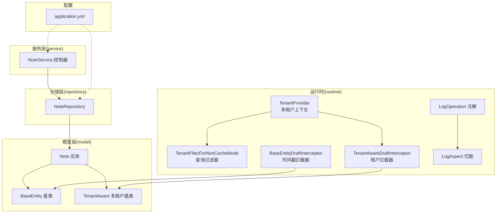
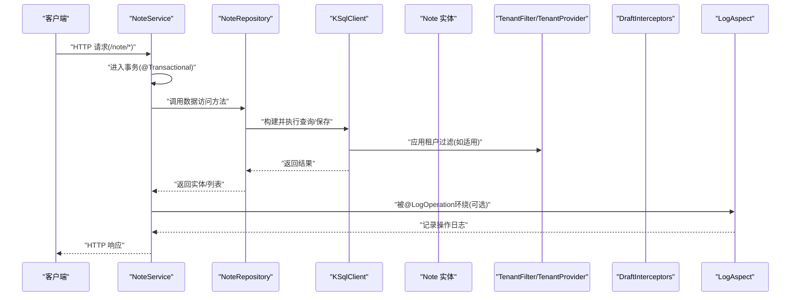
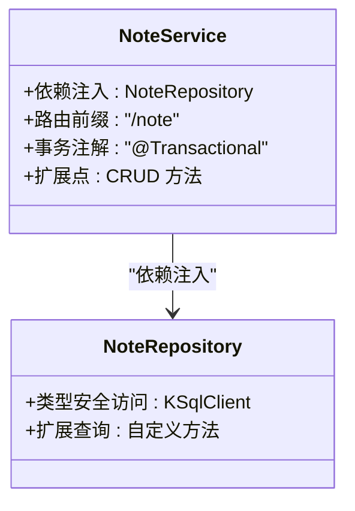
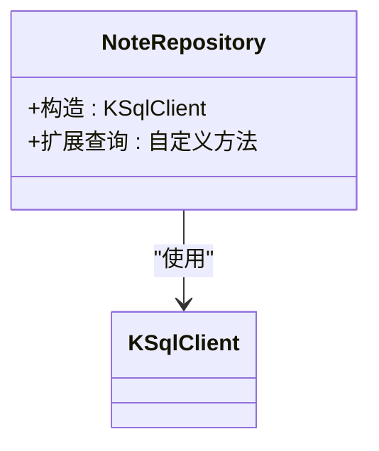
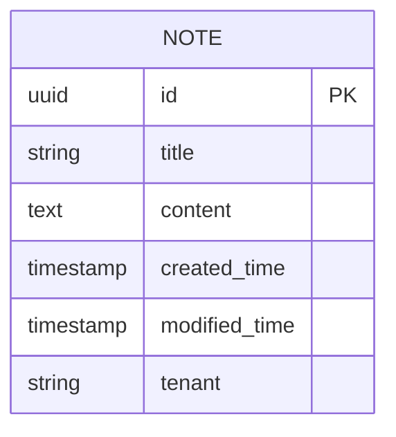
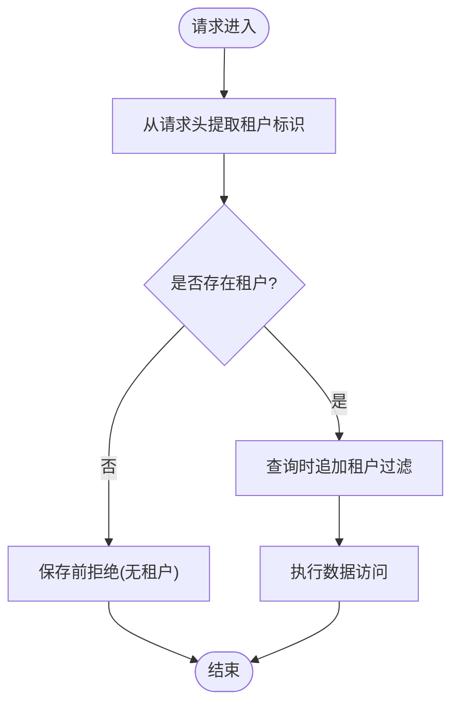
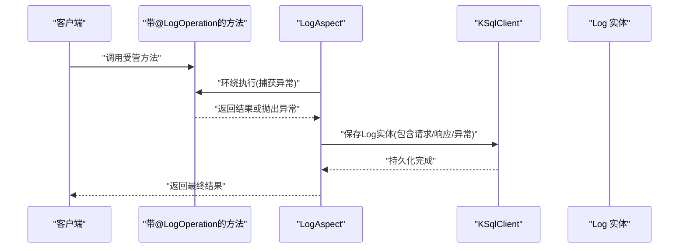
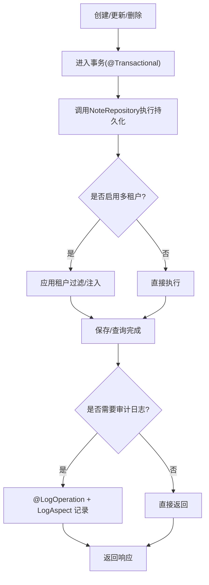
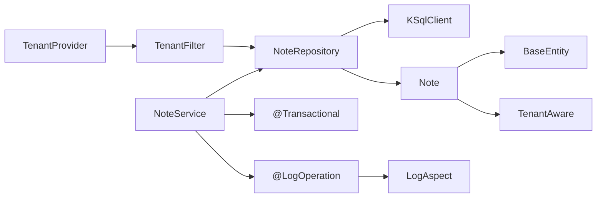

# 笔记服务架构

<cite>
**本文引用的文件**
- [NoteService.kt](file://service/src/main/kotlin/top/zztech/ainote/service/NoteService.kt)
- [NoteRepository.kt](file://repository/src/main/kotlin/top/zztech/ainote/repository/NoteRepository.kt)
- [Note.kt](file://model/src/main/kotlin/top/zztech/ainote/model/Note.kt)
- [BaseEntity.kt](file://model/src/main/kotlin/top/zztech/ainote/model/common/BaseEntity.kt)
- [TenantAware.kt](file://model/src/main/kotlin/top/zztech/ainote/model/common/TenantAware.kt)
- [TenantProvider.kt](file://runtime/src/main/kotlin/top/zztech/ainote/runtime/TenantProvider.kt)
- [TenantFilterForNonCacheMode.kt](file://runtime/src/main/kotlin/top/zztech/ainote/runtime/filter/TenantFilterForNonCacheMode.kt)
- [BaseEntityDraftInterceptor.kt](file://runtime/src/main/kotlin/top/zztech/ainote/runtime/interceptor/BaseEntityDraftInterceptor.kt)
- [TenantAwareDraftInterceptor.kt](file://runtime/src/main/kotlin/top/zztech/ainote/runtime/interceptor/TenantAwareDraftInterceptor.kt)
- [LogOperation.kt](file://runtime/src/main/kotlin/top/zztech/ainote/runtime/annotation/LogOperation.kt)
- [LogAspect.kt](file://runtime/src/main/kotlin/top/zztech/ainote/runtime/aspect/LogAspect.kt)
- [application.yml](file://service/src/main/resources/application.yml)
</cite>

## 目录
1. [引言](#引言)
2. [项目结构](#项目结构)
3. [核心组件](#核心组件)
4. [架构总览](#架构总览)
5. [详细组件分析](#详细组件分析)
6. [依赖分析](#依赖分析)
7. [性能考虑](#性能考虑)
8. [故障排查指南](#故障排查指南)
9. [结论](#结论)
10. [附录](#附录)

## 引言
本文件围绕笔记服务NoteService展开，系统性阐述其作为笔记管理核心组件的设计与实现要点。尽管当前NoteService类体为空，但基于项目架构惯例与依赖注入模式，可合理推断其未来将通过依赖注入获取NoteRepository实例以执行数据持久化操作；同时，结合Spring事务注解、Jimmer ORM特性、多租户上下文与操作日志切面，形成完整的数据一致性、隔离与可观测性保障体系。本文将从系统架构、组件关系、数据流、处理逻辑、集成点、错误处理与性能特征等维度进行深入解析，并提供面向非技术读者的可读性说明与可视化图示。

## 项目结构
该项目采用按职责分层与领域模型驱动的组织方式：
- model：定义领域实体与通用基类（含时间戳与多租户字段），以及枚举与公共实体。
- repository：基于Jimmer Kotlin Repository封装数据访问层，提供类型安全的查询与保存能力。
- runtime：运行时基础设施，包括多租户上下文、过滤器、拦截器、AOP日志切面与安全工具等。
- service：业务服务层，当前NoteService作为REST控制器示例，承载未来CRUD接口与业务编排。
- 配置：Spring Boot应用配置，包含数据库、Redis、Jimmer客户端与OpenAPI等。

图表来源
- [NoteService.kt](file://service/src/main/kotlin/top/zztech/ainote/service/NoteService.kt#L25-L31)
- [NoteRepository.kt](file://repository/src/main/kotlin/top/zztech/ainote/repository/NoteRepository.kt#L14-L26)
- [Note.kt](file://model/src/main/kotlin/top/zztech/ainote/model/Note.kt#L13-L29)
- [BaseEntity.kt](file://model/src/main/kotlin/top/zztech/ainote/model/common/BaseEntity.kt#L7-L30)
- [TenantAware.kt](file://model/src/main/kotlin/top/zztech/ainote/model/common/TenantAware.kt#L1-L17)
- [TenantProvider.kt](file://runtime/src/main/kotlin/top/zztech/ainote/runtime/TenantProvider.kt#L1-L16)
- [TenantFilterForNonCacheMode.kt](file://runtime/src/main/kotlin/top/zztech/ainote/runtime/filter/TenantFilterForNonCacheMode.kt#L12-L25)
- [BaseEntityDraftInterceptor.kt](file://runtime/src/main/kotlin/top/zztech/ainote/runtime/interceptor/BaseEntityDraftInterceptor.kt#L1-L23)
- [TenantAwareDraftInterceptor.kt](file://runtime/src/main/kotlin/top/zztech/ainote/runtime/interceptor/TenantAwareDraftInterceptor.kt#L1-L22)
- [LogOperation.kt](file://runtime/src/main/kotlin/top/zztech/ainote/runtime/annotation/LogOperation.kt#L21-L29)
- [LogAspect.kt](file://runtime/src/main/kotlin/top/zztech/ainote/runtime/aspect/LogAspect.kt#L32-L159)
- [application.yml](file://service/src/main/resources/application.yml#L1-L57)

章节来源
- [application.yml](file://service/src/main/resources/application.yml#L1-L57)

## 核心组件
- NoteService：当前为REST控制器示例，使用依赖注入持有NoteRepository实例，标注事务注解以确保数据一致性，并通过@RequestMapping定义统一路径前缀。
- NoteRepository：基于Jimmer Kotlin Repository抽象类，提供类型安全的数据访问能力，可扩展自定义查询。
- Note实体：采用Jimmer@Entity声明，具备主键、唯一键约束与关键字段；继承BaseEntity与TenantAware，天然具备时间戳与多租户能力。
- TenantProvider：从HTTP请求头中提取租户标识，作为多租户上下文来源。
- TenantFilterForNonCacheMode：在查询阶段对实现TenantAware的实体自动追加租户过滤条件。
- 拦截器：BaseEntityDraftInterceptor负责自动填充创建/修改时间；TenantAwareDraftInterceptor负责在保存前注入租户值。
- LogOperation与LogAspect：通过注解与AOP切面实现操作日志的自动记录，覆盖请求/响应信息与异常场景。

章节来源
- [NoteService.kt](file://service/src/main/kotlin/top/zztech/ainote/service/NoteService.kt#L25-L31)
- [NoteRepository.kt](file://repository/src/main/kotlin/top/zztech/ainote/repository/NoteRepository.kt#L14-L26)
- [Note.kt](file://model/src/main/kotlin/top/zztech/ainote/model/Note.kt#L13-L29)
- [TenantProvider.kt](file://runtime/src/main/kotlin/top/zztech/ainote/runtime/TenantProvider.kt#L1-L16)
- [TenantFilterForNonCacheMode.kt](file://runtime/src/main/kotlin/top/zztech/ainote/runtime/filter/TenantFilterForNonCacheMode.kt#L12-L25)
- [BaseEntityDraftInterceptor.kt](file://runtime/src/main/kotlin/top/zztech/ainote/runtime/interceptor/BaseEntityDraftInterceptor.kt#L1-L23)
- [TenantAwareDraftInterceptor.kt](file://runtime/src/main/kotlin/top/zztech/ainote/runtime/interceptor/TenantAwareDraftInterceptor.kt#L1-L22)
- [LogOperation.kt](file://runtime/src/main/kotlin/top/zztech/ainote/runtime/annotation/LogOperation.kt#L21-L29)
- [LogAspect.kt](file://runtime/src/main/kotlin/top/zztech/ainote/runtime/aspect/LogAspect.kt#L32-L159)

## 架构总览
下图展示NoteService与其依赖组件之间的交互关系，以及多租户与日志记录的关键路径。

图表来源
- [NoteService.kt](file://service/src/main/kotlin/top/zztech/ainote/service/NoteService.kt#L25-L31)
- [NoteRepository.kt](file://repository/src/main/kotlin/top/zztech/ainote/repository/NoteRepository.kt#L14-L26)
- [TenantFilterForNonCacheMode.kt](file://runtime/src/main/kotlin/top/zztech/ainote/runtime/filter/TenantFilterForNonCacheMode.kt#L12-L25)
- [TenantProvider.kt](file://runtime/src/main/kotlin/top/zztech/ainote/runtime/TenantProvider.kt#L1-L16)
- [LogAspect.kt](file://runtime/src/main/kotlin/top/zztech/ainote/runtime/aspect/LogAspect.kt#L32-L159)

## 详细组件分析

### NoteService 组件分析
- 角色定位：作为REST控制器示例，承担未来CRUD接口的入口职责；通过构造函数参数注入NoteRepository，遵循依赖注入原则。
- 路由设计：使用@RestController与@RequestMapping("/note")统一暴露REST端点，便于前端或其他客户端调用。
- 事务控制：标注@Transactional，确保单个请求内的数据变更原子性，避免部分提交导致的数据不一致。
- 扩展建议：未来可在类体内添加GET/POST/PUT/DELETE等方法，并结合@LogOperation注解与LogAspect实现操作审计。

图表来源
- [NoteService.kt](file://service/src/main/kotlin/top/zztech/ainote/service/NoteService.kt#L25-L31)
- [NoteRepository.kt](file://repository/src/main/kotlin/top/zztech/ainote/repository/NoteRepository.kt#L14-L26)

章节来源
- [NoteService.kt](file://service/src/main/kotlin/top/zztech/ainote/service/NoteService.kt#L25-L31)

### NoteRepository 组件分析
- 类型安全：基于Jimmer Kotlin Repository抽象类，提供类型安全的实体操作能力。
- 可扩展性：可在类内添加自定义查询方法，利用KSqlClient DSL构建复杂查询。
- 示例位置：类体中已预留扩展区域，便于后续加入findByTitleContaining等查询方法。

图表来源
- [NoteRepository.kt](file://repository/src/main/kotlin/top/zztech/ainote/repository/NoteRepository.kt#L14-L26)

章节来源
- [NoteRepository.kt](file://repository/src/main/kotlin/top/zztech/ainote/repository/NoteRepository.kt#L14-L26)

### Note 实体与数据库映射
- 实体声明：使用@Entity与KeyUniqueConstraint(noMoreUniqueConstraints=true, isNullNotDistinct=true)，明确主键与唯一约束策略。
- 主键与字段：id为主键且自动生成，title为键字段，content为可空内容字段。
- 继承关系：实现BaseEntity（含createdTime/modifiedTime）与TenantAware（含tenant），天然具备审计与多租户能力。
- 映射关系：Jimmer ORM将实体属性映射到数据库表列，唯一键约束与生成策略由注解声明。

图表来源
- [Note.kt](file://model/src/main/kotlin/top/zztech/ainote/model/Note.kt#L13-L29)
- [BaseEntity.kt](file://model/src/main/kotlin/top/zztech/ainote/model/common/BaseEntity.kt#L7-L30)
- [TenantAware.kt](file://model/src/main/kotlin/top/zztech/ainote/model/common/TenantAware.kt#L1-L17)

章节来源
- [Note.kt](file://model/src/main/kotlin/top/zztech/ainote/model/Note.kt#L13-L29)
- [BaseEntity.kt](file://model/src/main/kotlin/top/zztech/ainote/model/common/BaseEntity.kt#L7-L30)
- [TenantAware.kt](file://model/src/main/kotlin/top/zztech/ainote/model/common/TenantAware.kt#L1-L17)

### 多租户上下文与数据隔离
- 上下文提供：TenantProvider从HTTP请求头tenant中提取租户标识，若为空则返回null。
- 查询过滤：TenantFilterForNonCacheMode在过滤阶段对实现TenantAware的实体追加where(table.tenant eq tenant)条件，确保查询结果仅限当前租户。
- 保存拦截：TenantAwareDraftInterceptor在保存前检查是否已加载tenant，未加载则从TenantProvider注入；若未知则抛出错误，防止无租户数据写入。
- 时间戳拦截：BaseEntityDraftInterceptor在插入/更新时自动填充createdTime/modifiedTime，保证审计信息完整。

图表来源
- [TenantProvider.kt](file://runtime/src/main/kotlin/top/zztech/ainote/runtime/TenantProvider.kt#L1-L16)
- [TenantFilterForNonCacheMode.kt](file://runtime/src/main/kotlin/top/zztech/ainote/runtime/filter/TenantFilterForNonCacheMode.kt#L12-L25)
- [TenantAwareDraftInterceptor.kt](file://runtime/src/main/kotlin/top/zztech/ainote/runtime/interceptor/TenantAwareDraftInterceptor.kt#L1-L22)
- [BaseEntityDraftInterceptor.kt](file://runtime/src/main/kotlin/top/zztech/ainote/runtime/interceptor/BaseEntityDraftInterceptor.kt#L1-L23)

章节来源
- [TenantProvider.kt](file://runtime/src/main/kotlin/top/zztech/ainote/runtime/TenantProvider.kt#L1-L16)
- [TenantFilterForNonCacheMode.kt](file://runtime/src/main/kotlin/top/zztech/ainote/runtime/filter/TenantFilterForNonCacheMode.kt#L12-L25)
- [TenantAwareDraftInterceptor.kt](file://runtime/src/main/kotlin/top/zztech/ainote/runtime/interceptor/TenantAwareDraftInterceptor.kt#L1-L22)
- [BaseEntityDraftInterceptor.kt](file://runtime/src/main/kotlin/top/zztech/ainote/runtime/interceptor/BaseEntityDraftInterceptor.kt#L1-L23)

### 操作日志记录与审计
- 注解定义：LogOperation用于标记需要记录日志的方法，支持指定动作、实体类型与是否包含请求/响应信息。
- 切面实现：LogAspect通过@Around拦截带@LogOperation的方法，在方法执行前后收集请求/响应与异常信息，并保存到日志实体中。
- 数据来源：切面从请求上下文中提取IP、User-Agent、请求方法与URL，从安全上下文提取操作用户ID，从方法参数或返回对象中提取实体ID。

图表来源
- [LogOperation.kt](file://runtime/src/main/kotlin/top/zztech/ainote/runtime/annotation/LogOperation.kt#L21-L29)
- [LogAspect.kt](file://runtime/src/main/kotlin/top/zztech/ainote/runtime/aspect/LogAspect.kt#L32-L159)

章节来源
- [LogOperation.kt](file://runtime/src/main/kotlin/top/zztech/ainote/runtime/annotation/LogOperation.kt#L21-L29)
- [LogAspect.kt](file://runtime/src/main/kotlin/top/zztech/ainote/runtime/aspect/LogAspect.kt#L32-L159)

### CRUD方法结构推断与最佳实践
基于当前类体与项目架构惯例，NoteService未来可能实现的CRUD方法结构如下：
- 创建：POST /note，接收Note输入，调用Repository保存，返回新建实体。
- 查询列表：GET /note，支持分页与过滤（可结合TenantFilter），返回Note列表。
- 查询详情：GET /note/{id}，根据主键获取Note，支持FetchBy选择性加载关联。
- 更新：PUT /note/{id}，接收部分更新，调用Repository保存。
- 删除：DELETE /note/{id}，删除对应实体。
- 事务边界：每个方法均处于同一事务中，确保批量操作的一致性。
- 审计与日志：对关键方法使用@LogOperation，配合LogAspect自动记录。

图表来源
- [NoteService.kt](file://service/src/main/kotlin/top/zztech/ainote/service/NoteService.kt#L25-L31)
- [NoteRepository.kt](file://repository/src/main/kotlin/top/zztech/ainote/repository/NoteRepository.kt#L14-L26)
- [TenantFilterForNonCacheMode.kt](file://runtime/src/main/kotlin/top/zztech/ainote/runtime/filter/TenantFilterForNonCacheMode.kt#L12-L25)
- [LogOperation.kt](file://runtime/src/main/kotlin/top/zztech/ainote/runtime/annotation/LogOperation.kt#L21-L29)
- [LogAspect.kt](file://runtime/src/main/kotlin/top/zztech/ainote/runtime/aspect/LogAspect.kt#L32-L159)

## 依赖分析
- 组件耦合：NoteService与NoteRepository之间为松耦合的依赖注入关系；Repository与Jimmer KSqlClient强耦合，但通过抽象类封装降低上层复杂度。
- 外部依赖：Spring Web（REST）、Spring Transaction（事务）、Jimmer ORM（类型安全查询与映射）、AOP（日志切面）、OpenAPI（客户端SDK生成）。
- 循环依赖：当前结构未见循环依赖迹象；多租户过滤器与拦截器通过运行时装配，避免编译期循环。
- 接口契约：NoteRepository继承AbstractKotlinRepository，约定统一的实体类型与主键类型，便于扩展与测试。

图表来源
- [NoteService.kt](file://service/src/main/kotlin/top/zztech/ainote/service/NoteService.kt#L25-L31)
- [NoteRepository.kt](file://repository/src/main/kotlin/top/zztech/ainote/repository/NoteRepository.kt#L14-L26)
- [Note.kt](file://model/src/main/kotlin/top/zztech/ainote/model/Note.kt#L13-L29)
- [BaseEntity.kt](file://model/src/main/kotlin/top/zztech/ainote/model/common/BaseEntity.kt#L7-L30)
- [TenantAware.kt](file://model/src/main/kotlin/top/zztech/ainote/model/common/TenantAware.kt#L1-L17)
- [TenantProvider.kt](file://runtime/src/main/kotlin/top/zztech/ainote/runtime/TenantProvider.kt#L1-L16)
- [TenantFilterForNonCacheMode.kt](file://runtime/src/main/kotlin/top/zztech/ainote/runtime/filter/TenantFilterForNonCacheMode.kt#L12-L25)
- [LogOperation.kt](file://runtime/src/main/kotlin/top/zztech/ainote/runtime/annotation/LogOperation.kt#L21-L29)
- [LogAspect.kt](file://runtime/src/main/kotlin/top/zztech/ainote/runtime/aspect/LogAspect.kt#L32-L159)

章节来源
- [NoteService.kt](file://service/src/main/kotlin/top/zztech/ainote/service/NoteService.kt#L25-L31)
- [NoteRepository.kt](file://repository/src/main/kotlin/top/zztech/ainote/repository/NoteRepository.kt#L14-L26)
- [LogAspect.kt](file://runtime/src/main/kotlin/top/zztech/ainote/runtime/aspect/LogAspect.kt#L32-L159)

## 性能考虑
- 查询优化策略
  - 使用Jimmer的偏移优化阈值配置，减少大偏移量查询的开销。
  - 合理使用唯一键与索引，避免全表扫描；Note实体已声明唯一键约束，建议在数据库层面建立相应索引。
  - 在高频查询场景下，优先使用投影查询与选择性加载，减少不必要的字段传输。
- 事务与锁
  - 将短事务置于@LogOperation环绕范围内，避免长事务阻塞；对热点数据使用合适的隔离级别。
- 缓存与过滤
  - 多租户过滤器在查询阶段生效，避免跨租户数据泄露的同时也减少了无效扫描。
- 日志开销
  - 审计日志异步化或批量落盘，避免阻塞主业务流程。

[本节为通用性能指导，不直接分析具体文件]

## 故障排查指南
- 租户缺失
  - 现象：保存TenantAware实体时报错。
  - 原因：TenantProvider无法从请求头提取tenant，TenantAwareDraftInterceptor拒绝保存。
  - 处理：确保请求头包含tenant且非空，或在网关/中间件正确注入。
- 查询越权
  - 现象：查询不到数据或返回了其他租户数据。
  - 原因：未设置tenant或过滤器未生效。
  - 处理：确认TenantFilterForNonCacheMode已注册，请求头tenant有效。
- 日志未记录
  - 现象：@LogOperation未产生审计日志。
  - 原因：切面未织入或异常被捕获后未抛出。
  - 处理：检查AOP代理与注解使用，确保方法可见性与调用链正确。
- 事务回滚
  - 现象：部分操作失败导致数据不一致。
  - 原因：未在@LogOperation环绕范围内或异常未抛出。
  - 处理：确保方法处于同一事务，异常向上抛出以便触发回滚。

章节来源
- [TenantAwareDraftInterceptor.kt](file://runtime/src/main/kotlin/top/zztech/ainote/runtime/interceptor/TenantAwareDraftInterceptor.kt#L1-L22)
- [TenantFilterForNonCacheMode.kt](file://runtime/src/main/kotlin/top/zztech/ainote/runtime/filter/TenantFilterForNonCacheMode.kt#L12-L25)
- [LogAspect.kt](file://runtime/src/main/kotlin/top/zztech/ainote/runtime/aspect/LogAspect.kt#L32-L159)

## 结论
NoteService作为笔记管理的核心入口，依托Spring依赖注入与Jimmer ORM实现了类型安全、可扩展的数据访问；通过@LogOperation与LogAspect提供了完善的审计能力；借助TenantProvider与TenantFilter/TenantAwareDraftInterceptor，实现了多租户隔离与数据一致性保障。尽管当前类体为空，但基于现有架构，可顺畅扩展CRUD接口并保持高内聚、低耦合的设计风格。

[本节为总结性内容，不直接分析具体文件]

## 附录
- 配置要点
  - 数据源与Redis：通过application.yml集中配置，支持环境变量覆盖。
  - OpenAPI：Jimmer客户端TS/OpenAPI导出路径已在配置中声明，便于前端对接。
  - 安全：JWT相关配置位于同目录下的配置文件中，与本服务协同工作。

章节来源
- [application.yml](file://service/src/main/resources/application.yml#L1-L57)