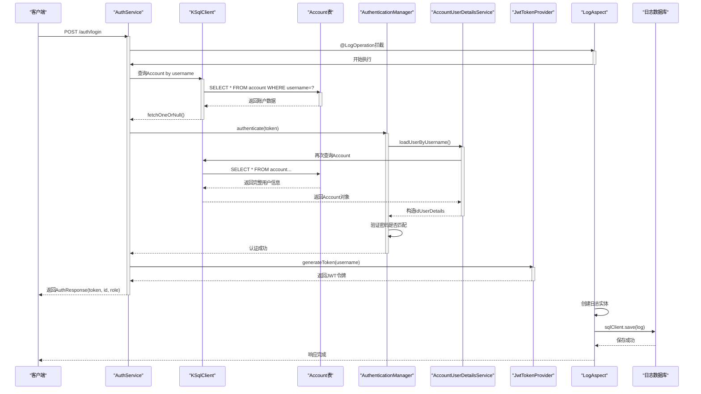

# 认证服务架构

<cite>
**本文档引用的文件**  
- [AuthService.kt](file://service/src/main/kotlin/top/zztech/ainote/service/AuthService.kt)
- [AccountUserDetailsService.kt](file://service/src/main/kotlin/top/zztech/ainote/service/AccountUserDetailsService.kt)
- [JwtTokenProvider.kt](file://runtime/src/main/kotlin/top/zztech/ainote/runtime/utility/JwtTokenProvider.kt)
- [JwtSecurityConfig.kt](file://service/src/main/kotlin/top/zztech/ainote/cfg/JwtSecurityConfig.kt)
- [LogAspect.kt](file://runtime/src/main/kotlin/top/zztech/ainote/runtime/aspect/LogAspect.kt)
- [LogOperation.kt](file://runtime/src/main/kotlin/top/zztech/ainote/runtime/annotation/LogOperation.kt)
- [Account.kt](file://model/src/main/kotlin/top/zztech/ainote/model/Account.kt)
- [AccountError.kt](file://service/src/main/kotlin/top/zztech/ainote/error/AccountError.kt)
</cite>

## 目录
1. [简介](#简介)
2. [核心组件分析](#核心组件分析)
3. [认证流程详解](#认证流程详解)
4. [JWT令牌机制](#jwt令牌机制)
5. [密码加密与安全配置](#密码加密与安全配置)
6. [API端点工作流程](#api端点工作流程)
7. [异常处理与事务管理](#异常处理与事务管理)
8. [操作日志记录机制](#操作日志记录机制)
9. [登录流程序列图](#登录流程序列图)
10. [结论](#结论)

## 简介
本文档深入剖析`AuthService`服务的实现机制，详细解释其如何通过`KSqlClient`与`Account`实体交互进行用户身份验证，并集成Spring Security的`AuthenticationManager`完成认证流程。同时阐述`JwtTokenProvider`在生成和验证JWT令牌中的作用，以及`PasswordEncoder`在密码加密过程中的集成方式。结合代码逻辑，展示`/login`和`/register`两个API端点的工作流程，包括异常处理和事务管理机制。此外，说明`@LogOperation`注解如何自动记录登录和注册操作日志，并揭示其与`LogAspect`切面的协作关系。

## 核心组件分析

本节分析认证服务中涉及的核心组件及其职责。

### AuthService
`AuthService`是提供用户认证功能的REST控制器，暴露`/auth/login`和`/auth/register`接口。它依赖于`KSqlClient`进行数据库操作，使用`AuthenticationManager`执行Spring Security认证流程，并通过`JwtTokenProvider`生成JWT令牌。

**Section sources**  
- [AuthService.kt](file://service/src/main/kotlin/top/zztech/ainote/service/AuthService.kt#L38-L90)

### AccountUserDetailsService
该服务实现了Spring Security的`UserDetailsService`接口，负责根据用户名从数据库加载用户信息。它通过`KSqlClient`查询`Account`实体，并将其转换为Spring Security所需的`UserDetails`对象。

**Section sources**  
- [AccountUserDetailsService.kt](file://service/src/main/kotlin/top/zztech/ainote/service/AccountUserDetailsService.kt#L27-L54)

### JwtTokenProvider
`JwtTokenProvider`组件用于生成、解析和验证JWT令牌。它使用配置的密钥对令牌进行签名，并提供方法从JWT中提取用户名及验证令牌有效性。

**Section sources**  
- [JwtTokenProvider.kt](file://runtime/src/main/kotlin/top/zztech/ainote/runtime/utility/JwtTokenProvider.kt#L12-L50)

### JwtSecurityConfig
此配置类定义了Spring Security的安全策略，包括禁用CSRF、表单登录、HTTP基本认证，启用无状态会话，并注册`JwtAuthenticationFilter`作为前置过滤器以拦截请求并验证JWT令牌。

**Section sources**  
- [JwtSecurityConfig.kt](file://service/src/main/kotlin/top/zztech/ainote/cfg/JwtSecurityConfig.kt#L23-L69)

## 认证流程详解

当用户发起登录请求时，`AuthService`首先通过`KSqlClient`查询`Account`实体是否存在指定用户名的账户。若不存在，则抛出`AccountException`异常。

随后，调用`AuthenticationManager.authenticate()`方法，传入`UsernamePasswordAuthenticationToken`，触发Spring Security的认证机制。该机制会调用`AccountUserDetailsService.loadUserByUsername()`方法获取用户详情，并比对密码（已加密存储）是否匹配。

认证成功后，服务将调用`JwtTokenProvider.generateToken()`生成JWT令牌，并封装`AuthResponse`返回给客户端。

**Section sources**  
- [AuthService.kt](file://service/src/main/kotlin/top/zztech/ainote/service/AuthService.kt#L54-L72)
- [AccountUserDetailsService.kt](file://service/src/main/kotlin/top/zztech/ainote/service/AccountUserDetailsService.kt#L31-L54)

## JWT令牌机制

`JwtTokenProvider`利用`io.jsonwebtoken`库实现JWT的生成与验证。其构造函数接收`jwt.secret`和`jwt.expiration`两个配置项，分别用于生成HMAC密钥和设置令牌有效期。

- `generateToken(username)`：创建包含用户名、签发时间、过期时间的JWT，并使用密钥签名。
- `getUsernameFromJWT(token)`：解析JWT载荷，提取`subject`字段（即用户名）。
- `validateToken(token)`：尝试解析并验证签名和过期时间，若失败则返回`false`。

该机制确保了令牌的安全性和可验证性。

**Section sources**  
- [JwtTokenProvider.kt](file://runtime/src/main/kotlin/top/zztech/ainote/runtime/utility/JwtTokenProvider.kt#L12-L50)

## 密码加密与安全配置

系统采用`BCryptPasswordEncoder`对用户密码进行哈希加密。在注册过程中，`AuthService.register()`方法调用`passwordEncoder.encode(input.password)`对明文密码加密后再持久化到数据库。

`JwtSecurityConfig`中通过`@Bean`方法注入`PasswordEncoder`实例，确保Spring Security在认证时使用相同的编码器进行密码比对。

这种设计符合安全最佳实践，避免明文存储密码。

**Section sources**  
- [JwtSecurityConfig.kt](file://service/src/main/kotlin/top/zztech/ainote/cfg/JwtSecurityConfig.kt#L65-L68)
- [AuthService.kt](file://service/src/main/kotlin/top/zztech/ainote/service/AuthService.kt#L83)

## API端点工作流程

### 登录端点 `/auth/login`
1. 接收`LoginInput`参数（用户名、密码）
2. 使用`KSqlClient`查询`Account`是否存在该用户名
3. 若不存在，抛出`usernameDoesNotExist`异常
4. 调用`AuthenticationManager.authenticate()`进行认证
5. 认证成功后生成JWT令牌
6. 返回`AuthResponse`包含用户ID、角色和令牌

### 注册端点 `/auth/register`
1. 接收`RegisterInput`参数（用户名、密码、邮箱等）
2. 使用`passwordEncoder.encode()`加密密码
3. 调用`sql.save()`将用户数据插入数据库
4. 若用户名已存在，捕获`SaveException.NotUnique`并抛出`usernameAlreadyExists`异常

两个端点均使用`@Transactional`注解确保数据库操作的原子性。

**Section sources**  
- [AuthService.kt](file://service/src/main/kotlin/top/zztech/ainote/service/AuthService.kt#L51-L89)

## 异常处理与事务管理

系统通过自定义异常类`AccountException`处理业务异常。`AccountError`枚举定义了`USERNAME_ALREADY_EXISTS`和`USERNAME_DOES_NOT_EXIST`两种错误类型。

在注册过程中，若数据库约束违反（用户名唯一性），会抛出`SaveException.NotUnique`，被捕获后转换为`AccountException.usernameAlreadyExists()`。

登录时若用户不存在，则直接抛出`AccountException.usernameDoesNotExist()`。

所有写操作均标注`@Transactional`，确保数据一致性。

**Section sources**  
- [AuthService.kt](file://service/src/main/kotlin/top/zztech/ainote/service/AuthService.kt#L86-L88)
- [AccountError.kt](file://service/src/main/kotlin/top/zztech/ainote/error/AccountError.kt#L8-L11)

## 操作日志记录机制

`@LogOperation`是一个自定义注解，用于标记需要记录操作日志的方法。其参数包括：
- `action`：操作类型（如"LOGIN"、"REGISTER"）
- `entityType`：操作的实体类型（如"Account"）
- `includeRequest`：是否包含请求信息
- `includeResponse`：是否包含响应状态

`LogAspect`是一个AOP切面，通过`@Around("@annotation(LogOperation)")`拦截所有标记该注解的方法。在方法执行前后：
- 执行目标方法（`proceed()`）
- 捕获执行结果或异常
- 从`SecurityContext`获取当前用户ID
- 从HTTP请求中提取IP、User-Agent、URL等信息
- 构造`Log`实体并通过`KSqlClient`保存

此机制实现了登录和注册操作的自动日志记录。

**Section sources**  
- [LogOperation.kt](file://runtime/src/main/kotlin/top/zztech/ainote/runtime/annotation/LogOperation.kt#L23-L28)
- [LogAspect.kt](file://runtime/src/main/kotlin/top/zztech/ainote/runtime/aspect/LogAspect.kt#L32-L158)

## 登录流程序列图

**Diagram sources**  
- [AuthService.kt](file://service/src/main/kotlin/top/zztech/ainote/service/AuthService.kt#L54-L72)
- [LogAspect.kt](file://runtime/src/main/kotlin/top/zztech/ainote/runtime/aspect/LogAspect.kt#L40-L67)

## 结论

`AuthService`通过紧密集成`KSqlClient`、Spring Security和JWT技术栈，构建了一个安全、可扩展的认证系统。其核心流程包括：
- 使用`KSqlClient`与`Account`实体交互实现数据持久化
- 借助`AuthenticationManager`和`AccountUserDetailsService`完成标准认证
- 利用`JwtTokenProvider`生成和验证无状态令牌
- 通过`BCryptPasswordEncoder`保障密码安全
- 运用`@LogOperation`与`LogAspect`实现自动化操作审计

整个系统设计遵循关注点分离原则，各组件职责清晰，具备良好的可维护性和安全性。