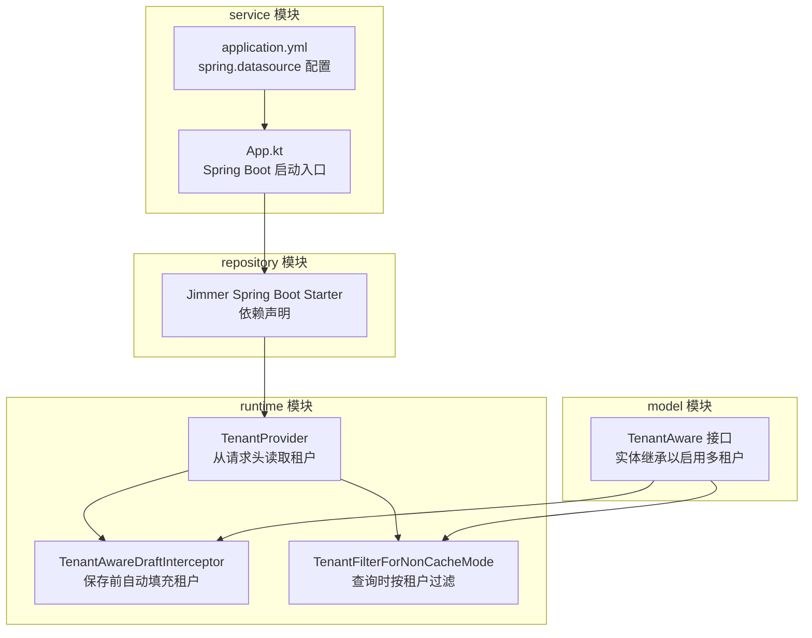
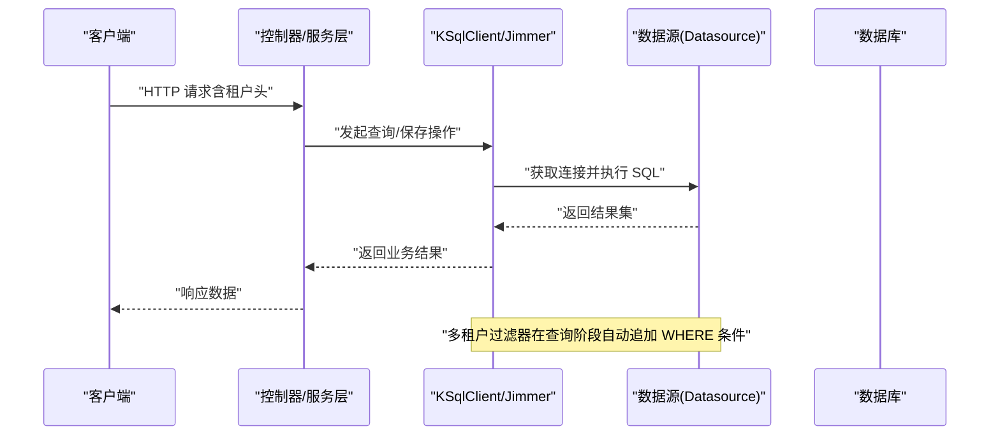
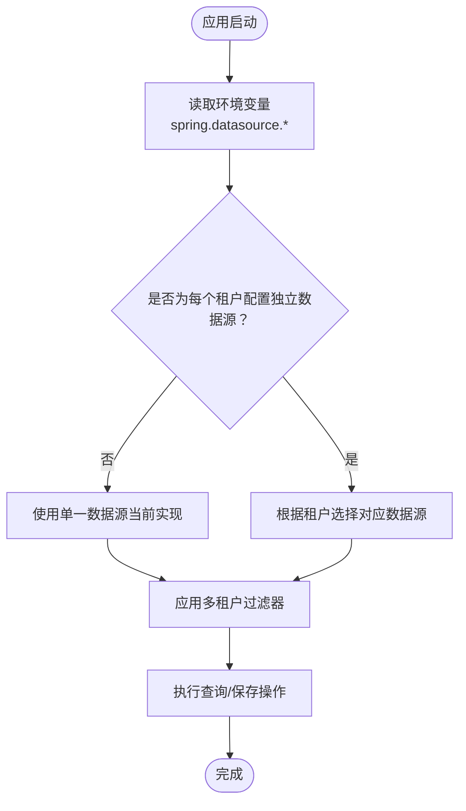
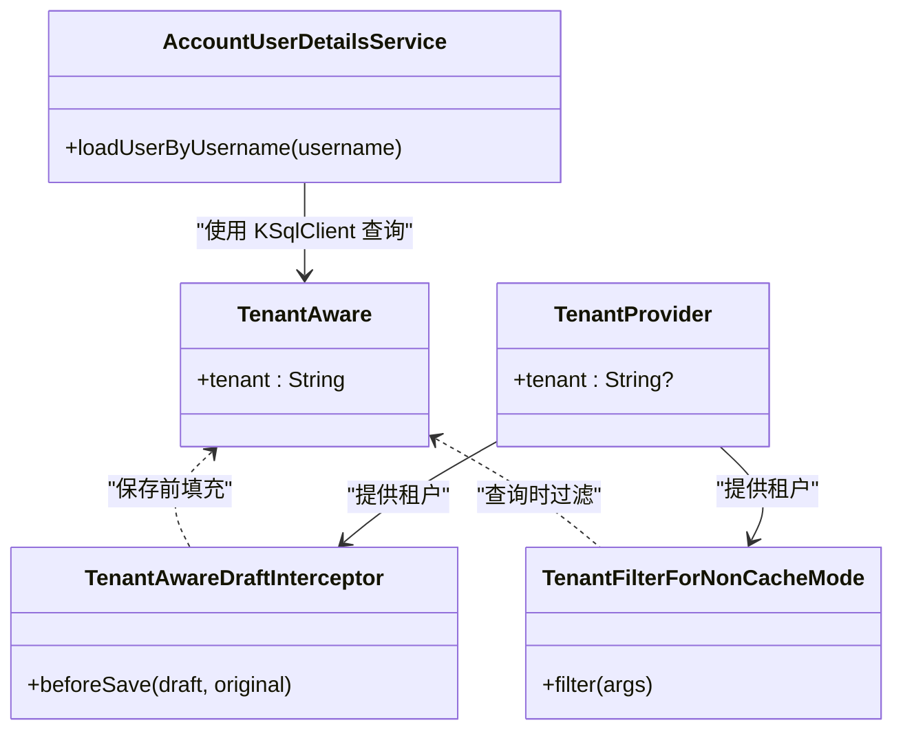
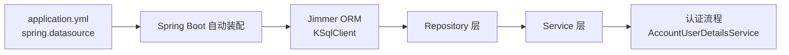

# 数据库配置

<cite>
**本文引用的文件**
- [application.yml](file://service/src/main/resources/application.yml)
- [README.md](file://README.md)
- [init.sql](file://database/init.sql)
- [TenantAware.kt](file://model/src/main/kotlin/top/zztech/ainote/model/common/TenantAware.kt)
- [TenantAwareDraftInterceptor.kt](file://runtime/src/main/kotlin/top/zztech/ainote/runtime/interceptor/TenantAwareDraftInterceptor.kt)
- [TenantFilterForNonCacheMode.kt](file://runtime/src/main/kotlin/top/zztech/ainote/runtime/filter/TenantFilterForNonCacheMode.kt)
- [TenantProvider.kt](file://runtime/src/main/kotlin/top/zztech/ainote/runtime/TenantProvider.kt)
- [AccountUserDetailsService.kt](file://service/src/main/kotlin/top/zztech/ainote/service/AccountUserDetailsService.kt)
- [repository/build.gradle.kts](file://repository/build.gradle.kts)
- [service/build.gradle.kts](file://service/build.gradle.kts)
</cite>

## 目录
1. [简介](#简介)
2. [项目结构](#项目结构)
3. [核心组件](#核心组件)
4. [架构总览](#架构总览)
5. [详细组件分析](#详细组件分析)
6. [依赖分析](#依赖分析)
7. [性能考虑](#性能考虑)
8. [故障排查指南](#故障排查指南)
9. [结论](#结论)
10. [附录](#附录)

## 简介
本文件聚焦于应用的数据库配置，围绕 application.yml 中 spring.datasource 的关键配置项展开，系统性说明：
- 如何根据数据库类型（H2、MySQL、PostgreSQL）正确设置 driver-class-name
- URL 连接字符串的格式与参数化写法，以及如何通过环境变量 ${DB_HOST}、${DB_PORT}、${DB_NAME} 实现外部化配置
- 用户名与密码的安全配置实践，特别是在生产环境通过环境变量注入敏感信息
- 多租户场景下为不同租户使用独立数据库的配置思路与 Jimmer ORM 的协同方式
- 常见配置错误的排查方法，如驱动类未找到、连接超时等

## 项目结构
本项目采用多模块结构，数据库配置主要位于 service 模块的 application.yml；Jimmer ORM 通过 repository 模块引入；多租户能力由 runtime 模块提供。

图表来源
- [application.yml](file://service/src/main/resources/application.yml#L1-L15)
- [repository/build.gradle.kts](file://repository/build.gradle.kts#L20-L28)
- [runtime/src/main/kotlin/top/zztech/ainote/runtime/TenantProvider.kt](file://runtime/src/main/kotlin/top/zztech/ainote/runtime/TenantProvider.kt#L1-L15)
- [runtime/src/main/kotlin/top/zztech/ainote/runtime/interceptor/TenantAwareDraftInterceptor.kt](file://runtime/src/main/kotlin/top/zztech/ainote/runtime/interceptor/TenantAwareDraftInterceptor.kt#L1-L21)
- [runtime/src/main/kotlin/top/zztech/ainote/runtime/filter/TenantFilterForNonCacheMode.kt](file://runtime/src/main/kotlin/top/zztech/ainote/runtime/filter/TenantFilterForNonCacheMode.kt#L1-L25)
- [model/src/main/kotlin/top/zztech/ainote/model/common/TenantAware.kt](file://model/src/main/kotlin/top/zztech/ainote/model/common/TenantAware.kt#L1-L16)

章节来源
- [application.yml](file://service/src/main/resources/application.yml#L1-L15)
- [repository/build.gradle.kts](file://repository/build.gradle.kts#L20-L28)

## 核心组件
- spring.datasource.driver-class-name：指定 JDBC 驱动类全名，需与所选数据库类型匹配
- spring.datasource.url：JDBC 连接字符串，支持占位符 ${DB_HOST}、${DB_PORT}、${DB_NAME}
- spring.datasource.username/password：数据库用户名与密码，建议通过环境变量注入
- Jimmer ORM：通过 Spring Boot Starter 与数据源集成，支持多租户过滤与自动填充

章节来源
- [application.yml](file://service/src/main/resources/application.yml#L1-L15)
- [repository/build.gradle.kts](file://repository/build.gradle.kts#L20-L28)

## 架构总览
下面的序列图展示了请求进入系统后，Jimmer ORM 如何与数据源协作，以及多租户过滤器如何生效：

图表来源
- [application.yml](file://service/src/main/resources/application.yml#L1-L15)
- [runtime/src/main/kotlin/top/zztech/ainote/runtime/filter/TenantFilterForNonCacheMode.kt](file://runtime/src/main/kotlin/top/zztech/ainote/runtime/filter/TenantFilterForNonCacheMode.kt#L1-L25)
- [runtime/src/main/kotlin/top/zztech/ainote/runtime/interceptor/TenantAwareDraftInterceptor.kt](file://runtime/src/main/kotlin/top/zztech/ainote/runtime/interceptor/TenantAwareDraftInterceptor.kt#L1-L21)

## 详细组件分析

### spring.datasource 配置项详解
- driver-class-name
  - H2：无需显式配置，应用启动时会自动初始化内存数据库
  - MySQL：需设置为 MySQL 对应的驱动类全名
  - PostgreSQL：当前配置为 PostgreSQL 驱动类全名
- url
  - 使用 JDBC URL 格式，支持占位符 ${DB_HOST}、${DB_PORT}、${DB_NAME}
  - 占位符具有默认值，便于本地开发；生产环境通过环境变量覆盖
- username/password
  - 建议通过环境变量注入，避免硬编码到仓库
  - 占位符支持默认值，便于快速启动

章节来源
- [application.yml](file://service/src/main/resources/application.yml#L1-L15)
- [README.md](file://README.md#L148-L177)

### 数据库类型与驱动类映射
- H2（默认开发数据库）：无需显式配置 driver-class-name，应用启动时自动初始化
- MySQL：driver-class-name 应设置为 MySQL 对应驱动类全名
- PostgreSQL：当前配置为 PostgreSQL 驱动类全名

章节来源
- [application.yml](file://service/src/main/resources/application.yml#L1-L15)
- [README.md](file://README.md#L148-L177)

### URL 连接字符串格式与外部化配置
- URL 格式遵循 JDBC 规范，包含主机、端口、数据库名
- 通过 ${DB_HOST}、${DB_PORT}、${DB_NAME} 实现外部化配置
- 占位符支持默认值，便于本地开发；生产环境通过环境变量覆盖

章节来源
- [application.yml](file://service/src/main/resources/application.yml#L1-L15)

### 用户名与密码的安全配置实践
- 建议通过环境变量注入敏感信息，避免将明文写入仓库
- application.yml 中使用占位符 ${DB_USERNAME}、${DB_PASSWORD}，并提供默认值
- 生产环境务必覆盖默认值，确保凭据安全

章节来源
- [application.yml](file://service/src/main/resources/application.yml#L1-L15)

### 多租户与独立数据库配置思路
- 当前项目通过租户头实现逻辑隔离，所有租户共享同一数据库实例
- 若需要为不同租户使用独立数据库，可在应用外层通过环境变量或配置中心动态切换 spring.datasource.*，从而在运行时选择不同的数据源
- Jimmer ORM 与数据源解耦，配合多租户过滤器即可在逻辑上实现隔离；若要物理隔离，需在应用启动前确定数据源并注入

图表来源
- [application.yml](file://service/src/main/resources/application.yml#L1-L15)
- [runtime/src/main/kotlin/top/zztech/ainote/runtime/filter/TenantFilterForNonCacheMode.kt](file://runtime/src/main/kotlin/top/zztech/ainote/runtime/filter/TenantFilterForNonCacheMode.kt#L1-L25)
- [runtime/src/main/kotlin/top/zztech/ainote/runtime/interceptor/TenantAwareDraftInterceptor.kt](file://runtime/src/main/kotlin/top/zztech/ainote/runtime/interceptor/TenantAwareDraftInterceptor.kt#L1-L21)

### Jimmer ORM 与配置的协同
- repository 模块引入 Jimmer Spring Boot Starter，使 ORM 能够自动发现数据源并生成类型安全的查询
- 多租户能力通过拦截器与过滤器实现：保存前自动填充租户，查询时自动追加租户条件
- 认证流程中，服务层通过 KSqlClient 从数据库加载用户信息，验证登录凭据

图表来源
- [model/src/main/kotlin/top/zztech/ainote/model/common/TenantAware.kt](file://model/src/main/kotlin/top/zztech/ainote/model/common/TenantAware.kt#L1-L16)
- [runtime/src/main/kotlin/top/zztech/ainote/runtime/interceptor/TenantAwareDraftInterceptor.kt](file://runtime/src/main/kotlin/top/zztech/ainote/runtime/interceptor/TenantAwareDraftInterceptor.kt#L1-L21)
- [runtime/src/main/kotlin/top/zztech/ainote/runtime/filter/TenantFilterForNonCacheMode.kt](file://runtime/src/main/kotlin/top/zztech/ainote/runtime/filter/TenantFilterForNonCacheMode.kt#L1-L25)
- [runtime/src/main/kotlin/top/zztech/ainote/runtime/TenantProvider.kt](file://runtime/src/main/kotlin/top/zztech/ainote/runtime/TenantProvider.kt#L1-L15)
- [service/src/main/kotlin/top/zztech/ainote/service/AccountUserDetailsService.kt](file://service/src/main/kotlin/top/zztech/ainote/service/AccountUserDetailsService.kt#L23-L54)

章节来源
- [repository/build.gradle.kts](file://repository/build.gradle.kts#L20-L28)
- [runtime/src/main/kotlin/top/zztech/ainote/runtime/interceptor/TenantAwareDraftInterceptor.kt](file://runtime/src/main/kotlin/top/zztech/ainote/runtime/interceptor/TenantAwareDraftInterceptor.kt#L1-L21)
- [runtime/src/main/kotlin/top/zztech/ainote/runtime/filter/TenantFilterForNonCacheMode.kt](file://runtime/src/main/kotlin/top/zztech/ainote/runtime/filter/TenantFilterForNonCacheMode.kt#L1-L25)
- [runtime/src/main/kotlin/top/zztech/ainote/runtime/TenantProvider.kt](file://runtime/src/main/kotlin/top/zztech/ainote/runtime/TenantProvider.kt#L1-L15)
- [service/src/main/kotlin/top/zztech/ainote/service/AccountUserDetailsService.kt](file://service/src/main/kotlin/top/zztech/ainote/service/AccountUserDetailsService.kt#L23-L54)

## 依赖分析
- 数据源与 ORM 的耦合度低：Jimmer 通过 Spring Boot Starter 自动装配数据源
- 多租户能力通过拦截器与过滤器实现，对业务代码透明
- 认证流程依赖 KSqlClient 从数据库加载用户信息

图表来源
- [application.yml](file://service/src/main/resources/application.yml#L1-L15)
- [repository/build.gradle.kts](file://repository/build.gradle.kts#L20-L28)
- [service/src/main/kotlin/top/zztech/ainote/service/AccountUserDetailsService.kt](file://service/src/main/kotlin/top/zztech/ainote/service/AccountUserDetailsService.kt#L23-L54)

章节来源
- [repository/build.gradle.kts](file://repository/build.gradle.kts#L20-L28)
- [service/src/main/kotlin/top/zztech/ainote/service/AccountUserDetailsService.kt](file://service/src/main/kotlin/top/zztech/ainote/service/AccountUserDetailsService.kt#L23-L54)

## 性能考虑
- 合理设置连接池参数（如最大连接数、空闲超时等），避免连接争用
- 在高并发场景下，优先使用连接池与异步处理
- 多租户过滤器会为每次查询追加 WHERE 条件，建议为相关列建立索引以提升查询效率
- 生产环境建议开启 SQL 日志与慢查询监控，结合数据库侧的执行计划分析优化

## 故障排查指南
- 驱动类未找到
  - 症状：启动时报找不到驱动类异常
  - 排查要点：
    - 确认 driver-class-name 与数据库类型匹配
    - 确认数据库驱动依赖已加入项目（例如 PostgreSQL 驱动）
    - 确认运行时类路径包含驱动 jar
  - 参考位置
    - [application.yml](file://service/src/main/resources/application.yml#L1-L15)
    - [service/build.gradle.kts](file://service/build.gradle.kts#L29-L36)

- 连接超时
  - 症状：应用启动或请求处理过程中出现连接超时
  - 排查要点：
    - 检查 URL 中主机、端口、数据库名是否正确
    - 检查网络连通性与防火墙策略
    - 检查数据库服务状态与负载情况
    - 调整连接池与超时参数（如最大连接数、超时时间）
  - 参考位置
    - [application.yml](file://service/src/main/resources/application.yml#L1-L15)

- 认证失败或用户不存在
  - 症状：登录时报用户名不存在或凭据错误
  - 排查要点：
    - 确认数据库中存在对应账户记录
    - 确认用户名大小写与输入一致
    - 确认密码哈希算法与加密方式一致
  - 参考位置
    - [service/src/main/kotlin/top/zztech/ainote/service/AccountUserDetailsService.kt](file://service/src/main/kotlin/top/zztech/ainote/service/AccountUserDetailsService.kt#L23-L54)
    - [database/init.sql](file://database/init.sql#L90-L101)

- 多租户数据隔离问题
  - 症状：查询到其他租户的数据
  - 排查要点：
    - 确认请求头中包含正确的租户标识
    - 确认 TenantProvider 能正确读取租户头
    - 确认过滤器与拦截器均被启用且生效
  - 参考位置
    - [runtime/src/main/kotlin/top/zztech/ainote/runtime/TenantProvider.kt](file://runtime/src/main/kotlin/top/zztech/ainote/runtime/TenantProvider.kt#L1-L15)
    - [runtime/src/main/kotlin/top/zztech/ainote/runtime/filter/TenantFilterForNonCacheMode.kt](file://runtime/src/main/kotlin/top/zztech/ainote/runtime/filter/TenantFilterForNonCacheMode.kt#L1-L25)
    - [runtime/src/main/kotlin/top/zztech/ainote/runtime/interceptor/TenantAwareDraftInterceptor.kt](file://runtime/src/main/kotlin/top/zztech/ainote/runtime/interceptor/TenantAwareDraftInterceptor.kt#L1-L21)

## 结论
- 通过 application.yml 的 spring.datasource 配置，可以灵活适配多种数据库类型，并借助环境变量实现外部化配置
- 在生产环境中，建议通过环境变量注入敏感信息，避免硬编码
- 多租户可通过租户头实现逻辑隔离，配合 Jimmer ORM 的拦截器与过滤器，实现保存前填充与查询时过滤
- 若需要物理隔离，可在应用外层按租户选择不同数据源，从而实现独立数据库的多租户方案

## 附录
- 初始化脚本参考：用于本地开发与测试的表结构与示例行
  - [init.sql](file://database/init.sql#L1-L101)
- 数据库类型与驱动类对照（来自 README）
  - [README.md](file://README.md#L148-L177)