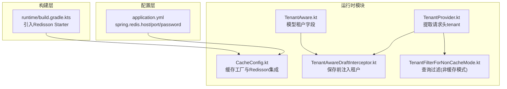
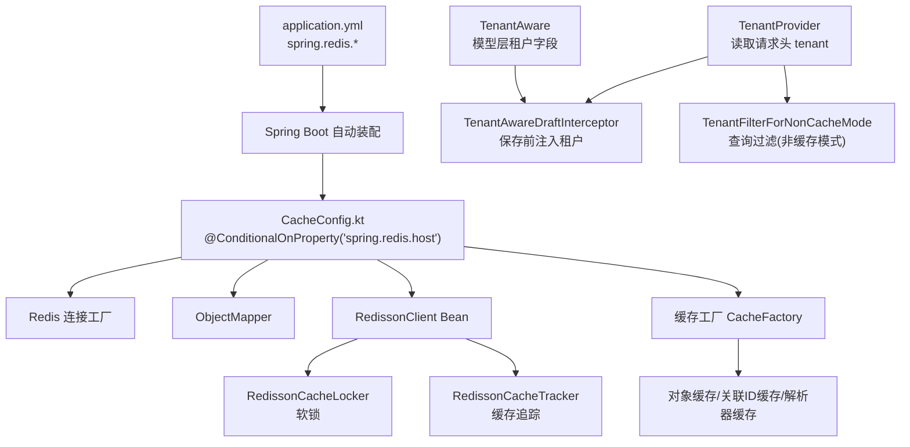
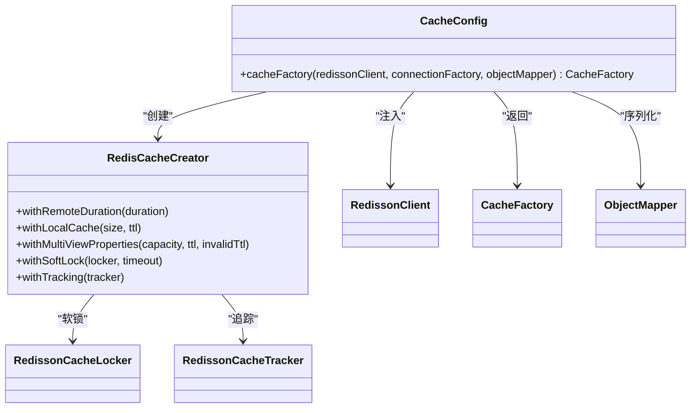
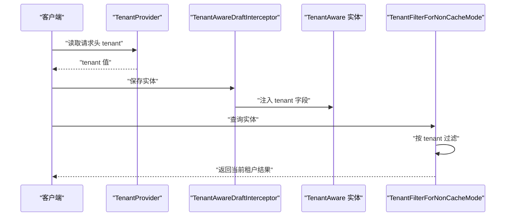
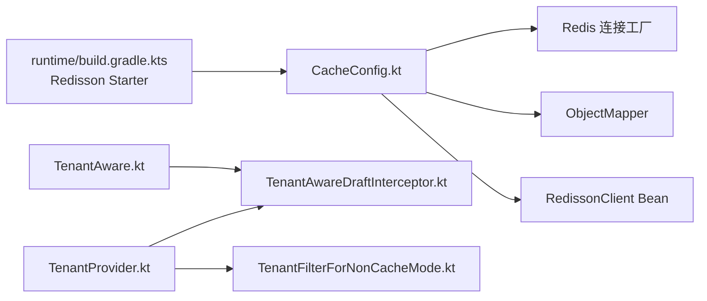

# 缓存配置

<cite>
**本文引用的文件**
- [application.yml](file://service/src/main/resources/application.yml)
- [CacheConfig.kt](file://runtime/src/main/kotlin/top/zztech/ainote/runtime/cache/CacheConfig.kt)
- [TenantProvider.kt](file://runtime/src/main/kotlin/top/zztech/ainote/runtime/TenantProvider.kt)
- [TenantAware.kt](file://model/src/main/kotlin/top/zztech/ainote/model/common/TenantAware.kt)
- [TenantAwareDraftInterceptor.kt](file://runtime/src/main/kotlin/top/zztech/ainote/runtime/interceptor/TenantAwareDraftInterceptor.kt)
- [TenantFilterForNonCacheMode.kt](file://runtime/src/main/kotlin/top/zztech/ainote/runtime/filter/TenantFilterForNonCacheMode.kt)
- [runtime/build.gradle.kts](file://runtime/build.gradle.kts)
</cite>

## 目录
1. [简介](#简介)
2. [项目结构](#项目结构)
3. [核心组件](#核心组件)
4. [架构总览](#架构总览)
5. [详细组件分析](#详细组件分析)
6. [依赖关系分析](#依赖关系分析)
7. [性能考量](#性能考量)
8. [故障排查指南](#故障排查指南)
9. [结论](#结论)
10. [附录](#附录)

## 简介
本指南围绕应用中的缓存配置展开，重点覆盖以下方面：
- 在 application.yml 中通过 spring.redis 的 host、port、password 实现 Redis 连接配置，并结合 ${REDIS_HOST}、${REDIS_PORT}、${REDIS_PASSWORD} 等占位符进行环境适配。
- 基于 CacheConfig.kt 文件，说明 Redisson 客户端在缓存工厂中的初始化与使用方式，以及缓存策略（本地缓存、远程缓存、软锁、追踪）的配置要点。
- 多租户场景下的缓存数据隔离机制，包括键命名空间设计思路与租户维度的访问控制。
- 面向缓存穿透、雪崩、击穿的预防配置建议，以及缓存与数据库一致性的维护策略。
- Redis 连接失败时的降级处理与健康检查配置建议。

## 项目结构
本项目的缓存相关能力由运行时模块提供，核心文件分布如下：
- 配置层：application.yml 提供 spring.redis 的主机、端口、密码等参数，并支持环境变量占位符。
- 缓存配置层：CacheConfig.kt 定义了基于 Redis 的缓存工厂，集成 Redisson 客户端以实现软锁与追踪。
- 多租户层：TenantProvider 提供当前请求的租户标识；TenantAware 定义模型层的租户字段；TenantAwareDraftInterceptor 在保存前注入租户；TenantFilterForNonCacheMode 在非缓存模式下对查询进行租户过滤。
- 构建层：runtime/build.gradle.kts 引入 Redisson Spring Boot Starter，为自动装配与客户端初始化提供基础。

图表来源
- [application.yml](file://service/src/main/resources/application.yml#L8-L12)
- [CacheConfig.kt](file://runtime/src/main/kotlin/top/zztech/ainote/runtime/cache/CacheConfig.kt#L19-L57)
- [TenantProvider.kt](file://runtime/src/main/kotlin/top/zztech/ainote/runtime/TenantProvider.kt#L1-L16)
- [TenantAware.kt](file://model/src/main/kotlin/top/zztech/ainote/model/common/TenantAware.kt#L1-L17)
- [TenantAwareDraftInterceptor.kt](file://runtime/src/main/kotlin/top/zztech/ainote/runtime/interceptor/TenantAwareDraftInterceptor.kt#L1-L22)
- [TenantFilterForNonCacheMode.kt](file://runtime/src/main/kotlin/top/zztech/ainote/runtime/filter/TenantFilterForNonCacheMode.kt#L1-L25)
- [runtime/build.gradle.kts](file://runtime/build.gradle.kts#L27-L27)

章节来源
- [application.yml](file://service/src/main/resources/application.yml#L8-L12)
- [CacheConfig.kt](file://runtime/src/main/kotlin/top/zztech/ainote/runtime/cache/CacheConfig.kt#L19-L57)
- [TenantProvider.kt](file://runtime/src/main/kotlin/top/zztech/ainote/runtime/TenantProvider.kt#L1-L16)
- [TenantAware.kt](file://model/src/main/kotlin/top/zztech/ainote/model/common/TenantAware.kt#L1-L17)
- [TenantAwareDraftInterceptor.kt](file://runtime/src/main/kotlin/top/zztech/ainote/runtime/interceptor/TenantAwareDraftInterceptor.kt#L1-L22)
- [TenantFilterForNonCacheMode.kt](file://runtime/src/main/kotlin/top/zztech/ainote/runtime/filter/TenantFilterForNonCacheMode.kt#L1-L25)
- [runtime/build.gradle.kts](file://runtime/build.gradle.kts#L27-L27)

## 核心组件
- 缓存工厂与 Redisson 集成：通过 CacheConfig.kt 定义的缓存工厂，使用 Redis 连接工厂与 ObjectMapper 创建 Redis 缓存条目，并启用本地缓存、远程缓存、软锁与追踪。
- 多租户隔离：TenantProvider 从请求头读取租户标识；TenantAwareDraftInterceptor 在保存前注入租户；TenantFilterForNonCacheMode 在查询阶段按租户过滤。
- 配置与环境适配：application.yml 使用 ${REDIS_HOST}、${REDIS_PORT}、${REDIS_PASSWORD} 占位符，便于不同环境切换。

章节来源
- [CacheConfig.kt](file://runtime/src/main/kotlin/top/zztech/ainote/runtime/cache/CacheConfig.kt#L19-L57)
- [TenantProvider.kt](file://runtime/src/main/kotlin/top/zztech/ainote/runtime/TenantProvider.kt#L1-L16)
- [TenantAware.kt](file://model/src/main/kotlin/top/zztech/ainote/model/common/TenantAware.kt#L1-L17)
- [TenantAwareDraftInterceptor.kt](file://runtime/src/main/kotlin/top/zztech/ainote/runtime/interceptor/TenantAwareDraftInterceptor.kt#L1-L22)
- [TenantFilterForNonCacheMode.kt](file://runtime/src/main/kotlin/top/zztech/ainote/runtime/filter/TenantFilterForNonCacheMode.kt#L1-L25)
- [application.yml](file://service/src/main/resources/application.yml#L8-L12)

## 架构总览
下图展示了缓存配置在系统中的位置与交互关系，包括配置加载、缓存工厂创建、Redisson 客户端参与、以及多租户隔离策略。

图表来源
- [application.yml](file://service/src/main/resources/application.yml#L8-L12)
- [CacheConfig.kt](file://runtime/src/main/kotlin/top/zztech/ainote/runtime/cache/CacheConfig.kt#L19-L57)
- [TenantProvider.kt](file://runtime/src/main/kotlin/top/zztech/ainote/runtime/TenantProvider.kt#L1-L16)
- [TenantAwareDraftInterceptor.kt](file://runtime/src/main/kotlin/top/zztech/ainote/runtime/interceptor/TenantAwareDraftInterceptor.kt#L1-L22)
- [TenantFilterForNonCacheMode.kt](file://runtime/src/main/kotlin/top/zztech/ainote/runtime/filter/TenantFilterForNonCacheMode.kt#L1-L25)
- [TenantAware.kt](file://model/src/main/kotlin/top/zztech/ainote/model/common/TenantAware.kt#L1-L17)

## 详细组件分析

### application.yml 中的 Redis 配置与环境适配
- 配置项
  - spring.redis.host：Redis 主机地址，默认值来自 ${REDIS_HOST:localhost}
  - spring.redis.port：Redis 端口，默认值来自 ${REDIS_PORT:6379}
  - spring.redis.password：Redis 密码，默认值来自 ${REDIS_PASSWORD:}
- 环境适配
  - 通过环境变量 REDIS_HOST、REDIS_PORT、REDIS_PASSWORD 可在不同环境（开发、测试、生产）灵活替换默认值，无需修改代码或配置文件。
- 典型用法
  - 开发环境：仅设置 REDIS_HOST=127.0.0.1 即可，其余使用默认值。
  - 生产环境：设置 REDIS_HOST、REDIS_PORT、REDIS_PASSWORD 以连接受保护的 Redis 集群或哨兵。

章节来源
- [application.yml](file://service/src/main/resources/application.yml#L8-L12)

### CacheConfig.kt：Redisson 客户端初始化与缓存策略
- 条件装配
  - 仅当存在 spring.redis.host 属性时才启用缓存配置。
- 缓存工厂创建
  - 使用 Redis 连接工厂与 ObjectMapper 构造 RedisCacheCreator。
  - 远程缓存有效期：1 小时
  - 本地缓存：容量 100，过期时间 5 分钟
  - 多视图属性缓存：容量 40，主缓存 2 分钟，失效时间 24 分钟
  - 软锁：使用 RedissonCacheLocker，超时 30 秒
  - 追踪：使用 RedissonCacheTracker
- 缓存类型
  - 对象缓存：针对实体类型
  - 关联 ID 缓存：针对关联属性
  - 关联 ID 列表缓存：针对集合属性
  - 解析器缓存：用于解析器相关属性
- Redisson 客户端
  - 通过 @Bean 注入 RedissonClient，作为软锁与追踪的基础。

图表来源
- [CacheConfig.kt](file://runtime/src/main/kotlin/top/zztech/ainote/runtime/cache/CacheConfig.kt#L19-L57)

章节来源
- [CacheConfig.kt](file://runtime/src/main/kotlin/top/zztech/ainote/runtime/cache/CacheConfig.kt#L19-L57)

### 多租户场景下的缓存数据隔离机制
- 租户标识来源
  - TenantProvider 从 HTTP 请求头 tenant 中读取当前租户标识，并在请求上下文中可用。
- 模型层租户字段
  - TenantAware 接口定义了实体的 tenant 字段，所有实现该接口的实体均具备租户属性。
- 写入隔离
  - TenantAwareDraftInterceptor 在保存前若未显式加载 tenant，则自动注入当前租户，确保写入数据带有租户标记。
- 查询隔离（非缓存模式）
  - TenantFilterForNonCacheMode 在非缓存模式下对查询进行过滤，确保只返回当前租户的数据。
- 键命名空间设计建议
  - 在使用 Redis 缓存时，推荐将键名前缀加入租户标识，例如以 tenant:prefix:id 的形式组织键，从而天然实现多租户隔离。
  - 若使用框架提供的缓存键生成策略，可在自定义键生成器中加入租户维度，避免跨租户键冲突。

图表来源
- [TenantProvider.kt](file://runtime/src/main/kotlin/top/zztech/ainote/runtime/TenantProvider.kt#L1-L16)
- [TenantAwareDraftInterceptor.kt](file://runtime/src/main/kotlin/top/zztech/ainote/runtime/interceptor/TenantAwareDraftInterceptor.kt#L1-L22)
- [TenantAware.kt](file://model/src/main/kotlin/top/zztech/ainote/model/common/TenantAware.kt#L1-L17)
- [TenantFilterForNonCacheMode.kt](file://runtime/src/main/kotlin/top/zztech/ainote/runtime/filter/TenantFilterForNonCacheMode.kt#L1-L25)

章节来源
- [TenantProvider.kt](file://runtime/src/main/kotlin/top/zztech/ainote/runtime/TenantProvider.kt#L1-L16)
- [TenantAware.kt](file://model/src/main/kotlin/top/zztech/ainote/model/common/TenantAware.kt#L1-L17)
- [TenantAwareDraftInterceptor.kt](file://runtime/src/main/kotlin/top/zztech/ainote/runtime/interceptor/TenantAwareDraftInterceptor.kt#L1-L22)
- [TenantFilterForNonCacheMode.kt](file://runtime/src/main/kotlin/top/zztech/ainote/runtime/filter/TenantFilterForNonCacheMode.kt#L1-L25)

### 缓存穿透、雪崩、击穿的预防配置建议
- 缓存穿透
  - 现有配置未直接启用“空值缓存”或“布隆过滤器”，建议在业务层增加：
    - 对不存在记录的键进行短期缓存（如 1-5 分钟），避免重复查询数据库。
    - 在入口处使用布隆过滤器快速判断键是否存在，减少无效查询。
- 缓存雪崩
  - 现有配置已设置合理的远程缓存过期时间（1 小时）与本地缓存（5 分钟），建议进一步：
    - 为热点键增加随机过期时间偏移，避免同时过期。
    - 启用多级缓存（本地+远程）与软锁，降低并发重建压力。
- 缓存击穿
  - 现有配置已启用软锁（RedissonCacheLocker），建议：
    - 对热点单点数据（如用户资料、配置）在重建期间允许短时间共享旧值，避免瞬时高并发打穿数据库。
    - 对关键路径的读操作增加限流或熔断保护。

[本节为通用建议，不直接分析具体文件，故无章节来源]

### 缓存与数据库一致性维护策略
- 写入一致性
  - 通过 TenantAwareDraftInterceptor 在保存前注入租户，确保写入数据具备租户标识，避免跨租户污染。
- 读取一致性
  - 在非缓存模式下，TenantFilterForNonCacheMode 会对查询进行租户过滤，保证读取范围正确。
- 缓存更新策略
  - 建议采用“先更新数据库，再失效缓存”的策略，避免脏读。
  - 对批量更新或复杂事务，可采用分布式锁（Redisson）保障一致性。

章节来源
- [TenantAwareDraftInterceptor.kt](file://runtime/src/main/kotlin/top/zztech/ainote/runtime/interceptor/TenantAwareDraftInterceptor.kt#L1-L22)
- [TenantFilterForNonCacheMode.kt](file://runtime/src/main/kotlin/top/zztech/ainote/runtime/filter/TenantFilterForNonCacheMode.kt#L1-L25)

### Redis 连接失败时的降级处理与健康检查配置
- 条件装配与降级
  - CacheConfig.kt 使用 @ConditionalOnProperty("spring.redis.host") 控制缓存配置是否生效。当未提供 spring.redis.host 时，缓存配置不会被加载，系统退化为无缓存模式。
- 健康检查
  - 建议在生产环境中启用 Spring Boot Actuator 的 Redis 健康检查端点，监控 Redis 连接状态与可用性。
- 降级策略
  - 当 Redis 不可用时，系统自动回退到无缓存模式（依赖数据库直连），业务仍可正常运行，但需关注延迟与 QPS 上升。
  - 对关键路径可增加本地缓存兜底（例如缩短本地缓存 TTL 或提高容量），以缓解瞬时压力。

章节来源
- [CacheConfig.kt](file://runtime/src/main/kotlin/top/zztech/ainote/runtime/cache/CacheConfig.kt#L19-L21)
- [runtime/build.gradle.kts](file://runtime/build.gradle.kts#L27-L27)

## 依赖关系分析
- 构建依赖
  - runtime 模块引入 org.redisson:redisson-spring-boot-starter，为 Redisson 客户端的自动装配与 Bean 注入提供支撑。
- 运行时依赖
  - CacheConfig.kt 依赖 Redis 连接工厂、ObjectMapper、RedissonClient，共同构成缓存工厂的运行时环境。
- 多租户依赖
  - TenantProvider 依赖 Spring Web 的 RequestContextHolder 获取请求上下文；TenantAwareDraftInterceptor 依赖 TenantProvider 注入租户；TenantFilterForNonCacheMode 依赖 TenantProvider 进行查询过滤。

图表来源
- [runtime/build.gradle.kts](file://runtime/build.gradle.kts#L27-L27)
- [CacheConfig.kt](file://runtime/src/main/kotlin/top/zztech/ainote/runtime/cache/CacheConfig.kt#L19-L57)
- [TenantProvider.kt](file://runtime/src/main/kotlin/top/zztech/ainote/runtime/TenantProvider.kt#L1-L16)
- [TenantAwareDraftInterceptor.kt](file://runtime/src/main/kotlin/top/zztech/ainote/runtime/interceptor/TenantAwareDraftInterceptor.kt#L1-L22)
- [TenantFilterForNonCacheMode.kt](file://runtime/src/main/kotlin/top/zztech/ainote/runtime/filter/TenantFilterForNonCacheMode.kt#L1-L25)
- [TenantAware.kt](file://model/src/main/kotlin/top/zztech/ainote/model/common/TenantAware.kt#L1-L17)

章节来源
- [runtime/build.gradle.kts](file://runtime/build.gradle.kts#L27-L27)
- [CacheConfig.kt](file://runtime/src/main/kotlin/top/zztech/ainote/runtime/cache/CacheConfig.kt#L19-L57)
- [TenantProvider.kt](file://runtime/src/main/kotlin/top/zztech/ainote/runtime/TenantProvider.kt#L1-L16)
- [TenantAwareDraftInterceptor.kt](file://runtime/src/main/kotlin/top/zztech/ainote/runtime/interceptor/TenantAwareDraftInterceptor.kt#L1-L22)
- [TenantFilterForNonCacheMode.kt](file://runtime/src/main/kotlin/top/zztech/ainote/runtime/filter/TenantFilterForNonCacheMode.kt#L1-L25)
- [TenantAware.kt](file://model/src/main/kotlin/top/zztech/ainote/model/common/TenantAware.kt#L1-L17)

## 性能考量
- 缓存层级
  - 本地缓存（容量与 TTL）与远程缓存（TTL）配合，可显著降低数据库压力。
- 并发控制
  - 软锁（Redisson）可避免缓存击穿时的并发重建风暴。
- 多视图属性
  - 对频繁访问的关联属性启用多视图缓存，可提升读性能。
- 键设计
  - 建议在键中加入租户维度，避免跨租户键冲突与数据串扰。

[本节为通用指导，不直接分析具体文件，故无章节来源]

## 故障排查指南
- Redis 连接失败
  - 现象：缓存功能不可用，系统退化为无缓存模式。
  - 排查：确认 application.yml 中 spring.redis.host 是否配置；检查网络连通性与认证信息；查看日志中 Redis 连接异常。
  - 处理：临时关闭 spring.redis.host 或修复连接参数后重启服务。
- 缓存穿透
  - 现象：大量不存在的键导致数据库压力增大。
  - 排查：检查业务层是否对空值进行短期缓存；确认布隆过滤器是否启用。
  - 处理：增加空值缓存与布隆过滤器。
- 缓存雪崩
  - 现象：大量键同时过期，导致瞬时数据库压力激增。
  - 排查：检查缓存过期策略与 TTL 设置；确认是否对热点键设置了随机偏移。
  - 处理：为热点键增加随机过期时间；提高本地缓存命中率。
- 缓存击穿
  - 现象：热点单点键失效时并发重建导致数据库压力骤增。
  - 排查：确认软锁是否生效；检查重建逻辑是否允许共享旧值。
  - 处理：启用软锁并允许短时间共享旧值；对关键路径增加限流。

章节来源
- [CacheConfig.kt](file://runtime/src/main/kotlin/top/zztech/ainote/runtime/cache/CacheConfig.kt#L19-L57)
- [application.yml](file://service/src/main/resources/application.yml#L8-L12)

## 结论
本项目通过 application.yml 的环境变量占位符实现了 Redis 连接的灵活配置；通过 CacheConfig.kt 将 Redisson 客户端与缓存策略（本地/远程、软锁、追踪）整合，形成稳定高效的缓存体系；借助多租户组件（TenantProvider、TenantAware、DraftInterceptor、Filter）在模型与访问层实现租户隔离。建议在生产环境中补充健康检查与布隆过滤器等能力，进一步增强系统的稳定性与性能。

[本节为总结性内容，不直接分析具体文件，故无章节来源]

## 附录
- Redis 连接参数参考
  - spring.redis.host：Redis 主机地址（默认 ${REDIS_HOST:localhost}）
  - spring.redis.port：Redis 端口（默认 ${REDIS_PORT:6379}）
  - spring.redis.password：Redis 密码（默认 ${REDIS_PASSWORD:}）

章节来源
- [application.yml](file://service/src/main/resources/application.yml#L8-L12)