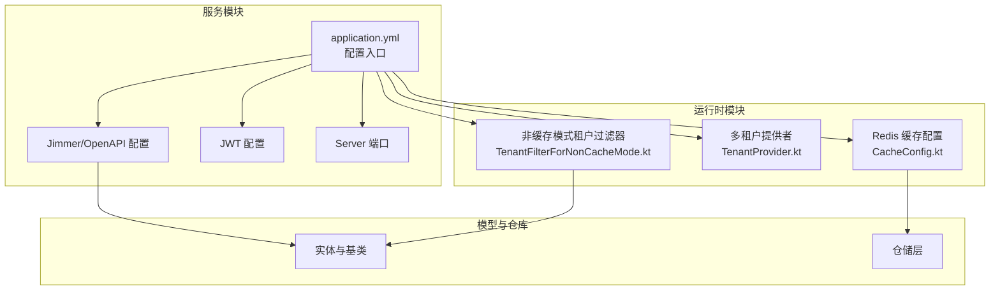
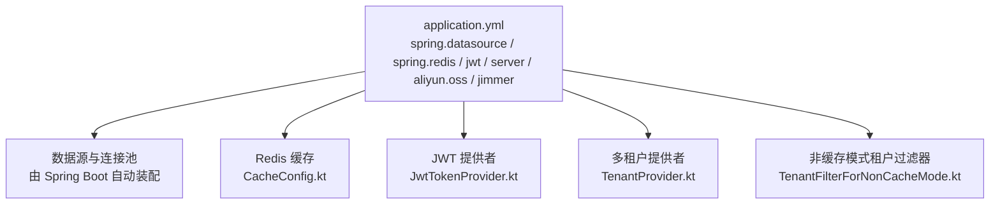
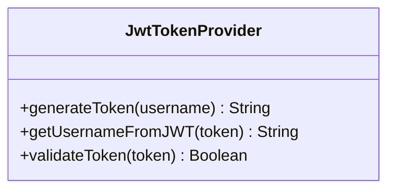
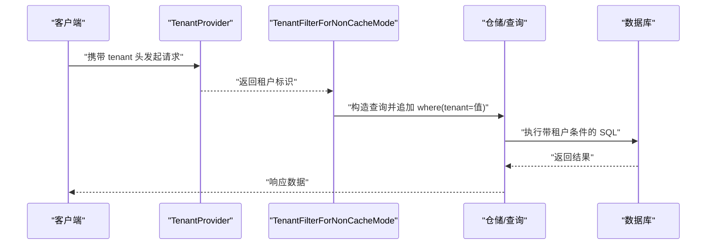
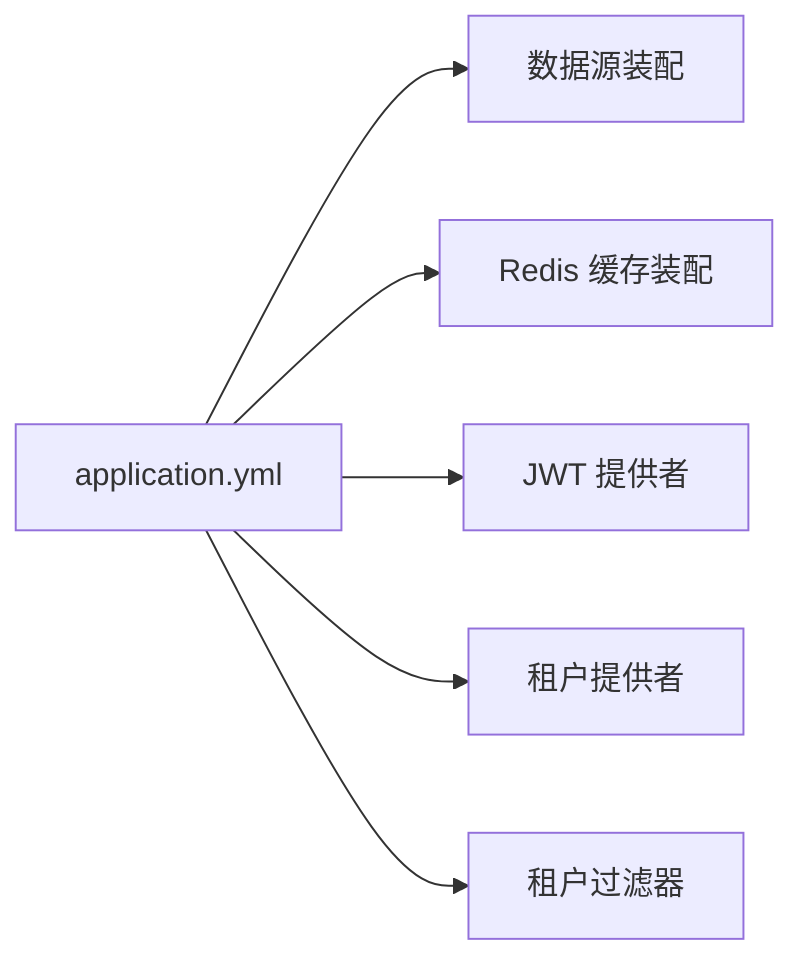

# 配置与部署

<cite>
**本文引用的文件**
- [application.yml](file://service/src/main/resources/application.yml)
- [README.md](file://README.md)
- [CacheConfig.kt](file://runtime/src/main/kotlin/top/zztech/ainote/runtime/cache/CacheConfig.kt)
- [JwtTokenProvider.kt](file://runtime/src/main/kotlin/top/zztech/ainote/runtime/utility/JwtTokenProvider.kt)
- [TenantProvider.kt](file://runtime/src/main/kotlin/top/zztech/ainote/runtime/TenantProvider.kt)
- [TenantFilterForNonCacheMode.kt](file://runtime/src/main/kotlin/top/zztech/ainote/runtime/filter/TenantFilterForNonCacheMode.kt)
- [init.sql](file://database/init.sql)
</cite>

## 目录
1. [简介](#简介)
2. [项目结构](#项目结构)
3. [核心组件](#核心组件)
4. [架构总览](#架构总览)
5. [详细组件分析](#详细组件分析)
6. [依赖分析](#依赖分析)
7. [性能考虑](#性能考虑)
8. [故障排查指南](#故障排查指南)
9. [结论](#结论)
10. [附录](#附录)

## 简介
本指南面向运维与开发人员，聚焦于 application.yml 的关键配置项说明，并提供分环境（开发、生产）数据库与缓存配置、JWT 参数说明、生产部署最佳实践（JVM 参数、日志级别、外部化配置），以及通过环境变量覆盖 YAML 的方式与多租户场景下的数据库/缓存策略建议。

## 项目结构
- 采用多模块结构：model、repository、runtime、service。配置集中在 service 模块的 resources 下。
- application.yml 提供数据源、Redis、Jimmer、OpenAPI、Server 端口、JWT 等核心配置。
- README.md 提供数据库切换（H2/MySQL/PostgreSQL）、Redis 启用、生产构建与运行等操作指引。

图表来源
- [application.yml](file://service/src/main/resources/application.yml#L1-L57)
- [CacheConfig.kt](file://runtime/src/main/kotlin/top/zztech/ainote/runtime/cache/CacheConfig.kt#L1-L57)
- [TenantProvider.kt](file://runtime/src/main/kotlin/top/zztech/ainote/runtime/TenantProvider.kt#L1-L16)
- [TenantFilterForNonCacheMode.kt](file://runtime/src/main/kotlin/top/zztech/ainote/runtime/filter/TenantFilterForNonCacheMode.kt#L1-L26)

章节来源
- [application.yml](file://service/src/main/resources/application.yml#L1-L57)
- [README.md](file://README.md#L148-L191)

## 核心组件
- 数据源（spring.datasource.*）
  - driver-class-name：数据库驱动类名
  - url：JDBC URL，支持占位符 ${DB_HOST}、${DB_PORT}、${DB_NAME}
  - username/password：数据库用户名与密码，支持占位符 ${DB_USERNAME}、${DB_PASSWORD}
- Redis（spring.redis.*）
  - host/port：Redis 主机与端口，支持占位符 ${REDIS_HOST}、${REDIS_PORT}
  - password：Redis 密码，支持占位符 ${REDIS_PASSWORD}
- Profile（spring.profiles.active）
  - 默认 dev，可通过 ${SPRING_PROFILES_ACTIVE} 切换
- Server（server.port）
  - 应用监听端口，支持 ${SERVER_PORT}
- JWT（jwt.*）
  - secret：签名密钥
  - expiration：过期毫秒数
- Aliyun OSS（aliyun.oss.*）
  - endpoint/access-key-id/access-key-secret/bucket-name：阿里云 OSS 配置，支持占位符
- Jimmer（jimmer.*）
  - 语言、SQL 输出、OpenAPI 生成等配置

章节来源
- [application.yml](file://service/src/main/resources/application.yml#L1-L57)

## 架构总览
下图展示配置项与运行时组件的映射关系，帮助理解配置如何影响缓存、租户过滤与安全流程。

图表来源
- [application.yml](file://service/src/main/resources/application.yml#L1-L57)
- [CacheConfig.kt](file://runtime/src/main/kotlin/top/zztech/ainote/runtime/cache/CacheConfig.kt#L1-L57)
- [JwtTokenProvider.kt](file://runtime/src/main/kotlin/top/zztech/ainote/runtime/utility/JwtTokenProvider.kt#L1-L50)
- [TenantProvider.kt](file://runtime/src/main/kotlin/top/zztech/ainote/runtime/TenantProvider.kt#L1-L16)
- [TenantFilterForNonCacheMode.kt](file://runtime/src/main/kotlin/top/zztech/ainote/runtime/filter/TenantFilterForNonCacheMode.kt#L1-L26)

## 详细组件分析

### 数据库配置（H2、MySQL、PostgreSQL）
- 默认使用 PostgreSQL 驱动与 URL 占位符，便于通过环境变量快速切换主机、端口、库名与凭据。
- README 提供了 H2（内存数据库）、MySQL、PostgreSQL 的切换示例，可直接替换 application.yml 对应段落。

分环境建议
- 开发环境（dev）
  - 使用 H2（内存数据库）或本地 PostgreSQL，避免持久化干扰
  - spring.profiles.active=dev
- 生产环境（prod）
  - 使用生产级 PostgreSQL/MySQL，确保高可用与备份策略
  - 通过环境变量注入 DB_* 与 REDIS_*，避免将敏感信息写入仓库

章节来源
- [application.yml](file://service/src/main/resources/application.yml#L1-L12)
- [README.md](file://README.md#L148-L177)

### Redis 缓存配置
- 当 spring.redis.host 存在时启用 Redis 缓存（CacheConfig.kt 条件装配）
- 支持 host/port/password 占位符，便于容器化部署
- 缓存工厂具备本地缓存、远程缓存、软锁与追踪能力，适合高并发读取场景

章节来源
- [application.yml](file://service/src/main/resources/application.yml#L8-L12)
- [CacheConfig.kt](file://runtime/src/main/kotlin/top/zztech/ainote/runtime/cache/CacheConfig.kt#L1-L57)

### JWT 相关配置
- jwt.secret：用于 HMAC 签名的密钥
- jwt.expiration：令牌过期毫秒数
- JwtTokenProvider 通过 @Value 注入上述配置，负责签发、解析与校验

图表来源
- [JwtTokenProvider.kt](file://runtime/src/main/kotlin/top/zztech/ainote/runtime/utility/JwtTokenProvider.kt#L1-L50)

章节来源
- [application.yml](file://service/src/main/resources/application.yml#L55-L57)
- [JwtTokenProvider.kt](file://runtime/src/main/kotlin/top/zztech/ainote/runtime/utility/JwtTokenProvider.kt#L1-L50)

### 多租户与数据库隔离
- 租户头：请求需携带 tenant 头，TenantProvider 从请求头提取
- 非缓存模式过滤器：TenantFilterForNonCacheMode 在查询时自动追加 where(tenant = 请求头值)
- Draft 拦截器：保存前自动填充 tenant 字段，未知租户会报错

图表来源
- [TenantProvider.kt](file://runtime/src/main/kotlin/top/zztech/ainote/runtime/TenantProvider.kt#L1-L16)
- [TenantFilterForNonCacheMode.kt](file://runtime/src/main/kotlin/top/zztech/ainote/runtime/filter/TenantFilterForNonCacheMode.kt#L1-L26)

章节来源
- [TenantProvider.kt](file://runtime/src/main/kotlin/top/zztech/ainote/runtime/TenantProvider.kt#L1-L16)
- [TenantFilterForNonCacheMode.kt](file://runtime/src/main/kotlin/top/zztech/ainote/runtime/filter/TenantFilterForNonCacheMode.kt#L1-L26)
- [init.sql](file://database/init.sql#L1-L32)

### OpenAPI 与安全方案
- OpenAPI 生成路径与 UI 路径在 application.yml 中配置
- 安全方案中使用 API Key（tenant 头）进行租户鉴权

章节来源
- [application.yml](file://service/src/main/resources/application.yml#L31-L50)

## 依赖分析
- application.yml 与运行时组件的耦合点
  - 数据源：由 Spring Boot 自动装配，application.yml 提供 JDBC 驱动与连接参数
  - Redis：CacheConfig 条件装配，依赖 spring.redis.host 是否存在
  - JWT：JwtTokenProvider 依赖 jwt.secret 与 jwt.expiration
  - 多租户：TenantProvider 与 TenantFilterForNonCacheMode 共同作用于查询过滤

图表来源
- [application.yml](file://service/src/main/resources/application.yml#L1-L57)
- [CacheConfig.kt](file://runtime/src/main/kotlin/top/zztech/ainote/runtime/cache/CacheConfig.kt#L1-L57)
- [JwtTokenProvider.kt](file://runtime/src/main/kotlin/top/zztech/ainote/runtime/utility/JwtTokenProvider.kt#L1-L50)
- [TenantProvider.kt](file://runtime/src/main/kotlin/top/zztech/ainote/runtime/TenantProvider.kt#L1-L16)
- [TenantFilterForNonCacheMode.kt](file://runtime/src/main/kotlin/top/zztech/ainote/runtime/filter/TenantFilterForNonCacheMode.kt#L1-L26)

## 性能考虑
- 数据库
  - 生产环境优先使用连接池与只读副本，合理设置超时与最大连接数
  - 对热点表建立合适索引，避免全表扫描
- 缓存
  - Redis 缓存工厂已内置本地缓存与远程缓存，建议结合业务热点调整本地缓存大小与过期时间
  - 使用软锁与追踪降低缓存击穿风险
- OpenAPI
  - 生产关闭 show-sql 与 pretty-sql，减少日志开销
- 日志
  - 生产环境建议将日志级别调整为 INFO 或 WARN，避免过多 DEBUG/INFO 造成 IO 压力

[本节为通用建议，不直接分析具体文件]

## 故障排查指南
- 数据库连接失败
  - 检查 DB_HOST/DB_PORT/DB_NAME/DB_USERNAME/DB_PASSWORD 是否正确注入
  - 确认数据库服务可达且账号权限正常
- Redis 连接失败
  - 检查 REDIS_HOST/REDIS_PORT/REDIS_PASSWORD 是否正确注入
  - 确认 Redis 服务状态与网络连通性
- JWT 校验失败
  - 检查 jwt.secret 与 jwt.expiration 是否一致
  - 确认客户端使用的密钥与过期时间与服务端一致
- 多租户查询异常
  - 确认请求是否携带 tenant 头
  - 检查租户过滤器是否生效（非缓存模式）

章节来源
- [application.yml](file://service/src/main/resources/application.yml#L1-L57)
- [JwtTokenProvider.kt](file://runtime/src/main/kotlin/top/zztech/ainote/runtime/utility/JwtTokenProvider.kt#L1-L50)
- [TenantProvider.kt](file://runtime/src/main/kotlin/top/zztech/ainote/runtime/TenantProvider.kt#L1-L16)
- [TenantFilterForNonCacheMode.kt](file://runtime/src/main/kotlin/top/zztech/ainote/runtime/filter/TenantFilterForNonCacheMode.kt#L1-L26)

## 结论
- application.yml 提供了数据库、Redis、JWT、Server、OpenAPI 等关键配置
- 通过环境变量可灵活覆盖默认值，满足开发与生产的差异化需求
- 多租户通过请求头与过滤器实现，配合缓存与连接池可获得良好性能
- 生产部署建议关注 JVM 参数、日志级别与外部化配置，确保安全与稳定

[本节为总结，不直接分析具体文件]

## 附录

### 分环境配置清单（开发/生产）
- 开发（dev）
  - spring.profiles.active=dev
  - 数据库：H2（内存）或本地 PostgreSQL
  - Redis：可选，便于本地调试
  - 日志：DEBUG/INFO
- 生产（prod）
  - spring.profiles.active=prod
  - 数据库：生产级 PostgreSQL/MySQL，使用环境变量注入 DB_* 参数
  - Redis：启用并配置 REDIS_* 参数
  - 日志：INFO/WARN
  - OpenAPI：关闭 show-sql 与 pretty-sql

章节来源
- [application.yml](file://service/src/main/resources/application.yml#L1-L57)
- [README.md](file://README.md#L148-L191)

### 通过环境变量覆盖 YAML 的方式
- application.yml 中大量使用 ${VAR:default} 形式，可在启动时通过环境变量覆盖默认值
- 常用变量
  - DB_HOST、DB_PORT、DB_NAME、DB_USERNAME、DB_PASSWORD
  - REDIS_HOST、REDIS_PORT、REDIS_PASSWORD
  - SPRING_PROFILES_ACTIVE、SERVER_PORT
  - ALIYUN_OSS_ENDPOINT、ALIYUN_ACCESS_KEY_ID、ALIYUN_ACCESS_KEY_SECRET、ALIYUN_OSS_BUCKET

章节来源
- [application.yml](file://service/src/main/resources/application.yml#L1-L57)

### 多租户与数据库/缓存策略建议
- 数据库策略
  - 单库多租户：通过租户头过滤与 Draft 拦截器实现隔离
  - 多库多租户：为每个租户配置独立数据源，或通过中间层路由
- 缓存策略
  - Redis 缓存按租户维度分区（例如 key 前缀加入 tenant），避免跨租户污染
  - 对热点数据开启本地缓存，远程缓存作为后备

章节来源
- [TenantProvider.kt](file://runtime/src/main/kotlin/top/zztech/ainote/runtime/TenantProvider.kt#L1-L16)
- [TenantFilterForNonCacheMode.kt](file://runtime/src/main/kotlin/top/zztech/ainote/runtime/filter/TenantFilterForNonCacheMode.kt#L1-L26)
- [CacheConfig.kt](file://runtime/src/main/kotlin/top/zztech/ainote/runtime/cache/CacheConfig.kt#L1-L57)