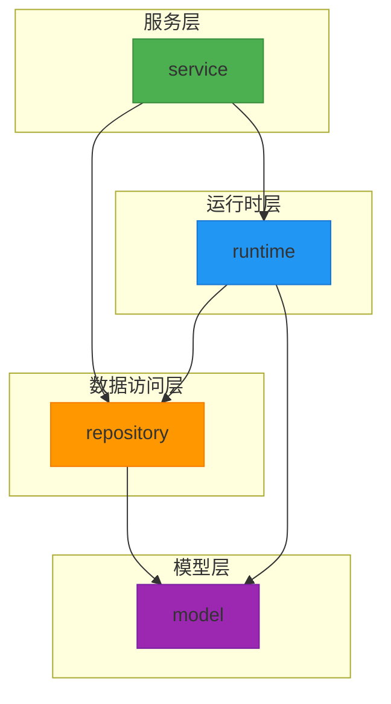
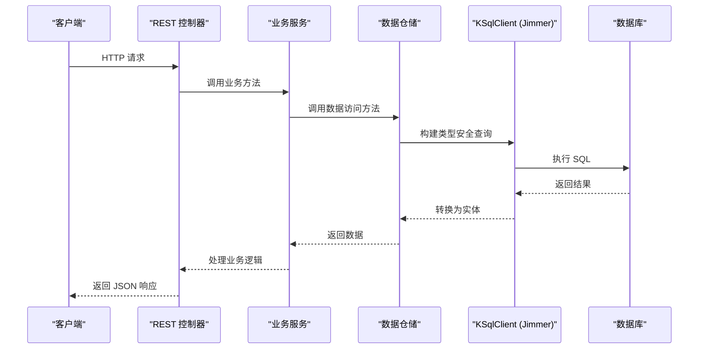
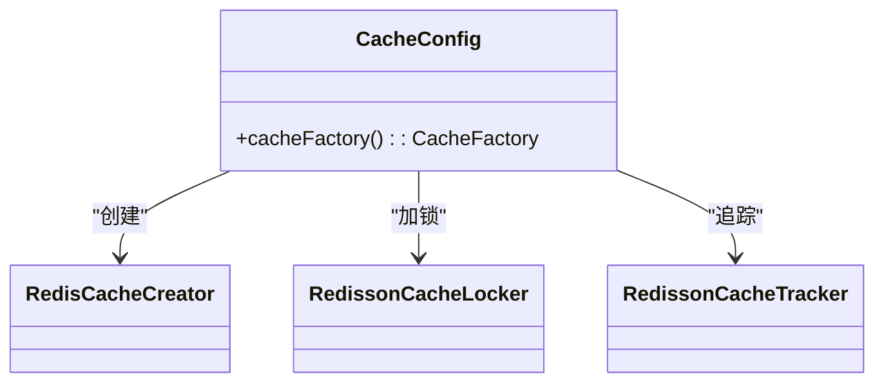
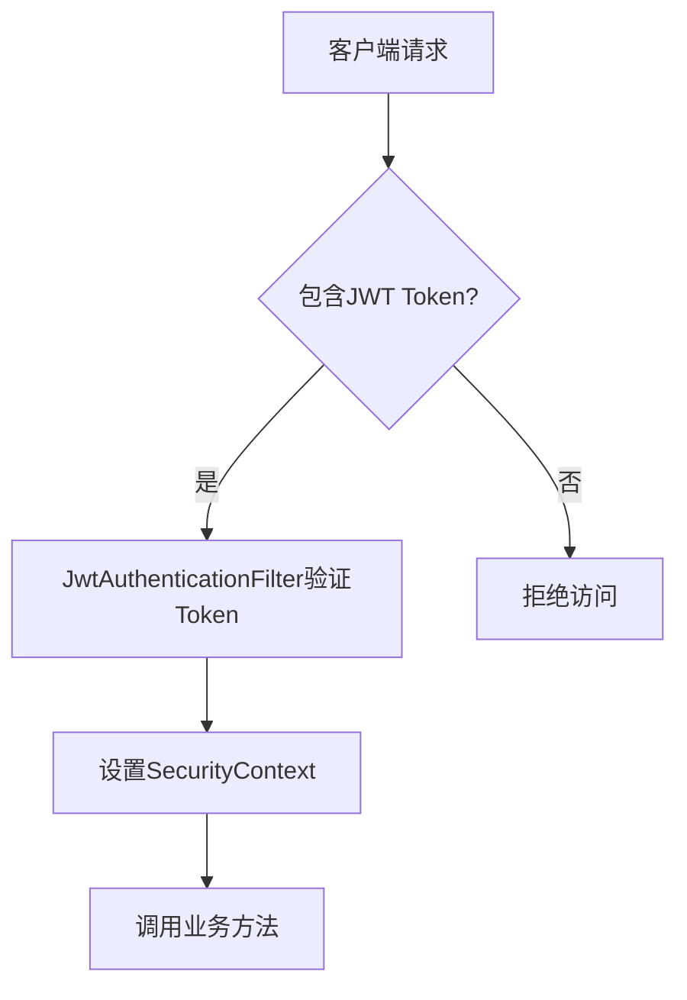

# 项目概述

<cite>
**本文档引用的文件**  
- [README.md](file://README.md)
- [build.gradle.kts](file://build.gradle.kts)
- [settings.gradle.kts](file://settings.gradle.kts)
- [application.yml](file://service/src/main/resources/application.yml)
- [App.kt](file://service/src/main/kotlin/top/zztech/ainote/App.kt)
- [BaseEntity.kt](file://model/src/main/kotlin/top/zztech/ainote/model/common/BaseEntity.kt)
- [TenantAware.kt](file://model/src/main/kotlin/top/zztech/ainote/model/common/TenantAware.kt)
- [CorsConfig.kt](file://service/src/main/kotlin/top/zztech/ainote/cfg/CorsConfig.kt)
- [JwtSecurityConfig.kt](file://service/src/main/kotlin/top/zztech/ainote/cfg/JwtSecurityConfig.kt)
- [CacheConfig.kt](file://runtime/src/main/kotlin/top/zztech/ainote/runtime/cache/CacheConfig.kt)
- [LogAspect.kt](file://runtime/src/main/kotlin/top/zztech/ainote/runtime/aspect/LogAspect.kt)
- [BaseEntityDraftInterceptor.kt](file://runtime/src/main/kotlin/top/zztech/ainote/runtime/interceptor/BaseEntityDraftInterceptor.kt)
- [TenantAwareDraftInterceptor.kt](file://runtime/src/main/kotlin/top/zztech/ainote/runtime/interceptor/TenantAwareDraftInterceptor.kt)
- [TenantFilterForNonCacheMode.kt](file://runtime/src/main/kotlin/top/zztech/ainote/runtime/filter/TenantFilterForNonCacheMode.kt)
- [AuthService.kt](file://service/src/main/kotlin/top/zztech/ainote/service/AuthService.kt)
- [NoteService.kt](file://service/src/main/kotlin/top/zztech/ainote/service/NoteService.kt)
- [LogService.kt](file://service/src/main/kotlin/top/zztech/ainote/service/LogService.kt)
- [OssConfig.kt](file://service/src/main/kotlin/top/zztech/ainote/cfg/OssConfig.kt)
</cite>

## 目录
1. [简介](#简介)
2. [项目结构](#项目结构)
3. [技术栈与构建系统](#技术栈与构建系统)
4. [核心架构设计](#核心架构设计)
5. [多模块依赖关系](#多模块依赖关系)
6. [数据库与缓存支持](#数据库与缓存支持)
7. [核心功能特性](#核心功能特性)
8. [运行与部署](#运行与部署)
9. [扩展与自定义](#扩展与自定义)
10. [总结](#总结)

## 简介

ainote-server 是一个基于 Kotlin 和 Jimmer ORM 构建的现代化 REST API 服务器，旨在为开发者提供一个开箱即用、结构清晰、功能完备的后端服务模板。项目采用 Spring Boot 3.5.6 框架，结合 Gradle 与 KSP（Kotlin Symbol Processing）构建工具，实现了高性能、类型安全的数据访问与灵活的业务扩展能力。

本项目不仅支持 H2、MySQL、PostgreSQL 等多种数据库，还可选集成 Redis 缓存以提升系统性能。其内置多租户支持、自动审计字段管理、CORS 配置、OpenAPI 文档生成及 TypeScript 客户端自动生成等核心功能，极大简化了企业级应用的开发流程。

无论是初学者还是高级开发者，均可通过此项目快速理解现代 Kotlin 后端开发的最佳实践，并将其作为模板进行定制化开发。

**Section sources**
- [README.md](file://README.md#L1-L235)

## 项目结构

ainote-server 采用清晰的多模块架构，将不同职责的代码分离到独立模块中，提升可维护性与可测试性。整体结构如下：

```
ainote-server/
├── model/          # 实体定义和公共基类
├── repository/     # 数据访问层 (Spring Data 风格仓储)
├── runtime/        # 运行时配置 (过滤器、拦截器、解析器、缓存)
└── service/        # 服务层和 REST 控制器
```

各模块职责明确：
- **model**：定义所有持久化实体及其公共基类（如 `BaseEntity` 和 `TenantAware`），是整个系统数据模型的核心。
- **repository**：封装数据访问逻辑，基于 Jimmer 提供类型安全的查询接口。
- **runtime**：包含运行时所需的切面、拦截器、缓存配置、安全工具等基础设施。
- **service**：实现业务逻辑与 REST API 接口，是外部请求的入口。

这种分层设计确保了高内聚、低耦合，便于团队协作与持续集成。



**Diagram sources**
- [README.md](file://README.md#L14-L32)
- [settings.gradle.kts](file://settings.gradle.kts#L1-L6)

**Section sources**
- [README.md](file://README.md#L14-L32)
- [settings.gradle.kts](file://settings.gradle.kts#L1-L6)

## 技术栈与构建系统

ainote-server 采用现代化的技术栈，确保开发效率与运行性能的平衡：

- **编程语言**：Kotlin 2.1.20，利用其空安全、扩展函数、数据类等特性提升代码质量。
- **框架**：Spring Boot 3.5.6，提供自动配置、嵌入式服务器、健康检查等企业级功能。
- **ORM**：Jimmer 0.9.117，专为 Kotlin 设计的类型安全 ORM，支持 Object Fetcher、Smart Save、DTO 自动生成等高级特性。
- **构建工具**：Gradle + KSP（Kotlin Symbol Processing），在编译期生成高效代码，避免反射开销。
- **JDK 版本**：要求 JDK 17 或更高版本，充分利用现代 JVM 特性。

项目使用 Gradle Wrapper（`gradlew`）管理构建，确保环境一致性。首次构建需执行 `./gradlew build` 以生成 KSP 所需的代码，之后可在 IDE 中正常运行。

**Section sources**
- [README.md](file://README.md#L7-L10)
- [build.gradle.kts](file://build.gradle.kts#L1-L7)

## 核心架构设计

ainote-server 的架构设计围绕 Jimmer ORM 的能力展开，结合 Spring Boot 的生态优势，构建了一个类型安全、可扩展的 REST 服务。

### 核心组件交互流程



**Diagram sources**
- [AuthService.kt](file://service/src/main/kotlin/top/zztech/ainote/service/AuthService.kt#L38-L90)
- [NoteService.kt](file://service/src/main/kotlin/top/zztech/ainote/service/NoteService.kt#L25-L32)
- [LogService.kt](file://service/src/main/kotlin/top/zztech/ainote/service/LogService.kt#L30-L88)

### 基础实体与审计字段

所有实体继承自 `BaseEntity` 接口，自动包含 `createdTime` 和 `modifiedTime` 字段。这些字段由 `BaseEntityDraftInterceptor` 在保存时自动填充，无需手动设置。

```kotlin
interface BaseEntity {
    val createdTime: LocalDateTime
    val modifiedTime: LocalDateTime
}
```

**Section sources**
- [BaseEntity.kt](file://model/src/main/kotlin/top/zztech/ainote/model/common/BaseEntity.kt#L7-L29)

### 多租户支持

通过 `TenantAware` 接口实现多租户隔离，所有租户感知实体均需实现该接口。系统通过 `TenantFilterForNonCacheMode` 自动添加租户过滤条件，并通过 `TenantAwareDraftInterceptor` 自动填充当前租户值。

```kotlin
interface TenantAware {
    val tenant: String
}
```

**Section sources**
- [TenantAware.kt](file://model/src/main/kotlin/top/zztech/ainote/model/common/TenantAware.kt#L6-L16)
- [TenantAwareDraftInterceptor.kt](file://runtime/src/main/kotlin/top/zztech/ainote/runtime/interceptor/TenantAwareDraftInterceptor.kt#L11-L21)
- [TenantFilterForNonCacheMode.kt](file://runtime/src/main/kotlin/top/zztech/ainote/runtime/filter/TenantFilterForNonCacheMode.kt#L14-L25)

## 多模块依赖关系

项目模块之间存在明确的依赖链，确保职责分离与编译顺序正确：

```
service → repository → model
service → runtime → model
runtime → repository → model
```

- **model** 为最底层，被所有其他模块依赖。
- **repository** 依赖 model 并提供数据访问能力。
- **runtime** 提供运行时支持，可独立于 service 使用。
- **service** 作为顶层模块，整合所有组件并暴露 API。

这种依赖结构避免了循环引用，支持模块化测试与独立部署。

**Section sources**
- [README.md](file://README.md#L26-L32)

## 数据库与缓存支持

### 数据库配置

项目默认使用 H2 内存数据库，适用于开发与测试。生产环境可切换至 MySQL 或 PostgreSQL，只需修改 `application.yml` 中的 `spring.datasource` 配置即可。

支持的数据库：
- H2（默认）
- MySQL
- PostgreSQL

配置示例（PostgreSQL）：
```yaml
spring:
  datasource:
    driver-class-name: org.postgresql.Driver
    url: jdbc:postgresql://localhost:5432/ainote
    username: postgres
    password: your_password
```

**Section sources**
- [application.yml](file://service/src/main/resources/application.yml#L1-L14)
- [README.md](file://README.md#L148-L176)

### Redis 缓存（可选）

通过 Redisson 集成 Redis，实现多层缓存（本地 + 远程）。启用方式：
1. 启动 Redis 服务
2. 配置 `spring.redis.host` 和 `port`
3. 重启应用

缓存配置由 `CacheConfig.kt` 实现，支持对象缓存、关联 ID 缓存、多视图缓存等高级特性。



**Diagram sources**
- [CacheConfig.kt](file://runtime/src/main/kotlin/top/zztech/ainote/runtime/cache/CacheConfig.kt#L21-L57)

**Section sources**
- [CacheConfig.kt](file://runtime/src/main/kotlin/top/zztech/ainote/runtime/cache/CacheConfig.kt#L21-L57)
- [README.md](file://README.md#L178-L190)

## 核心功能特性

### 自动化审计与日志

- **审计字段自动填充**：通过 `BaseEntityDraftInterceptor` 自动设置 `createdTime` 和 `modifiedTime`。
- **操作日志记录**：使用 `@LogOperation` 注解和 `LogAspect` AOP 切面，自动记录关键操作（如登录、注册、删除）。
- 日志内容包含用户、IP、User-Agent、请求方法、状态码等信息，便于审计追踪。

**Section sources**
- [BaseEntityDraftInterceptor.kt](file://runtime/src/main/kotlin/top/zztech/ainote/runtime/interceptor/BaseEntityDraftInterceptor.kt#L11-L22)
- [LogAspect.kt](file://runtime/src/main/kotlin/top/zztech/ainote/runtime/aspect/LogAspect.kt#L32-L158)

### 安全与认证

- 基于 JWT 的无状态认证
- 使用 `JwtAuthenticationFilter` 拦截请求并验证 Token
- 密码使用 BCrypt 加密存储
- 支持方法级权限控制（`@EnableMethodSecurity`）



**Diagram sources**
- [JwtSecurityConfig.kt](file://service/src/main/kotlin/top/zztech/ainote/cfg/JwtSecurityConfig.kt#L23-L68)
- [JwtAuthenticationFilter.kt](file://runtime/src/main/kotlin/top/zztech/ainote/runtime/utility/JwtAuthenticationFilter.kt)

**Section sources**
- [JwtSecurityConfig.kt](file://service/src/main/kotlin/top/zztech/ainote/cfg/JwtSecurityConfig.kt#L23-L68)

### 跨域与 API 文档

- **CORS 配置**：通过 `CorsConfig` 允许所有来源、方法和头部，适合开发环境。
- **OpenAPI 文档**：自动生成 `/openapi.yml` 和 Swagger UI（`/openapi.html`）。
- **TypeScript 客户端**：可通过 `/ts.zip` 下载自动生成的前端 SDK。

**Section sources**
- [CorsConfig.kt](file://service/src/main/kotlin/top/zztech/ainote/cfg/CorsConfig.kt#L7-L16)
- [application.yml](file://service/src/main/resources/application.yml#L23-L36)

## 运行与部署

### 开发运行

```bash
./gradlew :service:bootRun
```

或在 IDE 中运行 `App.kt` 的 `main` 函数。

访问地址：`http://localhost:8080`

### 生产构建

```bash
./gradlew clean build
```

生成的 JAR 文件位于 `service/build/libs/`，可通过以下命令运行：

```bash
java -jar service/build/libs/service-1.0.0.jar
```

**Section sources**
- [README.md](file://README.md#L57-L204)
- [App.kt](file://service/src/main/kotlin/top/zztech/ainote/App.kt#L7-L13)

## 扩展与自定义

ainote-server 可作为通用后端模板进行二次开发：

1. **添加新实体**：在 `model` 中定义接口，`repository` 中创建仓储，`service` 中编写控制器。
2. **禁用多租户**：移除 `TenantAware` 接口及相关过滤器。
3. **自定义缓存策略**：修改 `CacheConfig.kt`。
4. **集成 OSS**：通过 `OssConfig.kt` 配置阿里云对象存储。
5. **添加拦截器**：在 `runtime/interceptor/` 中新增 `DraftInterceptor`。

项目鼓励开发者根据实际业务需求进行裁剪与扩展，快速构建专属服务。

**Section sources**
- [README.md](file://README.md#L214-L221)
- [OssConfig.kt](file://service/src/main/kotlin/top/zztech/ainote/cfg/OssConfig.kt#L22-L53)

## 总结

ainote-server 是一个功能完整、结构清晰的 Kotlin REST API 模板项目，融合了 Jimmer ORM 的类型安全优势与 Spring Boot 的企业级能力。其多模块架构、自动化审计、多租户支持、缓存集成与 API 自动生成等特性，显著提升了开发效率与系统可维护性。

无论是用于学习现代 Kotlin 后端开发，还是作为生产项目的起点，ainote-server 都提供了坚实的基础与广阔的扩展空间。

**Section sources**
- [README.md](file://README.md#L1-L235)