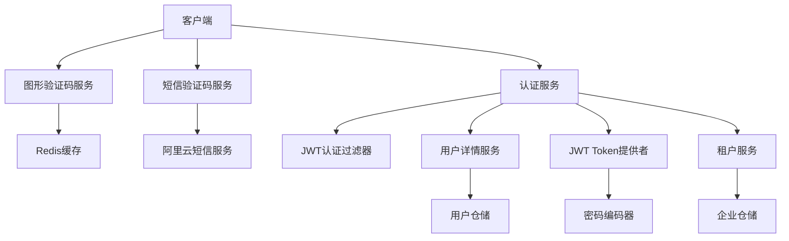
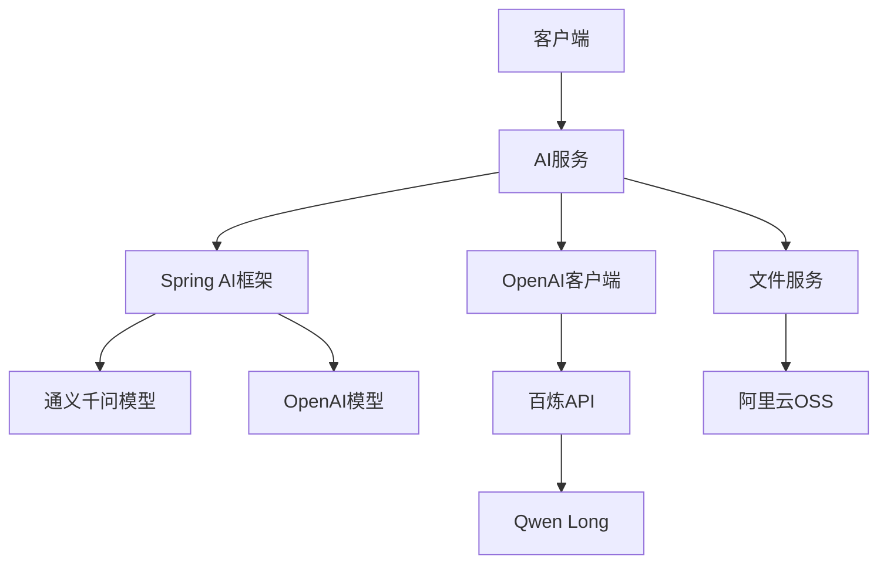
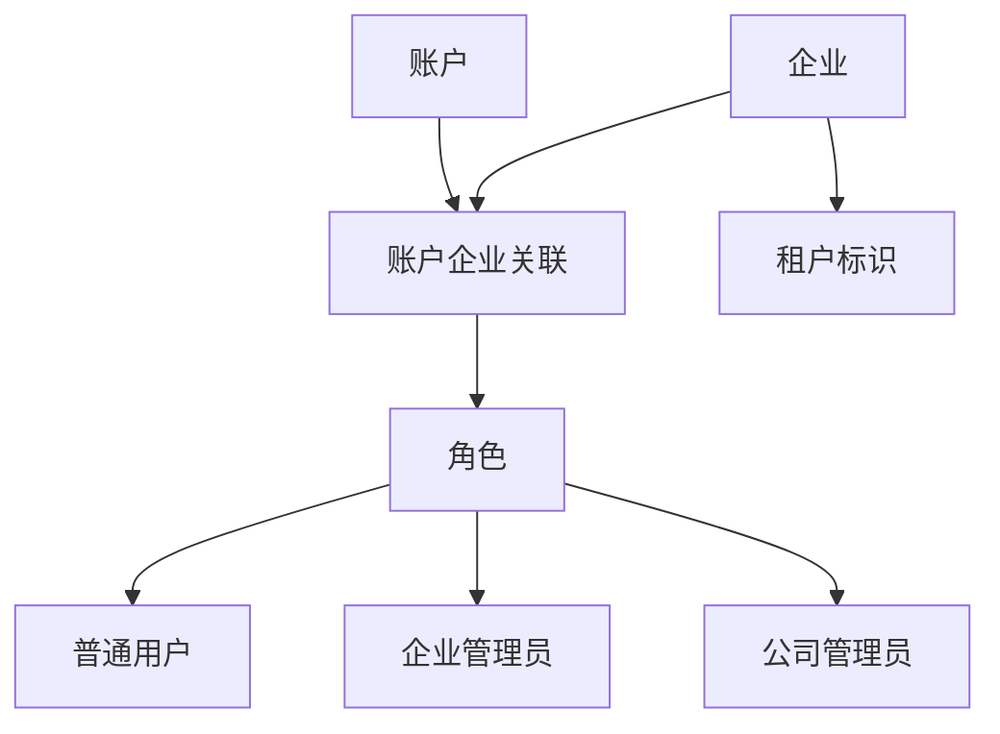

# 核心功能架构

## 简介

本文档详细介绍 ainote-server 项目中各个核心服务模块的架构设计，包括认证服务、短信验证服务、AI 服务、用户管理、企业服务、笔记服务、日志服务、文件存储服务和台账服务等。通过理解这些服务的内部实现和交互关系，开发者可以更好地进行功能扩展和系统维护。

## 认证服务架构

### 整体架构

认证服务基于 JWT（JSON Web Token）实现无状态认证，支持多种登录方式：



### 认证方式

#### 1. 用户名密码登录

- **图形验证码验证**: 防止机器人攻击
- **用户名密码验证**: 使用 Spring Security AuthenticationManager
- **JWT Token 生成**: 验证成功后生成访问令牌
- **租户信息获取**: 查询用户选择的企业作为当前租户

#### 2. 短信验证码登录/注册

- **短信验证码发送**: 调用阿里云短信服务发送验证码
- **验证码校验**: 从 Redis 中读取并验证验证码
- **用户注册**: 首次使用自动创建账户
- **JWT Token 生成**: 验证成功后生成访问令牌
- **租户信息**: 新用户默认使用 "default" 租户

### 图形验证码服务

使用 Hutool Captcha 生成图形验证码：

```kotlin
@GetMapping("/captcha")
fun captcha(): CaptchaResponse {
    val lineCaptcha = CaptchaUtil.createLineCaptcha(200, 100)
    val key = UUID.randomUUID().toString()
    // 存储到 Redis，30 分钟过期
    redissonClient.getBucket<String>("captcha:" + key)
        .set(lineCaptcha.getCode(), 30, TimeUnit.MINUTES)
    return CaptchaResponse(key, lineCaptcha.imageBase64Data)
}
```

### 短信验证码服务

集成阿里云号码认证服务（PNVS）：

```kotlin
@Service
class SmsVerifyCodeService {
    fun send(scene: String, phone: String): SmsSendResult {
        // 检查发送间隔
        // 生成随机验证码
        // 调用阿里云短信 API
        // 存储到 Redis
    }

    fun verify(scene: String, phone: String, code: String): Boolean {
        // 从 Redis 获取验证码
        // 验证码比对
        // 验证成功后删除验证码
    }
}
```

### 核心组件

#### AuthService

认证服务的核心实现类：

```kotlin
@Service
@Transactional
class AuthService(
    private val accountRepository: AccountRepository,
    private val passwordEncoder: BCryptPasswordEncoder,
    private val jwtTokenProvider: JwtTokenProvider
) {

    fun login(loginRequest: LoginRequest): LoginResponse {
        val user = accountRepository.findByUsername(loginRequest.username)
            ?: throw AuthenticationException("用户名或密码错误")

        if (!passwordEncoder.matches(loginRequest.password, user.password)) {
            throw AuthenticationException("用户名或密码错误")
        }

        val token = jwtTokenProvider.generateToken(user)
        return LoginResponse(token, UserView.from(user))
    }

    fun register(registerRequest: RegisterRequest): UserView {
        if (accountRepository.existsByUsername(registerRequest.username)) {
            throw BusinessException("用户名已存在")
        }

        val user = Account {
            username = registerRequest.username
            password = passwordEncoder.encode(registerRequest.password)
            email = registerRequest.email
            phone = registerRequest.phone
            status = UserStatus.ACTIVE
        }

        val savedUser = accountRepository.save(user)
        return UserView.from(savedUser)
    }
}
```

#### JwtTokenProvider

JWT Token 的生成和验证：

```kotlin
@Component
class JwtTokenProvider(
    @Value("\${jwt.secret}") private val secret: String,
    @Value("\${jwt.expiration}") private val expiration: Long
) {

    fun generateToken(user: Account): String {
        val claims = Jwts.claims().setSubject(user.username)
        claims["userId"] = user.id
        claims["roles"] = user.roles.map { it.name }

        return Jwts.builder()
            .setClaims(claims)
            .setIssuedAt(Date())
            .setExpiration(Date(System.currentTimeMillis() + expiration))
            .signWith(SignatureAlgorithm.HS512, secret)
            .compact()
    }

    fun validateToken(token: String): Boolean {
        return try {
            Jwts.parser().setSigningKey(secret).parseClaimsJws(token)
            true
        } catch (e: Exception) {
            false
        }
    }
}
```

#### JwtAuthenticationFilter

JWT 认证过滤器：

```kotlin
@Component
class JwtAuthenticationFilter(
    private val jwtTokenProvider: JwtTokenProvider,
    private val userDetailsService: AccountUserDetailsService
) : OncePerRequestFilter() {

    override fun doFilterInternal(
        request: HttpServletRequest,
        response: HttpServletResponse,
        filterChain: FilterChain
    ) {
        val token = getTokenFromRequest(request)

        if (token != null && jwtTokenProvider.validateToken(token)) {
            val username = jwtTokenProvider.getUsernameFromToken(token)
            val userDetails = userDetailsService.loadUserByUsername(username)

            val authentication = UsernamePasswordAuthenticationToken(
                userDetails, null, userDetails.authorities
            )
            SecurityContextHolder.getContext().authentication = authentication
        }

        filterChain.doFilter(request, response)
    }
}
```

### 安全配置

Spring Security 配置类：

```kotlin
@Configuration
@EnableWebSecurity
@EnableMethodSecurity(prePostEnabled = true)
class JwtSecurityConfig(
    private val jwtAuthenticationFilter: JwtAuthenticationFilter,
    private val jwtAuthenticationEntryPoint: JwtAuthenticationEntryPoint
) {

    @Bean
    fun securityFilterChain(http: HttpSecurity): SecurityFilterChain {
        return http
            .csrf { it.disable() }
            .sessionManagement { it.sessionCreationPolicy(SessionCreationPolicy.STATELESS) }
            .authorizeHttpRequests {
                it.requestMatchers("/api/auth/**").permitAll()
                 .requestMatchers("/openapi/**", "/ts.zip").permitAll()
                 .anyRequest().authenticated()
            }
            .exceptionHandling { it.authenticationEntryPoint(jwtAuthenticationEntryPoint) }
            .addFilterBefore(jwtAuthenticationFilter, UsernamePasswordAuthenticationFilter::class.java)
            .build()
    }
}
```

## 笔记服务架构

### 服务层次结构

笔记服务采用经典的分层架构：


### 核心实现

#### NoteService

笔记服务的业务逻辑实现：

```kotlin
@RestController
@RequestMapping("/api/notes")
@Transactional
class NoteService(
    private val noteRepository: NoteRepository,
    private val accountRepository: AccountRepository,
    private val logService: LogService
) {

    @GetMapping
    fun getNotes(
        @RequestParam(defaultValue = "0") page: Int,
        @RequestParam(defaultValue = "20") size: Int,
        @RequestParam(required = false) search: String?
    ): Page<NoteView> {
        val currentUser = getCurrentUser()

        val query = sqlClient.createQuery(Note) {
            where(table.author.id eq currentUser.id)
            search?.let {
                where(table.title ilike "%$it%" or table.content ilike "%$it%")
            }
            orderBy(table.createdTime.desc())
            select(table.fetch(NoteView::class))
        }

        return query.fetchPage(page, size)
    }

    @PostMapping
    @LogOperation("创建笔记")
    fun createNote(@Valid @RequestBody request: CreateNoteRequest): NoteView {
        val currentUser = getCurrentUser()

        val note = Note {
            title = request.title
            content = request.content
            author = currentUser
        }

        val savedNote = noteRepository.save(note)
        return NoteView.from(savedNote)
    }

    @PutMapping("/{id}")
    @LogOperation("更新笔记")
    fun updateNote(
        @PathVariable id: Long,
        @Valid @RequestBody request: UpdateNoteRequest
    ): NoteView {
        val currentUser = getCurrentUser()

        val note = noteRepository.findById(id)
            ?: throw EntityNotFoundException("笔记不存在")

        if (note.author.id != currentUser.id) {
            throw AccessDeniedException("无权限修改此笔记")
        }

        val updatedNote = noteRepository.save(note.apply {
            title = request.title
            content = request.content
        })

        return NoteView.from(updatedNote)
    }
}
```

#### NoteRepository

笔记数据访问层：

```kotlin
@Repository
class NoteRepository(sql: KSqlClient) : AbstractKotlinRepository<Note, Long>(sql) {

    fun findByAuthorId(authorId: Long): List<Note> {
        return sqlClient.createQuery(Note) {
            where(table.author.id eq authorId)
            orderBy(table.createdTime.desc())
            select(table)
        }.execute()
    }

    fun searchNotes(authorId: Long, keyword: String): List<Note> {
        return sqlClient.createQuery(Note) {
            where(
                table.author.id eq authorId,
                table.title ilike "%$keyword%" or table.content ilike "%$keyword%"
            )
            orderBy(table.createdTime.desc())
            select(table)
        }.execute()
    }
}
```

## 日志服务架构

### 日志记录机制

日志服务采用 AOP（面向切面编程）实现自动化的操作日志记录：


### 核心组件

#### LogOperation 注解

```kotlin
@Target(AnnotationTarget.FUNCTION)
@Retention(AnnotationRetention.RUNTIME)
annotation class LogOperation(
    val action: String,
    val description: String = ""
)
```

#### LogAspect 切面实现

```kotlin
@Aspect
@Component
class LogService(
    private val logRepository: LogRepository
) {

    @Around("@annotation(logOperation)")
    @LogOperation("API调用")
    fun logAround(
        joinPoint: ProceedingJoinPoint,
        logOperation: LogOperation
    ): Any? {
        val startTime = System.currentTimeMillis()

        try {
            val result = joinPoint.proceed()
            val endTime = System.currentTimeMillis()
            val duration = endTime - startTime

            // 记录成功日志
            recordLog(joinPoint, logOperation, "SUCCESS", duration, null)
            return result

        } catch (exception: Exception) {
            val endTime = System.currentTimeMillis()
            val duration = endTime - startTime

            // 记录失败日志
            recordLog(joinPoint, logOperation, "FAILED", duration, exception.message)
            throw exception
        }
    }

    private fun recordLog(
        joinPoint: ProceedingJoinPoint,
        logOperation: LogOperation,
        status: String,
        duration: Long,
        errorMessage: String?
    ) {
        val request = getCurrentRequest()
        val currentUser = getCurrentUser()

        val log = Log {
            user = currentUser
            action = logOperation.action
            method = joinPoint.signature.name
            path = request?.requestURI
            statusCode = if (status == "SUCCESS") 200 else 500
            ipAddress = getClientIpAddress(request)
            userAgent = request?.getHeader("User-Agent")
            requestTime = LocalDateTime.now()
            duration = duration
            errorMessage = errorMessage
        }

        logRepository.save(log)
    }
}
```

## 文件存储服务架构

### OSS 集成架构

文件存储服务基于阿里云 OSS 实现，支持文件上传、下载和管理：


### 核心实现

#### OssService

```kotlin
@Service
class OssService(
    private val ossClient: OSS,
    @Value("\${aliyun.oss.bucket-name}") private val bucketName: String,
    @Value("\${aliyun.oss.endpoint}") private val endpoint: String
) {

    fun uploadFile(file: MultipartFile, fileName: String): String {
        val objectName = generateUniqueFileName(fileName)

        val putObjectRequest = PutObjectRequest(bucketName, objectName, file.inputStream)
        putObjectRequest.metadata = ObjectMetadata().apply {
            contentLength = file.size
            contentType = file.contentType
        }

        ossClient.putObject(putObjectRequest)
        return "https://$bucketName.$endpoint/$objectName"
    }

    fun deleteFile(fileUrl: String): Boolean {
        val objectName = extractObjectNameFromUrl(fileUrl)
        return try {
            ossClient.deleteObject(bucketName, objectName)
            true
        } catch (e: Exception) {
            false
        }
    }

    private fun generateUniqueFileName(originalFileName: String): String {
        val timestamp = System.currentTimeMillis()
        val uuid = UUID.randomUUID().toString().replace("-", "")
        val extension = originalFileName.substringAfterLast(".", "")
        return "$timestamp-$uuid.$extension"
    }
}
```

#### FileController

```kotlin
@RestController
@RequestMapping("/api/files")
@Transactional
class FileService(
    private val staticFileRepository: StaticFileRepository,
    private val ossService: OssService
) {

    @PostMapping("/upload")
    @LogOperation("上传文件")
    fun uploadFile(
        @RequestParam("file") file: MultipartFile
    ): StaticFileView {
        val currentUser = getCurrentUser()

        // 上传到 OSS
        val fileUrl = ossService.uploadFile(file, file.originalFilename ?: "unknown")

        // 保存文件元数据
        val staticFile = StaticFile {
            fileName = extractFileName(fileUrl)
            originalName = file.originalFilename ?: "unknown"
            fileSize = file.size
            fileType = FileType.fromMimeType(file.contentType)
            fileUrl = fileUrl
            uploadedBy = currentUser
        }

        val savedFile = staticFileRepository.save(staticFile)
        return StaticFileView.from(savedFile)
    }

    @DeleteMapping("/{id}")
    @LogOperation("删除文件")
    fun deleteFile(@PathVariable id: Long) {
        val currentUser = getCurrentUser()

        val file = staticFileRepository.findById(id)
            ?: throw EntityNotFoundException("文件不存在")

        if (file.uploadedBy.id != currentUser.id) {
            throw AccessDeniedException("无权限删除此文件")
        }

        // 从 OSS 删除文件
        ossService.deleteFile(file.fileUrl)

        // 删除数据库记录
        staticFileRepository.delete(file)
    }
}
```

## 台账服务架构

### 台账系统架构

台账服务支持动态模板和记录管理：


### 核心实现

#### TemplateService（台账模板 REST 接口）

当前台账模板模块采用 `model-repository-service` 分层：

- **Model**: `LedgerTemplate`（Jimmer Entity，支持多租户 `TenantAware`）
- **Repository**: `LedgerTemplateRepository`（`AbstractKotlinRepository` + `createQuery`）
- **Service**: `TemplateService`（REST Controller，对外暴露 `/template/**`）

Service 层遵循约定：

- **输入**：使用 dto（如 `CreateTemplate`、`ChangeTemplateStatus`）
- **查询**：使用 specification dto（如 `SearchTemplate`）
- **返回**：使用 fetcher 控制字段（如 `LIST_TEMPLATE`、`SIMPLE_TEMPLATE`）

关键接口（简要）：

- **POST** `/template/add` 创建模板
- **GET** `/template/myTemplatePage` 我的可见模板分页
- **GET** `/template/tenantTemplatePage` 租户下模板分页
- **GET** `/template/{id}` 模板详情（`SIMPLE_TEMPLATE`）
- **PUT** `/template/changeStatus` 启用/禁用模板
- **DELETE** `/template/{id}` 删除模板

#### LedgerRecordService

```kotlin
@Service
@Transactional
class LedgerRecordService(
    private val recordRepository: LedgerRecordRepository,
    private val valueRepository: LedgerRecordValueRepository,
    private val templateRepository: LedgerTemplateRepository
) {

    fun createRecord(request: CreateRecordRequest): LedgerRecordView {
        val currentUser = getCurrentUser()
        val template = templateRepository.findById(request.templateId)
            ?: throw EntityNotFoundException("模板不存在")

        // 验证字段值
        validateFieldValues(template, request.values)

        val record = LedgerRecord {
            this.template = template
            createdBy = currentUser
        }

        val savedRecord = recordRepository.save(record)

        // 保存字段值
        request.values.forEach { valueRequest ->
            val value = LedgerRecordValue {
                record = savedRecord
                field = template.fields.find { it.id == valueRequest.fieldId }
                    ?: throw IllegalArgumentException("字段不存在")
                value = valueRequest.value
            }
            valueRepository.save(value)
        }

        return LedgerRecordView.from(savedRecord)
    }

    private fun validateFieldValues(template: LedgerTemplate, values: List<CreateValueRequest>) {
        template.fields.forEach { field ->
            val value = values.find { it.fieldId == field.id }

            if (field.required && (value == null || value.value.isNullOrBlank())) {
                throw IllegalArgumentException("字段 ${field.name} 是必填项")
            }

            // 类型验证
            value?.let {
                validateFieldType(field.fieldType, it.value)
            }
        }
    }

    private fun validateFieldType(fieldType: FieldType, value: String) {
        when (fieldType) {
            FieldType.DECIMAL -> {
                value.toDoubleOrNull()
                    ?: throw IllegalArgumentException("无效的数字格式")
            }
            FieldType.DATE -> {
                LocalDate.parse(value)
                    ?: throw IllegalArgumentException("无效的日期格式")
            }
            FieldType.INTEGER -> {
                value.toIntOrNull()
                    ?: throw IllegalArgumentException("无效的整数格式")
            }
            else -> {
                // 字符串类型无需验证
            }
        }
    }
}
```

## 服务间交互

### 依赖关系

各个服务模块之间存在清晰的依赖关系：


### 事务管理

服务层采用声明式事务管理：

```kotlin
@Service
@Transactional  // 类级别事务
class NoteService {

    @Transactional(readOnly = true)  // 只读事务
    fun getNote(id: Long): NoteView {
        // 查询操作
    }

    @Transactional  // 读写事务
    fun createNote(request: CreateNoteRequest): NoteView {
        // 创建操作
    }
}
```

### 异常处理

统一异常处理机制：

```kotlin
@RestControllerAdvice
class GlobalExceptionHandler {

    @ExceptionHandler(EntityNotFoundException::class)
    fun handleNotFound(exception: EntityNotFoundException): ResponseEntity<ErrorResponse> {
        return ResponseEntity
            .status(HttpStatus.NOT_FOUND)
            .body(ErrorResponse("NOT_FOUND", exception.message ?: "资源不存在"))
    }

    @ExceptionHandler(AccessDeniedException::class)
    fun handleAccessDenied(exception: AccessDeniedException): ResponseEntity<ErrorResponse> {
        return ResponseEntity
            .status(HttpStatus.FORBIDDEN)
            .body(ErrorResponse("ACCESS_DENIED", exception.message ?: "访问被拒绝"))
    }

    @ExceptionHandler(Exception::class)
    fun handleGenericException(exception: Exception): ResponseEntity<ErrorResponse> {
        return ResponseEntity
            .status(HttpStatus.INTERNAL_SERVER_ERROR)
            .body(ErrorResponse("INTERNAL_ERROR", "服务器内部错误"))
    }
}
```

通过以上架构设计，ainote-server 实现了模块化、可扩展、高内聚低耦合的服务架构，为后续的功能扩展和系统维护提供了良好的基础。

## AI 服务架构

### 整体架构

AI 服务集成了 Spring AI 框架，支持多种 AI 模型和服务提供商：



### AI 功能

#### 1. 智能对话

基础对话功能，支持通用问答：

```kotlin
@PostMapping("/chat")
fun chat(@RequestBody req: AiChatRequest): AiChatResponse {
    val result = chatModel.call(req.prompt)
    return AiChatResponse(result)
}
```

#### 2. 台账模板字段生成

根据模板信息和参考文档，自动生成台账模板字段定义：

```kotlin
@PostMapping("/template-fields")
fun generateTemplateFields(@RequestBody input: CreateTemplate): List<CreateTemplateField> {
    return generateTemplateFieldsByAi(input)
}
```

**工作流程**：
1. 检查是否提供参考文档文件
2. 如果有文件，上传到阿里云百炼平台
3. 构建 Prompt，包含模板信息和文件引用
4. 调用 Qwen Long 模型进行文件理解和内容生成
5. 使用 BeanOutputConverter 将 AI 输出转换为强类型对象
6. 如果文件处理失败，回退到纯文本模式

### Spring AI 集成

#### ChatModel

统一的消息对话接口：

```kotlin
interface ChatModel {
    fun call(prompt: String): String
}
```

#### 输出转换器

将 AI 输出的 JSON 自动转换为对象：

```kotlin
val converter = BeanOutputConverter(object : ParameterizedTypeReference<List<CreateTemplateField>>() {})
val result = chatModel.call(prompt)
val fields = converter.convert(result) ?: emptyList()
```

### Prompt 工程

系统使用结构化 Prompt 确保输出质量：

```kotlin
val systemPrompt = """
你是一个业务建模助手。根据给定的台账模板信息与引用文档，生成一组字段定义。
要求：
1) 只输出最终结果，不要输出任何解释、Markdown 或代码块标记。
2) 输出必须满足以下结构化格式要求：
${converter.format}
3) fieldType 只能使用以下枚举之一：TEXT,TEXTAREA,NUMBER,INTEGER,DECIMAL,DATE,DATETIME,TIME,BOOLEAN,SELECT,MULTISELECT,FILE,EMAIL,PHONE,URL
4) fieldName 使用英文 snake_case；fieldLabel 使用中文；sortOrder 从 0 递增。
5) 如果 fieldType 是 SELECT 或 MULTISELECT，则 fieldOptions 输出 JSON 字符串数组。
补充模板信息：
name: ${input.name}
description: ${input.description}
category: ${input.category}
"""
```

### 文件理解集成

使用阿里云百炼平台的文件理解能力：

```kotlin
// 上传文件
val fileParams = FileCreateParams.builder()
    .file(tmpPath)
    .purpose(FilePurpose.of("file-extract"))
    .build()
val bailianFileObject = bailianClient.files().create(fileParams)

// 在对话中引用文件
val chatParams = ChatCompletionCreateParams.builder()
    .addSystemMessage(systemPrompt)
    .addSystemMessage("fileid://${bailianFileId}")  // 引用文件
    .addUserMessage(userPrompt)
    .model(qwenLongModel)
    .build()
```

## 企业服务架构

### 企业组织架构



### 企业服务功能

#### 1. 企业 CRUD 操作

- **添加企业**: 系统自动生成 6 位数字租户标识
- **删除企业**: 级联删除相关数据
- **查询企业**: 支持分页和搜索

#### 2. 成员管理

- **加入企业**: 用户申请加入企业
- **成员列表**: 查询企业所有成员
- **设置管理员**: 设置用户为企业管理员

#### 3. 租户管理

每个企业有独立的租户标识（tenant），实现数据隔离：

```kotlin
@PostMapping("/add")
fun add(input: CompanyAddInput): UUID {
    // 生成随机的 tenant，6位数字
    val randomTenant = Random.nextInt(100000, 999999).toString()
    return companyRepository.save(input.copy(tenant = randomTenant)) {
        setMode(SaveMode.INSERT_ONLY)
    }.modifiedEntity.id
}
```

### 账户企业关联实体

`AccountCompanyEntity` 实现账户与企业的多对多关系：

- **account**: 关联的账户
- **company**: 关联的企业
- **role**: 用户在企业中的角色
- **choiceFlag**: 是否为用户当前选择的企业

### 角色权限体系

- **USER**: 普通用户
- **ADMIN**: 系统管理员
- **COMPANYADMIN**: 企业管理员

企业管理员可以：
- 管理企业成员
- 查看企业数据
- 配置企业设置