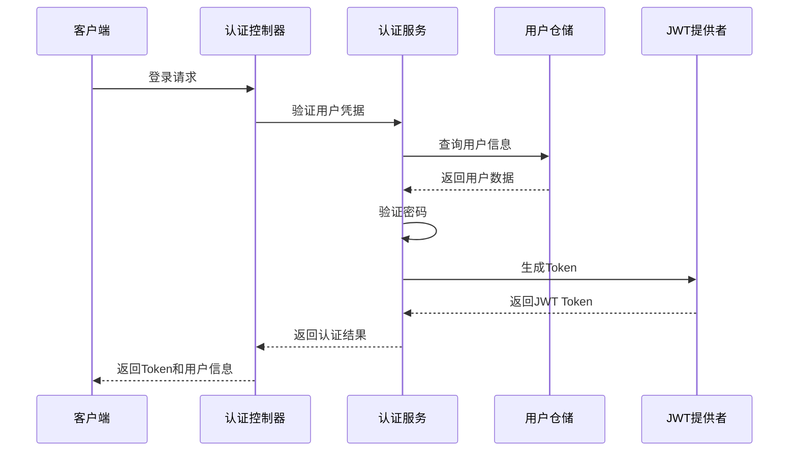

# 安全机制

## 简介

本文档详细介绍 ainote-server 项目的安全架构和机制，包括身份认证、授权控制、数据加密、输入验证、防护措施等多个方面的安全设计和实现。

## 认证架构

### JWT 认证流程

项目采用基于 JWT（JSON Web Token）的无状态认证机制：



### JWT Token 结构

JWT Token 包含以下关键信息：

```json
{
  "sub": "admin",
  "userId": 1,
  "roles": ["ADMIN", "USER"],
  "iat": 1640995200,
  "exp": 1641081600
}
```

- `sub`: 用户名
- `userId`: 用户ID
- `roles`: 用户角色列表
- `iat`: Token 签发时间
- `exp`: Token 过期时间

### 认证组件实现

#### JwtTokenProvider

```kotlin
@Component
class JwtTokenProvider(
    @Value("\${jwt.secret}") private val secret: String,
    @Value("\${jwt.expiration}") private val expiration: Long
) {

    private val key = Keys.hmacShaKeyFor(secret.toByteArray())

    fun generateToken(user: Account): String {
        val claims = Jwts.claims().setSubject(user.username)
        claims["userId"] = user.id
        claims["roles"] = user.roles.map { it.name }

        return Jwts.builder()
            .setClaims(claims)
            .setIssuedAt(Date())
            .setExpiration(Date(System.currentTimeMillis() + expiration))
            .signWith(key, SignatureAlgorithm.HS512)
            .compact()
    }

    fun validateToken(token: String): Boolean {
        return try {
            Jwts.parserBuilder()
                .setSigningKey(key)
                .build()
                .parseClaimsJws(token)
            true
        } catch (e: JwtException) {
            log.warn("Invalid JWT token: ${e.message}")
            false
        } catch (e: IllegalArgumentException) {
            log.warn("JWT token compact of handler are invalid: ${e.message}")
            false
        }
    }

    fun getClaimsFromToken(token: String): Claims {
        return Jwts.parserBuilder()
            .setSigningKey(key)
            .build()
            .parseClaimsJws(token)
            .body
    }

    fun getUsernameFromToken(token: String): String {
        return getClaimsFromToken(token).subject
    }

    fun getUserIdFromToken(token: String): Long {
        return getClaimsFromToken(token)["userId"] as Long
    }
}
```

#### JwtAuthenticationFilter

```kotlin
@Component
class JwtAuthenticationFilter(
    private val jwtTokenProvider: JwtTokenProvider,
    private val userDetailsService: AccountUserDetailsService
) : OncePerRequestFilter() {

    override fun doFilterInternal(
        request: HttpServletRequest,
        response: HttpServletResponse,
        filterChain: FilterChain
    ) {
        try {
            val token = getTokenFromRequest(request)

            if (token != null && jwtTokenProvider.validateToken(token)) {
                val username = jwtTokenProvider.getUsernameFromToken(token)
                val userDetails = userDetailsService.loadUserByUsername(username)

                val authentication = UsernamePasswordAuthenticationToken(
                    userDetails, null, userDetails.authorities
                )
                authentication.details = WebAuthenticationDetailsSource().buildDetails(request)

                SecurityContextHolder.getContext().authentication = authentication
            }
        } catch (ex: Exception) {
            log.error("Could not set user authentication in security context", ex)
        }

        filterChain.doFilter(request, response)
    }

    private fun getTokenFromRequest(request: HttpServletRequest): String? {
        val bearerToken = request.getHeader("Authorization")
        return if (bearerToken != null && bearerToken.startsWith("Bearer ")) {
            bearerToken.substring(7)
        } else null
    }
}
```

## 密码安全

### 密码加密存储

使用 BCrypt 算法进行密码加密：

```kotlin
@Configuration
class SecurityConfig {

    @Bean
    fun passwordEncoder(): PasswordEncoder {
        return BCryptPasswordEncoder(12)
    }
}
```

### 密码策略

#### 密码强度要求

```kotlin
@Component
class PasswordValidator {

    fun validate(password: String): ValidationResult {
        val errors = mutableListOf<String>()

        if (password.length < 8) {
            errors.add("密码长度至少8位")
        }

        if (!password.matches(Regex(".*[A-Z].*"))) {
            errors.add("密码必须包含大写字母")
        }

        if (!password.matches(Regex(".*[a-z].*"))) {
            errors.add("密码必须包含小写字母")
        }

        if (!password.matches(Regex(".*\\d.*"))) {
            errors.add("密码必须包含数字")
        }

        if (!password.matches(Regex(".*[!@#$%^&*()_+\\-=\\[\\]{};':\"\\\\|,.<>/?].*"))) {
            errors.add("密码必须包含特殊字符")
        }

        return ValidationResult(errors.isEmpty(), errors)
    }
}
```

### 密码重置功能

```kotlin
@Service
class PasswordResetService(
    private val accountRepository: AccountRepository,
    private val emailService: EmailService,
    private val passwordEncoder: PasswordEncoder
) {

    fun initiatePasswordReset(email: String) {
        val user = accountRepository.findByEmail(email)
            ?: return // 不透露用户是否存在

        val resetToken = generateSecureToken()
        val expirationTime = LocalDateTime.now().plusHours(1)

        user.passwordResetToken = resetToken
        user.passwordResetExpiration = expirationTime
        accountRepository.save(user)

        emailService.sendPasswordResetEmail(user.email, resetToken)
    }

    fun resetPassword(token: String, newPassword: String) {
        val user = accountRepository.findByPasswordResetToken(token)
            ?: throw InvalidTokenException("无效的重置令牌")

        if (user.passwordResetExpiration?.isBefore(LocalDateTime.now()) == true) {
            throw ExpiredTokenException("重置令牌已过期")
        }

        user.password = passwordEncoder.encode(newPassword)
        user.passwordResetToken = null
        user.passwordResetExpiration = null
        accountRepository.save(user)
    }
}
```

## 授权控制

### 基于角色的访问控制（RBAC）

#### 角色定义

```kotlin
enum class RoleEnum {
    ADMIN,      // 管理员
    USER,       // 普通用户
    GUEST       // 访客
}
```

#### 权限注解

```kotlin
@Target(AnnotationTarget.FUNCTION)
@Retention(AnnotationRetention.RUNTIME)
@PreAuthorize("hasRole('ADMIN')")
annotation class AdminOnly

@Target(AnnotationTarget.FUNCTION)
@Retention(AnnotationRetention.RUNTIME)
@PreAuthorize("hasRole('USER') or hasRole('ADMIN')")
annotation class UserAccess
```

#### 方法级权限控制

```kotlin
@RestController
@RequestMapping("/api/admin")
class AdminController {

    @AdminOnly
    @GetMapping("/users")
    fun getAllUsers(): List<UserView> {
        // 只有管理员可以访问
    }

    @UserAccess
    @GetMapping("/profile")
    fun getUserProfile(): UserView {
        // 所有认证用户都可以访问
    }
}
```

### 资源级权限控制

```kotlin
@Service
class NoteService {

    fun getNote(id: Long): NoteView {
        val note = noteRepository.findById(id)
            ?: throw EntityNotFoundException("笔记不存在")

        val currentUser = getCurrentUser()

        // 检查权限：笔记作者或管理员可以访问
        if (note.author.id != currentUser.id && !hasRole(currentUser, "ADMIN")) {
            throw AccessDeniedException("无权限访问此笔记")
        }

        return NoteView.from(note)
    }

    fun updateNote(id: Long, request: UpdateNoteRequest): NoteView {
        val note = noteRepository.findById(id)
            ?: throw EntityNotFoundException("笔记不存在")

        val currentUser = getCurrentUser()

        // 只有笔记作者可以修改
        if (note.author.id != currentUser.id) {
            throw AccessDeniedException("无权限修改此笔记")
        }

        // 更新逻辑
    }
}
```

## 输入验证与防护

### 输入验证

#### DTO 验证

```kotlin
data class CreateNoteRequest(
    @field:NotBlank(message = "标题不能为空")
    @field:Size(max = 200, message = "标题长度不能超过200字符")
    val title: String,

    @field:NotBlank(message = "内容不能为空")
    @field:Size(max = 10000, message = "内容长度不能超过10000字符")
    val content: String
)
```

#### 自定义验证器

```kotlin
@Component
class XSSValidator {

    fun sanitize(input: String): String {
        // 移除潜在的 XSS 攻击代码
        return input
            .replace("<script[^>]*>.*?</script>".toRegex(RegexOption.IGNORE_CASE), "")
            .replace("javascript:".toRegex(RegexOption.IGNORE_CASE), "")
            .replace("on\\w+\\s*=".toRegex(RegexOption.IGNORE_CASE), "")
    }

    fun containsXSS(input: String): Boolean {
        val xssPatterns = listOf(
            "<script",
            "javascript:",
            "onload=",
            "onerror=",
            "onclick=",
            "<iframe",
            "<object",
            "<embed"
        )

        return xssPatterns.any { pattern ->
            input.contains(pattern, ignoreCase = true)
        }
    }
}
```

### SQL 注入防护

Jimmer ORM 提供内置的 SQL 注入防护：

```kotlin
@Service
class NoteService {

    // 安全：使用参数化查询
    fun searchNotes(keyword: String): List<NoteView> {
        return sqlClient.createQuery(Note) {
            where(table.title ilike "%${keyword}%")  // Jimmer 自动参数化
            select(table.fetch(NoteView::class))
        }.execute()
    }

    // 危险：不要使用字符串拼接（这个例子展示什么是错误的做法）
    // fun dangerousSearch(keyword: String) {
    //     // ❌ 绝对不要这样做
    //     val sql = "SELECT * FROM note WHERE title LIKE '%$keyword%'"
    //     jdbcTemplate.query(sql, ...)
    // }
}
```

### CSRF 防护

由于使用 JWT 无状态认证，项目不依赖传统的 CSRF 防护，但仍采用以下措施：

```kotlin
@Configuration
class SecurityConfig {

    @Bean
    fun securityFilterChain(http: HttpSecurity): SecurityFilterChain {
        return http
            .csrf { it.disable() }  // JWT 无状态认证不需要 CSRF 防护
            .sessionManagement {
                it.sessionCreationPolicy(SessionCreationPolicy.STATELESS)
            }
            .headers {
                it.frameOptions().deny()  // 防止点击劫持
                it.contentTypeOptions().and()
                .httpStrictTransportSecurity()
            }
            .build()
    }
}
```

## 数据保护

### 敏感数据加密

```kotlin
@Component
class DataEncryptionService {

    private val key = Keys.secretKeyFor(Specs.symmetricAes())

    fun encrypt(plainText: String): String {
        val cipher = Cipher.getInstance("AES/GCM/NoPadding")
        cipher.init(Cipher.ENCRYPT_MODE, key)
        val encryptedData = cipher.doFinal(plainText.toByteArray())
        return Base64.getEncoder().encodeToString(encryptedData)
    }

    fun decrypt(encryptedText: String): String {
        val cipher = Cipher.getInstance("AES/GCM/NoPadding")
        cipher.init(Cipher.DECRYPT_MODE, key)
        val decryptedData = cipher.doFinal(Base64.getDecoder().decode(encryptedText))
        return String(decryptedData)
    }
}
```

### 数据脱敏

```kotlin
@Component
class DataMaskingService {

    fun maskEmail(email: String): String {
        val parts = email.split("@")
        if (parts.size != 2) return email

        val username = parts[0]
        val domain = parts[1]

        val maskedUsername = if (username.length <= 2) {
            "*".repeat(username.length)
        } else {
            username[0] + "*".repeat(username.length - 2) + username.last()
        }

        return "$maskedUsername@$domain"
    }

    fun maskPhoneNumber(phone: String): String {
        return if (phone.length == 11) {
            phone.substring(0, 3) + "****" + phone.substring(7)
        } else {
            phone
        }
    }
}
```

## 安全审计

### 安全事件日志

```kotlin
@Component
class SecurityAuditService {

    private val logger = LoggerFactory.getLogger(javaClass)

    fun logAuthenticationEvent(
        username: String,
        event: AuthEvent,
        ipAddress: String,
        userAgent: String,
        success: Boolean,
        failureReason: String? = null
    ) {
        val auditLog = SecurityAuditLog(
            username = username,
            event = event.name,
            ipAddress = ipAddress,
            userAgent = userAgent,
            success = success,
            failureReason = failureReason,
            timestamp = LocalDateTime.now()
        )

        if (success) {
            logger.info("Authentication success: {}", auditLog)
        } else {
            logger.warn("Authentication failure: {}", auditLog)
        }

        // 保存到数据库
        securityAuditRepository.save(auditLog)
    }

    enum class AuthEvent {
        LOGIN, LOGOUT, PASSWORD_CHANGE, TOKEN_REFRESH
    }
}
```

### 异常登录检测

```kotlin
@Component
class AnomalyDetectionService {

    fun detectSuspiciousActivity(username: String, ipAddress: String): List<SecurityAlert> {
        val alerts = mutableListOf<SecurityAlert>()

        // 检测异常登录地点
        val recentLogins = getRecentLogins(username, 24)
        val knownLocations = recentLogins.map { it.ipAddress }.toSet()

        if (ipAddress !in knownLocations && recentLogins.isNotEmpty()) {
            alerts.add(SecurityAlert("NEW_LOCATION", "从未知地点登录", ipAddress))
        }

        // 检测暴力破解尝试
        val failedAttempts = getFailedLoginAttempts(ipAddress, 1)
        if (failedAttempts >= 5) {
            alerts.add(SecurityAlert("BRUTE_FORCE", "检测到暴力破解尝试", ipAddress))
        }

        // 检测异常登录时间
        val currentHour = LocalTime.now().hour
        val userNormalHours = getUserNormalLoginHours(username)

        if (currentHour !in userNormalHours && recentLogins.isNotEmpty()) {
            alerts.add(SecurityAlert("UNUSUAL_TIME", "异常时间登录", ipAddress))
        }

        return alerts
    }
}
```

## 安全配置最佳实践

### 环境变量管理

```yaml
# application.yml
jwt:
  secret: ${JWT_SECRET:default-secret-change-in-production}
  expiration: ${JWT_EXPIRATION:86400000}

spring:
  datasource:
    password: ${DB_PASSWORD:default-password-change-in-production}

aliyun:
  oss:
    access-key-id: ${ALIYUN_ACCESS_KEY_ID:}
    access-key-secret: ${ALIYUN_ACCESS_KEY_SECRET:}
```

### 安全头配置

```kotlin
@Configuration
class SecurityHeaderConfig {

    @Bean
    fun securityFilterChain(http: HttpSecurity): SecurityFilterChain {
        return http
            .headers {
                it.frameOptions().deny()  // X-Frame-Options: DENY
                it.contentTypeOptions()   // X-Content-Type-Options: nosniff
                it.httpStrictTransportSecurity {  // HSTS
                    it.maxAgeInSeconds(31536000)
                    it.includeSubdomains(true)
                }
                it.referrerPolicy(ReferrerPolicyHeaderWriter.ReferrerPolicy.STRICT_ORIGIN_WHEN_CROSS_ORIGIN)
            }
            .build()
    }
}
```

### 限流保护

```kotlin
@Component
class RateLimitingService {

    private val rateLimiter = RateLimiter.create(10.0) // 每秒10个请求

    fun checkRateLimit(): Boolean {
        return rateLimiter.tryAcquire()
    }

    @Component
    class RateLimitingFilter : Filter {

        override fun doFilter(
            request: ServletRequest,
            response: ServletResponse,
            chain: FilterChain
        ) {
            val httpRequest = request as HttpServletRequest
            val httpResponse = response as HttpServletResponse

            if (!rateLimitingService.checkRateLimit()) {
                httpResponse.status = HttpStatus.TOO_MANY_REQUESTS.value()
                return
            }

            chain.doFilter(request, response)
        }
    }
}
```

通过以上多层次的安全机制，ainote-server 实现了全面的安全防护，确保数据和系统的安全性。开发者在使用这些安全功能时，应根据具体业务需求进行适当的配置和扩展。