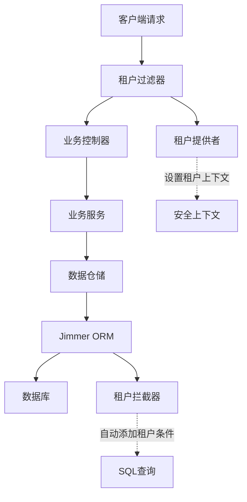

# 多租户支持

## 简介

ainote-server 项目内置了完整的多租户支持，通过 Jimmer ORM 的全局过滤器和拦截器机制，实现了透明的数据隔离。本文档详细介绍多租户架构的实现原理、配置方法和使用指南。

## 多租户架构概述

### 租户隔离策略

项目采用**行级安全（Row-Level Security）**策略，通过在数据表中添加 `tenant` 字段实现数据隔离：



### 租户识别机制

租户信息通过以下方式识别和传递：

1. **HTTP 请求头**: `tenant: {tenant_id}`
2. **租户上下文**: 线程本地存储当前租户信息
3. **自动过滤**: Jimmer 自动在所有查询中添加租户条件

## 核心组件实现

### TenantAware 接口

```kotlin
interface TenantAware {
    val tenant: String
}
```

所有需要租户隔离的实体都必须实现此接口：

```kotlin
@Entity
interface Note : BaseEntity, TenantAware {
    @Id
    @GeneratedValue(strategy = GenerationType.IDENTITY)
    val id: Long

    @Key
    val title: String

    @Column(columnDefinition = "TEXT")
    val content: String

    @ManyToOne
    val author: Account
}
```

### TenantProvider 租户提供者

```kotlin
@Component
class TenantProvider {

    companion object {
        private val tenantContext = ThreadLocal<String>()

        fun setCurrentTenant(tenant: String) {
            tenantContext.set(tenant)
        }

        fun getCurrentTenant(): String? {
            return tenantContext.get()
        }

        fun clear() {
            tenantContext.remove()
        }
    }

    fun getTenantFromRequest(): String? {
        val request = getCurrentRequest()
        return request?.getHeader("tenant")
    }
}
```

### TenantFilter 租户过滤器

```kotlin
@Component
class TenantFilterForNonCacheMode : Filter {

    override fun doFilter(
        request: ServletRequest,
        response: ServletResponse,
        chain: FilterChain
    ) {
        val httpRequest = request as HttpServletRequest
        val tenant = httpRequest.getHeader("tenant")

        if (tenant.isNullOrBlank()) {
            response.contentType = "application/json"
            response.status = HttpServletResponse.SC_BAD_REQUEST
            response.writer.write("""
                {
                    "error": "MISSING_TENANT",
                    "message": "缺少租户信息，请在请求头中添加 tenant 字段"
                }
            """.trimIndent())
            return
        }

        try {
            TenantProvider.setCurrentTenant(tenant)
            chain.doFilter(request, response)
        } finally {
            TenantProvider.clear()
        }
    }
}
```

### TenantAwareDraftInterceptor 租户拦截器

```kotlin
@Component
class TenantAwareDraftInterceptor : DraftInterceptor<TenantAware, TenantAwareDraft> {

    override fun beforeSave(draft: TenantAwareDraft, original: TenantAware?) {
        if (original == null) {
            // 新增实体时自动设置租户
            val currentTenant = TenantProvider.getCurrentTenant()
            if (currentTenant != null) {
                draft.tenant = currentTenant
            } else {
                throw IllegalStateException("无法确定当前租户")
            }
        }
        // 更新实体时保持租户不变
    }
}
```

## 数据库表设计

### 租户表结构

所有支持多租户的表都包含 `tenant` 字段：

```sql
-- 笔记表
CREATE TABLE note (
    id BIGSERIAL PRIMARY KEY,
    title VARCHAR(200) NOT NULL,
    content TEXT,
    author_id BIGINT NOT NULL,
    tenant VARCHAR(50) NOT NULL,
    created_time TIMESTAMP NOT NULL,
    modified_time TIMESTAMP NOT NULL,
    UNIQUE(tenant, id)  -- 租户内唯一
);

-- 文件表
CREATE TABLE static_file (
    id BIGSERIAL PRIMARY KEY,
    file_name VARCHAR(255) NOT NULL,
    original_name VARCHAR(255),
    file_size BIGINT,
    file_type VARCHAR(50),
    file_url VARCHAR(500),
    uploaded_by BIGINT,
    tenant VARCHAR(50) NOT NULL,
    uploaded_time TIMESTAMP NOT NULL,
    UNIQUE(tenant, id)
);

-- 租户索引优化
CREATE INDEX idx_note_tenant ON note(tenant);
CREATE INDEX idx_static_file_tenant ON static_file(tenant);
```

### 租户约束

```sql
-- 可选：添加 CHECK 约束限制租户值
ALTER TABLE note ADD CONSTRAINT chk_note_tenant
    CHECK (tenant IN ('a', 'b', 'c', 'default'));

-- 可选：创建分区表按租户分离数据（适用于大数据量场景）
CREATE TABLE note_partitioned (
    LIKE note INCLUDING ALL
) PARTITION BY LIST (tenant);

CREATE TABLE note_tenant_a PARTITION OF note_partitioned
    FOR VALUES IN ('a');

CREATE TABLE note_tenant_b PARTITION OF note_partitioned
    FOR VALUES IN ('b');
```

## 使用方式

### HTTP 请求示例

#### 创建笔记

```bash
curl -X POST http://localhost:8080/api/notes \
  -H "Authorization: Bearer YOUR_TOKEN" \
  -H "tenant: a" \
  -H "Content-Type: application/json" \
  -d '{
    "title": "租户A的笔记",
    "content": "这是租户A的内容"
  }'
```

#### 查询笔记

```bash
curl -X GET "http://localhost:8080/api/notes?page=0&size=10" \
  -H "Authorization: Bearer YOUR_TOKEN" \
  -H "tenant: a"
```

只会返回租户 `a` 的笔记数据。

### 服务层使用

```kotlin
@Service
class NoteService {

    fun getNotes(tenant: String): Page<NoteView> {
        // Jimmer 会自动添加 tenant = ? 条件
        return sqlClient.createQuery(Note) {
            select(table.fetch(NoteView::class))
        }.fetchPage(0, 20)
    }

    fun createNote(request: CreateNoteRequest): NoteView {
        val tenant = TenantProvider.getCurrentTenant()

        val note = Note {
            title = request.title
            content = request.content
            // tenant 字段会被 TenantAwareDraftInterceptor 自动填充
        }

        return NoteView.from(noteRepository.save(note))
    }
}
```

### 跨租户操作

#### 管理员跨租户查询

```kotlin
@Service
@PreAuthorize("hasRole('ADMIN')")
class AdminNoteService {

    fun getNotesFromAllTenants(): Map<String, List<NoteView>> {
        val result = mutableMapOf<String, List<NoteView>>()

        // 手动设置租户上下文
        listOf("a", "b", "c").forEach { tenant ->
            TenantProvider.setCurrentTenant(tenant)
            try {
                val notes = sqlClient.createQuery(Note) {
                    select(table.fetch(NoteView::class))
                }.execute()
                result[tenant] = notes.map { NoteView.from(it) }
            } finally {
                TenantProvider.clear()
            }
        }

        return result
    }
}
```

#### 租户数据迁移

```kotlin
@Service
@PreAuthorize("hasRole('ADMIN')")
class TenantMigrationService {

    fun migrateData(sourceTenant: String, targetTenant: String) {
        val notes = sqlClient.createQuery(Note) {
            where(table.tenant eq sourceTenant)
            select(table)
        }.execute()

        notes.forEach { note ->
            TenantProvider.setCurrentTenant(targetTenant)
            try {
                val newNote = Note {
                    title = note.title
                    content = note.content
                    author = note.author
                    // tenant 字段会自动设置为 targetTenant
                }
                noteRepository.save(newNote)
            } finally {
                TenantProvider.clear()
            }
        }
    }
}
```

## 配置管理

### 租户配置

```yaml
# application.yml
tenant:
  default: "default"
  allowed: ["a", "b", "c", "default"]
  isolation-level: "ROW_LEVEL"

jimmer:
  filters:
    tenant:
      target: top.zztech.ainote.model.TenantAware
      predicate: "tenant = :tenant"
      parameters:
        tenant: ${TENANT_CONTEXT:default}
```

### 动态租户配置

```kotlin
@Configuration
@ConfigurationProperties(prefix = "tenant")
class TenantConfig {
    var default: String = "default"
    var allowed: List<String> = listOf("default")
    var isolationLevel: String = "ROW_LEVEL"

    fun isValidTenant(tenant: String): Boolean {
        return tenant in allowed
    }
}

@Component
class TenantValidator(private val tenantConfig: TenantConfig) {

    fun validateTenant(tenant: String): Boolean {
        return tenantConfig.isValidTenant(tenant)
    }
}
```

## 性能优化

### 数据库索引优化

```sql
-- 租户字段索引
CREATE INDEX idx_note_tenant_created ON note(tenant, created_time);
CREATE INDEX idx_file_tenant_type ON static_file(tenant, file_type);

-- 复合索引优化查询
CREATE INDEX idx_note_author_tenant ON note(author_id, tenant);
CREATE INDEX idx_file_uploader_tenant ON static_file(uploaded_by, tenant);
```

### 查询优化

```kotlin
@Service
class OptimizedNoteService {

    fun getNotesByAuthor(authorId: Long): List<NoteView> {
        // 优化：同时利用租户和作者索引
        return sqlClient.createQuery(Note) {
            where(
                table.author.id eq authorId  // 自动添加 tenant 条件
            )
            orderBy(table.createdTime.desc())
            select(table.fetch(NoteView::class))
        }.execute()
    }

    fun searchNotes(keyword: String): List<NoteView> {
        // 优化：全文搜索索引
        return sqlClient.createQuery(Note) {
            where(
                table.title ilike "%$keyword%" or
                table.content ilike "%$keyword%"
            )
            orderBy(table.createdTime.desc())
            select(table.fetch {
                id()
                title()
                createdTime()
                // 只选择必要的字段，减少数据传输
            })
        }.execute()
    }
}
```

### 缓存策略

```kotlin
@Configuration
class TenantAwareCacheConfig {

    @Bean
    fun cacheFactory(redissonClient: RedissonClient): CacheFactory<*> {
        return CacheFactory.create(redissonClient) {
            withRemoteDuration(Duration.ofHours(1))
            withLocalCache(1000, Duration.ofMinutes(10))
            withTenantIsolation()  // 自定义：按租户隔离缓存
        }
    }
}
```

## 监控和审计

### 租户使用统计

```kotlin
@Service
class TenantAnalyticsService {

    fun getTenantUsageStats(startDate: LocalDate, endDate: LocalDate): TenantUsageReport {
        val report = TenantUsageReport()

        // 按租户统计笔记数量
        val noteStats = sqlClient.createQuery(Note) {
            where(table.createdTime between startDate..endDate)
            groupBy(table.tenant)
            select(
                table.tenant,
                count(table.id)
            )
        }.execute()

        noteStats.forEach { (tenant, count) ->
            report.addTenantStats(tenant, count)
        }

        return report
    }

    fun getTenantStorageUsage(tenant: String): StorageUsage {
        val totalSize = sqlClient.createQuery(StaticFile) {
            where(table.tenant eq tenant)
            select(sum(table.fileSize))
        }.executeOne() ?: 0L

        return StorageUsage(
            tenant = tenant,
            totalSize = totalSize,
            fileCount = getFileCount(tenant)
        )
    }
}
```

### 租户访问日志

```kotlin
@Component
class TenantAccessLogger {

    private val logger = LoggerFactory.getLogger(javaClass)

    @EventListener
    fun handleTenantAccess(event: TenantAccessEvent) {
        logger.info("Tenant access: {} - {} - {}",
            event.tenant,
            event.operation,
            event.ipAddress
        )

        // 记录到审计表
        auditService.logTenantAccess(
            tenant = event.tenant,
            operation = event.operation,
            ipAddress = event.ipAddress,
            userAgent = event.userAgent,
            timestamp = event.timestamp
        )
    }
}
```

## 故障处理

### 租户上下文丢失处理

```kotlin
@Component
class TenantContextErrorHandler {

    @EventListener
    fun handleMissingTenantContext(event: MissingTenantContextEvent) {
        logger.error("Missing tenant context for request: {}", event.requestUri)

        // 发送告警
        alertService.sendAlert(
            type = "MISSING_TENANT",
            message = "请求缺少租户上下文: ${event.requestUri}",
            severity = "HIGH"
        )
    }
}
```

### 租户数据隔离验证

```kotlin
@Component
class TenantIsolationValidator {

    @Scheduled(cron = "0 0 2 * * ?")  // 每天凌晨2点执行
    fun validateTenantIsolation() {
        val violations = mutableListOf<TenantViolation>()

        // 检查是否存在跨租户数据
        val crossTenantNotes = sqlClient.createQuery(Note) {
            where(table.tenant notIn listOf("a", "b", "c"))
            select(table)
        }.execute()

        if (crossTenantNotes.isNotEmpty()) {
            violations.add(
                TenantViolation("INVALID_TENANT", "发现无效租户数据")
            )
        }

        if (violations.isNotEmpty()) {
            alertService.sendAlert(
                type = "TENANT_ISOLATION_VIOLATION",
                message = "租户隔离验证失败: ${violations.size} 个违规项",
                severity = "CRITICAL"
            )
        }
    }
}
```

通过以上完整的多租户实现，ainote-server 提供了企业级的多租户解决方案，确保不同租户之间的数据完全隔离，同时提供了灵活的管理和监控功能。